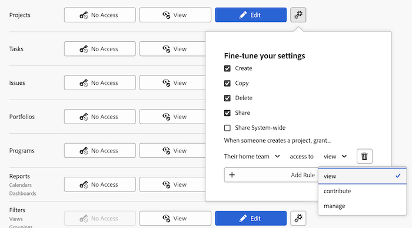

# 프로젝트에 대한 액세스 권한 부여

<!-- Audited: 12/2023 -->

Adobe Workfront 관리자는 다음 문서에 설명된 대로 액세스 수준을 사용하여 프로젝트에 대한 사용자의 액세스 권한을 정의할 수 있습니다.
* [액세스 수준 개요](../../../administration-and-setup/add-users/access-levels-and-object-permissions/access-levels-overview.md)
* [새로운 액세스 수준 개요](/help/quicksilver/administration-and-setup/add-users/how-access-levels-work/access-level-overview.md)

사용자 지정 액세스 수준을 사용하여 Workfront의 다른 개체 유형에 대한 사용자의 액세스를 관리하는 방법에 대한 자세한 내용은 [사용자 정의 액세스 수준 만들기 또는 수정](../../../administration-and-setup/add-users/configure-and-grant-access/create-modify-access-levels.md).

## 액세스 요구 사항

이 문서의 단계를 수행하려면 다음 액세스 권한이 있어야 합니다.

<table style="table-layout:auto"> 
 <col> 
 <col> 
 <tbody> 
  <tr> 
   <td role="rowheader">Adobe Workfront 플랜</td> 
   <td>임의</td> 
  </tr> 
    <tr> 
   <td role="rowheader">Adobe Workfront 라이선스</td> 
   <td> 
새로운 기능: 표준 

 
또는
 

현재: 플랜 
 
</td> 
  </tr>

<tr> 
   <td role="rowheader">액세스 수준 구성</td> 
   <td> 
Workfront 관리자여야 합니다.
 </td> 
  </tr> 
 </tbody> 
</table>

이 표의 정보에 대한 자세한 내용은 [Workfront 설명서의 액세스 요구 사항](/help/quicksilver/administration-and-setup/add-users/access-levels-and-object-permissions/access-level-requirements-in-documentation.md).

## 사용자 정의 액세스 수준을 사용하여 프로젝트에 대한 사용자 액세스 구성

1. 에 설명된 대로 액세스 수준 만들기 또는 편집을 시작합니다. [사용자 정의 액세스 수준 만들기 또는 수정](../../../administration-and-setup/add-users/configure-and-grant-access/create-modify-access-levels.md).
1. 톱니바퀴 아이콘 클릭  다음에 있음 **보기** 또는 **편집** 프로젝트 의 오른쪽에 있는 버튼을 클릭하고 아래에서 부여할 기능을 선택합니다. **설정 미세 조정**.

   

   >[!NOTE]
   >
   >* 작업 라이선스가 있는 사용자의 프로젝트 권한은 제한됩니다. 프로젝트에 기여할 수 있지만 관리할 수는 없습니다.
   >* 검토 라이선스가 있는 사용자는 전환된 문제의 프로젝트에 대한 보기 권한이 있지만 보기 권한은 제한됩니다.
   >* 사용자가 다른 사용자와 프로젝트를 공유할 때 부여할 수 있는 권한에 대한 자세한 내용은 [Adobe Workfront에서 프로젝트 공유](../../../workfront-basics/grant-and-request-access-to-objects/share-a-project.md).
   >* 특정 객체 유형에 대한 액세스 수준 설정을 구성할 때 해당 구성은 하위 등급 객체에 대한 사용자의 액세스 권한에 영향을 주지 않습니다. 예를 들어, 액세스 수준에서 프로젝트를 삭제하지 못하도록 사용자를 제한할 수 있지만 그렇다고 해서 프로젝트보다 순위가 낮은 작업 삭제는 제한하지 않습니다.객체 계층에 대한 자세한 내용은 섹션을 참조하십시오 [객체의 상호 의존성 및 계층](../../../workfront-basics/navigate-workfront/workfront-navigation/understand-objects.md#understanding-interdependency-and-hierarchy-of-objects) 이 문서에서 [Adobe Workfront의 오브젝트 이해](../../../workfront-basics/navigate-workfront/workfront-navigation/understand-objects.md).

1. (선택 사항) **공유 기본값 설정** 만들기 옵션의 오른쪽에 있는 다음 **규칙 추가** 새 프로젝트에 대한 공유 규칙을 추가합니다.

   이 액세스 수준의 사용자가 프로젝트를 만들면 왼쪽 메뉴에서 선택한 사용자와 프로젝트가 자동으로 공유됩니다.

   

   오른쪽 메뉴에서 프로젝트를 해당 사용자와 공유하는 방법을 지정합니다.

   

   >[!NOTE]
   >
   >이 액세스 수준의 사용자가 프로젝트 액세스 템플릿을 사용하는 경우 템플릿은 액세스 수준의 공유 설정을 무시합니다. 프로젝트 액세스 템플릿에 대한 자세한 내용은 [Adobe Workfront에서 프로젝트 공유](../../../workfront-basics/grant-and-request-access-to-objects/share-a-project.md).

   이 단계를 반복하여 액세스 수준에 필요한 수만큼 프로젝트 공유 규칙을 추가할 수 있습니다.

1. X를 클릭하여 **설정 미세 조정** 상자.
1. (선택 사항) 작업 중인 액세스 수준의 다른 오브젝트 및 영역에 대한 액세스 설정을 구성하려면 다음 문서 중 하나를 사용하여 계속합니다. [Adobe Workfront 액세스 구성](../../../administration-and-setup/add-users/configure-and-grant-access/configure-access.md), 예: [작업에 대한 액세스 권한 부여](../../../administration-and-setup/add-users/configure-and-grant-access/grant-access-tasks.md) 및 [재무 데이터에 대한 액세스 권한 부여](../../../administration-and-setup/add-users/configure-and-grant-access/grant-access-financial.md).
1. 작업을 마치면 를 클릭합니다. **저장**.

   액세스 수준이 만들어지면 사용자에게 이를 할당할 수 있습니다. 자세한 내용은 [사용자 프로필 편집](../../../administration-and-setup/add-users/create-and-manage-users/edit-a-users-profile.md).

## 라이선스 유형별 보고서, 대시보드 및 달력에 액세스

각 액세스 수준의 사용자가 문제에 대해 수행할 수 있는 작업에 대한 자세한 내용은 섹션을 참조하십시오 [프로젝트](../../../administration-and-setup/add-users/access-levels-and-object-permissions/functionality-available-for-each-object-type.md#projects) 이 문서에서 [각 객체 유형에 사용할 수 있는 기능](../../../administration-and-setup/add-users/access-levels-and-object-permissions/functionality-available-for-each-object-type.md).

## 공유 프로젝트에 대한 액세스

문제에 대한 소유자 또는 작성자는에 설명된 대로 해당 사용자에 대한 권한을 부여하여 다른 사용자와 공유할 수 있습니다 [Adobe Workfront에서 프로젝트 공유](../../../workfront-basics/grant-and-request-access-to-objects/share-a-project.md).

<!--
If you make changes here, make them also in the "Grant access to" articles where this snippet had to be converted to text:
* reports, dashboards, and calendars
* financial data
* issue
-->

다른 사용자와 객체를 공유할 때 객체에 대한 수신자의 권한은 다음 두 가지 사항의 조합으로 결정됩니다.

* 객체에 대해 수신자에게 부여하는 권한
* 개체 유형에 대한 수신자의 액세스 수준 설정입니다.
