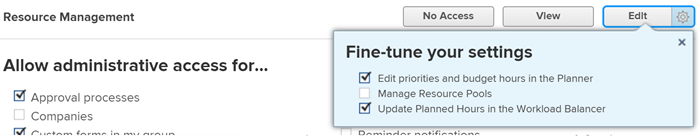

# 리소스 관리에 대한 액세스 권한 부여

Adobe Workfront 관리자는 [액세스 수준 개요](../../../administration-and-setup/add-users/access-levels-and-object-permissions/access-levels-overview.md)에 설명된 대로 액세스 수준을 사용하여 리소스 관리에 대한 사용자의 액세스 권한을 정의할 수 있습니다.

## 액세스 요구 사항

+++ 을 확장하여 이 문서의 기능에 대한 액세스 요구 사항을 봅니다.

<table style="table-layout:auto"> 
 <col> 
 <col> 
 <tbody> 
  <tr> 
   <td role="rowheader">Adobe Workfront 패키지</td> 
   <td>임의</td> 
  </tr> 
  <tr> 
   <td role="rowheader">Adobe Workfront 라이선스</td> 
   <td>
표준

   
플랜
</td> 
  </tr> 
  <tr> 
   <td role="rowheader">액세스 수준 구성</td> 
   <td> 
Workfront 관리자여야 합니다.
 </td> 
  </tr> 
 </tbody> 
</table>

이 표의 정보에 대한 자세한 내용은 [Workfront 설명서의 액세스 요구 사항](/help/quicksilver/administration-and-setup/add-users/access-levels-and-object-permissions/access-level-requirements-in-documentation.md)을 참조하십시오.

+++

## 사용자 지정 액세스 수준을 사용하여 리소스 관리 도구에 대한 사용자 액세스 구성

1. [사용자 지정 액세스 수준 만들기 또는 수정](../../../administration-and-setup/add-users/configure-and-grant-access/create-modify-access-levels.md)에 설명된 대로 액세스 수준을 만들거나 편집하십시오.
1. 리소스 관리 오른쪽에 있는 보기&#x200B;**또는**&#x200B;편집&#x200B;**단추의 톱니바퀴 아이콘**&#x200B;을(를) 클릭한 다음 **설정을 미세 조정**&#x200B;에서 부여할 기능을 선택합니다.

   

   <table style="table-layout:auto"> 
    <col> 
    <col> 
    <tbody> 
     <tr> 
      <td role="rowheader">플래너에서 우선 순위 및 예산 시간 편집</td> 
      <td> 
이 라이선스를 가진 사용자가 다음 작업을 수행할 수 있도록 허용합니다.
 
리소스 플래너에서 프로젝트의 우선 순위를 지정합니다.
 
리소스 계획 도구의 리소스에 대한 예산 할당(프로젝트의 비즈니스 사례에서 리소스 플래너 및 리소스 예산 섹션)
 
이 옵션은 기본적으로 활성화되어 있습니다.
 </td> 
     </tr> 
     <tr> 
      <td role="rowheader">리소스 풀 관리</td> 
      <td> 
이 라이선스를 가진 사용자가 리소스 풀을 만들고, 편집하고, 삭제할 수 있도록 허용합니다. 이 옵션은 기본적으로 비활성화되어 있습니다.
 </td> 
     </tr> 
     <tr data-mc-conditions=""> 
      <td role="rowheader">업무 균형자에서 계획된 시간 업데이트 </td> 
      <td> 
이 라이선스를 가진 사용자가 업무 균형자에서 사용자 할당을 업데이트할 때 계획된 작업 시간 항목을 업데이트할 수 있도록 허용합니다. 할당된 총 시간이 작업 항목의 계획된 시간이 됩니다.
 
이 옵션은 기본적으로 비활성화되어 있습니다.
 
 자세한 내용은 <a href="../../../resource-mgmt/workload-balancer/manage-user-allocations-workload-balancer.md" class="MCXref xref">업무 균형자에서 사용자 할당 관리</a>를 참조하십시오.
 </td> 
     </tr> 
    </tbody> 
   </table>

1. (선택 사항) 작업 중인 액세스 수준의 다른 개체 및 영역에 대한 액세스 설정을 구성하려면 [Adobe Workfront에 대한 액세스 구성](../../../administration-and-setup/add-users/configure-and-grant-access/configure-access.md)에 나열된 문서 중 하나를 계속 사용하십시오(예: [작업에 대한 액세스 권한 부여](../../../administration-and-setup/add-users/configure-and-grant-access/grant-access-tasks.md) 및 [재무 데이터에 대한 액세스 권한 부여](../../../administration-and-setup/add-users/configure-and-grant-access/grant-access-financial.md)).
1. 완료되면 **저장**&#x200B;을 클릭하세요.

   액세스 수준이 만들어지면 사용자에게 이를 할당할 수 있습니다. 자세한 내용은 [사용자 프로필 편집](../../../administration-and-setup/add-users/create-and-manage-users/edit-a-users-profile.md)을 참조하세요.

## 라이선스 유형별 리소스 관리에 대한 액세스

각 액세스 수준의 사용자가 리소스 관리로 수행할 수 있는 작업에 대한 자세한 내용은 문서 [각 개체 유형에 사용할 수 있는 기능](../../../administration-and-setup/add-users/access-levels-and-object-permissions/functionality-available-for-each-object-type.md#resource)의 [리소스 관리](../../../administration-and-setup/add-users/access-levels-and-object-permissions/functionality-available-for-each-object-type.md) 섹션을 참조하십시오.

## 공유 문제에 액세스

<!--
If you make changes here, make them also in the "Grant access to" articles where this snippet had to be converted to text:
* reports, dashboards, and calendars
* financial data
* issue
-->

다른 사용자와 객체를 공유할 때 수신자의 리소스 할당 예산 또는 조회에 대한 권한은 다음 세 가지 사항의 조합으로 결정됩니다.

* 리소스 관리에 대한 수신자의 액세스 수준 설정
* [재무 데이터에 대한 액세스 권한 부여](../../../administration-and-setup/add-users/configure-and-grant-access/grant-access-financial.md)에 설명된 대로 재무 데이터에 대한 사용자의 액세스 권한
* 공유자가 오브젝트에 부여한 재무 데이터에 대한 모든 권한

개체를 공유할 때 사용자가 개체에 대한 재무 데이터에 부여할 수 있는 권한에 대한 자세한 내용은 [개체에 대한 재무 권한 공유](../../../workfront-basics/grant-and-request-access-to-objects/share-financial-permissions-object.md)를 참조하십시오.
