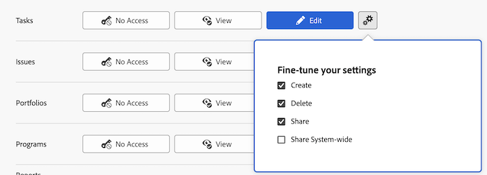

# 작업에 대한 액세스 권한 부여

Adobe Workfront 관리자는 [액세스 수준 개요](../../../administration-and-setup/add-users/access-levels-and-object-permissions/access-levels-overview.md)에 설명된 대로 액세스 수준을 사용하여 작업에 대한 사용자의 액세스 권한을 정의할 수 있습니다.

사용자 지정 액세스 수준을 사용하여 Workfront의 다른 개체 형식에 대한 사용자 액세스를 관리하는 방법에 대한 자세한 내용은 [사용자 지정 액세스 수준 만들기 또는 수정](../../../administration-and-setup/add-users/configure-and-grant-access/create-modify-access-levels.md)을 참조하십시오.

## 액세스 요구 사항

+++ 을 확장하여 이 문서의 기능에 대한 액세스 요구 사항을 봅니다.

이 문서의 단계를 수행하려면 다음 액세스 권한이 있어야 합니다.

<table style="table-layout:auto"> 
 <col> 
 <col> 
 <tbody> 
  <tr> 
   <td role="rowheader">Adobe Workfront 플랜</td> 
   <td>임의</td> 
  </tr> 
  <tr> 
   <td role="rowheader">Adobe Workfront 라이선스</td> 
   <td>플랜</td> 
  </tr> 
  <tr> 
   <td role="rowheader">액세스 수준 구성</td> 
   <td> 
Workfront 관리자여야 합니다.
 
<b>참고</b>: 아직 액세스 권한이 없는 경우 Workfront 관리자에게 액세스 수준에 추가 제한을 설정했는지 문의하세요. Workfront 관리자가 액세스 수준을 수정하는 방법에 대한 자세한 내용은 <a href="../../../administration-and-setup/add-users/configure-and-grant-access/create-modify-access-levels.md" class="MCXref xref" data-mc-variable-override="">사용자 지정 액세스 수준 만들기 또는 수정</a>을 참조하십시오.
 </td> 
  </tr> 
 </tbody> 
</table>

+++

## 사용자 정의 액세스 수준을 사용하여 작업에 대한 사용자 액세스 구성

1. [사용자 지정 액세스 수준 만들기 또는 수정](../../../administration-and-setup/add-users/configure-and-grant-access/create-modify-access-levels.md)에 설명된 대로 액세스 수준을 만들거나 편집하십시오.
1. 작업 오른쪽에 있는 보기&#x200B;**또는**&#x200B;편집&#x200B;**단추의 톱니바퀴 아이콘**&#x200B;을(를) 클릭한 다음 **설정을 미세 조정**&#x200B;에서 부여할 기능을 선택합니다.

   

   >[!NOTE]
   >
   >특정 객체 유형에 대한 액세스 수준 설정을 구성할 때 해당 구성은 하위 등급 객체에 대한 사용자의 액세스 권한에 영향을 주지 않습니다. 예를 들어, 사용자가 자신의 액세스 수준에서 작업을 삭제하지 못하도록 제한할 수 있지만 그렇다고 해서 작업보다 순위가 낮은 문제를 삭제하지 못하도록 제한하지는 않습니다. 개체의 계층 구조에 대한 자세한 내용은 [Adobe Workfront의 개체 이해](../../../workfront-basics/navigate-workfront/workfront-navigation/understand-objects.md#understanding-interdependency-and-hierarchy-of-objects)에서 [개체의 상호 종속성 및 계층 구조](../../../workfront-basics/navigate-workfront/workfront-navigation/understand-objects.md) 섹션을 참조하십시오.

1. (선택 사항) 상위 개체의 작업에 대해 상속된 권한을 제한하려면 **추가 제한 설정**&#x200B;을 클릭한 다음 **프로젝트, 작업, 문제 등에서 문서 액세스 권한을 상속하지 않음**&#x200B;을 선택하십시오.

1. (선택 사항) 작업 중인 액세스 수준의 다른 개체 및 영역에 대한 액세스 설정을 구성하려면 [Adobe Workfront에 대한 액세스 구성](../../../administration-and-setup/add-users/configure-and-grant-access/configure-access.md)에 나열된 문서 중 하나(예: [재무 데이터에 대한 액세스 권한 부여](../../../administration-and-setup/add-users/configure-and-grant-access/grant-access-financial.md))를 계속합니다.
1. 완료되면 **저장**&#x200B;을 클릭하세요.

   액세스 수준이 만들어지면 사용자에게 이를 할당할 수 있습니다. 자세한 내용은 [사용자 프로필 편집](../../../administration-and-setup/add-users/create-and-manage-users/edit-a-users-profile.md)을 참조하세요.

## 라이선스 유형별 작업에 대한 액세스

각 액세스 수준의 사용자가 작업을 수행할 수 있는 작업에 대한 자세한 내용은 문서 [각 개체 유형에 사용할 수 있는 기능](../../../administration-and-setup/add-users/access-levels-and-object-permissions/functionality-available-for-each-object-type.md#tasks)의 [작업](../../../administration-and-setup/add-users/access-levels-and-object-permissions/functionality-available-for-each-object-type.md) 섹션을 참조하십시오.

## 공유 작업 액세스

[작업 공유](../../../workfront-basics/grant-and-request-access-to-objects/share-a-task.md)에 설명된 대로 문제의 소유자 또는 작성자가 다른 사용자에게 권한을 부여하여 다른 사용자와 공유할 수 있습니다.

<!--

If you make changes here, make them also in the "Grant access to" articles where this snippet had to be converted to text:

* reports, dashboards, and calendars

* financial data

* issue

-->

다른 사용자와 객체를 공유할 때 객체에 대한 수신자의 권한은 다음 두 가지 사항의 조합으로 결정됩니다.

* 객체에 대해 수신자에게 부여하는 권한
* 개체 유형에 대한 수신자의 액세스 수준 설정입니다.
