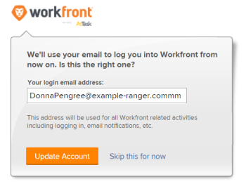

# 자동 제공된 사용자의 암호 변경

자동 프로비저닝을 통해 사용자를 만들면 Adobe Workfront에서 사용자 이름에 대한 GUID(Globally Unique Identifier)를 지정합니다. GUID는 임의의 숫자와 문자의 고유한 문자열입니다(예: *5489cb430012526e1ea635e8c29f377f*).

새 사용자가 임시 암호를 변경하려고 할 때 사용자 이름에 대한 이메일 주소를 입력하고 잘못된 사용자 이름에 대한 오류를 수신하는 경우가 많습니다. 사용자가 암호를 변경하려면 시스템에서 할당한 사용자 이름(GUID)을 입력해야 합니다.

GUID 사용자 이름은 사용하기 어려울 수 있으므로 먼저 사용자 이름을 Workfront 메일 주소로 변경한 다음 암호를 변경하도록 허용하는 것이 좋습니다.

>[!TIP]
>
>다음과 같은 방법으로 사용자의 GUID를 찾을 수 있습니다.
>
>* 사용자 프로필로 이동한 다음 브라우저의 URL에서 GUID를 복사합니다.
>
>  예를 들어 URL `https://acme.workfront.com/user/61941ab1000af22d7104628efa1c738b/details`에서 마지막 두 개의 슬래시(`61941ab1000af22d7104628efa1c738b`) 사이에 숫자와 문자의 문자열을 복사합니다.
>
>  자세한 내용은 [사용자 프로필 편집](../../../administration-and-setup/add-users/create-and-manage-users/edit-a-users-profile.md)을 참조하세요.
>
>* 사용자 > GUID 열을 사용하여 사용자 보고서를 만듭니다. 자세한 내용은 [보고서 만들기](../../../reports-and-dashboards/reports/creating-and-managing-reports/create-report.md)를 참조하세요.
>
>* Workfront API를 쿼리합니다.
>

## 액세스 요구 사항

이 문서의 단계를 수행하려면 다음 액세스 권한이 있어야 합니다.

<table style="table-layout:auto"> 
 <col> 
 <col> 
 <tbody> 
  <tr> 
   <td role="rowheader">Adobe Workfront 플랜</td> 
   <td>임의</td> 
  </tr> 
  <tr> 
   <td role="rowheader">Adobe Workfront 라이선스</td> 
   <td>플랜</td> 
  </tr> 
  <tr> 
   <td role="rowheader">액세스 수준 구성</td> 
   <td> <p>Workfront 관리자여야 합니다.</p> <p><b>참고</b>: 아직 액세스 권한이 없는 경우 Workfront 관리자에게 액세스 수준에 추가 제한을 설정했는지 문의하세요. Workfront 관리자가 액세스 수준을 수정하는 방법에 대한 자세한 내용은 <a href="../../../administration-and-setup/add-users/configure-and-grant-access/create-modify-access-levels.md" class="MCXref xref">사용자 지정 액세스 수준 만들기 또는 수정</a>을 참조하십시오.</p> </td> 
  </tr> 
 </tbody> 
</table>

## 자동 제공된 사용자의 암호 변경

1. 다음 예와 같이 API 요청을 전달하여 사용자의 GUID 사용자 이름을 결정합니다.

   https://`<domain>`.my.workfront.com/attask/api/v14.0/USER/search?fields=username&amp;ID=`<ID of User>` 여기서 *`<domain>`*&#x200B;은(는) 회사의 도메인이고 *`<ID of User>`*&#x200B;은(는) 사용자의 Workfront ID입니다.

   다음과 유사한 응답을 받게 됩니다.

   

   &quot;username&quot;에 대한 반환은 사용자의 GUID입니다.

1. GUID를 사용자 이름으로 사용하여 사용자의 암호를 변경합니다.

   암호 변경에 대한 자세한 내용은 [암호 재설정](../../../workfront-basics/manage-your-account-and-profile/managing-your-workfront-account/reset-your-password.md)을 참조하세요.

   조직에서 SSO 시스템을 사용하는 경우 Workfront 시스템 관리자만 사용자 암호를 변경할 수 있습니다. 자세한 내용은 [Adobe Workfront의 SSO(Single Sign-On) 개요](../../../administration-and-setup/add-users/single-sign-on/sso-in-workfront.md)를 참조하십시오.

1. 사용자가 Workfront에 로그인한 상태에서 다음 위치로 이동합니다.

```
   https://<your domain>.my.workfront.com/login/convertUsername
```

1. **로그인 전자 메일 주소** 상자에서 사용자의 전자 메일 주소가 올바른지 확인한 다음 **계정 업데이트**&#x200B;를 클릭합니다.

   

   사용자의 사용자 이름이 Workfront 이메일 주소로 변경됩니다.

>[!TIP]
>
>사용자 ID 찾기:
>
>1. Adobe Workfront의 오른쪽 상단에 있는 **기본 메뉴** 아이콘 을(를) 클릭한 다음 **사용자** 를 클릭합니다.
>
>1. 사용자를 선택합니다.
>
>   사용자의 프로필 페이지가 열리고 해당 사용자 ID가 URL에 표시됩니다.
>
