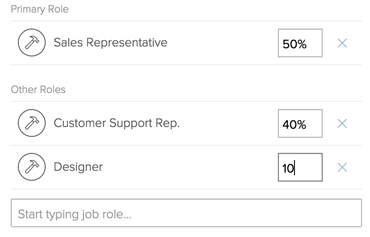

# 사용자 프로필 편집

{{highlighted-preview}}

<!--

>[!IMPORTANT]
>
>The procedure described on this page applies only to organizations that have not yet been onboarded to the Admin Console. If your organization has been onboarded to the Adobe Admin Console, you must perform this action through the Adobe Admin Console.
>
>For instructions on editing a user's profile in the Adobe Admin Console, see the section "Edit user details" in the article [Manage users individually](https://helpx.adobe.com/enterprise/using/manage-users-individually.html) or contact your Adobe Admin Console Administrator.
>
>For a list of procedures that differ based on whether your organization has been onboarded to the Adobe Admin Console, see [Platform-based administration differences (Adobe Workfront/Adobe Business Platform)](../../../administration-and-setup/get-started-wf-administration/actions-in-admin-console.md).
-->

Adobe Workfront 관리자는 사용자를 만들고 기존 사용자의 프로필을 관리할 수 있습니다. 사용자 만들기에 대한 자세한 내용은 [사용자 추가](../../../administration-and-setup/add-users/create-and-manage-users/add-users.md).

## 액세스 요구 사항

이 문서의 단계를 수행하려면 다음이 있어야 합니다.

<table style="table-layout:auto"> 
 <col> 
 <col> 
 <tbody> 
  <tr> 
   <td role="rowheader">Adobe Workfront 플랜</td> 
   <td>임의</td> 
  </tr> 
  <tr> 
   <td role="rowheader">Adobe Workfront 라이선스</td> 
   <td> 
새로운 기능: 표준

   또는
   
현재: 플랜
</td> 
  </tr> 
  <tr> 
   <td role="rowheader">액세스 수준 구성</td> 
   <td> 
다음 중 하나가 있어야 합니다.
 
    <ul> 
     <li> 
시스템 관리자 액세스 수준입니다. 자세한 내용은 <a href="../../../administration-and-setup/add-users/configure-and-grant-access/grant-a-user-full-administrative-access.md" class="MCXref xref">사용자에게 전체 관리 액세스 권한 부여</a>. 
 </li> 
     <li> 
다음 <b>사용자</b> 액세스 수준에 있는 개체를에 구성했습니다. <b>편집</b> 액세스, 사용 <b>만들기</b> 다음 두 가지 중 하나 이상 <b>사용자 관리자</b> 아래에 옵션 활성화됨 <b>설정 미세 조정</b> . 
 
     <ul><li> 사용 관리자(모든 사용자)</li>
     <li>사용자 관리자(그룹 사용자)</li></ul>
     
If  <b>사용자 관리자(그룹 사용자)</b> 이(가) 활성화되어 있으므로 사용자가 멤버인 그룹의 그룹 관리자여야 사용자를 편집할 수 있습니다.
 
     
에 대한 자세한 내용은 <b>사용자</b> 액세스 수준에서 을(를) 설정합니다. <a href="../../../administration-and-setup/add-users/configure-and-grant-access/grant-access-other-users.md" class="MCXref xref">사용자에게 액세스 권한 부여</a>.
 </li> 
    </ul> </td> 
  </tr> 
 </tbody> 
</table> 
*보유 중인 플랜, 라이선스 유형 또는 액세스 권한을 확인하려면 Workfront 관리자에게 문의하십시오.

## 사용자 프로필 편집

{{step-1-to-users}}

1. 사용자를 선택한 다음 **편집** 아이콘 .

   사용자 편집 상자가 표시됩니다.

1. 다음에서 **사용자 편집** 상자를 클릭하고 다음 정보를 변경한 다음 **변경 내용 저장** 언제든지:

   <table style="table-layout:auto"> 
    <col> 
    <col> 
    <tbody> 
     <tr> 
      <td role="rowheader">개인적인 정보 </td> 
      <td> 
       <ul> 
        <li>
<b>이름</b>
</li>
        <li>
<b>성</b>
</li> 
        <li> 
<b>이메일 주소:</b> 사용자의 이메일 주소는 Workfront에서 사용자의 사용자 이름이기도 합니다. 이 필드는 대/소문자를 구분하므로 고유해야 합니다. 사용자가 10분 내에 고유하지 않은 이메일 주소를 3번 추가하려고 하면 reCAPTCHA 응답이 나타납니다.
 
 다음 항목 선택 <b>나는 로봇이 아니다</b> 을(를) 계속하기 전에 설정합니다.

허용 목록에 추가하다 전자 메일 도메인을 사용하고 목록에 없는 전자 메일 도메인을 입력하면 사용자에게 전자 메일 알림이 전송되지 않습니다. 허용 목록에 추가하다에 대한 자세한 내용은 <a href="../../../administration-and-setup/get-started-wf-administration/configure-your-email-allowlist.md" class="MCXref xref">허용 목록에 추가하다 이메일 구성</a>.
 </li> 
        <li> 
<b>암호 재설정</b>: 이 링크를 클릭하여 사용자의 암호를 재설정합니다. 다른 사용자의 암호를 재설정하려면 먼저 자신의 암호를 입력해야 합니다.
 
다른 사용자의 암호를 재설정하려면 Workfront 관리자 또는 그룹 관리자여야 합니다.
 
<b>참고</b>:  
          <ul> 
           <li> 
그룹 관리자인 경우 관리자로 지정된 그룹의 사용자에 대해서만 암호를 재설정할 수 있습니다. 또한 액세스 수준에서 사용자 관리(그룹 사용자) 권한을 활성화해야 합니다.
 
  
 
이 설정은 기본적으로 비활성화되어 있습니다. 자세한 내용은 <a href="../../../administration-and-setup/add-users/configure-and-grant-access/create-modify-access-levels.md" class="MCXref xref">사용자 정의 액세스 수준 만들기 또는 수정</a>.
 </li> 
           <li> 
Workfront 관리자의 암호를 재설정할 수 없습니다.
 </li> 
          </ul> 
 </li> 
        <li><b>&lt;sso configuration=""&gt; 사용자 이름</b>: Workfront 관리자가 Workfront과의 SSO 통합을 활성화한 경우 이 필드에 SSO 사용자 이름이 표시됩니다. Workfront 인스턴스에 대해 활성화된 SSO 구성 유형이 이 필드에 표시됩니다. </li> 
        <li> 
<b>전용 허용 &lt;sso configuration=""&gt; 인증</b>: Workfront 관리자가 Workfront과의 SSO 통합을 활성화하고 모든 사용자를 SSO로 업데이트한 경우 기본적으로 이 필드가 선택되어 있습니다. Workfront 인스턴스에 대해 활성화된 SSO 구성 유형이 이 필드에 표시됩니다.
 
이 필드를 선택하면 사용자는 SSO 자격 증명으로 Workfront에 로그인해야 합니다. 선택을 취소하면 Workfront 자격 증명으로 Workfront에 로그인할 수 있습니다.
 
SSO 솔루션으로 Workfront을 구성하는 방법에 대한 자세한 내용은 <a href="../../../administration-and-setup/add-users/single-sign-on/sso-in-workfront.md" class="MCXref xref">Adobe Workfront의 Single Sign-On 개요</a>
 
SSO용 사용자 업데이트에 대한 자세한 내용은 <a href="../../../administration-and-setup/add-users/single-sign-on/update-users-sso.md" class="MCXref xref">SSO(Single Sign-On)를 위해 사용자 업데이트</a>.
 
        
<b>참고</b>:
 
        
 그룹 관리자인 경우 &lt;sso configuration=""&gt; 필드로 지정된 그룹의 사용자에게만 표시됩니다. 또한 액세스 수준에서 사용자 관리(그룹 사용자) 권한을 활성화해야 합니다.
        
그룹 관리자이고 액세스 수준에서 사용자 관리자(모든 사용자) 권한을 활성화한 경우 &lt;sso configuration=""&gt; 모든 사용자의 필드입니다.
 </li> 
        <li><b>작업 정보:</b> 직책(의)과 같은 작업에 대한 정보 <b>제목</b> field) 및 사용자가 담당하는 전문 지식 영역( <b>다음에 대한 설명:</b> field).</li> 
        <li>
<b>연락처 정보</b>: 사용자의 전화번호(위치: <b>전화번호, 내선</b>, 및 <b>모바일 번호</b> 필드) 및 주소(위치: <b>주소, 구/군/시, 시/도, 우편 번호, 국가</b> 필드 ).

        
사용자가 UUM(Unified User Management) 또는 IMS(Identity Management System) Adobe에 대해 활성화되어 있으면 <b>국가</b> 연락처 정보 섹션의 필드는 국가 코드 값(예: US, GB, IN)만 허용합니다.
</li>
       </ul> </td> 
     </tr> 
     <tr> 
      <td role="rowheader">환경 설정 </td> 
      <td> 
       <ul> 
      <li> 
<b>시간대:</b> 사용자의 시간대입니다.
 
사용자가 시간대 간에 Workfront에서 공동 작업을 수행하는 데 도움이 되는 방법에 대해서는 을 참조하십시오. <a href="../../../workfront-basics/tips-tricks-and-troubleshooting/working-across-timezones.md" class="MCXref xref">시간대 간 작업</a>.
 </li> 
       <li><b>이메일 로케일</b>: 사용자 기본 이메일 로케일. 이는 Workfront에서 이 사용자에게 제공되는 이메일의 숫자 및 날짜 형식에 영향을 줍니다.</li>

   <li><b>이 테스트 환경에서 이메일 수신</b>: 현재 로그인한 환경에서 이메일 알림을 받으려면 이 옵션을 선택합니다.
      
<b>메모</b>

      
이 옵션은 미리보기 및 샌드박스 환경에서만 사용할 수 있습니다. 이메일 알림은 기본적으로 프로덕션 환경에서 활성화됩니다. 

      </li>

   </li> 
       <li><b>자신에게 할당한 작업을 내 처리 중 탭으로 전송</b>: 사용자가 자신에게 할당하는 모든 항목이 [홈] 영역의 [작업 중] 목록에 바로 표시되도록 하려면 이 옵션을 선택합니다. 기본값은 홈 영역의 [시작할 준비] 또는 [준비되지 않음] 목록에서 사용자에게 할당된 모든 항목을 나열하는 것입니다.</li> 
       <li><b>문서 업로드 시 자동으로 증명 생성</b>: 사용자가 업로드하는 문서에서 즉시 증명을 생성하려면 이 옵션을 선택합니다. </li>
       </ul> </td> 
     </tr> 
     <tr> 
      <td role="rowheader">알림</td> 
      <td> 
새 사용자에 대해 활성화해야 하는 이메일 알림을 선택합니다.
 
인스턴트 및 일별 다이제스트 알림을 선택할 수 있습니다.
 
자세한 내용은 <a href="../../../administration-and-setup/manage-workfront/emails/configure-event-notifications-for-everyone-in-the-system.md" class="MCXref xref">시스템의 모든 사용자를 위한 이벤트 알림 구성</a>.
 </td> 
     </tr> 
     <tr> 
      <td role="rowheader">액세스</td> 
      <td> 
       <ul> 
      <li><b>활성화됨:</b> 이 상자를 선택하여 사용자가 활성 상태임을 나타냅니다. 활성 사용자는 Workfront 라이선스를 사용합니다. 상자를 지우면 사용자가 비활성화되고 Workfront에 로그인할 수 없습니다.</li> 
       <li> 
<b>액세스 수준:</b> 이 사용자에게 할당할 액세스 수준을 선택합니다.
 
       
사용자에게 액세스 수준을 할당할 때 자신의 액세스 수준과 같거나 낮은 수준을 할당할 수 있습니다.

       
예를 들어 액세스 수준이 계획인 경우 관리자 액세스 수준을 할당할 수 없습니다. 하지만 Workfront 관리자가 자신의 액세스 수준에서도 활성화되지 않은 액세스 수준에 대해 기본이 아닌 권한을 활성화한 경우에는 기본적으로 자신의 액세스 수준보다 낮은 액세스 수준을 할당할 수 없습니다. 

       
예를 들어 작업을 삭제할 수 있는 액세스 권한이 없는 플랜 라이선스가 있는 경우 작업 라이선스가 플랜 라이선스보다 낮더라도 작업을 삭제할 수 있는 액세스 권한이 있는 작업 라이선스를 누구에게 할당할 수 없습니다. 자세한 내용은  <a href="../../../administration-and-setup/add-users/configure-and-grant-access/create-modify-access-levels.md" class="MCXref xref">사용자 정의 액세스 수준 만들기 또는 수정</a>. 
 
       
액세스 수준에 대한 자세한 내용은 <a href="../../../administration-and-setup/add-users/configure-and-grant-access/configure-access.md" class="MCXref xref">Adobe Workfront 액세스 구성</a>.

       
 <b>참고:</b>
 
       
 조직에서 새 액세스 모델(표준/라이트/기여자)을 사용하는 경우 해당 사용자가 해당 월에 대한 결정 한도에 이미 도달한 경우 표준 또는 라이트 사용자를 기여자 액세스 수준에 재할당할 수 없습니다. 

새 액세스 모델에 대한 자세한 내용은 <a href="../how-access-levels-work/access-level-overview.md" class="MCXref xref">새로운 액세스 수준 개요</a>. 

결정 한도에 대한 자세한 내용은 <a href="/help/quicksilver/review-and-approve-work/proof-doc-decision-limits.md" class="MCXref xref">비유료 사용자에 대한 제한된 문서 및 증명 결정 개요</a>.
</li> 
       <li> 
<b>레이아웃 템플릿</b>: 사용자에 대한 레이아웃 템플릿을 선택합니다. 이 레이아웃 템플릿은 사용자의 홈 그룹, 홈 팀 또는 기본 역할에 할당된 모든 레이아웃 템플릿보다 우선합니다. 레이아웃 템플릿의 할당 우선 순위에 대한 자세한 내용은 <a href="../../../administration-and-setup/customize-workfront/use-layout-templates/create-and-manage-layout-templates.md" class="MCXref xref">레이아웃 템플릿 만들기 및 관리</a>.
 
<b>참고</b>:  
다음 목록은 이 필드에서 사용할 수 있는 템플릿 목록이 액세스 권한에 따라 어떻게 달라지는지 설명합니다.
 
       <ul> 
       <li>Workfront 관리자는 모든 시스템 수준 및 그룹 수준의 레이아웃 템플릿을 볼 수 있습니다.</li> 
       <li>그룹 관리자는 시스템 수준 레이아웃 템플릿과 관리하는 그룹과 관련된 템플릿을 볼 수 있습니다.</li> 
       <li>플랜 라이선스가 있고 사용자 편집에 대한 액세스 권한이 있는 사용자는 시스템 수준의 레이아웃 템플릿만 볼 수 있습니다.</li> 
       </ul> 
그룹 수준 레이아웃 템플릿에 대한 자세한 내용은 <a href="../../../administration-and-setup/customize-workfront/use-layout-templates/create-and-manage-layout-templates.md" class="MCXref xref">레이아웃 템플릿 만들기 및 관리</a>.
 
 </li> 
       </ul> </td> 
     </tr> 
     <tr> 
      <td role="rowheader">조직 </td> 
      <td> 
       <ul> 
      <li><b>회사</b>: 사용자의 회사입니다. 사용자는 한 회사에만 연결할 수 있습니다. 회사를 사용자와 연결하려면 먼저 회사를 만들어야 합니다. 활성 회사만 목록에 표시됩니다. 회사 만들기에 대한 자세한 내용은 <a href="../../../administration-and-setup/set-up-workfront/organizational-setup/create-and-edit-companies.md" class="MCXref xref">회사 만들기 및 편집</a>.</li> 
      <li><b>보고 대상:</b> 사용자를 위해 회사를 지정한 경우 이 필드에 사용자의 직접 관리자를 지정할 수도 있습니다. 사용자에게는 한 명의 관리자만 있을 수 있습니다. 사용자가 회사와 먼저 연결되어 있지 않으면 이 필드가 표시되지 않습니다. </li> 
      <li><b>부하 직원:</b> 사용자를 위해 회사를 지정한 경우 사용자의 직접 보고서도 지정할 수 있습니다. 사용자는 여러 부하 직원을 보유할 수 있습니다. 사용자가 회사와 먼저 연결되어 있지 않으면 이 필드가 표시되지 않습니다.</li> 
      <li><b>홈 팀</b>: 사용자의 홈 팀을 지정합니다. 사용자는 홈 팀을 하나만 보유할 수 있습니다. 홈 팀은 레이아웃 템플릿을 할당할 때 또는 사용자에게 할당된 작업 및 문제에 대한 처리 중 단추를 정의할 때 중요합니다. </li> 
      <li><b>다른 팀</b>: 사용자가 여러 팀에 속할 수 있습니다. 사용자는 홈 영역에서 팀에 할당된 작업 항목을 볼 수 있습니다. </li> 
      <li> 
<b>홈 그룹:</b> 적절한 그룹을 선택하여 사용자를 할당합니다. 이를 통해 사용자는 그룹과 공유되는 객체에 액세스할 수 있습니다. 사용자의 홈 그룹과 레이아웃 템플릿을 공유할 수도 있습니다.
 
필수 필드입니다. 모든 사용자는 홈 그룹과 연결되어 있어야 합니다. 선택하지 않으면 그룹이 새 사용자의 홈 그룹으로 할당됩니다.
 
<b>참고</b>:
 
      
 다음 중 하나가 참인 경우에만 사용자에게 그룹을 할당할 수 있습니다.

      <ul><li>Workfront 관리자입니다</li>
      <li>그룹의 관리자입니다.</li>
      <li>이 그룹은 공개적입니다.</li></ul> 
      <li> 
<b>기타 그룹</b>: 사용자가 여러 그룹에 속할 수 있습니다. Workfront 관리자이거나 그룹의 관리자이거나 그룹이 공개인 경우에만 그룹을 사용자에게 할당할 수 있습니다.
 
<b>중요 사항</b>:
 
      
100개가 넘는 그룹에 사용자를 추가하면 그룹 목록을 로드하는 Workfront 영역에서 성능 문제가 발생할 수 있습니다.
 
공용 그룹에 대한 자세한 내용은 <a href="../../../administration-and-setup/manage-groups/create-and-manage-groups/create-a-group.md" class="MCXref xref">그룹 만들기</a>.
 
그룹에 대한 자세한 내용은 <a href="../../../administration-and-setup/manage-groups/groups-overview/groups.md" class="MCXref xref">그룹 개요</a>.
 </li> 
       </ul> </td> 
     </tr> 
     <tr> 
      <td role="rowheader">리소스 계획 수립 </td> 
      <td> 
       <ul>
       <li>
       <b>작업 시간</b>: 사용자가 오버헤드를 포함하지 않고 실제 작업에 사용할 수 있는 FTE(Full Time Equivalent) 시간의 백분율을 나타냅니다. 작업 시간은 최대 1의 10진수여야 하며 0일 수 없습니다. 예를 들어, 실제 작업에 대한 20% 가용성은 0.2입니다.

   필드의 기본값은 1이며, 사용자가 전체 FTE를 실제 프로젝트 관련 작업에 사용함을 나타냅니다.

   시스템은 이 숫자를 사용하여 실제 프로젝트 관련 작업에 대한 사용자의 가용성을 계산합니다.

   Workfront에서 일정을 만드는 방법에 대한 자세한 내용은 <a href="../../set-up-workfront/configure-timesheets-schedules/create-schedules.md">일정 만들기</a>.

   일정 예외 및 휴무는 사용자의 용량에 영향을 줄 수도 있습니다.

   Workfront은 설정 영역의 리소스 관리 기본 설정에 따라 사용자의 가용성을 계산합니다. 자세한 내용은 <a href="../../set-up-workfront/configure-system-defaults/configure-resource-mgmt-preferences.md">리소스 관리 환경 설정 구성</a>.

   <b>팁</b>

   작업 시간 값을 1로 설정하면 사용자가 프로젝트 관련 작업에 전체 시간에 해당하는 전체 시간을 사용할 수 있음을 나타냅니다.
   </li> 
      <li> <b>일정 비활성화</b>: 이 사용자를 특정 날짜 및 특정 시간에 비활성화하도록 예약하려면 이 확인란을 선택합니다. </li> 
       <li><b>예약된 비활성화 일자</b>: 사용자가 비활성화되는 날짜 및 시간입니다. 비활성화 일정을 예약하는 방법에 대한 자세한 내용은 <a href="../../../administration-and-setup/add-users/create-and-manage-users/deactivate-a-user.md#scheduling-users-for-deactivation" class="MCXref xref">비활성화 예약</a> 위치: <a href="../../../administration-and-setup/add-users/create-and-manage-users/deactivate-a-user.md" class="MCXref xref">사용자 비활성화 또는 재활성화</a>.</li> 
       <li> 
<b>기본 역할</b>: 사용자가 Workfront에서 수행할 수 있는 기본 작업 역할입니다. 사용자가 할당된 모든 작업 및 문제도 이 작업 역할에 할당됩니다. 작업 역할은 리소스 관리에서 필수적입니다. 관리 사용자 액세스 권한이 있는 플랜 라이선스가 있거나 Workfront 관리자인 경우에만 이 필드를 업데이트할 수 있습니다. 관리자 액세스 권한을 가진 사용자 설정에 대한 자세한 내용은 <a href="../../../administration-and-setup/add-users/configure-and-grant-access/grant-access-other-users.md" class="MCXref xref">사용자에게 액세스 권한 부여</a>.
 
활성 작업 역할만 목록에 표시됩니다. 
 </li> 
       <li>다음을 선택한 경우 <b>기본 역할</b>, <b>FTE 가용성 백분율</b> 필드가 표시됩니다. 사용자의 일정 중 이 작업 역할에 할당되는 시간의 백분율을 지정합니다. 기본 역할에 대한 FTE 가용성 백분율의 기본값은 100%입니다. </li> 
       <li> 
<b>기타 역할</b>: 사용자는 Workfront에서 여러 작업 역할을 가질 수 있습니다. 작업 역할은 리소스 관리에서 필수적입니다. 사용자가 이행할 수 있는 작업 역할 수에는 제한이 없습니다. 그러나 너무 많은 수의 작업 역할에 한 명의 사용자를 할당하지 않는 것이 좋습니다. 리소스 관리가 너무 복잡해질 수 있기 때문입니다.
활성 작업 역할만 목록에 표시됩니다. 작업 역할에 대한 자세한 내용은 <a href="../../../administration-and-setup/set-up-workfront/organizational-setup/create-manage-job-roles.md" class="MCXref xref">작업 역할 만들기 및 관리</a>.
 
관리 사용자 액세스 권한이 있는 플랜 라이선스가 있거나 Workfront 관리자인 경우에만 이 필드를 업데이트할 수 있습니다.  관리자 액세스 권한을 가진 사용자 설정에 대한 자세한 내용은 <a href="../../../administration-and-setup/add-users/configure-and-grant-access/grant-access-other-users.md" class="MCXref xref">사용자에게 액세스 권한 부여</a>.
 </li> 
       <li> 
(조건부) 하나 또는 여러 개를 선택한 경우 <b>기타 역할</b>, <b>FTE 가용성 백분율</b> 각 역할에 대한 필드가 표시됩니다. 사용자 일정이 각 작업 역할에 할당되는 시간의 백분율을 지정합니다. 다른 역할에 대한 FTE 가용성 백분율의 기본값은 0%입니다.
 
<b>참고</b>: 다른 역할에 0% FTE 가용성이 있는 경우 사용자가 이러한 역할의 작업에 할당되지 않는 한 리소스 플래너에 표시되지 않습니다.
 
  
 
<b>참고</b>: 
모든 항목의 합계 <b>FTE 가용성 백분율</b> 모든 역할에 대해 100%가 같아야 합니다. FTE 가용성의 각 비율은 리소스 플래너의 사용자당 각 역할에 대한 가용 시간을 계산합니다. 사용자당 각 역할에 대한 사용 가능한 시간은 사용자의 사용 가능한 시간에 따라 다릅니다.
 
Workfront 관리자가 리소스 관리 환경 설정에서 FTE를 계산하기 위해 선택한 방법에 따라 사용자의 사용 가능한 시간이 Workfront에서 계산됩니다.
 
사용자의 가용성 계산에 대한 자세한 내용은 <a href="../../../resource-mgmt/resource-planning/calculate-hours-fte-for-users-roles-resource-planner.md" class="MCXref xref">리소스 플래너에서 사용자 및 역할에 대한 시간 및 FTE 계산 개요</a>.
 
리소스 관리 환경 설정 구성에 대한 자세한 내용은 <a href="../../../administration-and-setup/set-up-workfront/configure-system-defaults/configure-resource-mgmt-preferences.md" class="MCXref xref">리소스 관리 환경 설정 구성</a>.
 

       
(선택 사항) 프로젝트 중에 사용자의 작업 역할이 변경된 경우 재무 계산에 유효 일자 작업 역할 할당이 사용됩니다.

클릭 <b>날짜별 역할 정의</b>를 선택하고 <b>기본 역할</b> 및 <b>기타 역할</b>을 누르고 각 역할에 대한 할당 백분율을 입력합니다. 역할은 기존 역할(다른 백분율 사용)과 동일하거나 새 역할일 수 있습니다. 다음 항목 선택 <b>시작일</b> 이러한 역할이 활성화되면 미래의 날짜가 될 수 있습니다. 최신 역할이 활성화되면 다음을 클릭할 수 있습니다. <b>이전 역할 표시</b> 을 클릭하여 이전의 비활성 역할을 확인합니다.
 </li>
       <li> 
<b>예약</b>: 일정을 사용자와 연결합니다. 사용자의 일정은 사용자가 할당된 작업의 타임라인을 계산합니다.
 
일정을 사용자와 연결하려면 먼저 일정을 만들어야 합니다. 일정 만들기에 대한 자세한 내용은 <a href="../../../administration-and-setup/set-up-workfront/configure-timesheets-schedules/create-schedules.md" class="MCXref xref">일정 만들기</a>.
 
<b>참고</b>: 사용자와 연결하는 일정이 사용자의 시간대와 일치하는 것이 좋습니다.
 </li> 
       <li> 
<b>타임시트 프로필</b>: 타임시트 프로필을 사용자와 연결하여 타임시트가 사용자를 위해 자동으로 생성되도록 합니다.
 
<b>참고</b>: 이 필드에서 사용할 수 있는 프로필 목록은 액세스 권한에 따라 다릅니다.
       <ul>
       <li>Workfront 관리자는 모든 시스템 수준 및 모든 그룹 수준의 타임시트 프로필을 볼 수 있습니다.</li>
       <li>그룹 관리자는 시스템 수준의 타임시트 프로필과 관리하는 그룹과 관련된 프로필을 볼 수 있습니다.</li>
       <li>플랜 라이선스가 있고 사용자 편집 액세스 권한이 있는 사용자는 시스템 수준의 타임시트 프로필만 볼 수 있습니다. 그룹 수준 타임시트 프로필에 대한 자세한 내용은 <a href="../../../timesheets/create-and-manage-timesheets/create-timesheet-profiles.md" class="MCXref xref">타임시트 프로필 만들기, 편집 및 할당</a>.</li>
      </ul>
 </li> 
       <li><b>기본 시간 유형</b>: 사용자의 기본 시간 유형을 선택합니다. 사용자가 시간을 기록할 때 기본적으로 사용되는 시간 유형입니다.</li> 
       <li><b>사용 가능한 시간 유형</b>: 사용자가 사용할 수 있는 시간 유형을 선택합니다. 이러한 시간 유형은 사용자가 시간을 기록할 수 있는 Workfront의 모든 곳에서 볼 수 있습니다. 사용자는 프로젝트 수준과 사용자 수준에서 활성화된 시간 유형만 볼 수 있습니다. 사용자가 사용할 수 있는 시간 유형에 대한 자세한 내용은 <a href="../../../timesheets/create-and-manage-timesheets/define-hour-types-and-availability.md" class="MCXref xref">타임시트의 시간 유형 및 가용성 정의</a>.</li> 
       <li><b>로그 시간 위치:</b> 사용자가 작업 항목에 시간을 시간 단위로 기록할지 또는 일 단위로 기록할지 선택합니다. 자세한 내용은 <a href="../../../timesheets/config-timesheet-prefs/config-time-logged-hrs-days.md" class="MCXref xref">시간이 시간 단위로 기록되는지 또는 일 단위로 기록되는지 구성</a>.</li>

   <li> <b>FTE</b>: 사용자의 FTE입니다. Workfront은 시스템 수준의 리소스 관리 기본 설정이 기본 일정으로 설정된 경우에만 이 숫자를 사용하여 기본 일정을 기준으로 사용자의 가용성을 계산합니다.

   
FTE는 사용자가 직장에서 보낼 수 있는 시간을 나타냅니다. 여기에는 간접비와 프로젝트 작업에 소비된 시간이 포함됩니다. 예를 들어, 회의나 교육에서 보내는 시간도 FTE에 포함됩니다.

   FTE는 최대 1까지의 십진수여야 하며 0일 수 없습니다. 예를 들어 FTE 값이 0.5이고 Workfront의 기본 일정이 40시간인 경우 사용자는 일주일에 20시간 동안 사용할 수 있습니다.

   필드의 기본값은 1입니다.

   일정 예외, 휴무가 있을 수 있으며 작업 시간 값이 사용자의 가용성에 영향을 줄 수 있습니다.

   Workfront은 설정 영역의 리소스 관리 기본 설정에 따라 사용자의 가용성을 계산합니다.

   시스템 수준의 리소스 관리 기본 설정이 사용자 일정으로 설정된 경우 여기에서 지정한 값이 무시되며 사용자는 일정에 지정된 내용에 따라 사용할 수 있는 것으로 간주됩니다.

   자세한 내용은 <a href="../../set-up-workfront/configure-system-defaults/configure-resource-mgmt-preferences.md">리소스 관리 환경 설정 구성</a>.

   Workfront에서 일정을 만드는 방법에 대한 자세한 내용은 <a href="../../set-up-workfront/configure-timesheets-schedules/create-schedules.md">일정 만들기</a>.
   </li>

   <li><b>리소스 풀</b>: 사용자를 리소스 풀과 연결합니다. 자세한 내용은 <a href="../../../resource-mgmt/resource-planning/resource-pools/associate-resource-pools-with-users.md" class="MCXref xref">사용자와 리소스 풀 연결 </a>.</li>

   <li><b>원가율</b>: 사용자의 시간당 비용입니다.
      
날짜 유효 원가율을 확인하려면 다음을 클릭합니다. <strong>비율 추가</strong>. 기간에 대한 원가율 값을 입력하고 필요에 따라 시작 일자와 종료 일자를 지정합니다. 원가율 1에는 시작 일자가 없고 최종 원가율에는 종료 일자가 없습니다.

일부 날짜는 자동으로 추가됩니다. 예를 들어, 원가 환율 1에 종료 일자가 없고 시작 일자가 2023년 5월 1일인 원가 환율 2를 추가하면, 종료 일자가 2023년 4월 30일로 원가 환율 1에 추가되므로 간격이 없습니다.
</li>

   <li><b>청구 요금</b>: 사용자의 시간당 청구 금액입니다.
      
유효 청구 요금 날짜를 확인하려면 다음을 클릭하십시오. <strong>비율 추가</strong>. 기간에 대한 청구 요금의 값을 입력하고 필요에 따라 시작 일자와 종료 일자를 지정합니다. 청구 요금 1에는 시작 일자가 없으며 마지막 청구 요금에 종료 일자가 없습니다.
 
일부 날짜는 자동으로 추가됩니다. 예를 들어 청구 요금 1에 종료 일자가 없고 시작 일자가 2023년 5월 1일인 초를 추가하는 경우, 2023년 4월 30일인 종료 일자가 청구 요금 1에 추가되므로 간격이 없습니다.

  
</li>

   </ul> </td> 
     </tr> 
     <tr> 
      <td role="rowheader">사용자 정의 양식</td> 
      <td>
기존 사용자 정의 양식을 이 사용자와 연결합니다. 사용자 정의 양식을 사용자와 연결하려면 먼저 사용자 정의 양식을 만들어야 합니다. 활성 사용자 정의 양식만 목록에 표시됩니다. 편집 액세스 권한이 없는 필드는 개별 사용자 정의 양식에 표시되지 않습니다.
 
<strong>참고:</strong> 외부 조회 필드 및 Workfront 기본 필드와 같은 고급 사용자 정의 양식 기능은 사용자 편집 대화 상자가 아닌 세부 정보 페이지에서 사용자 레코드를 열 때만 사용할 수 있습니다. (사용자 목록에서 사용자 이름을 클릭하여 세부 정보를 엽니다.)
 
사용자 정의 양식 만들기에 대한 자세한 내용은 <a href="../../../administration-and-setup/customize-workfront/create-manage-custom-forms/create-or-edit-a-custom-form.md" class="MCXref xref">사용자 정의 양식 만들기 또는 편집</a>.
</td> 
     </tr> 
     <tr> 
      <td role="rowheader">댓글</td> 
      <td>사용자 및 해당 사용자 프로필의 업데이트 영역에 보낼 주석을 입력합니다.</td> 
     </tr> 
    </tbody> 
   </table>
