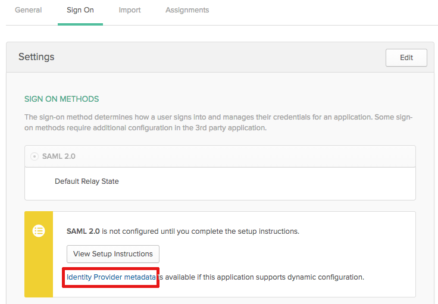

# 고급 인증을 사용할 때 IDP에서 SAML 2.0 메타데이터 업데이트

<!-- enhanced authentication is no longer available for workfront customers -->

{{important-admin-console-onboard}}

Adobe Workfront 관리자는 Workfront SSO(Single Sign-On)를 SAML(Security Assertion Markup Language) 2.0 프로토콜을 지원하는 모든 ID 공급자와 통합할 수 있습니다.

다음 섹션에서는 Workfront 계정이 고급 인증 경험으로 업그레이드된 경우(아직 모든 조직에서 사용할 수 없음) 통합 프로세스에 대해 설명합니다. 향상된 인증 경험에 대한 자세한 내용은 [향상된 인증 개요](../../../administration-and-setup/manage-workfront/security/get-started-enhanced-authentication.md).

고급 인증 경험으로 마이그레이션하기 전에 SAML을 구성하는 방법에 대한 자세한 내용은 [ID 공급자에서 SAML 2.0 메타데이터 업데이트](../../../administration-and-setup/add-users/single-sign-on/update-saml-2-metadata-ip.md).

## 액세스 요구 사항

이 문서의 절차를 수행하려면 다음 액세스 권한이 있어야 합니다.

<table style="table-layout:auto"> 
 <col> 
 <col> 
 <tbody> 
  <tr> 
   <td role="rowheader">Adobe Workfront 플랜</td> 
   <td>모든</td> 
  </tr> 
  <tr> 
   <td role="rowheader">Adobe Workfront 라이선스</td> 
   <td>플랜</td> 
  </tr> 
  <tr> 
   <td role="rowheader">액세스 수준 구성</td> 
   <td> 
Workfront 관리자여야 합니다.
 
<b>참고</b>: 여전히 액세스 권한이 없는 경우 Workfront 관리자에게 액세스 수준에서 추가 제한 사항을 설정하는지 문의하십시오. Workfront 관리자가 액세스 수준을 수정하는 방법에 대한 자세한 내용은 <a href="../../../administration-and-setup/add-users/configure-and-grant-access/create-modify-access-levels.md" class="MCXref xref">사용자 정의 액세스 수준 만들기 또는 수정</a>.
 </td> 
  </tr> 
 </tbody> 
</table>

## ID 공급자로 Okta 사용

Okta는 SAML 2.0을 지원하는 ID 공급자의 예입니다. 이 섹션에서는 Okta를 ID 공급자로 사용하는 방법을 설명합니다. SAML 2.0을 지원하는 다른 ID 공급자를 구성할 때 유사한 단계가 필요합니다.

>[!NOTE]
>
>사용자는 전자 메일 주소를 기반으로 매핑됩니다. Okta를 사용하여 Workfront에 로그인하려면 Workfront 고객에서 만든 이메일 주소가 동일한(대/소문자 구분 안 함)인 사용자가 있어야 합니다.

다음 섹션을 완료하여 Workfront에서 Okta를 ID 공급자로 구성합니다.

* [Okta에서 Workfront 앱 만들기](#create-a-workfront-app-in-okta)
* [Workfront에서 ID 공급자로 Okta 인스턴스 추가](#add-your-okta-instance-as-an-identity-provider-in-workfront)

### Okta에서 Workfront 앱 만들기 {#create-a-workfront-app-in-okta}

1. Okta 환경에 로그인합니다.
1. 확인 **클래식 UI** 은 Okta 인터페이스의 왼쪽 위 모서리에서 선택됩니다.
1. 메뉴에서 **애플리케이션** > **애플리케이션**.

1. 클릭 **애플리케이션 추가**&#x200B;를 클릭한 다음 **새 앱 만들기**.

1. 에서 **새 응용 프로그램 통합 대화 상자 만들기** 상자, 선택 **SAML 2.0**&#x200B;를 클릭한 다음 **만들기**.

1. Workfront 앱의 이름을 지정한 다음 **다음**.
1. 표시되는 SAML 설정 페이지에서 SAML 설정 페이지에 필요한 정보를 찾습니다.

   1. Okta 인터페이스가 표시되는 브라우저 탭을 종료하지 않고 별도의 브라우저 탭이나 창을 엽니다.
   1. 브라우저에서 다음 URL을 지정합니다.

      `https://[your_customer_subdomain].my.workfront.com/auth/saml2/metadata`

   1. 결과 XML 파일에서 **entityID** 및 **위치**.

      

   1. 에서 값을 복사합니다. **entityID** 필드를 시스템 클립보드에 추가합니다. 이 브라우저 탭을 닫지 마십시오.

1. 6단계에서 연 SAML 설정 페이지로 돌아갑니다.
1. 에서 값을 붙여넣습니다. **entityID** 필드 **대상 URI(SP 엔티티 ID)** 필드.

1. 다른 브라우저 탭의 XML 파일에서 **위치** 필드.
1. 에서 값을 붙여넣습니다. **위치** 필드 **단일 사인온** **URL** 필드.

1. 로 스크롤합니다. **속성 문(선택 사항)** 섹션을 참조하십시오.
1. 에서 **이름** 필드, 지정 **이메일**.

1. 에서 **값** 필드, 지정 **user.email**.

1. (선택 사항) 고급 값을 추가합니다.
1. 클릭 **다음**.
1. 선택, **내부 앱을 추가하는 Okta 고객입니다**&#x200B;를 클릭한 다음 **완료**.

### Workfront에서 ID 공급자로 Okta 인스턴스 추가 {#add-your-okta-instance-as-an-identity-provider-in-workfront}

이 절차에서는 Workfront에서 ID 공급자로 Okta를 구성하는 데 필요한 정보를 제공합니다. 기타 매핑 또는 구성 옵션에 대한 자세한 내용은 [SAML 2.0으로 Adobe Workfront 구성](../../../administration-and-setup/add-users/single-sign-on/configure-workfront-saml-2.md).

1. Okta 인스턴스에 대한 ID 공급자 메타데이터를 다운로드합니다.

   1. Okta 환경에 로그인합니다.
   1. 확인 **클래식 UI** 은 Okta 인터페이스의 왼쪽 위 모서리에서 선택됩니다.
   1. 메뉴에서 **애플리케이션** > **애플리케이션**.

   1. 섹션에 설명된 대로 만든 Workfront 앱을 클릭합니다. [Okta에서 Workfront 앱 만들기](#create-a-workfront-app-in-okta)
   1. 설정 **로그인** 탭, **ID 공급자 메타데이터**.

      

      메타데이터가 새 브라우저 탭에서 XML로 열립니다.

   1. 브라우저 URL 필드에 표시되는 URL을 복사합니다.

1. Workfront 관리자로 Workfront에 로그인합니다.
1. 을(를) 클릭합니다. **기본 메뉴** 아이콘  Adobe Workfront의 오른쪽 위 모서리에서 을(를) 클릭하고 **설정** .

1. 왼쪽 패널에서 **시스템** > **단일 사인온(SSO)**.

1. (조건부) 두 개의 탭이 표시되면 **새 SSO 공급자** 탭.

   

   >[!IMPORTANT]
   >
   >에서 기존 SSO 구성 설정을 삭제하지 마십시오 **현재 SSO 공급자** 계정이 고급 인증 환경으로 업데이트되고 새 SSO 구성이 완전히 작동할 때까지 탭합니다.

1. 클릭 **새 SSO 공급자**.
1. Okta IDP와 같은 이름을 지정한 후 설명을 지정합니다.
1. 에서 **ID 공급자 메타데이터에서 필드 채우기** 섹션에서 1단계에서 복사한 URL을 **메타데이터 URL** 필드.\
   또는, **파일 선택** .xml 파일을 업로드하려면 URL을 붙여넣는 것이 좋습니다.

1. 에서 **사용자 특성 매핑** 섹션, **디렉토리 속성** 필드, 유형 **이메일**. (**이메일 주소** 가 이미 **Workfront 사용자 특성** 필드)

1. (선택 사항) 활성화 **기본 SSO 공급자 설정** 인증을 위해 Workfront 로그인 화면이 아닌 ID 공급자 로그인 화면으로 인증되지 않은 사용자를 보내려면 시스템의 모든 사용자가 ID 공급자를 통해 Workfront에 액세스하는 경우에만 이 옵션을 활성화하는 것이 좋습니다.
1. 을(를) 선택합니다 **활성화** 확인란을 선택합니다. 이 작업을 수행하기 전에 시스템의 사용자가 새 로그인 환경을 인식하여 Workfront 시스템에 대한 액세스 권한을 잃지 않도록 해야 합니다.
1. 클릭 **연결 테스트**.\
   연결이 성공했음을 알리는 메시지가 표시됩니다.

1. **저장**&#x200B;을 클릭합니다.

## 다른 ID 공급자 사용

Okta 이외의 ID 공급자(예: Ping 또는 Centrify)를 사용하는 경우 Workfront 메타데이터를 다시 ID 공급자에게 업로드해야 합니다.
