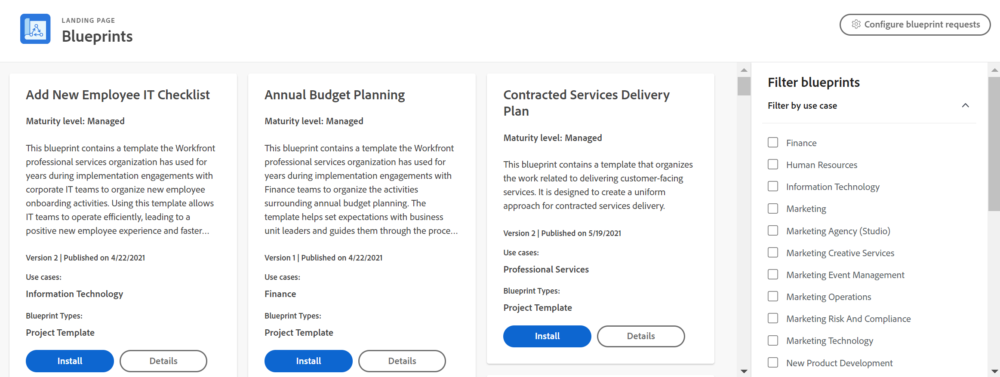

# 블루프린트 개요

<!--Audited: 01/2024-->

블루프린트는 Workfront의 일반적인 사용 사례를 처리하는 Workfront 개체 세트입니다. 블루프린트를 다운로드하여 설치한 다음 특정 사용 사례에 맞게 개체를 구성할 수 있습니다.

>[!INFO]
>
>예:
>
>* **인적 자원 조직 설정**
>
>   이 블루프린트에는 인적 자원 부서로 확장할 조직 구조의 구성이 포함되어 있습니다.
>
>* **새 직원 IT 검사 목록 추가**
>
>   이 블루프린트에는 새 직원 온보딩 활동을 구성하는 템플릿이 들어 있습니다. 이 템플릿을 사용하면 IT 팀이 효율적으로 운영할 수 있으므로 새로운 직원의 업무 경험이 향상되고 업무 생산성을 보다 빠르게 추적할 수 있습니다.
>
>* **상속된 인스턴스 기본 사항 | 체크리스트**
>
>    이 블루프린트에는 Workfront 인스턴스 구성 방법을 명확하게 이해하기 위해 간단한 질문, 리소스 및 링크 목록과 함께 검토할 수 있는 프로젝트 템플릿(또는 체크리스트)이 포함되어 있습니다. 최근에 Workfront 인스턴스를 상속했으며 시작할 위치에 대한 지침이 필요한 경우 사용하십시오.
>
>현재 블루프린트를 검토하려면 다음을 참조하십시오 [사용 가능한 블루프린트 목록](/help/quicksilver/administration-and-setup/blueprints/list-of-available-blueprints.md).

블루프린트는 사용자와 함께 성장하는 작업 관리 시스템을 만드는 데 도움이 되는 기본 구성 요소를 제공합니다. 시스템 관리자는 블루프린트 카탈로그를 검색하고 바로 사용할 수 있는 프로젝트 템플릿, 대시보드 및 조직 구조를 설치할 수 있습니다. 다른 사용자는 카탈로그를 탐색하고 블루프린트 설치를 요청할 수 있습니다. 자세한 내용은 [블루프린트 카탈로그 검색 및 블루프린트 설치 요청](../../administration-and-setup/blueprints/browse-catalog.md).

각 블루프린트는 입증된 Best Practice를 보다 신속하게 시스템에 구현할 수 있도록 도와 주는 부서와 특정 성숙도 수준에 맞춰 타기팅됩니다. 아래 설명된 완성도 수준은 블루프린트 카탈로그 카드 및 세부 정보에 표시됩니다.

* **[!UICONTROL 관리됨]:** 관리 프로젝트 템플릿을 사용하면 활동 및 결과물이 표준 절차로 완전히 수용되기 전에 새로운 비즈니스 프로세스를 채택할 수 있습니다. 여기에는 새 프로세스의 각 단계가 준수되도록 하는 작업이 포함됩니다.

* **[!UICONTROL 통합]:** 통합 프로젝트 템플릿에서는 비즈니스 기능이 표준 운영 절차를 통해 지원된다고 가정합니다. 프로세스에 기여하는 사람은 프로세스를 수행하기 위해 완료해야 하는 단계 및 작업을 알고 있습니다. 이 프로세스를 지원하는 프로젝트 템플릿에는 보고 목적으로 필요한 마일스톤과 기타 주요 결과물만 추적하는 작업이 더 적게 포함되어 있습니다.

## 적합한 블루프린트 찾기

사용 사례, 완성도, 설치 상태별로 블루프린트를 찾아보고 카탈로그의 오른쪽에 있는 필터로 입력할 수 있습니다. 관심 있는 블루프린트를 찾으면 세부 정보 페이지에서 세부 정보를 볼 수 있습니다.

### 블루프린트 유형

블루프린트 유형은 블루프린트에 포함된 것을 보여 줍니다. 유형은 카탈로그의 블루프린트 카드 하단에 나열됩니다. 블루프린트는 두 개 이상의 유형을 가질 수 있습니다.

다음 유형의 블루프린트를 사용할 수 있습니다.

* **프로젝트 템플릿**: 프로젝트 템플릿과 연결된 표준 개체(작업, 문제, 역할 및 팀)와 해당 개체와 관련된 일부 환경 설정을 포함합니다. 자세한 내용은 [블루프린트 구성](../../administration-and-setup/blueprints/configure-template-package.md).
* **조직 구조**: 조직 구조(회사, 그룹, 역할 및 팀)와 관련된 개체를 포함합니다. 자세한 내용은 [블루프린트 구성](../../administration-and-setup/blueprints/configure-template-package.md).
* **대시보드**: 구현 서비스와 같은 특정 사용 사례에 대한 하나 이상의 대시보드를 포함합니다.
<!--
* Request queues: Includes one or more projects configured as request queues.
* Custom forms: Includes custom forms attached to another object type, such as a project or portfolio.
* Setup features: Includes one or more elements that are configured in the Setup area of Workfront, such as layout templates.
-->

현재 블루프린트를 검토하려면 다음을 참조하십시오 [사용 가능한 블루프린트 목록](/help/quicksilver/administration-and-setup/blueprints/list-of-available-blueprints.md).

### 세부 정보 보기

각 블루프린트에는 세부 사항 페이지가 포함되어 있습니다. 이 페이지에서 다음 작업을 수행할 수 있습니다.

* 워크플로우 콘텐츠 요약 보기
* 블루프린트에 대한 간략한 요약 읽기
* 설치 기록 보기(클릭 **[!UICONTROL 세부 정보 보기]** 블루프린트와 함께 설치된 개체의 전체 목록을 보려면
* 역할, 팀, 회사 및 그룹 설명 보기
* 프로젝트 템플릿과 같은 특정 블루프린트의 시각적 예 보기(브라우저에서 전체 이미지를 미리 보거나 다운로드할 수 있음)

![[!UICONTROL 블루프린트 세부 정보] 페이지](assets/blueprint-details-page-2022.png)

## 블루프린트 설치

Workfront 관리자는 모든 환경(프로덕션, 미리보기 또는 샌드박스 환경)에서 직접 블루프린트를 설치할 수 있습니다. 자세한 내용은 다음을 참조하십시오. [블루프린트 설치](../../administration-and-setup/blueprints/blueprints-install.md) 또는 [블루프린트 구성](../../administration-and-setup/blueprints/configure-template-package.md).

설치 후 수행할 다음 작업에 대해 잘 모를 수 있습니다. 자세한 내용은 [블루프린트 설치 후 수행할 작업](../../administration-and-setup/blueprints/best-next-actions-after-install.md).

## 블루프린트 및 템플릿에 대한 추가 참고 사항

블루프린트는 의 프로젝트 템플릿 기능을 대체하지 않습니다. [!DNL Adobe Workfront]. 블루프린트는 새 템플릿을 더 빨리 만들어 더 많은 작업을 구성하는 방법입니다. [!DNL Workfront].

블루프린트는 복사하거나 편집할 수 없습니다. 하지만 블루프린트에서 솔루션을 설치한 후에는 일반적으로 의 해당 레코드를 업데이트하는 것과 같은 방식으로 블루프린트에서 생성된 프로젝트 템플릿, 작업 역할 또는 팀을 수정할 수 있습니다. [!DNL Workfront] 인터페이스. 또한 블루프린트를 설치하면 템플릿이에 저장됩니다. [!UICONTROL 템플릿] 영역 [!DNL Workfront] 원본 블루프린트는 [!UICONTROL 블루프린트] 영역입니다. 필요에 맞게 맞춤화하기 전에 템플릿 복사본을 만들 필요가 없습니다.

블루프린트는 환경에 구성된 것을 제거하거나 대체하지 않습니다. 새 템플릿을 만드는 블루프린트를 설치하여 기존 템플릿을 바꾸려면 템플릿에서 프로젝트를 빌드하는 플래너 사이에 혼동을 피하기 위해 이전 버전을 비활성화하는 것이 좋습니다.
