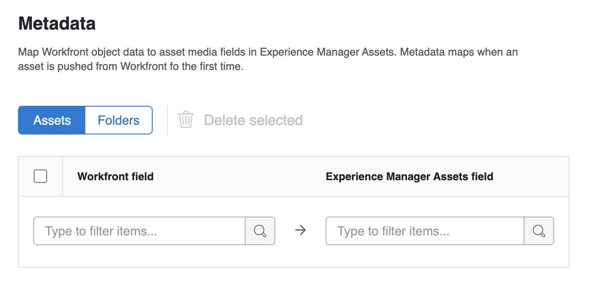

# 구성 [!UICONTROL Experience Manager Assets as a Cloud Service] 통합

다음 위치에서 작업을 콘텐츠와 연결할 수 있습니다. [!DNL Experience Manager Assets]&#x200B;:

* 에서 에셋 및 메타데이터 푸시 [!DNL Adobe Workfront] 끝 [!DNL Experience Manager Assets]&#x200B;
* 에서 에셋 연결 [!DNL Experience Manager Assets] 의 프로젝트 및 작업에 [!DNL Workfront&#x200B;]
* 버전 관리 사용 사례 촉진
* 연결된 폴더 만들기 [!DNL Experience Manager Assets]
* 에셋 및 폴더에 대한 메타데이터 추적
* 프로젝트 메타데이터 동기화 [!DNL Workfront] 및 [!DNL Experience Manager Assets]

여러 Experience Manager Assets 저장소를 조직 ID를 통해 하나의 Workfront 환경에 연결하거나 여러 Workfront 환경을 하나의 Experience Manager Assets 저장소에 연결할 수도 있습니다. 설정하려는 각 통합에 대해 이 문서의 구성 지침을 따르십시오.

## 액세스 요구 사항

다음 항목이 있어야 합니다.

<table>
  <tr>
   <td><strong>[!DNL Adobe Workfront] 플랜*</strong>
   </td>
   <td>모든
   </td>
  </tr>
  <tr>
   <td><strong>[!DNL Adobe Workfront] 라이센스*</strong>
   </td>
   <td>[!UICONTROL 계획]
   </td>
  </tr>
  <tr>
   <td><strong>[!DNL Experience Manager] 라이센스</strong>
   </td>
   <td>[!UICONTROL Standard]
   </td>
  </tr>
  <tr>
   <td><strong>제품</strong>
   </td>
   <td>다음을 수행해야 합니다. [!DNL Experience Manager Assets as a Cloud Service]을 누르고 제품에 사용자로 추가되어야 합니다.
   </td>
  </tr>
  <tr>
   <td>액세스 수준 구성*
   </td>
   <td>다음이어야 합니다: [!DNL Workfront] 관리자. 다음에 대한 정보: [!DNL Workfront] 관리자, 참조 <strong>사용자에게 전체 관리 액세스 권한 부여</strong>.
   </td>
  </tr>
</table>

*보유 중인 플랜, 라이선스 유형 또는 액세스 권한을 확인하려면 Workfront 관리자에게 문의하십시오.

## 전제 조건

시작하기 전에,

* 다음을 수행해야 합니다. [!DNL Workfront] 및 [!DNL Adobe Experience Manager Assets] 에서 조직 ID와 연결됨 [!DNL Adobe Admin Consol]e. 자세한 내용은 [플랫폼 기반 관리의 차이점 ([!DNL Adobe Workfront]/[!DNL Adobe Business Platform])](/help/quicksilver/administration-and-setup/get-started-wf-administration/actions-in-admin-console.md).

## 통합 정보 설정

1. 다음을 클릭합니다. **[!UICONTROL 메인 메뉴]** 아이콘을 클릭한 다음 Adobe Workfront 오른쪽 위 모서리에 있는 **[!UICONTROL 설정]** .
1. 선택 **[!UICONTROL 문서]** 왼쪽 패널에서 을 선택합니다. **[!UICONTROL [!DNL Experience Manager]통합]**.
   >[!NOTE]
   >
   >이 구성 영역은 [!DNL Workfront] 환경은 다음 아래에 포함됩니다. [!DNL Adobe Admin Console].

1. 선택 **[!UICONTROL 추가 [!DNL Experience Manager] 통합]**.
1. 다음에서 **[!UICONTROL 이름]** 필드에 Workfront 및 Experience Manager Assets에서 이 통합과 상호 작용할 때 사용자가 볼 이름을 입력합니다.
1. 다음에서 **[!UICONTROL 탐색 URL]** 필드에서 탐색 URL이 자동으로 채워집니다. 이 읽기 전용 URL은 조직의 [!DNL Experience Manager] 인스턴스: [!UICONTROL 메인 메뉴] 빠르게 액세스할 수 있습니다.
1. 다음에서 저장소 선택 **[!UICONTROL [!DNL Experience Manager]에셋 저장소]** 드롭다운 메뉴. 자동으로 채워집니다. [!DNL Experience Manager] 사용자 프로필이 할당된 조직 ID와 연결된 저장소입니다.
   

1. 클릭 **[!UICONTROL 저장]** 또는 로 이동합니다. [메타데이터 설정(선택 사항)](#set-up-metadata-optional) 이 문서의 섹션.

   >[!NOTE]
   >
   >통합의 복잡성으로 인해 초기 구성을 저장한 후에는 저장소를 변경할 수 없습니다.

## 메타데이터 설정(선택 사항)

매핑할 수 있습니다 [!DNL Workfront] 의 에셋 미디어 필드에 대한 개체 데이터 [!DNL Experience Manager] 에셋.

>[!IMPORTANT]
>
>메타데이터는 한 방향으로만 매핑할 수 있습니다. [!DNL Workfront] 끝 [!DNL Experience Manager]. 연결된 문서의 메타데이터 [!DNL Workfront] 출처: [!DNL Experience Manager] 을(를) (으)로 전송할 수 없음 [!DNL Workfront].

### 메타데이터 필드 구성

메타데이터 필드 매핑을 시작하기 전에 Workfront 및 Experience Manager Assets 모두에서 메타데이터 필드를 구성해야 합니다.

메타데이터 필드를 구성하려면:

1. 에서 메타데이터 스키마 구성 [!DNL Experience Manager Assets] 에서 설명된대로 [Adobe 간 에셋 메타데이터 매핑 구성 [!DNL Workfront] 및 [!DNL Experience Manager Assets]](https://experienceleague.adobe.com/docs/experience-manager-cloud-service/content/assets/integrations/configure-asset-metadata-mapping.html?lang=en).

1. Workfront에서 사용자 정의 양식 필드를 구성합니다. [!DNL Workfront] 에는 사용할 수 있는 많은 기본 제공 사용자 정의 필드가 있습니다. 그러나 에 설명된 대로 사용자 정의 필드를 만들 수도 있습니다 [사용자 정의 양식 만들기 또는 편집](/help/quicksilver/administration-and-setup/customize-workfront/create-manage-custom-forms/create-or-edit-a-custom-form.md).

+++ **를 확장하여 지원되는 Workfront 및 Experience Manager Assets 필드에 대한 자세한 정보를 봅니다**

**Experience Manager Assets 태그**

Workfront 지원 필드를 Experience Manager Assets의 태그에 매핑할 수 있습니다. 이렇게 하려면 Experience Manager Assets의 태그 값이 Workfront과 일치하는지 확인해야 합니다.

* 태그와 Workfront 필드 값은 맞춤법 및 형식에서 정확히 일치해야 합니다.
* experience Manager assets 태그에 매핑된 Workfront 필드 값은 Experience Manager Assets의 태그가 대문자로 표시되더라도 모두 소문자여야 합니다.
* Workfront 필드 값에는 공백이 없어야 합니다.
* Workfront의 필드 값에는 Experience Manager Assets 태그의 폴더 구조도 포함되어야 합니다.
* 여러 한 줄 텍스트 필드를 태그에 매핑하려면 메타데이터 매핑의 Workfront 측에 쉼표로 구분된 태그 값 목록을 입력하고 `xcm:keywords` Experience Manager Assets 쪽입니다. 각 필드 값은 별도의 태그에 매핑됩니다. 계산된 필드를 사용하여 여러 Workfront 필드를 쉼표로 구분된 단일 텍스트 필드로 결합할 수 있습니다.
* 해당 필드에 사용 가능한 값의 쉼표로 구분된 목록을 입력하여 드롭다운, 라디오 버튼 또는 확인란 필드의 값을 매핑할 수 있습니다.

>[!INFO]
>
>**예**: 여기에서 폴더 구조에 표시되는 태그를 일치시키기 위해 Workfront의 필드 값은 다음과 같습니다. `landscapes:trees/spruce`. Workfront 필드 값에서 소문자를 확인합니다.
>
>태그 트리에서 태그가 맨 왼쪽 항목이 되도록 하려면 뒤에 콜론이 와야 합니다. 이 예제에서 landscape 태그에 매핑하려면 Workfront의 필드 값은 다음과 같습니다 `landscapes:`.
>
>

Experience Manager Assets에서 태그를 만들면 메타데이터 섹션의 태그 드롭다운 아래에 태그가 표시됩니다. 필드를 태그에 연결하려면 다음을 선택합니다. `xcm:keywords` 메타데이터 매핑 영역의 Experience Manager Assets 필드 드롭다운.

태그를 만들고 관리하는 방법을 포함하여 Experience Manager Assets의 태그에 대한 자세한 내용은 [태그 관리](https://experienceleague.adobe.com/docs/experience-manager-64/administering/contentmanagement/tags.html).

**Experience Manager Assets 사용자 지정 메타데이터 스키마 필드**

기본 제공 및 사용자 지정 Workfront 필드를 모두 Experience Manager Assets의 사용자 지정 메타데이터 스키마 필드에 매핑할 수 있습니다.

Experience Manager Assets에서 만든 사용자 지정 메타데이터 필드는 메타데이터 설정 영역의 자체 섹션에 구성됩니다.

<!-- 
link to documentation about creating schema - waiting on response from Anuj about best article to link to
-->

**Workfront 필드**

기본 제공 필드와 사용자 지정 Workfront 필드를 모두 Experience Manager Assets에 매핑할 수 있습니다. 다음 필드 값은 Workfront과 Experience Manager Assets 간에 대소문자와 맞춤법 모두에서 일치해야 합니다.

* 드롭다운 필드
* 다중 선택 필드

>[!TIP]
>
> 필드 값이 정확히 일치하는지 확인하려면
>
> * 설정 > Workfront의 사용자 지정 Forms 또는 오브젝트의 필드
> * Experience Manager Assets의 에셋 > 메타데이터 스키마

+++

### 에셋의 메타데이터 매핑

에셋이 전달될 때 메타데이터 맵 [!DNL Workfront] 처음으로. 기본 제공 필드 또는 사용자 지정 필드가 있는 문서는에 에셋을 처음 전송할 때 지정된 필드에 자동으로 매핑됩니다. [!DNL Experience Manager Assets].

에셋의 메타데이터를 매핑하려면 다음을 수행합니다.

1. 선택 **[!UICONTROL 에셋]** 메타데이터 테이블 위
1. 다음에서 **[!UICONTROL [!DNL Workfront]필드]** 열에서 기본 제공 또는 사용자 지정 Workfront 필드를 선택합니다.

   >[!NOTE]
   >
   >단일 항목을 매핑할 수 있습니다 [!DNL Workfront] 여러 필드 [!UICONTROL Experience Manager Assets] 필드. 여러 개를 매핑할 수 없음 [!DNL Workfront] 단일 필드 [!DNL Experience Manager Assets] 필드.
   ><!--To map a Workfront field to an Experience Manager Assets tag, see -->

1. 다음에서 [!DNL Experience Manager Assets] 필드, 미리 채워진 범주를 검색하거나 검색 필드에 두 개 이상의 문자를 입력하여 추가 범주에 액세스합니다.
1. 필요에 따라 2단계와 3단계를 반복합니다.
   
1. 클릭 [!UICONTROL 저장] 또는 로 이동합니다. [폴더](#folders) 이 문서의 섹션.

### 폴더에 대한 메타데이터 매핑

사용자가 프로젝트에 연결된 폴더를 만들면 연결된 프로젝트, 포트폴리오 및 프로그램 데이터가 의 폴더 메타데이터 필드에 매핑됩니다. [!DNL Experience Manager Assets].

>[!NOTE]
>
>이 통합은 의 사용자 지정 메타데이터를 지원하지 않습니다. [!DNL Adobe Experience Manager].

폴더의 메타데이터를 매핑하려면 다음을 수행합니다.

1. 선택 **[!UICONTROL 폴더]** 메타데이터 테이블 위
1. 다음에서 **[!UICONTROL [!DNL Workfront]필드]** 열에서 기본 제공 또는 사용자 지정 Workfront 필드를 선택합니다.

   >[!NOTE]
   >
   >단일 Workfront 필드를 여러 Experience Manager Assets 필드에 매핑할 수 있습니다. 여러 개를 매핑할 수 없음 [!DNL Workfront] 단일 필드 [!DNL Experience Manager Assets] 필드.

1. 다음에서 **[!DNL Experience Manager Assets]** 필드, 미리 채워진 범주를 검색하거나 검색 필드에 두 개 이상의 문자를 입력하여 추가 범주에 액세스합니다.
1. 필요에 따라 2단계와 3단계를 반복합니다.
   
1. 클릭 **[!UICONTROL 저장]** 또는 로 이동합니다. [프로젝트 메타데이터 동기화](#project-metadata-sync) 이 문서의 섹션.

### 오브젝트 메타데이터 동기화

An [!DNL Experience Manager] 매핑된 필드 [!DNL Workfront] 포트폴리오, 프로그램, 프로젝트, 작업, 문제 및 문서 필드는에서 필드가 변경되면 자동으로 업데이트됩니다. [!DNL Workfront].

>[!IMPORTANT]
>
>사용자는에 대한 쓰기 액세스 권한이 있어야 합니다. [!DNL Experience Manager] 업데이트된 메타데이터를 동기화하기 위해 개체에 있는 에셋의 경우.

1. 활성화 **[!UICONTROL 오브젝트 메타데이터 동기화]** 필드.
1. 클릭 **저장** 또는 로 이동합니다. [워크플로우 설정(선택 사항)](#set-up-workflows-optional) 이 문서의 섹션.

<!--Courtney start here-->

## 워크플로우 설정(선택 사항)

워크플로는 Workfront을 Adobe Experience Manager as a Cloud Service에 연결하는 작업 세트입니다. Workfront 관리자는 Workfront에서 워크플로우를 구성한 다음 프로젝트 템플릿에 할당할 수 있습니다. 워크플로가 할당된 프로젝트 템플릿을 사용하여 프로젝트를 만들면 워크플로에 정의된 작업이 트리거됩니다.

통합에서 설정한 기본 워크플로 값은 프로젝트 템플릿 및 프로젝트 수준에서 재정의할 수 있습니다.

### Adobe Experience Manager 연결 폴더를 만들기 위한 워크플로우 설정

1. 전환 **[!UICONTROL 연결된 폴더 만들기]** 켜짐.
1. 폴더 경로를 선택하여 이 통합과 연결된 모든 폴더를 연결할 위치를 지정합니다.
   
1. 활성화 **Portfolio 및 프로그램 이름 추가** 연결된 폴더 이름 끝에 Portfolio 및 프로그램 이름을 자동으로 포함하는 옵션입니다.
1. 클릭 **저장** 또는 로 이동합니다. [연결된 폴더 설정(선택 사항)](#set-up-linked-folders-optional) 이 문서의 섹션.

<!--Courtney end here-->

## 연결된 폴더 설정(선택 사항)

사용자가 연결된 폴더를 만들도록 허용할 수 있습니다. [!DNL Experience Manager] 다음 기간 동안 [!DNL Workfront] 프로젝트. 폴더가 연결되면 폴더에 추가된 모든 에셋이 자동으로 두 폴더에 표시됩니다 [!DNL Workfront] 및 [!DNL Experience Manager]. 에셋이 의 연결된 폴더에 추가되는 경우 [!DNL Workfront] 처음으로 에셋의 메타데이터가에 푸시됨 [!DNL Experience Manager Assets].

아래 단계에서는 연결된 폴더를 만들 위치를 지정합니다. 각 통합에는 연결된 모든 폴더에 대해 하나의 위치만 있을 수 있습니다.

연결된 폴더를 설정하려면 다음을 수행하십시오.

1. 전환 **[!UICONTROL 연결된 폴더 활성화]** 켜짐.
1. 폴더 경로를 선택하여 이 통합과 연결된 모든 폴더를 연결할 위치를 지정합니다.

   >[!NOTE]
   >
   >사용자는에서 쓰기 액세스 권한이 필요합니다. [!DNL Adobe Experience Manager Assets] 연결된 폴더를 만들도록 지정한 폴더에 연결합니다.

1. **[!UICONTROL 저장]**&#x200B;을 클릭합니다.
