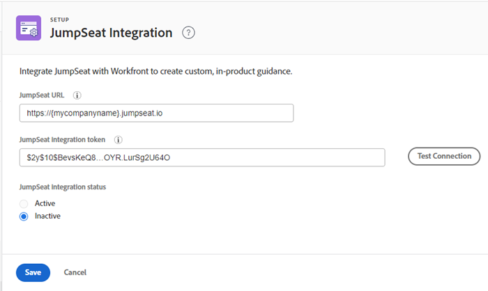

# JumpSeat 통합 구성

[!DNL JumpSeat]을(를) [!DNL Workfront]과(와) 통합하여 사용자 지정 제품 내 지침을 만들 수 있습니다.

## 액세스 요구 사항

+++ 을 확장하여 이 문서의 기능에 대한 액세스 요구 사항을 봅니다.

<table>
  <tr>
   <td>Adobe Workfront 패키지
   </td>
    
워크플로 얼티밋

   <td> 
Prime 또는 Ultimate

   </td>
  </tr>
    <tr>
   <td>Adobe Workfront 라이선스
   </td>
   <td>표준
   
플랜

   </td>
  </tr>
  </tr>
  <tr>
   <td>제품
   </td>
   <td>활성 [!DNL JumpSeat] 플랜이 있어야 합니다.
   </td>
  </tr>
   <tr>
   <td>액세스 수준 구성
   </td>
   <td>[!DNL Workfront] 관리자여야 합니다.
   </td>
  </tr>
</table>

이 표의 정보에 대한 자세한 내용은 [Workfront 설명서의 액세스 요구 사항](/help/quicksilver/administration-and-setup/add-users/access-levels-and-object-permissions/access-level-requirements-in-documentation.md)을 참조하십시오.

+++

## 전제 조건

시작하기 전에 다음을 수행해야 합니다

* [!DNL Workfront]에서 응용 프로그램으로 [!DNL JumpSeat]을(를) 추가하고 활성화합니다. 자세한 내용은 [응용 프로그램을 추가하거나 삭제하는 방법](https://support.jumpseat.io/article/how-to-add-an-application/)을 참조하세요.

>[!IMPORTANT]
>
>Adobe 통합 환경을 사용하는 경우 응용 프로그램 URL `.workfront.adobe.com`을(를) 사용해야 합니다.

## [!DNL JumpSeat] 통합 구성

미리 보기 및 프로덕션 환경 모두에서 [!DNL JumpSeat] 통합을 설정하는 것이 좋습니다.

>[!TIP]
>
>[!DNL Workfront]에서 두 개의 별도 [!DNL JumpSeat] 응용 프로그램을 추가하고 활성화해야 합니다(미리 보기용 응용 프로그램과 프로덕션용 응용 프로그램). 자세한 내용은 [응용 프로그램을 추가하거나 삭제하는 방법](https://support.jumpseat.io/article/how-to-add-an-application/)을 참조하십시오.

[!DNL JumpSeat] 통합을 구성하려면:

{{step-1-to-setup}}

1. 왼쪽 패널에서 **[!UICONTROL 시스템]** > **[!UICONTROL [!DNL JumpSeat]통합]**&#x200B;을 클릭합니다.
1. **[!UICONTROL [!DNL JumpSeat]의 확장 아이콘에 있는]** URL[!DNL JumpSeat]을(를) 입력하십시오.

>[!BEGINSHADEBOX]

**예:**

https://{mycompanyname}.jumpseat.io

>>

>[!ENDSHADEBOX]

1. **[!UICONTROL [!DNL JumpSeat]통합 토큰]**&#x200B;을(를) 입력하십시오. **[!UICONTROL 의]**&#x200B;구성[!DNL JumpSeat] 페이지에서 찾을 수 있습니다.

   **예:** $2y$10$BevsKeQ8....OYR.LurSg2U64O

1. **[!UICONTROL 구성 테스트]**&#x200B;를 클릭합니다.
1. 통합이 **[!UICONTROL 활성]** 또는 **[!UICONTROL 비활성]**&#x200B;이 되도록 하려면 선택하십시오.

   >[!IMPORTANT]
   >
   >통합을 활성화하려면 5단계에서 수행한 구성 테스트를 통과해야 합니다.

   

1. **[!UICONTROL 저장]**&#x200B;을 클릭합니다.

>[!TIP]
>
>[!DNL JumpSeat] 통합 구성에 대한 자세한 내용은 [!DNL JumpSeat]JumpSeat+Workfront[에 대한 ](https://jumpseat.io/landing-page/jumpseat-workfront/) 설명서를 참조하십시오.
