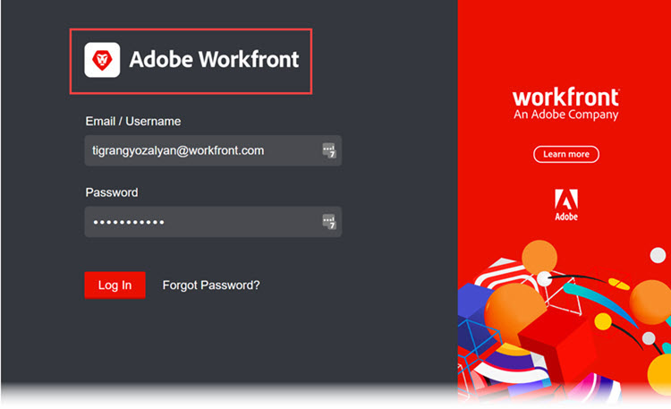

# Adobe Workfront 인스턴스에 브랜드 설정

<!--
**DON'T DELETE, DRAFT OR HIDE THIS ARTICLE. IT IS LINKED TO THE PRODUCT, THROUGH THE CONTEXT SENSITIVE HELP LINKS. **
-->

>[!IMPORTANT]
>
>이 페이지에 설명된 프로시저는 [!DNL Adobe Experience Cloud]에 아직 온보딩되지 않은 조직에만 적용됩니다.
>
> 조직이 [!DNL Adobe Experience Cloud]에 온보딩된 경우 브랜딩을 사용할 수 없습니다.

Workfront 관리자는 다음 위치에 로고가 있는 Workfront을 브랜딩할 수 있습니다.

* 로그인 화면

  

* 상위 탐색 영역

  

* 메인 메뉴

  

로그인 화면의 배경 이미지와 색상을 변경할 수도 있습니다.

>[!NOTE]
>
>* 조직의 Workfront 인스턴스가 사용자 정의 SSO 포털을 사용하는 경우 로그인 배경 이미지 및 색상을 변경할 수 없습니다. 자세한 내용은 네트워크 또는 IT 관리자에게 문의하십시오.
><!--
>or is enabled with Adobe IMS  >
>  >
>-->
>
>* Workfront 관리자 또는 그룹 관리자는 레이아웃 템플릿을 사용하여 특정 그룹 및 사용자에 대한 Workfront을 브랜딩할 수도 있습니다. 레이아웃 템플릿의 브랜딩은 이 문서에 설명된 시스템 수준 브랜딩을 무시합니다. 레이아웃 템플릿의 브랜딩에 대한 지침은 [레이아웃 템플릿을 사용하여 Adobe Workfront 브랜딩](../../../administration-and-setup/customize-workfront/use-layout-templates/brand-wf-using-a-layout-template.md)을 참조하십시오.

## 액세스 요구 사항

+++ 을 확장하여 이 문서의 기능에 대한 액세스 요구 사항을 봅니다.

이 문서의 단계를 수행하려면 다음 액세스 권한이 있어야 합니다.

<table style="table-layout:auto"> 
 <col> 
 <col> 
 <tbody> 
  <tr> 
   <td role="rowheader">Adobe Workfront 플랜</td> 
   <td>임의</td> 
  </tr> 
  <tr> 
  <tr> 
   <td role="rowheader">Adobe Workfront 라이선스</td> 
   <td>
새로운 기능: 표준

       
또는

       
현재: 플랜
</td>
  </tr> 
  </tr> 
  <tr> 
   <td role="rowheader">액세스 수준 구성</td> 
   <td>[!UICONTROL 시스템 관리자]</td>
  </tr> 
 </tbody> 
</table>

이 표의 정보에 대한 자세한 내용은 [Workfront 설명서의 액세스 요구 사항](/help/quicksilver/administration-and-setup/add-users/access-levels-and-object-permissions/access-level-requirements-in-documentation.md)을 참조하십시오.

+++

## 로그인 화면에 브랜딩

{{step-1-to-setup}}

1. **시스템** > **브랜딩**&#x200B;을 클릭합니다.

1. 다음 변경 중 하나를 수행하여 브랜딩 이미지로 Workfront을 사용자 지정합니다.

   <table style="table-layout:auto"> 
    <col> 
    <col> 
    <tbody> 
     <tr> 
      <td role="rowheader"> 
홈 아이콘 (위쪽 탐색 영역의 맨 왼쪽에 표시됨)에 브랜딩합니다.
 </td> 
      <td> 
<strong>위쪽 탐색 영역</strong> 섹션의 <strong>홈 아이콘</strong>에서 상자의 아무 곳이나 클릭한 다음 로고 이미지를 찾아 선택합니다. 또는 이미지를 상자로 드래그합니다.
 
이미지를 자르려면 스크롤 컨트롤을 사용하고 이미지를 지정된 공간 내에서 원하는 위치로 드래그합니다.
 
120 x 120 이미지를 사용하는 것이 좋습니다. GIF, JPG, PNG, SVG 형식 중 하나일 수 있습니다.
 
이 아이콘은 사용자가 PDF 파일로 내보내는 보고서, 목록, 대시보드 및 게재된 보고서에도 표시됩니다.
 </td> 
     </tr> 
     <tr> 
      <td role="rowheader"> 
주 메뉴  로고  브랜딩(주 메뉴의 오른쪽 위 모서리에 표시)
 </td> 
      <td> 
<strong>위쪽 탐색 영역</strong> 섹션의 <strong>기본 메뉴 로고</strong>에서 상자의 아무 곳이나 클릭한 다음 로고 이미지를 찾아 선택합니다. 또는 이미지를 상자로 드래그합니다.
 
이미지를 자르려면 스크롤 컨트롤을 사용하고 이미지를 지정된 공간 내에서 원하는 위치로 드래그합니다.
 
300 x 120픽셀 이미지를 사용하는 것이 좋습니다. GIF, JPG, PNG, SVG 형식 중 하나일 수 있습니다.
 </td> 
     </tr> 
     <tr> 
      <td role="rowheader">로그인 화면 로고 을(를) 브랜딩합니다(사용자가 로그인 자격 증명을 입력하는 상자의 왼쪽 상단에 표시됨)</td> 
      <td> 
<strong>로그인 화면</strong>에서 상자의 아무 곳이나 클릭한 다음 로고 이미지를 찾아 선택합니다. 이미지를 자르려면 스크롤 컨트롤을 사용하고 이미지를 지정된 공간 내에서 원하는 위치로 드래그합니다.
 
300 x 120픽셀 이미지를 사용하는 것이 좋습니다. GIF, JPG, PNG, SVG 형식 중 하나일 수 있습니다.
 </td> 
     </tr> 
     <tr> 
      <td role="rowheader">로그인 화면 배경색 (사용자가 로그인 자격 증명을 입력하는 상자 뒤에 표시됨)을(를) 브랜딩합니다.</td> 
      <td> 
<strong>로그인 화면</strong>에서 <strong>배경색</strong>을 설정합니다. 
 
RGB 또는 HEX 색상 코드를 사용할 수 있습니다.
 
배경색은 로그인 화면 배경이 로그인 화면 배경 이미지(이 표의 다음 행 참조)보다 크거나 이미지에 투명도가 있는 경우에만 표시됩니다.
 </td> 
     </tr> 
     <tr> 
      <td role="rowheader">로그인 화면 배경 이미지 (사용자가 로그인 자격 증명을 입력하는 상자 뒤에 표시됨)에 브랜딩합니다.</td> 
      <td> 
       <ol style="list-style-type: lower-alpha;"> 
        <li value="1"> 
 <strong>로그인 화면</strong> 영역의 <strong>배경 이미지</strong> 아래에서 상자를 클릭한 다음 JPG 또는 PNG 이미지(최대 20개)를 찾아 선택합니다. 
 
여러 배경 이미지가 무작위 순서로 표시되므로 사용자가 로그인 페이지를 새로 고칠 때마다 변경됩니다. 이미지는 2MB 이하인 것이 좋습니다.
 </li> 
        <li value="2"> 
업로드한 각 배경 이미지 위로 마우스를 가져간 후 설정(톱니바퀴) 아이콘을 클릭하고 다음 옵션 중 하나를 사용하여 로그인 화면 배경에 이미지가 표시될 위치와 방법을 지정합니다.
 
         <ul> 
          <li> 
<strong>화면 채우기</strong>: 이미지를 로그인 화면 배경에 맞추면 이미지가 커질 수 있습니다. 최상의 결과를 얻으려면 고해상도 이미지(최대 2MB)를 사용하십시오.
 
이 옵션을 사용하면 사용자 지정할 수 없는 Workfront 배너가 이미지의 일부를 가립니다.
 </li> 
          <li> 
<strong>타일</strong>: 로그인 화면 배경 영역에 이미지를 원래 크기로 바둑판식으로 배열합니다. 패턴을 생성하는 데 유용합니다. 배경 영역의 왼쪽 위 모서리, 가운데 위 또는 오른쪽 위에서 타일링을 시작하려면 파란색 정렬 옵션을 선택합니다.
 </li> 
          <li> 
<strong>위치</strong>: 로그인 화면 배경 영역의 왼쪽 위, 가운데 위 또는 오른쪽 위의 파란색 정렬 옵션 중 하나를 사용하여 선택한 위치에 이미지를 원래 크기로 배치합니다.
 
배경색은 로그인 화면의 나머지 배경 영역을 채웁니다. 배경색에 대한 자세한 내용은 이 표의 이전 행을 참조하십시오.
 </li> 
         </ul> </li> 
       </ol> </td> 
     </tr> 
     <tr> 
      <td role="rowheader">기본 브랜딩으로 재설정</td> 
      <td> 
기본 브랜딩으로 재설정하면 업로드한 모든 사진과 이미지가 삭제됩니다.
 
화면 오른쪽 아래에서 <strong>모든 브랜딩을 Workfront 기본값으로 재설정</strong>을 클릭한 다음 <strong>예</strong>를 클릭합니다.
 </td> 
     </tr> 
    </tbody> 
   </table>

   >[!NOTE]
   >
   >조직의 Workfront 인스턴스가 사용자 정의 SSO 포털을 사용하는 경우에는 사용할 수 없습니다.
   ><!--   >
   >or is enabled with Adobe IMS   >
   >   >
   >-->
   >
   >자세한 내용은 네트워크 또는 IT 관리자에게 문의하십시오.

1. **저장**&#x200B;을 클릭합니다.
