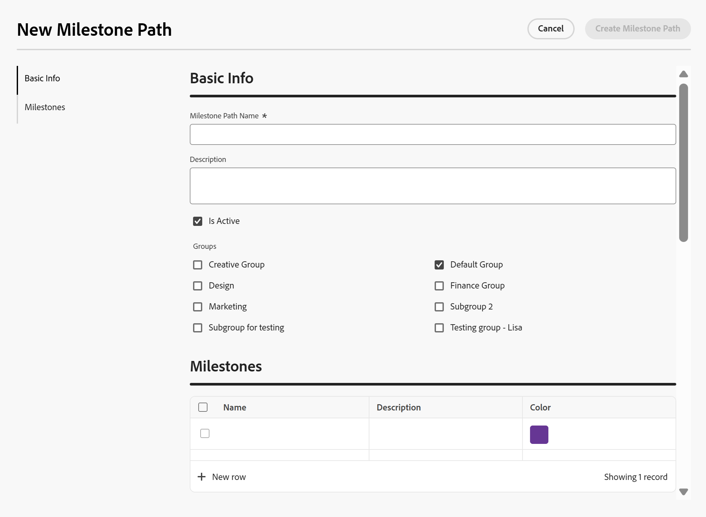

# 마일스톤 경로 만들기

<!--Audited: 07/2024-->

<!--
NOTE: DON'T DELETE, DRAFT OR HIDE THIS ARTICLE. IT IS LINKED TO THE PRODUCT, THROUGH THE CONTEXT SENSITIVE HELP LINKS.
-->

<!--The highlighted information on this page refers to functionality not yet generally available. It is available only in the Preview environment for all customers. After the monthly releases to Production, the same features are also available in the Production environment for customers who enabled fast releases.    

For information about fast releases, see [Enable or disable fast releases for your organization](/help/quicksilver/administration-and-setup/set-up-workfront/configure-system-defaults/enable-fast-release-process.md). -->

이 페이지에서 강조 표시된 정보는 아직 일반적으로 사용할 수 없는 기능을 참조합니다. 모든 고객을 위한 미리보기 환경에서만 사용할 수 있습니다. 미리보기 릴리스의 1주일부터 모든 고객을 위한 프로덕션 환경에서도 동일한 기능을 사용할 수 있습니다.

자세한 내용은 [인터페이스 현대화](/help/quicksilver/product-announcements/product-releases/interface-modernization/interface-modernization.md)를 참조하십시오.

Adobe Workfront 관리자는 시스템의 모든 프로젝트에 적용할 수 있는 마일스톤 경로를 만들 수 있습니다. 이 영역의 마일스톤 경로에 대한 변경 사항은 전체 Workfront 시스템에 영향을 줍니다.

## 액세스 요구 사항

+++ 을 확장하여 이 문서의 기능에 대한 액세스 요구 사항을 봅니다.

이 문서의 단계를 수행하려면 다음 액세스 권한이 있어야 합니다.

<table style="table-layout:auto"> 
 <col> 
 <col> 
 <tbody> 
  <tr> 
   <td role="rowheader">Adobe Workfront 플랜</td> 
   <td>임의</td> 
  </tr> 
  <tr> 
   <td role="rowheader">Adobe Workfront 라이선스</td> 
   <td>
표준

   
플랜

   </td> 
  </tr> 
  <tr> 
   <td role="rowheader">액세스 수준 구성</td> 
   <td> 
Workfront 관리자여야 합니다.
</td> 
  </tr> 
 </tbody> 
</table>

*자세한 내용은 [Workfront 설명서의 액세스 요구 사항](/help/quicksilver/administration-and-setup/add-users/access-levels-and-object-permissions/access-level-requirements-in-documentation.md)을 참조하십시오.

+++

## 마일스톤 및 마일스톤 경로

프로젝트의 주요 작업을 사전 정의된 이정표와 연결할 수 있습니다. 이 기능은 프로젝트 진행 방식에 대한 높은 수준의 개요를 관리자 및 기타 이해 당사자에게 제공할 수 있습니다.

미리 정의된 모든 이정표의 합계를 이정표 경로라고 합니다.

이정표 경로를 구축하는 첫 번째 단계는 이정표 단계가 무엇인지 식별하고 이정표를 설정하는 것입니다. 마일스톤 경로를 여러 프로젝트에 연결할 수 있으므로 마일스톤 단계는 프로젝트의 일반 단계 또는 단계여야 합니다.

마일스톤 경로를 프로젝트와 연결하고 마일스톤을 작업에 연결하는 방법에 대한 자세한 내용은 [마일스톤과 작업 연결](../../../manage-work/tasks/manage-tasks/associate-milestones-with-tasks.md)을 참조하십시오.

## 마일스톤 경로 만들기

{{step-1-to-setup}}

1. **프로세스** > **마일스톤 경로**&#x200B;를 클릭합니다.
1. **새 마일스톤 경로**&#x200B;를 클릭합니다.

   

   새 마일스톤 경로(New Milestone Path) 상자가 열립니다.

   

   

1. 왼쪽 패널에서 **기본 정보**&#x200B;를 클릭합니다.

   다음 정보를 업데이트합니다.

   <table style="table-layout:auto">
    <tr>
      <td>마일스톤 경로 이름</td>
       <td>마일스톤 경로의 이름을 입력합니다.</td>
    </tr>
    <tr>
      <td>설명</td>
      <td>마일스톤 경로를 정의하는 설명을 입력합니다.</td>
    </tr>
    <tr>
       <td>활성화됨</td>
      <td>마일스톤 경로를 활성화하려면 이 확인란을 선택합니다. 다른 사용자는 프로젝트를 만들거나 편집할 때 이 경로를 찾아 프로젝트에 첨부할 수 있습니다. 비활성 마일스톤 경로는 프로젝트에 첨부할 수 없습니다. 이 기능은 기본적으로 활성화되어 있습니다.</td>
    </tr>
    <tr>
      <td>그룹</td>
      <td>이 그룹의 사용자가 이 마일스톤 경로를 보고 프로젝트에 적용할 수 있도록 하려면 나열된 그룹을 선택하십시오. 마일스톤 경로를 입력하는 사용자의 홈 그룹이 기본적으로 선택됩니다.</td>
    </tr>
   </table>

1. 왼쪽 패널에서 **마일스톤**을 클릭합니다.
1. 프로덕션 환경에서 **마일스톤 추가**를 클릭하여 경로에 마일스톤을 추가합니다.
   미리 보기 환경에서 **새 행**&#x200B;을 클릭하여 경로에 마일스톤을 추가합니다.
1. 다음 정보를 업데이트합니다.

   <table style="table-layout:auto"> 
    <col> 
    <col> 
    <tbody> 
     <tr> 
      <td role="rowheader">이름</td> 
      <td>각 마일스톤의 수사적 이름을 입력합니다.</td> 
     </tr> 
     <tr> 
      <td role="rowheader">설명</td> 
      <td>이정표에 대한 설명을 입력합니다.</td> 
     </tr> 
     <tr> 
      <td role="rowheader">색상</td> 
      <td> 
마일스톤과 연결할 색상을 선택합니다. 
 
색상을 선택하지 않으면 마일스톤 경로에 사용되는 마지막 색상이 선택됩니다. 각 이정표에 대해 고유한 색상을 선택하는 것이 좋습니다. 색상은 시각적 및 보고 목적으로 사용됩니다.
 </td> 
     </tr> 
    </tbody> 
   </table>

1. (선택 사항) 각 이정표를 드래그하여 놓아 순서를 변경합니다.
1. 변경 내용을 저장하려면 **마일스톤 경로 만들기**&#x200B;를 클릭하세요.

   마일스톤 경로를 프로젝트와 연결할 준비가 되었습니다.

   마일스톤 경로를 프로젝트에 연결하고 마일스톤을 작업에 연결하는 방법에 대한 자세한 내용은 [마일스톤과 작업 연결](../../../manage-work/tasks/manage-tasks/associate-milestones-with-tasks.md)을 참조하세요.

1. (선택 사항) 마일스톤 경로 목록에서 마일스톤 하나를 선택한 다음 **편집** 아이콘 을 클릭하여 마일스톤 경로를 열고 정보를 편집합니다.
1. (선택 사항) **Export** 아이콘 을 클릭하고 다음 형식 중 선택하여 마일스톤 경로 목록을 파일로 내보냅니다.

   * PDF
   * Excel
   * Excel(xlsx)
   * 탭으로 구분됨

1. (선택 사항) 마일스톤 목록에서 하나 또는 여러 마일스톤을 선택한 다음 **삭제** 아이콘 을 클릭하여 삭제합니다.
1. **예, 삭제**&#x200B;를 클릭합니다.

   마일스톤이 삭제되어 복구할 수 없습니다. 마일스톤 경로는 이전에 연결된 모든 프로젝트에서 제거되며 모든 마일스톤은 연결된 작업에서 제거됩니다.

   삭제된 마일스톤은 복구할 수 없습니다.

## 프로젝트 보고서에서 마일스톤 경로 세부 정보 보기

프로젝트 보고서에서 마일스톤 경로의 세부 사항을 볼 수 있습니다.

마일스톤 경로를 프로젝트와 연결해야 프로젝트 보고서에서 해당 세부 사항을 볼 수 있습니다.

마일스톤 경로를 프로젝트에 연결하는 방법에 대한 자세한 내용은 [프로젝트 편집](/help/quicksilver/manage-work/projects/manage-projects/edit-projects.md)을 참조하세요.

{{step1-to-reports}}

1. **새 보고서**&#x200B;를 클릭한 다음 **프로젝트**&#x200B;를 클릭합니다.
1. **열 추가**&#x200B;를 클릭합니다.
1. **이 열에 표시** 영역에서 **마일스톤 경로**&#x200B;를 입력한 다음 표시될 때 **마일스톤 경로 이름**&#x200B;을 클릭하세요.
1. (선택 사항) **필터**&#x200B;를 클릭하고 보고서에 다음 필터를 추가합니다. **프로젝트 마일스톤 경로 ID가 비어 있지 않습니다**.

   필터는 보고서에 마일스톤 경로와 연결된 프로젝트만 표시하도록 합니다.

1. **저장 및 닫기**&#x200B;를 클릭합니다.
1. 보고서 이름을 추가한 다음 **적용**&#x200B;을 클릭합니다.

   프로젝트 보고서가 표시됩니다. 각 프로젝트와 연결된 마일스톤 경로가 보고서의 마지막 열에 표시됩니다.
1. 보고서의 마지막 열에서 마일스톤 경로 이름을 클릭합니다.

   마일스톤 경로의 세부 정보가 표시됩니다.

   

   마일스톤 경로 세부 정보 페이지에는 다음 정보가 표시됩니다.

   * 마일스톤 경로 이름, ID 및 설명
   * 마일스톤 경로 그룹
   * 이정표 이름, 설명, 색상 및 색상 아이콘

1. (선택 사항) 프로젝트 보고서로 돌아가려면 **뒤로**&#x200B;를 클릭합니다.

