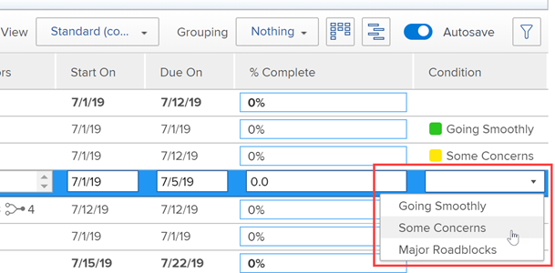

# 조건의 표시 순서 변경

프로젝트, 작업 및 문제에 조건이 표시되는 순서를 변경할 수 있습니다.

* 사용자가 프로젝트를 편집할 때

  

* 사용자가 작업 또는 문제에 대한 조건을 변경할 때

  

## 액세스 요구 사항

+++ 을 확장하여 이 문서의 기능에 대한 액세스 요구 사항을 봅니다.

이 문서의 단계를 수행하려면 다음 액세스 권한이 있어야 합니다.

<table style="table-layout:auto"> 
 <col> 
 <col> 
 <tbody> 
  <tr> 
   <td role="rowheader">Adobe Workfront 플랜</td> 
   <td>임의</td> 
  </tr> 
  <tr> 
   <td role="rowheader">Adobe Workfront 라이선스</td> 
   <td>플랜</td> 
  </tr> 
  <tr> 
   <td role="rowheader">액세스 수준 구성</td> 
   <td> 
Workfront 관리자여야 합니다.
 
<b>참고</b>: 아직 액세스 권한이 없는 경우 Workfront 관리자에게 액세스 수준에 추가 제한을 설정했는지 문의하세요. Workfront 관리자가 액세스 수준을 수정하는 방법에 대한 자세한 내용은 <a href="../../../administration-and-setup/add-users/configure-and-grant-access/create-modify-access-levels.md" class="MCXref xref">사용자 지정 액세스 수준 만들기 또는 수정</a>을 참조하십시오.
 </td> 
  </tr> 
 </tbody> 
</table>

+++

## 조건의 표시 순서 변경

{{step-1-to-setup}}

1. **프로젝트 환경 설정** > **조건**&#x200B;을 클릭합니다.

1. **프로젝트**,**작업** 또는 **문제** 탭을 선택하십시오.

1. 순서를 변경하려면  조건을 드래그합니다.

   새 주문이 자동으로 저장됩니다.

조건 사용자 지정에 대한 자세한 내용은 [사용자 지정 조건](../../../administration-and-setup/customize-workfront/create-manage-custom-conditions/custom-conditions.md)을 참조하세요.
