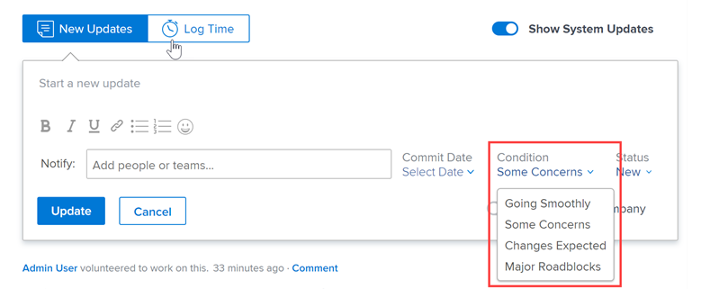

# 사용자 지정 조건 만들기 또는 편집

Adobe Workfront 관리자는 조직의 요구 사항에 맞게 프로젝트, 작업 및 문제에 대한 사용자 지정 조건을 만들거나 편집할 수 있습니다.

## 액세스 요구 사항

이 문서의 단계를 수행하려면 다음 액세스 권한이 있어야 합니다.

<table style="table-layout:auto"> 
 <col> 
 <col> 
 <tbody> 
  <tr> 
   <td>Adobe Workfront 플랜</td> 
   <td>임의</td> 
  </tr> 
  <tr> 
   <td>Adobe Workfront 라이선스</td> 
   <td>플랜</td> 
  </tr> 
  <tr> 
   <td>액세스 수준 구성</td> 
   <td> 
Workfront 관리자여야 합니다.
 
<b>참고</b>: 아직 액세스 권한이 없는 경우 Workfront 관리자에게 액세스 수준에 추가 제한을 설정했는지 문의하세요. Workfront 관리자가 액세스 수준을 수정하는 방법에 대한 자세한 내용은 <a href="../../../administration-and-setup/add-users/configure-and-grant-access/create-modify-access-levels.md" class="MCXref xref">사용자 지정 액세스 수준 만들기 또는 수정</a>을 참조하십시오.
 </td> 
  </tr> 
 </tbody> 
</table>

## 사용자 지정 조건 만들기 또는 편집

1. Adobe Workfront 오른쪽 상단의 **기본 메뉴** 아이콘 을(를) 클릭한 다음 **설정** 을(를) 클릭합니다.

1. **프로젝트 환경 설정** > **조건**&#x200B;을 클릭합니다.

1. 조건과 연결할 개체 유형(**프로젝트**, **작업** 또는 **문제**)의 탭을 클릭합니다.

1. 새 조건을 만들려면 **새 조건 추가**&#x200B;를 클릭합니다.

   또는

   기존 조건을 편집하려면 편집할 조건을 마우스로 가리킨 다음 맨 오른쪽에 나타나는 **편집** 아이콘을 클릭합니다.

   

1. 다음 옵션을 사용하여 사용자 지정 조건을 구성합니다.

   <table style="table-layout:auto"> 
    <col> 
    <col> 
    <tbody> 
     <tr> 
      <td>조건 이름</td> 
      <td>(필수) 조건을 설명하는 이름을 입력합니다.</td> 
     </tr> 
     <tr> 
      <td>설명</td> 
      <td>(선택 사항) 조건 용도를 사용할 조건에 대한 설명을 입력합니다.</td> 
     </tr> 
     <tr> 
      <td>색상</td> 
      <td>(선택 사항) 색상 아이콘을 클릭한 다음, 프로젝트, 작업 또는 문제에 표시될 때 조건에 사용할 색상을 선택합니다. 16진수도 입력할 수 있습니다.</td> 
     </tr> 
     <tr> 
      <td>같음 </td> 
      <td>
(필수, 프로젝트만 해당) 드롭다운 목록에서 새 조건의 기능을 가장 잘 설명하는 옵션을 클릭합니다. 예를 들어 추적 웰 (Tracking Well)이라는 이름의 조건의 경우 타겟 을 클릭합니다. 기본 조건의 작동 방식을 결정합니다. 만드는 모든 조건은 드롭다운 메뉴의 옵션 중 하나와 일치해야 합니다.

      
기본 조건에 대한 자세한 내용은 <a href="../../../administration-and-setup/customize-workfront/create-manage-custom-conditions/set-custom-condition-default-projects.md" class="MCXref xref">프로젝트 기본값으로 사용자 지정 조건 설정</a> 및 <a href="../../../administration-and-setup/customize-workfront/create-manage-custom-conditions/set-custom-condition-default-tasks-issues.md" class="MCXref xref">작업 및 문제에 대한 기본값으로 사용자 지정 조건 설정</a>을 참조하십시오.

      
조건 만들기를 완료한 후에는 이 옵션을 수정할 수 없습니다.
</td> 
     </tr> 
     <tr> 
      <td>키</td> 
      <td>
(필수) 프로젝트 조건의 경우 사용자가 인식할 수 있는 영숫자 약어를 입력합니다. 작업 또는 문제 조건의 경우 01에서 99까지의 두 자리 숫자 코드를 입력합니다. 

      
API에 사용되며 보고 목적으로 사용할 수 있는 이 키는 각 개체에 대해 고유해야 합니다.

      
조건을 저장한 후에는 조건에 대한 키를 변경할 수 없습니다. 
</td> 
     </tr> 
     <tr> 
      <td>상태 숨기기</td> 
      <td>
(선택 사항) 이 옵션은 더 이상 사람들이 사용하지 않으려고 하지만 기록 상의 이유로 유지하려는 사용자 지정 조건에 사용할 수 있습니다. 

      
작업 항목에 사용된 사용자 지정 조건을 숨기는 경우 숨긴 후에도 해당 작업 항목에 계속 표시됩니다. 
</td> 
     </tr> 
    </tbody> 
   </table>

   >[!TIP]
   >
   >세 가지 객체 유형 모두에 대해 조건 용어와 색상을 표준화할 수 있습니다. 이렇게 하려면 한 탭(프로젝트, 작업, 문제)의 이름 조건 및 색상 16진수 코드를 다른 두 탭의 해당 조건에 복사합니다.

1. (선택 사항)  조건을 새 위치로 드래그하여 목록의 순서를 변경합니다.

   이렇게 하면 프로젝트, 작업 및 문제에 조건이 표시되는 순서가 변경됩니다.

   * 사용자가 프로젝트를 편집할 때

     

   * 사용자가 업데이트 탭에서 작업 또는 문제에 대한 조건을 변경할 때:

     

   * 사용자가 목록 보기에서 작업 또는 문제에 대한 조건을 변경할 때:

     

1. **저장**&#x200B;을 클릭합니다.

사용자 지정 조건을 프로젝트 또는 작업 및 문제의 기본 조건으로 설정할 수 있습니다. 자세한 내용은 [프로젝트 기본값으로 사용자 지정 조건 설정](../../../administration-and-setup/customize-workfront/create-manage-custom-conditions/set-custom-condition-default-projects.md) 및 [작업 및 문제에 대한 기본값으로 사용자 지정 조건 설정](../../../administration-and-setup/customize-workfront/create-manage-custom-conditions/set-custom-condition-default-tasks-issues.md)을 참조하십시오.

사용자 지정 조건에 대한 자세한 내용은 [사용자 지정 조건](../../../administration-and-setup/customize-workfront/create-manage-custom-conditions/custom-conditions.md)을 참조하세요.
