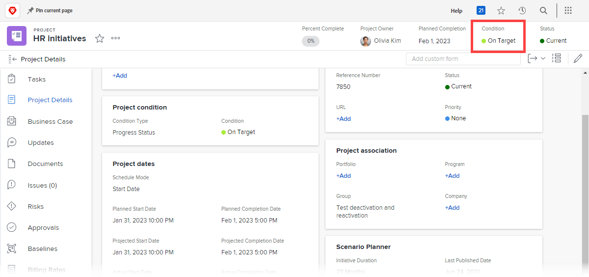

# 사용자 지정 조건을 프로젝트의 기본값으로 설정

프로젝트의 조건 유형이 수동 대신 진행 상태로 설정된 경우, Adobe Workfront은 진행 중인 대로 프로젝트에 기본적으로 3가지 기본 조건 중 하나를 자동으로 표시합니다(Target 시, 위험 중 또는 문제 발생). [프로젝트 조건 및 조건 유형 개요](../../../manage-work/projects/manage-projects/project-condition-and-condition-type.md).

사용자 지정 조건을 이러한 기본 제공 조건 3개를 사용하는 대신 기본 조건으로 설정할 수 있습니다. 예를 들어, 모든 프로젝트에서 Target 시 기본 조건을 추적 우문으로 표시하도록 변경할 수 있습니다.

## 액세스 요구 사항

이 문서의 절차를 수행하려면 다음 액세스 권한이 있어야 합니다.

<table style="table-layout:auto"> 
 <col> 
 <col> 
 <tbody> 
  <tr> 
   <td role="rowheader">Adobe Workfront 플랜</td> 
   <td>모든</td> 
  </tr> 
  <tr> 
   <td role="rowheader">Adobe Workfront 라이선스</td> 
   <td>플랜</td> 
  </tr> 
  <tr> 
   <td role="rowheader">액세스 수준 구성</td> 
   <td> 
Workfront 관리자여야 합니다.
 
<b>참고</b>: 여전히 액세스 권한이 없는 경우 Workfront 관리자에게 액세스 수준에서 추가 제한 사항을 설정하는지 문의하십시오. Workfront 관리자가 액세스 수준을 수정하는 방법에 대한 자세한 내용은 <a href="../../../administration-and-setup/add-users/configure-and-grant-access/create-modify-access-levels.md" class="MCXref xref">사용자 정의 액세스 수준 만들기 또는 수정</a>.
 </td> 
  </tr> 
 </tbody> 
</table>

## 사용자 지정 조건을 모든 프로젝트에 대한 기본 조건으로 설정합니다.

1. 을(를) 클릭합니다. **기본 메뉴** 아이콘  Adobe Workfront의 오른쪽 위 모서리에서 을(를) 클릭하고 **설정** .

1. 클릭 **프로젝트 환경 설정** > **조건**.

1. 을(를) 클릭합니다. **프로젝트** 탭.
1. 클릭 **기본 조건 설정**.
1. 변경할 기본 조건 옆에 있는 드롭다운 메뉴에서 대신 사용할 사용자 지정 조건을 클릭합니다.
1. 변경할 다른 기본 조건에 대해 이전 단계를 반복합니다.
1. **저장**&#x200B;을 클릭합니다.

사용자 지정 조건을 작업 및 문제에 대한 기본 조건으로 설정하는 방법에 대한 자세한 내용은 [사용자 지정 조건을 작업 및 문제에 대한 기본값으로 설정](../../../administration-and-setup/customize-workfront/create-manage-custom-conditions/set-custom-condition-default-tasks-issues.md).

사용자가 프로젝트의 조건을 수동으로 업데이트할 수 있도록 프로젝트 설정에 대한 자세한 내용은 [작업 및 문제에 대한 조건 업데이트](../../../manage-work/projects/updating-work-in-a-project/update-condition-for-tasks-and-issues.md).

사용자 지정 조건에 대한 자세한 내용은 [사용자 지정 조건](../../../administration-and-setup/customize-workfront/create-manage-custom-conditions/custom-conditions.md).
