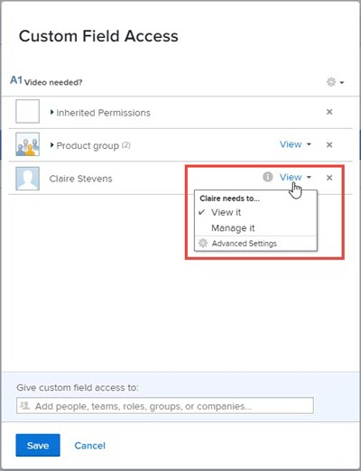

# 기존 양식 빌더와 사용자 정의 필드 및 위젯에 대한 공유 구성

기본적으로 사용자 정의 양식에 새 사용자 정의 필드 또는 위젯을 추가하면 사용자 정의 양식에 대한 액세스 권한이 있는 시스템의 모든 사용자가 해당 항목에 대한 레이블 및 이름과 같은 속성을 편집할 수 있습니다. 공유할 수 있는 사용자를 제어하여 변경할 수 있습니다.

사용자 정의 양식의 사용자 정의 필드 및 위젯에 대한 자세한 내용은 [기존 양식 빌더로 사용자 정의 양식에 사용자 정의 필드 추가](../../../administration-and-setup/customize-workfront/create-manage-custom-forms/add-a-custom-field-to-a-custom-form.md) 및 [기존 양식 빌더를 사용하여 사용자 정의 양식의 자산 위젯 추가 또는 편집](../../../administration-and-setup/customize-workfront/create-manage-custom-forms/add-widget-or-edit-its-properties-in-a-custom-form.md).

## 액세스 요구 사항

이 문서의 단계를 수행하려면 다음이 있어야 합니다.

<table style="table-layout:auto"> 
 <col> 
 <col> 
 <tbody> 
  <tr data-mc-conditions=""> 
   <td role="rowheader"> 
Adobe Workfront 플랜
 </td> 
   <td>임의</td> 
  </tr> 
  <tr> 
   <td role="rowheader">Adobe Workfront 라이선스</td> 
   <td>
   
새로운 기능: 표준

   
또는

   
현재: 플랜
</td>
  </tr> 
  <tr data-mc-conditions=""> 
   <td role="rowheader">액세스 수준 구성</td> 
   <td> 
사용자 정의 양식에 대한 관리 액세스
 </td> 
  </tr> 
 </tbody> 
</table>

이 표의 정보에 대한 자세한 내용은 [Workfront 설명서의 액세스 요구 사항](/help/quicksilver/administration-and-setup/add-users/access-levels-and-object-permissions/access-level-requirements-in-documentation.md).

## 사용자 정의 필드 또는 위젯에 대한 공유 구성

{{step-1-to-setup}}

1. 왼쪽 패널에서 **사용자 지정 Forms**.
1. 조직의 Workfront 인스턴스에서 사용자 정의 필드 또는 위젯에 대한 공유를 구성하는 경우 다음을 수행합니다.

   1. 클릭 **필드** 필드 영역을 엽니다.
   1. 공유를 구성할 항목을 선택하고 .

   또는 기존 사용자 정의 양식의 사용자 정의 필드 또는 위젯에 대한 공유를 구성하는 경우 다음을 수행합니다.

   1. 사용자 정의 양식을 선택한 다음 .
   1. 오른쪽의 양식 편집 영역에서 공유를 구성할 항목을 선택합니다.
   1. 왼쪽 패널에서 **필드 공유**.

1. 다음에서 **사용자 정의 필드 액세스** 항목을 공유할 사람과 공유할 방법을 지정하는 상자가 표시됩니다.

   1. 의 왼쪽 아래 모서리 근처 **사용자 정의 필드 액세스** 상자, 아래 **사용자 정의 필드 액세스 권한 부여 대상**&#x200B;에서 항목을 공유할 사용자, 팀, 작업 역할, 그룹 또는 회사의 이름을 입력한 다음 표시될 때 이름을 클릭합니다.

      

   1. 항목 공유 방법을 자세히 알아보려면 이름 오른쪽에 있는 드롭다운 목록을 클릭한 후 다음 옵션 중 하나를 사용하십시오.

      

      <table style="table-layout:auto"> 
       <col> 
       <col> 
       <tbody> 
        <tr> 
         <td role="rowheader">보기</td> 
         <td> 
다음을 클릭할 수 있습니다. <strong>고급 설정</strong> 을 클릭하여 사용자 또는 사용자가 액세스 권한을 사용하여 사용자 정의 양식에 항목을 추가하거나 다른 사용자와 공유할 수 있게 할지 여부를 지정합니다.
 </td> 
        </tr> 
        <tr> 
         <td role="rowheader">관리함</td> 
         <td> 
에 액세스하여 사용자 정의 필드를 편집하고, 필드 라이브러리 및 사용자 정의 양식을 작성한 페이지에서 볼 수 있습니다.
 
다음을 클릭할 수 있습니다. <strong>고급 설정</strong> 사용자 또는 사용자가 액세스 권한을 사용하여 시스템에서 항목을 삭제할지 또는 다른 사용자와 공유할 수 있게 할지 여부를 지정합니다.
 </td> 
        </tr> 
       </tbody> 
      </table>

1. (선택 사항) 이전 단계를 반복하여 다른 이름을 목록에 추가하고 해당 옵션을 구성합니다.
1. (선택 사항) 톱니바퀴 아이콘을 클릭합니다  오른쪽 상단 모서리에서 필드에 대한 시스템 전체 공유 옵션을 선택합니다.

   다음 옵션 중 일부가 이 드롭다운 메뉴에 동시에 표시되는 것은 아닙니다. 예를 들어 두 번째 옵션은 다른 두 개 중 하나를 선택한 경우에만 표시됩니다.

   * **Workfront의 모든 사용자가 편집할 수 있도록 시스템 전체에서 편집 가능하도록 설정** (기본 옵션)

     사용자 정의 필드 또는 위젯을 추가하고 이에 대한 공유를 제한하지 않으면 사용자 정의 양식에 대한 액세스 권한이 있는 모든 사용자가 사용자 정의 필드 또는 위젯을 보고 속성을 편집할 수 있습니다.

   * **시스템 전체 편집 액세스 제거**

     목록에 추가한 사용자만 액세스할 수 있습니다.

   * **Workfront의 모든 사용자가 볼 수 있도록 시스템 전체에 표시**

1. 클릭 **저장** 또는 **저장 + 닫기**.

## 사용자 정의 양식을 공유할 때 사용자 정의 필드 및 위젯에 대한 상속된 액세스 권한

다른 사용자가 그룹, 작업 역할, 팀 또는 회사와 사용자 정의 양식을 공유할 경우 수신자는 양식에 있는 모든 사용자 정의 필드 및 위젯에 대한 보기 액세스 권한을 상속합니다. 양식의 해당 항목에 대한 이 수준의 액세스 권한은 항상 유지되므로 양식을 만든 사람이 의도한 대로 수신자에게 양식이 기능할 수 있습니다. 양식에 대한 편집 액세스 권한이 있는 수신자에게도 마찬가지입니다.

사용자 정의 필드 또는 위젯에 대한 액세스 권한을 상속받은 사람을 찾을 수 있으며 액세스 권한을 제거할 수 있습니다.

>[!NOTE]
>
>수신자가 공유 사용자 정의 양식의 사용자 정의 필드 또는 위젯에 대한 관리 액세스 권한을 가지고 있는 경우 해당 액세스 권한은 수신자에 대해 유지됩니다.

* [사용자 정의 필드 또는 위젯에 대한 액세스 권한을 상속한 사용자를 확인합니다.](#find-out-who-has-inherited-access-to-a-custom-field-or-widget)
* [공유된 사용자 정의 양식의 사용자 정의 필드 또는 위젯에 대한 액세스 제거](#remove-access-to-a-custom-field-or-widget-in-a-custom-form-that-was-shared)

### 사용자 정의 필드 또는 위젯에 대한 액세스 권한을 상속한 사용자를 확인합니다. {#find-out-who-has-inherited-access-to-a-custom-field-or-widget}

1. 다음을 클릭합니다. **메인 메뉴** 아이콘  Adobe Workfront의 오른쪽 상단에서 을(를) 클릭한 다음 **설정** .

1. 왼쪽 패널에서 **사용자 지정 Forms**.
1. 클릭 **필드**&#x200B;을 선택한 다음 필드, 이미지 또는 액세스 위젯을 선택합니다.
1. 표시되는 상자에서 **상속된 권한** 표시되는 이름을 봅니다.
1. 클릭 **취소**.

### 공유된 사용자 정의 양식의 사용자 정의 필드 또는 위젯에 대한 액세스 제거 {#remove-access-to-a-custom-field-or-widget-in-a-custom-form-that-was-shared}

공유된 사용자 정의 양식의 사용자 정의 필드 또는 위젯에 대한 액세스를 제거해야 하는 경우 양식 공유를 해제해야 합니다. 자세한 내용은 이 섹션의 내용을 참조하십시오. [사용자 정의 양식에 대한 액세스 제거](../../../administration-and-setup/customize-workfront/create-manage-custom-forms/share-access-to-a-custom-form.md#unshare) 이 문서에서 [사용자 정의 양식 공유](../../../administration-and-setup/customize-workfront/create-manage-custom-forms/share-access-to-a-custom-form.md).
