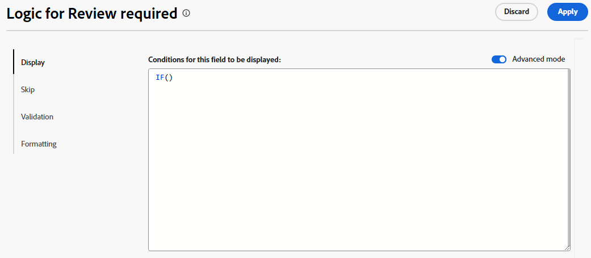

# 사용자 정의 양식 및 필드에 논리 규칙 추가

논리 규칙을 사용하면 양식의 필드를 추가로 사용자 지정할 수 있습니다.

예를 들어, 사용자가 필드 또는 섹션을 작성할 때 선택하는 내용에 따라 사용자 정의 양식의 필드나 섹션을 표시하거나 건너뛸 수 있습니다.

>[!NOTE]
>
>논리는 한 양식 내에서만 적용되며 다른 양식의 선택 사항을 기반으로 할 수 없습니다.

## 액세스 요구 사항

+++ 을 확장하여 이 문서의 기능에 대한 액세스 요구 사항을 봅니다.

이 문서의 단계를 수행하려면 다음 액세스 권한이 있어야 합니다.

<table style="table-layout:auto"> 
 <col> 
 <col> 
 <tbody> 
  <tr data-mc-conditions=""> 
   <td role="rowheader">Adobe Workfront 플랜 </td> 
   <td>임의</td> 
  </tr> 
  <tr> 
   <td role="rowheader">Adobe Workfront 라이선스</td> 
   <td>
   <p>새로운 기능: 표준</p>
   <p>또는</p>
   <p>현재: 플랜</p></td> 
  </tr> 
  <tr data-mc-conditions=""> 
   <td role="rowheader">액세스 수준 구성</td> 
   <td>사용자 정의 양식에 대한 관리 액세스 </td> 
  </tr>  
 </tbody> 
</table>

이 표의 정보에 대한 자세한 내용은 [Workfront 설명서의 액세스 요구 사항](/help/quicksilver/administration-and-setup/add-users/access-levels-and-object-permissions/access-level-requirements-in-documentation.md)을 참조하십시오.

+++

## 논리 아이콘 표시 및 건너뛰기

사용자 정의 양식에는 특정 필드에 표시 또는 건너뛰기 논리가 적용되는 시기를 나타내는 아이콘이 표시됩니다. 양식 디자이너의 필드에 있는 아이콘은 논리가 필드에 적용되었음을 나타냅니다.

| 아이콘 | 양식 디자이너의 필드 위치 | 정의 |
|--- |--- |--- |
|  | 하단 왼쪽 | 필드는 표시 논리의 대상 필드입니다. 양식에서 특정 항목을 선택하면 이 필드가 표시됩니다. |
|  | 하단 오른쪽 | 필드는 표시 논리를 정의합니다. 이 필드의 특정 선택 또는 값은 대상 필드를 표시합니다. |
|  | 하단 왼쪽 | 필드는 건너뛰기 논리의 대상 필드입니다. 양식에서 특정 항목을 선택하면 양식이 앞으로 건너뛰고 그 사이의 필드는 숨겨집니다. |
|  | 하단 오른쪽 | 필드는 건너뛰기 논리를 정의합니다. 이 필드의 특정 선택 또는 값은 다른 필드를 건너뛰고 대상 필드로 바로 이동합니다. |


필드 설정에 기존 논리 규칙을 표시하기 위해 논리가 적용된 필드를 선택합니다.


## 디스플레이 논리 및 건너뛰기 논리 사용에 대한 고려 사항

* 사용자 지정 필드, 위젯 또는 섹션 구분에 표시 논리를 추가하려면 적어도 하나의 다중 선택 필드(라디오 버튼, 드롭다운 또는 확인란)를 양식에서 그 앞에 배치해야 합니다.
사용자 정의 양식의 사용자 정의 필드 및 위젯에 대한 자세한 내용은 [사용자 정의 양식 만들기](/help/quicksilver/administration-and-setup/customize-workfront/create-manage-custom-forms/form-designer/design-a-form/design-a-form.md)를 참조하십시오.
* 위젯 또는 섹션 구분에 건너뛰기 논리를 추가할 수 없습니다. 다중 선택 필드(라디오 단추, 드롭다운 또는 확인란)에만 추가할 수 있습니다.
* 다중 옵션 필드의 선택 사항을 표시하거나 숨기려면 표시 또는 건너뛰기 논리를 적용할 수 없습니다. 예를 들어 다른 필드의 표시 또는 건너뛰기 논리에 따라 드롭다운, 확인란 그룹 또는 라디오 버튼 필드에 대해 표시되는 선택 사항을 제한할 수 없습니다.
* 사용자 정의 필드에 대해 다음 내용이 모두 참인 경우 표시 논리와 건너뛰기 논리를 모두 사용자 정의 필드에 추가할 수 있습니다.

   * 객관식 필드(라디오 버튼, 드롭다운 또는 확인란)입니다
   * 앞에 다중 선택 필드가 옵니다.
   * 뒤에 다른 사용자 지정 필드가 옵니다.

* 표시 논리나 건너뛰기 논리를 사용하여 양식을 복사할 경우 해당 논리는 새 사용자 정의 양식에 복사됩니다.
* 개체를 일괄 편집할 때 생략되거나 숨겨진 필드를 포함하여 모든 사용자 정의 필드가 [개체 편집] 상자에 표시됩니다.
* 사용자 정의 양식에 대한 표시 논리 규칙을 만들 때는 다음 사항에 유의하십시오.

   * 표시 논리 문에 포함되지 않은 사용자 정의 필드는 기본적으로 사용자 정의 양식에 표시됩니다.
   * 다중 필드 표시 논리 문을 만들 수 있습니다.
   * 섹션 구분 아래의 모든 필드에 표시 논리가 적용되어 있고 논리의 결과로 해당 필드가 모두 숨겨져 있는 경우 사용자 정의 양식에서 전체 섹션이 숨겨집니다.

## 사용자 정의 양식에 표시 논리 추가

표시 논리는 사용자가 다중 선택 필드에서 특정 값을 선택할 때 양식에 표시되는 사용자 정의 필드를 정의합니다. 값이 선택될 때만 표시되는 대상 필드에 논리가 추가됩니다.

<!--
>[!NOTE]
>
><span class="preview">This procedure describes the basic mode for display logic. Advanced display logic is also available. For more information, see [Add advanced display logic to a custom form](#add-advanced-display-logic-to-a-custom-form), in this article.</span>
-->

{{step-1-to-setup}}

1. **사용자 지정 Forms**&#x200B;을 클릭합니다.
1. 새 사용자 정의 양식을 만들거나 기존 양식을 엽니다. 자세한 내용은 [사용자 정의 양식 만들기](/help/quicksilver/administration-and-setup/customize-workfront/create-manage-custom-forms/form-designer/design-a-form/design-a-form.md)를 참조하십시오.
1. 필요에 따라 양식에 필드를 추가합니다. 하나 이상의 객관식 필드(라디오 버튼, 드롭다운 또는 확인란)를 표시할 대상 필드 앞에 배치해야 합니다.
1. 대상 필드를 선택하고 **논리 추가**&#x200B;를 클릭합니다.
1. 논리 빌더에서 **표시** 탭을 선택합니다.
1. **표시 규칙 추가**&#x200B;를 클릭합니다.

   

1. 아래 단계에 따라 빌더에 논리 구문을 만듭니다.

   1. 첫 번째 옵션은 정의 필드를 선택하는 것입니다. 대상을 표시하는 선택 값이 있는 필드입니다. 객관식 필드여야 합니다.
   1. 두 번째 옵션은 선택 값을 선택하는 것입니다. 해당 필드에 이미 정의된 값만 사용할 수 있습니다.
   1. 세 번째 옵션은 **선택됨** 또는 **선택되지 않음**&#x200B;입니다. **선택됨**&#x200B;을(를) 선택하면 값을 선택할 때 대상 필드가 표시됩니다. **선택되지 않음**&#x200B;을 선택하면 정의 필드에서 다른 값을 선택하면 대상 필드가 표시됩니다.
   1. **And** 규칙을 논리 문에 추가하려면 방금 만든 규칙 바로 아래에 있는 **규칙 추가**&#x200B;를 클릭합니다. 동일한 프롬프트에 따라 규칙을 빌드합니다. 대상 필드를 표시하려면 And 규칙이 모두 충족되어야 합니다.

      

   1. 논리 문에 **Or** 규칙을 추가하려면 논리 빌더 아래쪽의 **규칙 추가**&#x200B;를 클릭하십시오. 그런 다음 Or 영역 내에서 **규칙 추가**&#x200B;를 클릭하고 같은 프롬프트에 따라 규칙을 만듭니다. 하나 이상의 규칙이 충족되면 대상 필드가 표시됩니다.

1. 논리 문 작성을 마치면 **적용**&#x200B;을 클릭합니다.

   표시 논리 아이콘이 양식 디자이너의 대상 필드 및 정의 필드에 추가됩니다.

<!--
<div class="preview">

## Add advanced display logic to a custom form

The advanced display logic for custom form fields allows you to build complex logic using formulas. You can apply this logic to the following field types: drop-down, radio button, checkbox, typeahead, single line text, paragraph text, date field, text with formatting, and calculated fields.

### Examples

You can use advanced display logic to control the visibility of custom form sections based on user roles and the visibility of a field based on another field's status.

No logic is applied to the default section on the form, so it is always visible to all users.

Using the following condition, the Resources Required section is only displayed when a user with the job role of Resource Manager views the form.

```IF($$USER.{roleID}="123abc", true)```

Note that ```123abc``` represents the role ID of the Resource Manager.


The same condition with a different role ID is applied to the Project Financial KPIs section to define that  only the Financial Advisor role can view the section.

Using the following condition, the Sold KPI field only becomes visible when the project is complete. This logic is applied directly to the field instead of to a form section. There is no need to specify which role can view the field, because that is already defined in the section that the field is in.

```IF({status}="CPL", true)```


### Define advanced display logic

{{step-1-to-setup}}

1. Click **Custom Forms**.
1. Create a new custom form or open an existing form. See [Create a custom form](/help/quicksilver/administration-and-setup/customize-workfront/create-manage-custom-forms/form-designer/design-a-form/design-a-form.md) for details.
1. Add fields to the form as needed.
1. Select the field to apply logic to, and click **Add Logic**.
1. Select the **Display** tab on the logic builder.
1. Turn on **Advanced mode**.
   
   This option might be turned on automatically, for fields that do not support the simple mode of display logic.

   

1. Build the display condition in the editor.

   For more information about calculations and expressions, see [Add calculated fields to a form](/help/quicksilver/administration-and-setup/customize-workfront/create-manage-custom-forms/form-designer/design-a-form/add-a-calculated-field.md) and [Overview of calculated data expressions](/help/quicksilver/reports-and-dashboards/reports/calc-cstm-data-reports/calculated-data-expressions.md).

1. Click **Apply**.
   
   The logic is applied to the field and the display logic icon is added in the form designer.

</div>
-->

## 사용자 정의 양식에 건너뛰기 논리 추가

건너뛰기 논리는 사용자가 다중 선택 필드에서 특정 값을 선택할 때 건너뛰는 사용자 정의 양식 필드를 정의합니다. 건너뛴 필드는 양식에서 숨겨집니다. 로직은 건너뛴 필드가 아니라 선택한 정의 필드에 적용됩니다.

{{step-1-to-setup}}

1. **사용자 지정 Forms**&#x200B;을 클릭합니다.
1. 새 사용자 정의 양식을 만들거나 기존 양식을 엽니다. 자세한 내용은 [사용자 정의 양식 만들기](/help/quicksilver/administration-and-setup/customize-workfront/create-manage-custom-forms/form-designer/design-a-form/design-a-form.md)를 참조하십시오.
1. 필요에 따라 양식에 필드를 추가합니다. 건너뛰기 논리를 위한 정의 필드는 다중 선택 필드(라디오 단추, 드롭다운 또는 확인란)여야 합니다.
1. 정의 필드를 선택하고 화면 왼쪽 하단에서 **논리 추가**&#x200B;를 클릭합니다.
1. 논리 빌더에서 **건너뛰기** 탭을 선택합니다.
1. **건너뛰기 규칙 추가**&#x200B;를 클릭합니다.

   

1. 아래 단계에 따라 빌더에 논리 구문을 만듭니다.

   1. 정의 필드가 빌더에 표시됩니다. 건너뛰기 논리를 적용하기 위해 선택한 필드입니다.
   1. 첫 번째 옵션은 선택 값을 선택하는 것입니다. 필드에 이미 정의된 값만 사용할 수 있습니다.
   1. 두 번째 옵션은 **선택됨** 또는 **선택되지 않음**&#x200B;입니다. **선택됨**&#x200B;을(를) 선택하면 값을 선택할 때 대상 필드가 표시되고 그 사이의 필드는 건너뜁니다. **선택되지 않음**&#x200B;을 선택하면 정의 필드에서 다른 값을 선택할 때 대상 필드가 표시되고 그 사이의 필드는 건너뜁니다.
   1. 세 번째 옵션은 타겟 필드이거나 건너뛸 위치입니다. 필드 이름 또는 **양식의 끝**&#x200B;을(를) 선택하십시오. 옵션을 선택하기 전에 먼저 &quot;empty&quot;라는 단어를 클릭해야 할 수 있습니다.

      

   1. 논리 문에 **Or** 규칙을 추가하려면 논리 빌더 아래쪽의 **규칙 추가**&#x200B;를 클릭하십시오. 그런 다음 동일한 프롬프트에 따라 옵션을 선택하여 규칙을 빌드합니다. **Or** 규칙 하나가 충족되면 대상 필드가 표시됩니다.

1. 논리 문 작성을 마치면 **적용**&#x200B;을 클릭합니다.

   건너뛰기 논리 아이콘은 양식 디자이너의 대상 필드 및 정의 필드에 추가됩니다.

## 사용자 정의 양식에 유효성 검사 논리 추가

유효성 검사 논리는 공식을 사용하여 작성되며, 논리를 필요한 만큼 단순하거나 복잡하게 만들 수 있습니다. 유효성 검사는 다른 필드의 값 또는 객체의 상태를 기반으로 할 수 있으며, 유효성 검사가 실패하는 경우에 대한 오류 메시지를 제공할 수 있습니다.

사용자가 사용자 정의 양식을 작성할 때 논리가 적용된 필드가 정의된 유효성 검사 조건을 충족하면 필드가 강조 표시되고 오류 메시지가 표시됩니다.

한 줄 텍스트, 단락, 단일 선택 드롭다운, 다중 선택 드롭다운, 외부 조회, 자동 완성, 날짜, 확인란 그룹 및 라디오 버튼과 같은 필드 유형에 유효성 검사 논리를 적용할 수 있습니다.

### 예시

다음 조건을 사용하면 사용자가 메시지를 트리거하는 값을 입력할 때 예산 필드가 필드 아래에 메시지를 표시합니다. 예를 들어 입력한 값이 음수이면 첫 번째 메시지가 표시됩니다. 예산 값을 입력하기 전에 프로젝트 상태를 현재로 변경하려고 하면 두 번째 메시지가 표시됩니다.

```
IF({DE:Budget Field} < 0,
     "Budget cannot be negative",
     IF({DE:Budget Field} == 0 && {status} == "CUR", "Budget must be specified before moving to Current status")
)
```

또 다른 간단한 예는 전화 번호 필드가 유효하려면 특정 자릿수를 포함해야 한다는 것입니다.

다른 필드를 기반으로 한 유효성 검사의 추가 예는 회의실 크기(소규모, 중간 또는 대규모)에 대한 필드와 회의 참석자의 수에 대한 별도의 필드입니다. 각 룸 크기에 대한 인원은 유효성 검사 공식에 기록됩니다. 사용자가 입력한 참석자 수가 선택한 회의실에 비해 너무 많은 경우 오류 메시지가 표시됩니다.

유효성 검사 논리의 추가 예제는 [사용자 지정 양식의 고급 논리 예제](/help/quicksilver/administration-and-setup/customize-workfront/create-manage-custom-forms/form-designer/design-a-form/advanced-logic-examples.md)를 참조하십시오.

### 유효성 검사 논리 정의

{{step-1-to-setup}}

1. **사용자 지정 Forms**&#x200B;을 클릭합니다.
1. 새 사용자 정의 양식을 만들거나 기존 양식을 엽니다. 자세한 내용은 [사용자 정의 양식 만들기](/help/quicksilver/administration-and-setup/customize-workfront/create-manage-custom-forms/form-designer/design-a-form/design-a-form.md)를 참조하십시오.
1. 필요에 따라 양식에 필드를 추가합니다.
1. 논리를 적용할 필드를 선택하고 **논리 추가**&#x200B;를 클릭합니다.
1. 논리 빌더에서 **유효성 검사** 탭을 선택합니다.

   

1. 유효성 검사를 충족하지 않을 때 표시할 오류 메시지를 포함하여 편집기에서 유효성 검사 조건을 작성합니다.

   계산 및 식에 대한 자세한 내용은 [양식에 계산 필드 추가](/help/quicksilver/administration-and-setup/customize-workfront/create-manage-custom-forms/form-designer/design-a-form/add-a-calculated-field.md) 및 [계산된 데이터 식의 개요](/help/quicksilver/reports-and-dashboards/reports/calc-cstm-data-reports/calculated-data-expressions.md)를 참조하십시오.

1. **적용**&#x200B;을 클릭합니다.

   논리는 양식 디자이너의 필드에 적용됩니다.

<!--
<div class="preview">

## Add formatting logic to a custom form

Formatting logic highlights a field value when it meets the defined conditions. The applied formatting will work on multiple fields at once.

You can apply formatting logic to the following field types: single line text, paragraph, single-select dropdown, multi-select dropdown, external lookup, typeahead, calculated, date, checkbox group, and radio buttons.

Formatting applied to custom forms is separate from formatting applied to lists and reports. For information on report formatting, see [Use conditional formatting in views](/help/quicksilver/reports-and-dashboards/reports/reporting-elements/use-conditional-formatting-views.md).

### Example

Using the following condition, the Budget field appears red when the user enters a value of 1000 or more. The field appears yellow when the user enters a value of 500 or more.

To add a hover-over definition of the formatting, use the Instructions field in the custom form. For example, a message on the Budget field could say "Please enter a budget within a reasonable range. Values over 500 are a warning notice, and above 1000 is considered too high."

```
IF(
     {DE:Budget Field} >=1000,
     FORMAT($$NEGATIVE),
     IF({DE:Budget Field} >= 500, FORMAT($$NOTICE))
)
```

### Define formatting logic

{{step-1-to-setup}}

1. Click **Custom Forms**.
1. Create a new custom form or open an existing form. See [Create a custom form](/help/quicksilver/administration-and-setup/customize-workfront/create-manage-custom-forms/form-designer/design-a-form/design-a-form.md) for details.
1. Add fields to the form as needed.
1. Select the field to apply logic to, and click **Add Logic**.
1. Select the **Formatting** tab on the logic builder.

   

1. Build the formatting condition in the editor.

   You can add up to five formatting rules per field.

   The field highlighting color options are:

   * `$$POSITIVE (green)`
   * `$$INFORMATIVE (blue)`
   * `$$NEGATIVE (red)`
   * `$$NOTICE (orange)`
   
   The text formatting options are:
   
   * `$$BOLD`
   * `$$ITALIC`
   * `$$UNDERLINE`

   Only one color option may be used per function, along with up to three additional text formatting options. If no color option is specified, the system's default color is applied.

   For more information about calculations and expressions, see [Add calculated fields to a form](/help/quicksilver/administration-and-setup/customize-workfront/create-manage-custom-forms/form-designer/design-a-form/add-a-calculated-field.md) and [Overview of calculated data expressions](/help/quicksilver/reports-and-dashboards/reports/calc-cstm-data-reports/calculated-data-expressions.md).

1. Click **Apply**.
   
   The logic is applied to the field in the form designer.

</div>
-->
