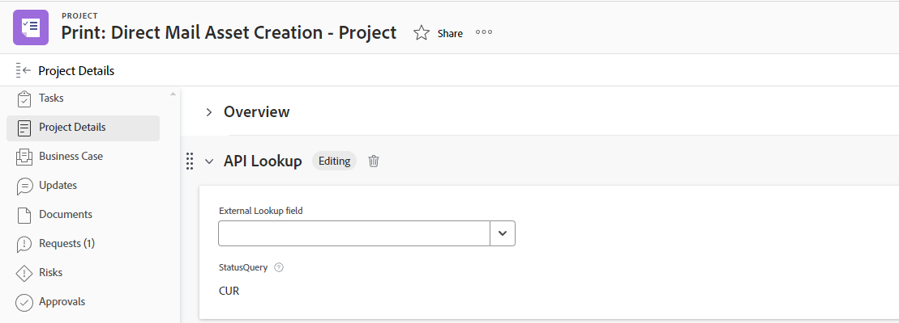

# 사용자 정의 양식의 외부 조회 필드 예

사용자 정의 양식의 외부 조회 필드는 외부 API를 호출하고 드롭다운 필드에 값을 옵션으로 반환합니다. 사용자 정의 양식이 첨부된 오브젝트로 작업하는 사용자는 드롭다운에서 이러한 옵션 중 하나 이상을 선택할 수 있습니다.

이 문서에서는 외부 조회 필드를 사용하여 동일한 Workfront 인스턴스 또는 공개 API를 호출하는 예제를 제공합니다. 외부 조회를 사용하여 Jira, Salesforce 또는 ServiceNow와 같은 외부 시스템과 통신할 수도 있습니다.

사용자 지정 양식에 외부 조회 필드를 추가하고 외부 조회 구성 요소에 대한 추가 정의에 대한 자세한 내용은 [양식 디자이너를 사용하여 양식 디자인](/help/quicksilver/administration-and-setup/customize-workfront/create-manage-custom-forms/form-designer/design-a-form/design-a-form.md)을 참조하십시오.

## 동일한 Workfront 인스턴스에 대해 외부 조회 필드 설정

외부 조회를 사용하여 Workfront 인스턴스의 데이터를 사용자 정의 양식으로 가져올 수 있습니다.

### 외부 조회에서 기본 Workfront 필드 값 사용

이 예에서는 Workfront API를 호출하고 기존 &quot;상태 쿼리&quot; 필드의 데이터를 외부 조회 필드로 가져오는 방법을 보여 줍니다.

1. 사용자 정의 양식을 엽니다.
1. 화면 왼쪽에서 **외부 조회**&#x200B;를 찾아 캔버스의 섹션으로 끕니다.
1. 필드의 **레이블** 및 **이름**&#x200B;을(를) 입력하십시오.
1. 필드의 **형식**&#x200B;을(를) 선택하십시오.
1. **기본 API URL** 필드에 API URL 호출을 입력합니다.

   * 동일한 인스턴스를 참조하도록 $$HOST를 추가할 수 있습니다.
   * $$QUERY를 추가하여 다른 필드 쿼리를 기준으로 결과를 필터링할 수 있습니다.

   **예**
   `$$HOST/attask/api/v15.0/project/search?status={DE:StatusQuery}&$$QUERY`

1. 이 조회 필드가 API에서 참조하는 필드에 대한 **종속성**&#x200B;을 검토하십시오.

   종속성 필드는 개체의 세부 정보 페이지에 있는 사용자 지정 필드나 기본 필드일 수 있습니다.

   이 예제에서는 `{DE:StatusQuery}`이(가) StatusQuery 사용자 지정 필드의 값으로 바뀝니다.

1. **HTTP 메서드**&#x200B;를 선택하십시오.

   대부분 **Get**&#x200B;일 수 있습니다.

1. API 호출 결과를 가져오려면 **JSON 경로**&#x200B;를 입력하십시오.

   **예**
   `$.data[*].name`

   >[!NOTE]
   >
   >**헤더** 정보는 동일한 Workfront 인스턴스를 호출하는 데 필요하지 않습니다.

1. **적용**&#x200B;을 클릭합니다.

   

   사용자 정의 양식을 Workfront 개체(이 예에서는 프로젝트)에 추가하면 다음과 유사하게 표시됩니다.

   

   

### 외부 조회에서 사용자 정의 필드 값 사용

이 예에서는 Workfront API를 호출하고 사용자 지정 필드의 데이터를 외부 조회 필드로 가져오는 방법을 보여 줍니다. 예제 사용자 정의 필드는 &quot;사용자 정의 색상&quot;입니다.

1. 사용자 정의 양식을 엽니다.
1. 화면 왼쪽에서 **외부 조회**&#x200B;를 찾아 캔버스의 섹션으로 끕니다.
1. 필드의 **레이블** 및 **이름**&#x200B;을(를) 입력하십시오.
1. 필드의 **형식**&#x200B;을(를) 선택하십시오.
1. **기본 API URL** 필드에 API URL 호출을 입력합니다.

   **예**
   `$$HOST/attask/api/v18.0/PORT/search?ID={portfolioID}&fields=parameterValues`

1. 이 조회 필드가 API에서 참조하는 필드에 대한 **종속성**&#x200B;을 검토하십시오.

   종속성 필드는 개체의 세부 정보 페이지에 있는 사용자 지정 필드나 기본 필드일 수 있습니다.

1. **HTTP 메서드**&#x200B;를 선택하십시오.

   대부분 **Get**&#x200B;일 수 있습니다.

1. API 호출 결과를 가져오려면 **JSON 경로**&#x200B;를 입력하십시오.

   **예**
   `$.data[*].parameterValues.["DE:Combo Colors"]`

   * &quot;parameterValues&quot;는 현재 있는 개체에 대한 Workfront의 모든 사용자 지정 필드를 참조합니다.
   * 이 예에서 &quot;DE:Combo Colors&quot;는 검색할 값이 포함된 특정 사용자 지정 필드입니다.

   >[!NOTE]
   >
   >**헤더** 정보는 동일한 Workfront 인스턴스를 호출하는 데 필요하지 않습니다.

1. **적용**&#x200B;을 클릭합니다.

   사용자 정의 양식을 Workfront 개체에 추가하면 &quot;콤보 색상&quot; 필드의 모든 값이 외부 조회 필드 드롭다운에 표시됩니다.

## 공개 API에 대한 외부 조회 필드 설정

외부 조회를 사용하여 외부 공개 API를 호출하고 데이터를 검색할 수 있습니다.

이 예에서는 드롭다운 옵션에서 모든 국가 이름을 하드 코딩하지 않아도 되도록 국가 API(예: <https://api.first.org/data/v1/countries>)를 호출하는 방법을 보여 줍니다.

1. 사용자 정의 양식을 엽니다.
1. 화면 왼쪽에서 **외부 조회**&#x200B;를 찾아 캔버스의 섹션으로 끕니다.
1. 필드의 **레이블** 및 **이름**&#x200B;을(를) 입력하십시오.
1. 필드의 **형식**&#x200B;을(를) 선택하십시오.
1. **기본 API URL** 필드에 API URL 호출을 입력합니다.

   * $$QUERY를 추가하여 최종 사용자에 대한 쿼리 필터링을 구현할 수 있습니다.

   **예**
모든 국가 목록: <https://api.first.org/data/v1/countries>

   사용자가 드롭다운 필드에서 국가를 검색할 수 있도록 허용합니다. <https://api.first.org/data/v1/countries?q=$$QUERY>

   사용자가 <https://api.first.org/data/v1/countries?region={DE:Region}&q=$$QUERY> 지역에서 국가를 검색할 수 있도록 허용합니다.

   * 사용 가능한 영역은 Workfront의 별도 사용자 정의 필드에 정의됩니다.
   * 사용자가 양식에서 지역을 선택하면 외부 조회 필드에 해당 지역의 국가(API에서 지역이 정의된 국가)만 표시됩니다. 선택한 영역에서 국가를 검색할 수도 있습니다.

1. 이 조회 필드가 API에서 참조하는 필드에 대한 **종속성**&#x200B;을 검토하십시오.

   종속성 필드는 개체의 세부 정보 페이지에 있는 사용자 지정 필드나 기본 필드일 수 있습니다.

   이 예제에서는 `{DE:Region}`이(가) Region 사용자 지정 필드의 값으로 바뀝니다.

1. **HTTP 메서드**&#x200B;를 선택하십시오.

   대부분 **Get**&#x200B;일 수 있습니다.

1. API 호출 결과를 가져오려면 **JSON 경로**&#x200B;를 입력하십시오.

   이 옵션을 사용하면 API URL에서 반환되는 JSON에서 데이터를 추출할 수 있습니다. JSON 내에서 드롭다운 옵션에 표시할 값을 선택하는 데 사용됩니다.

   **예**
   `$.data[*].country`

1. (선택 사항) **헤더 추가**&#x200B;를 클릭하고 API를 사용한 인증에 필요한 키-값 쌍을 입력하거나 붙여 넣습니다.

   >[!NOTE]
   >
   >헤더 필드는 자격 증명을 저장할 수 있는 안전한 위치가 아니므로 입력하고 저장하는 내용에 주의해야 합니다.

1. (선택 사항) 사용자가 드롭다운에서 둘 이상의 값을 선택할 수 있도록 하려면 **다중 선택 드롭다운**&#x200B;을 선택합니다.

1. **적용**&#x200B;을 클릭합니다.

   

   사용자 정의 양식을 Workfront 개체(이 예에서는 프로젝트)에 추가하면 다음과 유사하게 표시됩니다.

   

   
