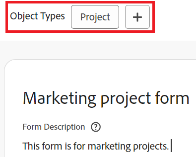

# 양식 디자이너를 사용하여 기존 사용자 정의 양식에서 오브젝트 유형 추가 또는 삭제

양식 디자이너를 사용하여 기존 사용자 정의 양식에서 개체 유형을 추가하거나 삭제할 수 있습니다.

## 액세스 요구 사항

이 문서의 단계를 수행하려면 다음이 있어야 합니다.

<table style="table-layout:auto"> 
 <col> 
 <col> 
 <tbody> 
  <tr data-mc-conditions=""> 
   <td role="rowheader"> 
Adobe Workfront 플랜
 </td> 
   <td>임의</td> 
  </tr> 
  <tr> 
   <td role="rowheader">Adobe Workfront 라이선스</td> 
   <td>
   
새로운 기능: 표준

   
또는

   
현재: 플랜
</td> 
  </tr> 
  <tr data-mc-conditions=""> 
   <td role="rowheader">액세스 수준 구성*</td> 
   <td>
사용자 정의 양식에 대한 관리 액세스
</td> 
  </tr>  
 </tbody> 
</table>

이 표의 정보에 대한 자세한 내용은 [Workfront 설명서의 액세스 요구 사항](/help/quicksilver/administration-and-setup/add-users/access-levels-and-object-permissions/access-level-requirements-in-documentation.md)을 참조하십시오.

## 기존 사용자 정의 양식에 개체 유형 추가

양식에 다른 객체 유형을 추가하여 여러 객체에 첨부할 수 있습니다.

>[!NOTE]
>
>섹션 구분 권한은 객체 유형에 의해 영향을 받을 수 있습니다. 사용자 정의 양식 섹션 구분에 대한 제한된 편집 권한은 프로젝트, 작업, 문제 및 사용자 객체 유형에 대해서만 사용할 수 있습니다.
>
>자세한 내용은 [여러 개체 유형이 섹션 구분 권한에 미치는 영향](/help/quicksilver/administration-and-setup/customize-workfront/create-manage-custom-forms/form-designer/design-a-form/organize-a-form.md#how-multiple-object-types-can-affect-section-break-permissions)을 참조하십시오.

{{step-1-to-setup}}

1. 왼쪽 패널에서 **사용자 지정 Forms**&#x200B;을 클릭합니다.

   표시되는 보기에서 조직에 대해 만들어진 모든 사용자 정의 양식을 검토할 수 있습니다. 각 양식을 만든 사용자, 양식 작성자가 작동하는 객체 유형 및 양식 활성화 여부도 확인할 수 있습니다.

1. 추가 개체 유형을 추가할 사용자 정의 양식을 선택한 다음 을 클릭합니다.

1. 양식의 맨 위에서 **개체 유형** 뒤에 있는 더하기 기호 + 를 클릭한 다음 표시되는 메뉴에서 원하는 유형을 선택합니다. 이 단계를 반복하여 원하는 만큼 객체 유형을 추가할 수 있습니다.

   

1. **저장 후 닫기**&#x200B;를 클릭합니다.

   >[!TIP]
   >
   >사용자 정의 양식을 만드는 동안 언제든지 **적용**&#x200B;을 클릭하여 변경 내용을 저장하고 양식을 열어 둘 수 있습니다.

## 사용자 정의 양식의 오브젝트 유형 삭제

기존 사용자 정의 양식에서 오브젝트 유형을 삭제할 수 있습니다. 사용자 정의 양식에는 하나 이상의 오브젝트 유형이 있어야 합니다.

>[!CAUTION]
>
>사용자가 삭제하려는 유형의 객체에 사용자 정의 양식을 이미 첨부하고 해당 객체에 데이터를 추가한 경우, 양식에서 해당 객체 유형을 삭제하면 해당 데이터가 영구적으로 삭제됩니다. 여기에는 사용자가 나중에 필요로 하는 이전 정보가 포함될 수 있습니다.
>
>일반적으로 이미 사용 중인 사용자 정의 양식을 편집하는 횟수를 최소화하는 것이 좋습니다. 사용자 정의 양식을 사용하는 사람에게 변경 사항을 알리는 알림 시스템이 없습니다.

객체 유형을 삭제하려면 다음을 수행합니다.

{{step-1-to-setup}}

1. 왼쪽 패널에서 **사용자 지정 Forms**&#x200B;을 클릭합니다.
1. 편집할 사용자 정의 양식을 선택한 다음 을 클릭합니다.
1. 양식에서 삭제할 **개체 형식**&#x200B;의 X를 클릭합니다.

   

1. (선택 사항) 양식에서 제거할 다른 객체 유형에 대해 이전 단계를 반복합니다.
1. **적용**&#x200B;을 클릭한 다음 **저장 및 닫기**&#x200B;를 클릭합니다.
