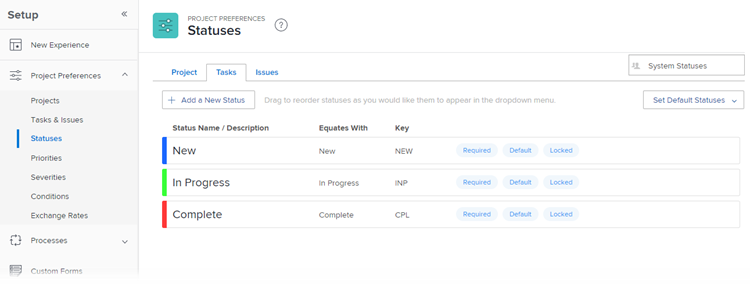

# 시스템 작업 상태 목록에 액세스합니다

작업 상태를 사용하여 사용자에게 지정된 시간에 작업의 개발 단계를 표시할 수 있습니다.

## 액세스 요구 사항

이 문서의 절차를 수행하려면 다음 액세스 권한이 있어야 합니다.

<table style="table-layout:auto"> 
 <col> 
 <col> 
 <tbody> 
  <tr> 
   <td role="rowheader">Adobe Workfront 플랜</td> 
   <td>모든</td> 
  </tr> 
  <tr> 
   <td role="rowheader">Adobe Workfront 라이선스</td> 
   <td>플랜</td> 
  </tr> 
  <tr> 
   <td role="rowheader">액세스 수준 구성</td> 
   <td> 
Workfront 관리자여야 합니다.
 
<b>참고</b>: 여전히 액세스 권한이 없는 경우 Workfront 관리자에게 액세스 수준에서 추가 제한 사항을 설정하는지 문의하십시오. Workfront 관리자가 액세스 수준을 수정하는 방법에 대한 자세한 내용은 <a href="../../../administration-and-setup/add-users/configure-and-grant-access/create-modify-access-levels.md" class="MCXref xref">사용자 정의 액세스 수준 만들기 또는 수정</a>.
 </td> 
  </tr> 
 </tbody> 
</table>

## 작업 상태 액세스

시스템 상태 편집 또는 새 사용자 지정 상태 만들기에 대한 자세한 내용은 [상태 만들기 또는 편집](../../../administration-and-setup/customize-workfront/creating-custom-status-and-priority-labels/create-or-edit-a-status.md).

1. 을(를) 클릭합니다. **기본 메뉴** 아이콘  Adobe Workfront의 오른쪽 위 모서리에서 을(를) 클릭하고 **설정** .

1. 클릭 **프로젝트 환경 설정** > **상태**.

1. 을(를) 클릭합니다. **작업** 탭.

   Workfront에서 사용할 수 있는 작업 상태는 이 탭에 나열됩니다.

   

   기본 제공 시스템 작업 상태에 대한 자세한 내용은 [시스템 작업 상태](../../../administration-and-setup/customize-workfront/creating-custom-status-and-priority-labels/system-task-statuses.md).

## 사용자 지정 작업 상태 만들기 정보

Workfront 관리자는 Workfront에 사용자 지정 시스템 작업 상태를 추가할 수 있습니다.

그룹 소유자는 그룹에 대한 사용자 지정 작업 상태를 추가할 수 있습니다.

사용자 지정 작업 상태를 생성할 때는 항상 새 상태와 기존 시스템 상태를 같아야 합니다. 사용자 지정 상태와 동일한 상태를 확인하려면 시스템 상태의 동작을 이해해야 합니다. 동일한 상태를 선택한 후에는 이 선택을 변경할 수 없습니다.

사용자 지정 상태 만들기, 시스템 상태 편집 또는 작업에 대한 새 기본 상태 선택에 대한 자세한 내용은 [상태 만들기 또는 편집](../../../administration-and-setup/customize-workfront/creating-custom-status-and-priority-labels/create-or-edit-a-status.md).
