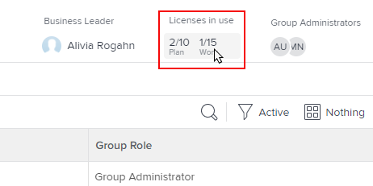

# 그룹에 할당되어 사용되는 라이선스 수 보기

Adobe Workfront 관리자는 그룹 및 해당 하위 그룹에 현재 사용된 개별 라이선스 유형의 개수를 볼 수 있습니다. 이 기능은 라이선스를 재배포할지 여부를 평가해야 할 때 유용합니다.

관리하는 그룹 위에 그룹이 있는 경우 해당 관리자는 해당 그룹에 대해 이 작업을 수행할 수도 있습니다. Workfront 관리자(모든 그룹)의 경우도 마찬가지입니다.

>[!IMPORTANT]
>
>사용자 라이선스는 그룹이 사용자의 홈 그룹인 경우에만 특정 그룹에서 계산됩니다.

## 액세스 요구 사항

이 문서의 단계를 수행하려면 다음이 있어야 합니다.

<table style="table-layout:auto"> 
 <col> 
 <col> 
 <tbody> 
  <tr> 
   <td role="rowheader">Workfront 플랜*</td> 
   <td> 
모든
 </td> 
  </tr> 
  <tr> 
   <td role="rowheader">Adobe Workfront 라이센스*</td> 
   <td> 
플랜 
 
그룹의 그룹 관리자 또는 Workfront 관리자여야 합니다. 자세한 내용은 <a href="../../../administration-and-setup/manage-groups/group-roles/group-administrators.md" class="MCXref xref">그룹 관리자</a> 및 <a href="../../../administration-and-setup/add-users/configure-and-grant-access/grant-a-user-full-administrative-access.md" class="MCXref xref">사용자에게 전체 관리 액세스 권한 부여</a>.
 </td> 
  </tr> 
 </tbody> 
</table>

&#42;보유 중인 플랜 또는 라이선스 유형을 확인해야 하는 경우 Workfront 관리자에게 문의하십시오.

## 그룹에 사용된 라이선스 수 보기

1. 다음을 클릭합니다. **메인 메뉴** 아이콘  Adobe Workfront의 오른쪽 상단에서 을(를) 클릭한 다음 **설정** .

1. 왼쪽 패널에서 **그룹** .

1. 그룹 이름을 클릭합니다.
1. 표시되는 페이지에서 오른쪽 상단 모서리 근처의 헤더 영역에 을 봅니다. **사용 중인 라이선스** 개수를 확인할 영역 **플랜** 및 **작업** 현재 사용 중인 라이선스.

   최상위 그룹을 보고 있고 Workfront 관리자가 그룹에 대해 각 라이선스 유형의 최대 수를 정의한 경우 이러한 숫자도 표시됩니다. 예를 들어 아래 그룹에서는 최대 10명의 사용자가 플랜 라이선스를 가질 수 있으며 15명의 사용자는 작업 라이선스를 가질 수 있습니다.

   

   Workfront 관리자가 그룹에 할당된 최대 라이선스 수를 정의하는 방법에 대한 자세한 내용은 섹션 을 참조하십시오 [홈 그룹에 대한 최대 라이선스 수 설정](../../../administration-and-setup/get-started-wf-administration/manage-available-licenses-in-your-system.md#set) 이 문서에서 [시스템에서 사용 가능한 라이선스 관리](../../../administration-and-setup/get-started-wf-administration/manage-available-licenses-in-your-system.md).

   >[!NOTE]
   >
   >보려는 그룹이 하위 그룹인 경우 그룹에 할당된 최대 라이선스 수가 아니라 사용 중인 라이선스 수만 볼 수 있습니다. Workfront 관리자는 하위 그룹에 대한 최대 라이선스 수를 정의하지 않기 때문입니다.
   >
   >

1. 현재 그룹에서 사용 중인 각 라이선스 유형(검토 및 요청 포함)의 별도 개수를 확인하려면 바로 아래의 텍스트 영역을 클릭하십시오 **사용 중인 라이선스:**

   

   표시되는 상자에서는 계획, 작업, 검토 및 요청의 네 가지 Workfront 라이선스 유형에 대해 동일한 정보를 제공합니다. 이 그룹의 구성원 또는 하위 그룹 중 하나에서 사용 중인 총 라이선스 수를 맨 아래에 확인할 수 있습니다.

   

   검토 및 요청 라이센스의 경우 최대 열에 항상 무제한이 표시됩니다.
