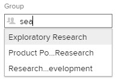

# 하위 그룹 만들기

관리하는 그룹 아래에 하위 그룹을 만들어 사용자 및 프로젝트를 구성하고 Adobe Workfront 내에 액세스 권한을 할당할 수 있습니다.

관리하는 그룹 위에 그룹이 있으면 해당 관리자가 사용자 그룹을 위해 이 작업을 수행할 수도 있습니다. Workfront 관리자(모든 그룹의 경우)도 마찬가지입니다.

하지만 일반적으로 그룹 관리자는 그룹 및 하위 그룹을 관리합니다. 그룹 페이지를 사용하여 그룹 및 하위 그룹을 한 위치에서 관리할 수 있습니다. Workfront 내에서 그룹 및 하위 그룹이 작동하는 방법에 대한 자세한 내용은 [그룹 개요](../../../administration-and-setup/manage-groups/groups-overview/groups.md) 및 [하위 그룹 개요](../../../administration-and-setup/manage-groups/groups-overview/subgroups.md).

## 액세스 요구 사항

이 문서의 절차를 수행하려면 다음 사항이 있어야 합니다.

<table style="table-layout:auto"> 
 <col> 
 <col> 
 <tbody> 
  <tr> 
   <td role="rowheader">Workfront 플랜*</td> 
   <td>모든</td> 
  </tr> 
  <tr> 
   <td role="rowheader">Adobe Workfront 라이선스*</td> 
   <td> 
플랜 
 
그룹의 그룹 관리자 또는 Workfront 관리자여야 합니다. 자세한 내용은 <a href="../../../administration-and-setup/manage-groups/group-roles/group-administrators.md" class="MCXref xref">그룹 관리자</a> 및 <a href="../../../administration-and-setup/add-users/configure-and-grant-access/grant-a-user-full-administrative-access.md" class="MCXref xref">사용자에게 전체 관리자 액세스 권한 부여</a>.
 </td> 
  </tr> 
 </tbody> 
</table>

&#42;보유하고 있는 플랜 또는 라이선스 유형을 찾아야 하는 경우 Workfront 관리자에게 문의하십시오.

## 하위 그룹 추가

1. 을(를) 클릭합니다. **기본 메뉴** 아이콘  Adobe Workfront의 오른쪽 위 모서리에서 을(를) 클릭하고 **설정** .

1. 클릭 **그룹**.

   표시되는 목록에서 관리하는 그룹과 해당 그룹의 하위 그룹을 볼 수 있습니다. Adobe Workfront 관리자는 모든 그룹을 볼 수 있습니다.

1. 새 하위 그룹을 추가할 기존 그룹 또는 하위 그룹을 선택합니다.
1. 클릭 **새 하위 그룹**.
1. 에서 **새 하위 그룹** 표시되는 상자에 **그룹 이름** 하위 그룹에 속해 있어야 합니다.
1. (선택 사항) 다음 정보 중 하나를 지정합니다.

   <table style="table-layout:auto"> 
    <col> 
    <col> 
    <tbody> 
     <tr> 
      <td role="rowheader">그룹 이름</td> 
      <td>그룹 이름을 변경합니다.</td> 
     </tr> 
     <tr> 
      <td role="rowheader">설명</td> 
      <td>하위 그룹에 대한 설명을 입력합니다. 최대 512자를 입력할 수 있습니다.</td> 
     </tr> 
     <tr> 
      <td role="rowheader">활성화됨</td> 
      <td> 
(기본적으로 활성화됨) Workfront 인스턴스에서 그룹을 활성화합니다.
 
아래 표시된 것과 같은 자동 완성 필드에서는 일반 사용자가 객체에 첨부하거나 객체를 공유하기 위해 그룹을 검색할 때 활성 그룹만 목록에 표시됩니다.
 
  
 
사용자를 위해 이 작업을 간소화하려면 현재 사용 중이 아닌 그룹에 대해 활성 상태임 옵션을 비활성화할 수 있습니다.
 
이 필드를 사용하여 활성 또는 비활성 상태에 따라 그룹 목록을 쉽게 보고, 필터링하고, 그룹화할 수 있습니다. 보기, 필터 및 목록 그룹화를 사용하는 방법에 대한 자세한 내용은 <a href="../../../reports-and-dashboards/reports/reporting-elements/reporting-elements-filters-views-groupings.md" class="MCXref xref" data-mc-variable-override="">보고 요소: 필터, 보기 및 그룹화</a>.
  </td> 
     </tr> 
     <tr> 
      <td role="rowheader">이 그룹 및 해당 하위 그룹을 공개로 설정</td> 
      <td> 
하위 그룹이 아니라 최상위 수준 그룹에 대한 세부 정보를 보고 있는 경우에만 사용할 수 있습니다. 편집 사용자 액세스 권한이 있는 하위 그룹의 사용자(그룹의 관리자가 아닌 사용자)가 이 그룹 및 하위 그룹을 다른 사용자의 사용자 프로필에 추가할 수 있도록 하려면 이 옵션을 활성화합니다.
 
공개 그룹의 경우 편집 사용자 액세스 권한이 있는 사용자(그룹 내 또는 그룹 외부)가 다른 사용자의 프로필에 그룹을 추가할 수 있습니다. 개인 그룹에 대해서는 이 작업을 수행할 수 없습니다.
 
이 옵션은 둘 이상의 수준이 있는 그룹 계층 구조의 맨 위 상위 그룹에서만 편집할 수 있습니다. 상위 그룹의 모든 하위 그룹은 해당 설정을 상속합니다.
 
<b>메모</b>:  
        <ul> 
         <li>하위 그룹을 단독으로 공개시킬 수는 없지만 상위 상위 그룹 공개로 만들 수 있습니다. 이 경우 상위 하위 그룹 모두를 공개로 만들 수도 있습니다.</li> 
         <li>공개 그룹에 속하는 하위 그룹은 기본적으로 공개되므로 편집 사용자 액세스 권한이 있는 모든 사용자는 다른 사용자에게도 하위 그룹을 추가할 수 있습니다.</li> 
        </ul> 
 
사용자를 편집하는 데 필요한 액세스에 대한 정보가 필요한 경우 <a href="../../../administration-and-setup/add-users/configure-and-grant-access/grant-access-other-users.md" class="MCXref xref" data-mc-variable-override="">사용자에게 액세스 권한 부여</a>. 사용자 편집에 대한 자세한 내용은 <a href="../../../administration-and-setup/add-users/create-and-manage-users/edit-a-users-profile.md" class="MCXref xref" data-mc-variable-override="">사용자 프로필 편집</a>.
 </td> 
     </tr> 
     <tr> 
      <td role="rowheader">비즈니스 리더 </td> 
      <td> 
관리하는 하위 그룹에 대해 한 명의 사용자를 비즈니스 리더로 할당할 수 있습니다. 비즈니스 리더는 하위 그룹에 대한 비즈니스 결정을 내리는 사람입니다. 자세한 내용은 <a href="../../../administration-and-setup/manage-groups/group-roles/business-leader-overview.md" class="MCXref xref" data-mc-variable-override="">비즈니스 리더 개요</a>.
 
개인이 아직 하위 그룹의 멤버가 아닌 경우 해당 이름을 이 필드에 추가하면 해당 그룹에도 추가됩니다.
 
<b>메모</b>:  
        <ul> 
         <li>하위 그룹에서 비즈니스 리더를 제거하려면 먼저 비즈니스 리더 필드에서 해당 이름을 제거해야 합니다.</li> 
         <li>비즈니스 리더 필드에서 이름을 제거하면 해당 사용자는 해당 그룹에서 해당 이름을 제거하지 않는 한 하위 그룹의 구성원으로 유지됩니다. 그룹에서 사용자를 제거하는 방법에 대한 지침은 섹션을 참조하십시오 <a href="../../../administration-and-setup/manage-groups/create-and-manage-groups/manage-a-group.md#manage" class="MCXref xref" data-mc-variable-override="">그룹 구성원 관리</a> 기사 <a href="../../../administration-and-setup/manage-groups/create-and-manage-groups/manage-a-group.md" class="MCXref xref" data-mc-variable-override="">그룹 관리</a>.</li> 
        </ul> 
 
자세한 내용은 <a href="../../../administration-and-setup/manage-groups/group-roles/business-leader-overview.md" class="MCXref xref" data-mc-variable-override="">비즈니스 리더 개요</a>.
 </td> 
     </tr> 
     <tr> 
      <td role="rowheader">그룹 멤버 및 그룹 관리자</td> 
      <td> 
       <ul> 
        <li> 
그룹 구성원: 사용자 및 그룹을 하위 그룹에 추가하려면 추가할 기존 사용자 또는 그룹의 이름을 입력한 다음 해당 이름이 나타날 때 해당 이름을 선택합니다.
 
추가한 사용자 및 그룹은 그룹과 공유되는 모든 객체에 액세스할 수 있습니다.
 </li> 
        <li> 
그룹 관리자: 하위 그룹은 그 위에 있는 그룹의 그룹 관리자를 상속하므로 하위 그룹의 그룹 관리자로 사용자를 지정하는 것은 선택 사항입니다. 사용자 이름의 오른쪽에 있는 드롭다운 메뉴를 사용하여 그룹 구성원을 그룹의 관리자로 지정할 수 있습니다.
 </li> 
       </ul> </td> 
     </tr> 
     <tr> 
      <td role="rowheader">목록에서 직원 및 그룹 검색</td> 
      <td> 이 하위 그룹에 이미 할당된 사용자 또는 그룹을 찾아야 하는 경우 여기에 해당 이름을 입력하고 있을 때 선택할 수 있습니다.</td> 
     </tr> 
    </tbody> 
   </table>

1. 클릭 **저장.**
