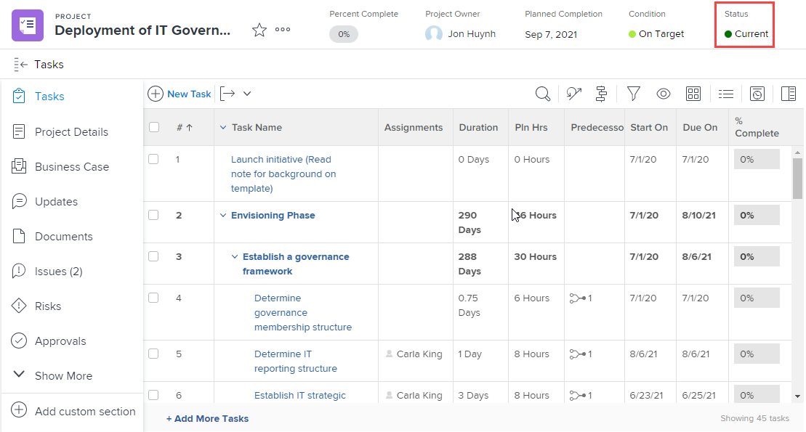

# 그룹 상태 만들기 또는 편집

그룹 관리자는 관리하는 그룹에 대해 사용자 정의 상태를 만들 수 있습니다. 이렇게 하면 수십 개의 회사 전체 사용자 정의 상태가 필요하지 않고 그룹 계층에서 더 많은 자율성을 가질 수 있습니다.

Workfront 관리자가 상태 잠금을 해제한 경우 관리하는 그룹의 시스템 수준 상태를 편집할 수도 있습니다. 자세한 내용은 [잠김 및 잠금 해제된 시스템 수준 상태](../../../administration-and-setup/customize-workfront/creating-custom-status-and-priority-labels/lock-or-unlock-a-custom-system-level-status.md)를 참조하십시오.

그룹 위에 그룹이 있는 경우 해당 관리자는 그룹을 위해 이러한 작업을 수행할 수도 있습니다. Workfront 관리자(모든 그룹)의 경우도 마찬가지입니다.

>[!NOTE]
>
>애자일 보기에서 프로젝트를 볼 때 프로젝트에 사용자 지정 그룹 상태를 표시할 수 없습니다. 애자일 보기에서 프로젝트를 볼 때는 기본 및 사용자 지정 잠금 상태만 표시됩니다. 프로젝트의 애자일 보기를 사용자 지정하는 방법에 대한 자세한 내용은 문서 [Adobe Workfront에서 보기 만들기 또는 편집](/help/quicksilver/reports-and-dashboards/reports/reporting-elements/create-edit-views.md#create-or-customize-an-agile-view)의 [애자일 보기 만들기 또는 사용자 지정](/help/quicksilver/reports-and-dashboards/reports/reporting-elements/create-edit-views.md) 섹션을 참조하십시오.

상태에 대한 일반적인 정보는 [상태 개요](../../../administration-and-setup/customize-workfront/creating-custom-status-and-priority-labels/statuses-overview.md)를 참조하십시오.

## 액세스 요구 사항

+++ 을 확장하여 이 문서의 기능에 대한 액세스 요구 사항을 봅니다.

<table style="table-layout:auto"> 
 <col> 
 <col> 
 <tbody> 
  <tr> 
   <td>Adobe Workfront 패키지</td> 
   <td>
임의
</td> 
  </tr> 
  <tr> 
   <td>Adobe Workfront 라이선스</td> 
   <td>
표준

       
플랜
</td>
  </tr>
  <tr> 
   <td>액세스 수준 구성</td> 
   <td>그룹의 그룹 관리자 또는 시스템 관리자여야 합니다.</td>
  </tr>
 </tbody> 
</table>

자세한 내용은 [Workfront 설명서의 액세스 요구 사항](/help/quicksilver/administration-and-setup/add-users/access-levels-and-object-permissions/access-level-requirements-in-documentation.md)을 참조하십시오.

+++

## 그룹 상태 만들기 또는 편집

{{step-1-to-setup}}

1. 왼쪽 패널에서 **그룹** 을 클릭합니다.

1. 상태를 만들거나 사용자 지정할 그룹의 이름을 클릭합니다.
1. 왼쪽 패널에서 **상태**&#x200B;를 클릭합니다.

   보고 있는 그룹이 최상위 그룹인 경우 표시되는 목록에는 다음 항목이 포함됩니다.

   * 시스템 수준 잠금 상태.
   * 그룹에 대해 사용자 정의 상태가 이미 생성되었습니다.

   또한 보고 있는 그룹이 하위 그룹인 경우 목록에는 다음도 포함됩니다.

   * 하위 그룹 위의 그룹에 속하는 잠긴 상태.
   * 만들 때 하위 그룹 위에 속한 잠금 해제 상태입니다.

     하위 그룹이 생성되면 상위 그룹에서 생성된 잠금 해제된 상태는 하위 그룹의 상태 목록에 포함되지 않습니다. 그러나 나중에 누군가가 이 중 하나를 잠근 경우, 해당 잠금은 하위 그룹의 상태 목록에 포함됩니다. 자세한 내용은 [그룹이 상태를 상속하는 방법](../../../administration-and-setup/manage-groups/manage-group-statuses/how-groups-inherit-statuses.md)을 참조하세요.

1. 상태와 연결할 개체 유형(**프로젝트**, **작업** 또는 **문제**)의 탭을 선택하십시오.

1. (조건부) 상태가 문제 상태인 경우 **기본 목록**&#x200B;을(를) 선택했는지 확인하십시오.

   

   다른 문제 유형(버그 보고서, 순서 변경, 문제, 요청) 사용자 지정에 대한 자세한 내용은 [기본 문제 유형 사용자 지정](../../../administration-and-setup/set-up-workfront/configure-system-defaults/customize-default-issue-types.md)을 참조하십시오.

1. (조건부) 새 상태를 만들려면 **새 상태 추가**&#x200B;를 클릭합니다.

   또는

   기존 상태를 편집하려면 편집할 상태를 마우스로 가리킨 다음 맨 오른쪽에 표시되는 **편집** 옵션을 클릭합니다.

   

   >[!NOTE]
   >다음 경우에만 그룹의 상태를 편집할 수 있습니다.
   >      
   >* 상태가 생성된 그룹을 관리합니다.
   >* Workfront 관리자가 시스템 수준에서 상태를 잠금 해제했습니다
   >* 그룹 상위 그룹의 그룹 관리자가 상태를 잠금 해제했습니다.
   >      
   >      
   >기존 상태를 편집하는 경우 이름, 설명 및 색상만 변경할 수 있습니다.
   >
   >잠긴 상태를 편집하면 그룹의 상태를 상속한 모든 하위 그룹에 변경 사항이 적용됩니다.
   >   
   >반대로 잠금 해제 상태를 편집해도 그룹에서 상태를 상속한 하위 그룹에는 영향을 주지 않습니다.

1. 다음 정보를 지정합니다.

   상태를 편집하는 경우 처음 3개의 설정만 변경할 수 있습니다.

   <table style="table-layout:auto"> 
    <col> 
    <col> 
    <tbody> 
     <tr> 
      <td role="rowheader">상태 이름</td> 
      <td> 
상태 이름을 입력합니다. 필수 필드입니다.
 
상태 이름을 만들 때는 시스템의 다른 사용자가 같은 이름으로 상태를 만들 수 있습니다. Workfront에서 상태를 선택할 때 혼동을 피하기 위해 고유한 이름을 사용하는 것이 좋습니다.

중복 상태가 있는 경우 그룹 관리자는 이름을 업데이트하여 구분해야 합니다. 시스템에서 유일한 고유성 표시기는 상태 키입니다.
 </td> 
     </tr> 
     <tr> 
      <td role="rowheader">설명</td> 
      <td>(선택 사항) 상태에 대한 설명을 입력합니다. 이것은 그것의 목적을 이용하는 사람들에게 전달한다.</td> 
     </tr> 
     <tr> 
      <td role="rowheader">색상</td> 
      <td> 
색상 필드를 클릭하고 견본 패널에서 색상을 선택하여 상태의 색상을 사용자 정의합니다. 필드에 16진수를 입력할 수도 있습니다.
 
사용자가 개체를 볼 때 Workfront의 오른쪽 위 모서리에 상태 색상이 표시됩니다.
 
  
 </td> 
     </tr> 
     <tr> 
      <td role="rowheader">같음</td> 
      <td> 
목록에서 상태의 기능을 가장 잘 설명하는 옵션 중 하나를 선택합니다. 예를 들어 상태 이름이 완료인 경우 이 이름과 동일한 옵션은 완료여야 합니다.
 
모든 상태는 이러한 옵션 중 하나와 동일해야 합니다. 이렇게 하면 상태의 작동 방식이 결정되기 때문입니다.
 
상태를 만든 후에는 이 옵션을 수정할 수 없습니다.
 </td> 
     </tr> 
     <tr> 
      <td role="rowheader">키</td> 
      <td> 
새 상태를 만드는 경우 해당 상태에 대한 코드나 약어를 입력하거나 생성된 약어를 사용하십시오. 이 키는 보고 목적으로 사용할 수 있으므로 Workfront에서 고유해야 합니다. 시스템에서 이미 사용 중인 키를 지정하려고 하면 필드가 빨간색으로 바뀝니다.
 
이를 사용할 사람이 인식할 수 있는 약어를 사용하는 것이 유용할 수 있습니다.
 
상태를 만든 후에는 이 옵션을 수정할 수 없습니다.
 
계획, 현재 및 완료 상태에 대한 키 코드는 변경할 수 없습니다. 이는 텍스트 모드에서 보고서를 작성하는 경우에 중요합니다.
 </td> 
     </tr> 
     <tr> 
      <td role="rowheader">상태 숨기기</td> 
      <td> 
(프로젝트 및 작업 상태만 해당)
 
사용자에게 상태를 숨기려면 이 옵션을 활성화합니다. 비활성화되면(기본 설정) 그룹 아래의 모든 하위 그룹이 상태를 사용할 수 있습니다.
 
팁: 4가지 문제 유형(버그 보고서, 순서 변경, 문제, 요청)을 모두 비활성화하여 문제 상태를 숨길 수 있습니다.
 </td> 
     </tr> 
     <tr> 
      <td role="rowheader">모든 그룹에 대해 잠금</td> 
      <td> 
       
이 옵션을 활성화한 상태로 두면 그룹 및 해당 하위 그룹의 사용자가 상태를 보고 사용할 수 있고 그룹 관리자는 하위 그룹에 대해 이 옵션을 사용자 지정할 수 없습니다.
 
       
이 옵션이 비활성화되면 그룹 관리자는 하위 그룹의 상태를 사용자 정의할 수 있습니다.
 
       
<b>참고</b>: 그룹 승인 프로세스에서 잠김 상태와 잠금 해제 상태를 모두 사용할 수 있습니다. 잠금 해제된 그룹 상태의 그룹 승인 프로세스를 만드는 경우 사용자는 해당 그룹과 관련된 프로젝트, 작업 또는 문제에 승인 프로세스를 첨부할 수 있습니다.
 
       
잠금 상태에 대한 자세한 내용은 <a href="../../../administration-and-setup/manage-groups/manage-group-statuses/lock-or-unlock-a-custom-group-status.md" class="MCXref xref">잠금 및 잠금 해제된 그룹 상태</a>를 참조하십시오.
 
       </td> 
     </tr>
    </tbody> 
   </table>

1. **저장**&#x200B;을 클릭합니다.

   이제 그룹 또는 하위 그룹과 연결된 모든 프로젝트에 상태를 사용할 수 있습니다. 잠근 경우 하위 그룹에서 사용할 수 있습니다.

   상태를 그룹의 기본 상태로 구성할 수 있습니다. 자세한 내용은 [사용자 지정 상태를 그룹의 기본 상태로 사용](../../../administration-and-setup/manage-groups/manage-group-statuses/use-custom-statuses-as-default-statuses-group.md)을 참조하세요.

## 여러 그룹에 대한 사용자 지정 상태 만들기

Workfront 관리자인 경우 시스템 전체 상태를 만든 다음 필요하지 않은 그룹에서 해당 상태를 숨겨서 여러 그룹에 대한 사용자 지정 상태를 만들 수 있습니다.

그룹 관리자(또는 Workfront 관리자)인 경우, 더 높은 수준의 그룹에 대한 상태를 만든 다음 필요하지 않은 더 낮은 하위 그룹에서 해당 상태를 숨김으로써 관리하는 그룹 계층 구조 내의 여러 하위 그룹에 대한 사용자 지정 상태를 만들 수 있습니다.

1. Workfront 관리자인 경우 [상태 만들기 또는 편집](../../../administration-and-setup/customize-workfront/creating-custom-status-and-priority-labels/create-or-edit-a-status.md)에 설명된 대로 시스템 전체에서 잠금 해제된 상태를 만듭니다.
1. 오른쪽 위 모서리의 상자에서 **시스템 상태**&#x200B;를 삭제하고 상태를 숨기려는 그룹의 이름을 입력한 다음 표시될 때 이름을 클릭합니다.
1. 그룹에서 숨길 상태를 마우스로 가리킨 다음 표시될 때 **편집**&#x200B;을 클릭합니다.

   

1. 표시되는 **상태 숨기기** 옵션을 활성화하십시오.

   

1. **저장**&#x200B;을 클릭합니다.

   상태는 흐리게 표시되며 더 이상 해당 그룹의 모든 사용자에게 표시되지 않습니다.

1. 3~5단계를 반복하여 사용자 정의 상태를 필요하지 않은 다른 그룹에서 숨깁니다.

