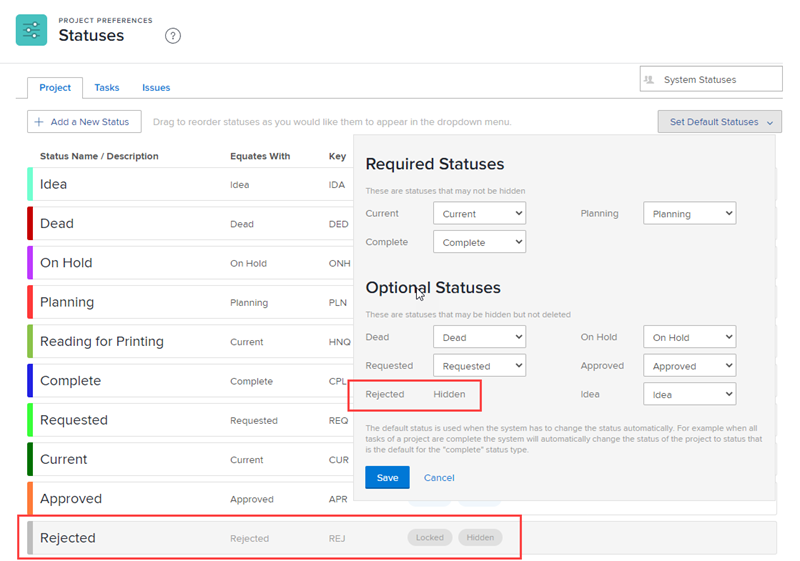

# 사용자 지정 상태를 그룹의 기본 상태로 사용합니다

그룹 관리자는 사용자 정의 상태를 관리하는 그룹 또는 하위 그룹의 기본 상태로 구성할 수 있습니다. 이 기능은 시스템이 프로젝트, 작업 또는 문제에 Workfront 상태를 자동으로 할당해야 할 때 유용합니다. 프로젝트, 작업 또는 문제에는 해당하는 Workfront 상태를 표시하는 대신 항상 기본 상태로 설정한 사용자 지정 상태가 표시됩니다.

구성하는 상태는 그룹에 대해 생성된 사용자 정의 상태, 그룹 위의 그룹에서 상속 또는 시스템 수준에서 상속될 수 있습니다.

관리하는 그룹 위에 그룹이 있으면 해당 관리자가 사용자 그룹을 위해 이 작업을 수행할 수도 있습니다. Workfront 관리자(모든 그룹의 경우)도 마찬가지입니다.

>[!INFO]
>
>**예:** 완료됨이라는 사용자 지정 상태를 만들고 Workfront 상태 완료와 동일한 기본 상태로 설정할 수 있습니다.
>
>그런 다음 100%에 도달하면 완료 상태로 변경하도록 설정된 작업의 경우 상태가 완료 대신 완료됨으로 표시됩니다.

## 액세스 요구 사항

이 문서의 절차를 수행하려면 다음 사항이 있어야 합니다.

<table style="table-layout:auto"> 
 <col> 
 <col> 
 <tbody> 
  <tr> 
   <td role="rowheader">Workfront 플랜*</td> 
   <td>모든</td> 
  </tr> 
  <tr> 
   <td role="rowheader">Adobe Workfront 라이선스*</td> 
   <td> 
플랜 
 
그룹의 그룹 관리자 또는 Workfront 관리자여야 합니다. 자세한 내용은 <a href="../../../administration-and-setup/manage-groups/group-roles/group-administrators.md" class="MCXref xref">그룹 관리자</a> 및 <a href="../../../administration-and-setup/add-users/configure-and-grant-access/grant-a-user-full-administrative-access.md" class="MCXref xref">사용자에게 전체 관리자 액세스 권한 부여</a>.
 </td> 
  </tr> 
 </tbody> 
</table>

&#42;보유하고 있는 플랜 또는 라이선스 유형을 찾아야 하는 경우 Workfront 관리자에게 문의하십시오.

## 문제 상태

사용자 지정 상태가 문제 상태이면 이 문제에 대해 4가지 문제 유형(버그 보고서, 변경 주문, 문제 및 요청)을 모두 활성화해야 합니다. 예를 들어, 아래 표시된 문제 상태에서는 변경 순서 문제 유형을 선택하지 않았으므로 상태 다시 열기를 기본 상태로 사용할 수 없습니다.

## 사용자 지정 상태를 그룹의 기본 상태로 설정

1. 을(를) 클릭합니다. **기본 메뉴** 아이콘  Adobe Workfront의 오른쪽 위 모서리에서 을(를) 클릭하고 **설정** .
1. 왼쪽 패널에서 **그룹** 를 클릭한 다음 상태를 만들거나 사용자 지정할 그룹의 이름을 클릭합니다.
1. 왼쪽 패널에서 **상태** .
1. 를 엽니다. **프로젝트**, **작업**, 또는 **문제** 탭으로 이동하여 기본 상태로 설정할 상태 유형에 따라 탭을 클릭합니다.
1. 클릭 **기본 상태 설정** 오른쪽 상단 근처에 있습니다.
1. 표시되는 드롭다운 영역에서 기본 상태를 설정할 상태 옆에 있는 설정할 기본 상태를 선택합니다.
1. **저장**&#x200B;을 클릭합니다.

   이제 해당 상태를 그룹과 연관된 프로젝트에서 사용할 기본 상태로 사용할 수 있습니다.

1. 사용자 지정 상태를 사용할 프로젝트와 연결합니다.

   상태가 있는 그룹을 프로젝트와 연관시켜 상태를 프로젝트와 연관시킵니다. 상태가 있는 그룹이 프로젝트와 연결된 경우에만 사용자 지정 상태를 사용할 수 있습니다.

   >[!NOTE]
   >
   >프로젝트를 다른 그룹에 할당하면 프로젝트 상태가 다시 로드되고 변경될 수 있습니다.

   1. 사용자 지정 상태를 사용할 프로젝트로 이동합니다.
   1. 자세히 메뉴를 클릭합니다 를 클릭한 다음 **편집**.
   1. 에서 **프로젝트 편집** 표시되는 상자(에 있음) **그룹** 아래의 필드 **프로젝트 연결**&#x200B;을 눌러 사용자 지정 상태와 연결된 그룹을 선택합니다.

   1. 클릭 **변경 내용 저장**.

## 그룹은 기본 상태 구성을 상속합니다

Workfront 관리자가 사용자 지정 상태를 기본 상태로 구성한 후 생성된 새 그룹은 해당 구성을 상속합니다.

마찬가지로 그룹 관리자가 사용자 지정 상태를 기본 상태로 설정하면 그룹 바로 아래에 새로 생성된 하위 그룹은 해당 구성을 상속합니다.

자세한 내용은 [그룹이 상태를 상속하는 방법](../../../administration-and-setup/manage-groups/manage-group-statuses/how-groups-inherit-statuses.md).

## 기본 상태가 숨겨지면

기본 상태를 숨길 경우([숨기기] 상태 옵션을 활성화하여), 시스템은 해당 유형의 다른 상태를 기본값으로 설정합니다.

동등한 유형의 사용 가능한 상태가 없는 경우 상태 유형이 다음과 같이 표시됩니다. **숨김** 작업 항목에 사용할 수 없습니다.

