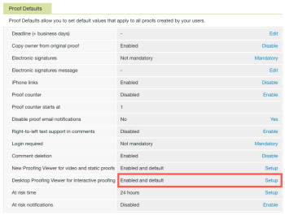

# 조직에 대한 데스크탑 언어 교정 뷰어 설치

Desktop Proofing Viewer(Desktop Proofing Viewer)는 대화형 내용을 교정할 수 있도록 설계되었으며 각 사용자의 로컬 컴퓨터에 설치해야 합니다. Adobe Workfront 관리자 또는 Workfront 증명 관리자는 이 설치를 수행할 수 있습니다.

## 액세스 요구 사항

다음 항목이 있어야 합니다.

<table style="table-layout:auto"> 
 <col> 
 <col> 
 <tbody> 
  <tr> 
   <td role="rowheader">Adobe Workfront 플랜*</td> 
   <td> 
현재 계획: Pro 이상
 
또는
 
기존 계획: Premium 또는 선택
 
다양한 계획에 따른 언어 교정에 대한 자세한 내용은 <a href="../../../administration-and-setup/manage-workfront/configure-proofing/access-to-proofing-functionality.md" class="MCXref xref">Workfront에서 언어 교정 기능에 액세스</a>.
 </td> 
  </tr> 
  <tr> 
   <td role="rowheader">Adobe Workfront 라이선스*</td> 
   <td> 
현재 계획: 작업 또는 계획
 
기존 계획: 모두(사용자가 교정을 사용하도록 설정되어 있어야 함)
 </td> 
  </tr> 
  <tr> 
   <td role="rowheader">액세스 수준 구성*</td> 
   <td> 
증명 권한 프로필에서 관리자를 선택해야 합니다. 자세한 내용은 <a href="../../../administration-and-setup/manage-workfront/configure-proofing/configure-a-users-proofing-access.md" class="MCXref xref">사용자의 언어 교정 액세스 구성</a>.
 </td> 
  </tr> 
 </tbody> 
</table>

&#42;어떤 계획, 라이선스 유형 또는 액세스 권한을 보유하고 있는지 알아보려면 Workfront 관리자에게 문의하십시오.

## 시스템 요구 사항

다음 운영 체제에서 데스크탑 언어 교정 뷰어가 지원됩니다.

* Windows 7 이상, 32비트 및 64비트
* Mac OS X 10.9 이상, 64비트

## 전제 조건

사용자가 데스크톱 언어 교정 뷰어를 사용할 수 있도록 하려면 다음을 수행해야 합니다

* 설치하기 전에 대화형 증명을 위한 기본 보기로 데스크탑 교정 뷰어를 실행하도록 시스템을 구성합니다.

## 대화형 증명을 위한 기본값으로 데스크탑 교정 뷰어를 구성합니다

조직에 대해 데스크탑 언어 교정 뷰어를 설치한 후 대화형 증명을 위한 기본 뷰어로 설정할 수 있습니다.

1. Workfront에서 기본 메뉴를 클릭합니다. 를 클릭한 다음 교정을 클릭합니다  Workfront 증명 액세스

1. 클릭 **계정 설정** Workfront 증명의 오른쪽 상단 모서리에서 **설정**&#x200B;탭.

1. 아래 **증명 기본값**, 의 끝 **대화형 교정을 위한 데스크탑 언어 교정 뷰어** row, **설정**.

   

1. 클릭 **활성화됨 및 기본값**&#x200B;를 클릭한 다음 **저장**.

## 사용자용 데스크탑 언어 교정 뷰어 설치

* [Mac에 데스크탑 언어 교정 뷰어 설치](#installing-the-desktop-proofing-viewer-on-mac)
* [Windows에 데스크탑 언어 교정 뷰어 설치](#installing-the-desktop-proofing-viewer-on-windows)

### Mac에 데스크탑 언어 교정 뷰어 설치 {#installing-the-desktop-proofing-viewer-on-mac}

1. 사용자의 시스템에서 다음 중 하나를 수행하여 앱을 다운로드합니다.

   * 프로덕션 환경을 사용하는 경우  [데스크탑 언어 교정 뷰어에 대한 Mac 프로덕션 다운로드입니다.](https://assets.proofhq.com/nativeviewer/desktop_viewer/Workfront+Proof-2.1.19.pkg)
   * 미리 보기 환경을 사용하는 경우  [데스크탑 언어 교정 뷰어에 대한 Mac 미리 보기 다운로드.](https://assets.preview.proofhq.com/nativeviewer/desktop_viewer/Workfront+Proof+Preview-2.1.19.pkg)
)

1. 방금 다운로드한 파일을 열어 설치를 시작합니다.
1. 표시되는 설치 상자에서 **계속**&#x200B;를 클릭한 다음 **설치**.

   

1. Workfront의 문서 영역에서 대화형 증명을 열어 각 사용자가 설치를 완료했는지 확인합니다.

### Windows에 데스크탑 언어 교정 뷰어 설치 {#installing-the-desktop-proofing-viewer-on-windows}

1. 사용자의 시스템에서 다음 중 하나를 수행하여 앱을 다운로드합니다.

   * 프로덕션 환경에서 [Windows Production Download for the Desktop Proofing Viewer.](https://assets.proofhq.com/nativeviewer/desktop_viewer/Workfront+Proof+Setup+2.1.19.exe)
   * 미리 보기 환경에서 [데스크톱 언어 교정 뷰어에 대한 Windows 미리 보기 다운로드](https://assets.preview.proofhq.com/nativeviewer/desktop_viewer/Workfront+Proof+Preview+Setup+2.1.19.exe).

1. 방금 다운로드한 파일을 열어 설치를 시작합니다.
1. 표시되는 보안 경고 상자에서 **실행**.

   

   Desktop Proofing Viewer가 설치 및 실행됩니다.

1. (조건부) Internet Explorer를 사용하여 응용 프로그램을 설치하는 경우 응용 프로그램을 설치한 후 브라우저에서 시작 페이지를 새로 고칩니다.
1. Workfront의 문서 영역에서 대화형 증명을 열어 각 사용자가 설치를 완료했는지 확인합니다.
