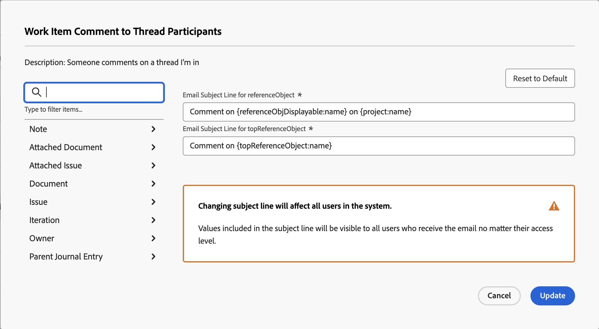
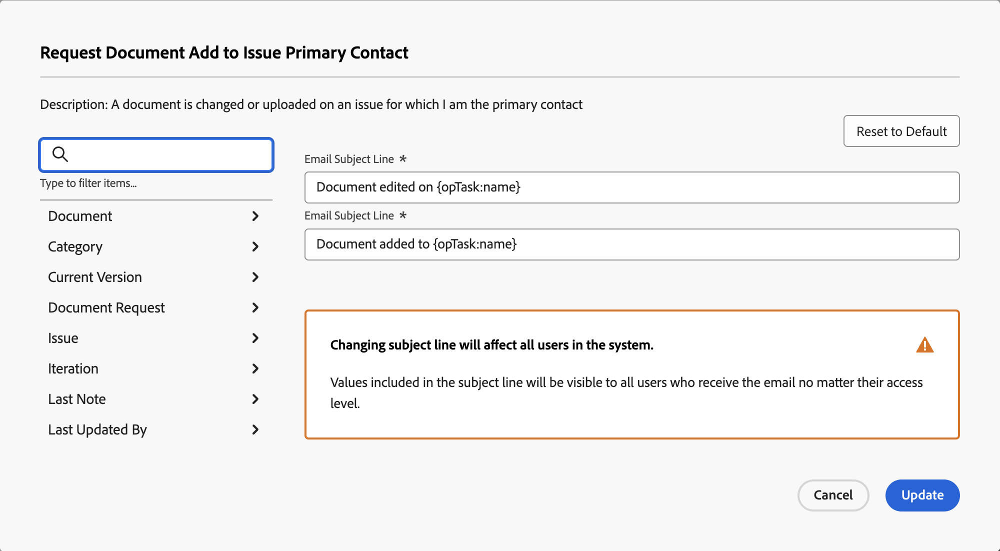

# 이벤트 알림에 대한 이메일 제목 사용자 지정

이벤트 알림에 의해 트리거된 이메일의 제목 줄을 사용자 지정할 수 있습니다.

제목란을 변경하면 수신자의 액세스 수준에 관계없이 시스템의 모든 사용자에게 영향을 미칩니다. 사용자는 이메일 제목에 포함된 모든 개체 및 필드를 볼 수 있습니다.

일부 이벤트 알림에는 여러 제목 줄이 있으며, 이것은 이러한 이벤트 알림이 해당 기능에 따라 여러 이메일 제목을 가질 수 있음을 의미합니다.

>[!IMPORTANT]
>
>제목 줄이 여러 개체를 참조하는 경우의 기본 필드를 삭제할 때는 주의하십시오. 다음은 이러한 제목 줄이 포함된 이벤트 알림 목록입니다.
>
>* 누군가가 지시된 업데이트에 나를 포함시킵니다.
>* 누군가가 지시된 업데이트에 내 팀을 포함시킵니다.
>* 스레드 참가자에 대한 작업 항목 주석
>* 작업 항목 피할당자에 대한 작업 항목 주석
>

## 액세스 요구 사항

+++ 이 문서의 기능에 대한 액세스 요구 사항을 보려면 확장하십시오.

<table style="table-layout:auto"> 
 <col> 
 </col> 
 <col> 
 </col> 
 <tbody> 
  <tr> 
   <td role="rowheader">Adobe Workfront 패키지</td> 
   <td>Any</td> 
  </tr> 
  <tr> 
   <td role="rowheader">Adobe Workfront 라이센스</td> 
   <td>
   
표준

   
플랜

   </td> 
  </tr> 
  <tr> 
   <td role="rowheader">액세스 수준 구성</td> 
   <td> 
미리 알림 알림에 대한 관리 액세스 권한이 있는 Planner 이상
 </td> 
  </tr> 
 </tbody> 
</table>

자세한 내용은 [Workfront 설명서의 액세스 요구 사항](/help/quicksilver/administration-and-setup/add-users/access-levels-and-object-permissions/access-level-requirements-in-documentation.md)을 참조하십시오.

+++

## 이벤트 알림에 대한 이메일 제목 줄 사용자 지정 {#customize-email-subject-lines-for-event-notifications}

{{step-1-to-setup}}

1. 왼쪽 패널에서 **이메일** > **알림**&#x200B;을 클릭합니다.

1. **이벤트 알림** 탭을 클릭합니다.
1. 사용자 지정할 이벤트 알림의 이름을 클릭하여 **이벤트 알림** 상자를 엽니다.
1. **전자 메일 제목 줄** 상자에서 전자 메일 제목의 사용자 지정 필드를 포함한 텍스트 및 필드를 변경합니다.

   추가된 필드 이름은 데이터베이스 구조의 카멜 대/소문자 구문과 일치해야 합니다. <!--For more information about how our objects and their fields are named in the Workfront database, see the [Adobe Workfront API](../../../wf-api/workfront-api.md).-->

1. **업데이트**&#x200B;를 클릭하여 전자 메일의 새 제목 줄을 저장합니다.

## 여러 객체 전자 메일의 전자 메일 제목 줄 사용자 지정

일부 이벤트 알림에는 트리거하는 개체에 따라 여러 제목 줄이 있습니다.

예를 들어 &quot;지시된 업데이트에 다른 사용자가 나를 포함함&quot;에는 두 개의 다른 제목 줄이 있습니다. 첫 번째 줄은 작업, 문제, 템플릿 작업 및 문서(&quot;referenceObject&quot;라고도 함)에 대한 것이며 두 번째 줄은 포트폴리오, 프로그램 등과 같은 사용자가 주석을 달 수 있는 개체(&quot;topReferenceObject&quot;라고도 함)에 대한 것입니다.

사용자가 작업, 문제, 템플릿 작업 또는 문서에 대한 대화에 포함된 경우 첫 번째 제목란으로 이메일이 생성됩니다. 제목 줄에 &quot;referenceObject:name&quot;이(가) 포함되어 있으며 시스템이 개체를 정의하고 제목 필드에 적절한 이름을 표시합니다. 이메일 제목 줄은 &quot;Project ABC의 작업 123에 대한 댓글&quot;과 유사합니다.

프로젝트 대화에 추가되면 두 번째 주체가 포함된 이메일이 생성됩니다. 여기서 제목 줄에는 &quot;topReferenceObject:name&quot;이(가) 포함되어 있으며 Workfront은 참조된 개체를 식별하고 제목의 &quot;topReferenceObject:name&quot; 대신 해당 개체 이름을 반환합니다. 이메일 제목 줄은 &quot;Project ABC에 대한 댓글&quot;과 유사합니다.

전자 메일 제목 줄을 편집하고 제목 줄에 필드를 추가하려면 이 문서의 [이벤트 알림에 대한 전자 메일 제목 줄 사용자 지정](#customize-email-subject-lines-for-event-notifications)을 참조하세요.

## 여러 작업 전자 메일에 대한 전자 메일 제목 줄 사용자 지정

일부 이벤트 알림에는 객체에 대해 수행되는 다양한 작업의 개요를 설명하는 여러 이메일 주제가 있습니다.

예를 들어, 문서를 문제에 추가하도록 요청하는 것은 두 개의 서로 다른 이메일을 트리거할 수 있는 이벤트입니다. 하나는 문서가 추가될 때, 하나는 문서가 편집될 때 각각 하나씩 트리거됩니다.

전자 메일 제목 줄을 편집하고 두 제목 줄에 필드를 추가하려면 이 문서의 [이벤트 알림에 대한 전자 메일 제목 줄 사용자 지정](#customize-email-subject-lines-for-event-notifications)을 참조하십시오.
