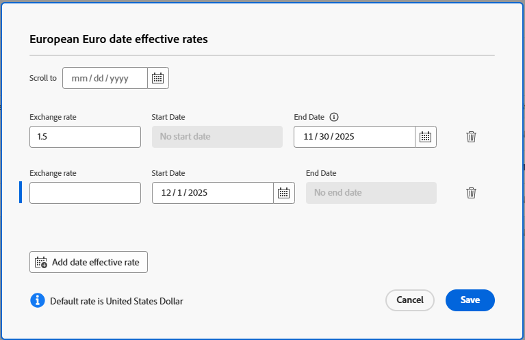

# 환율 설정

<!--

*** DON'T DELETE, DRAFT OR HIDE THIS ARTICLE. IT IS LINKED TO THE PRODUCT, THROUGH THE CONTEXT SENSITIVE HELP LINKS. **

-->

Adobe Workfront 관리자는 Workfront에서 통화 환율을 설정할 수 있습니다. 여기에는 다음이 포함됩니다.

* Workfront 시스템에 대한 기본 통화 설정
* 현재 환율에 일치하도록 Workfront의 환율 업데이트
* 여러 통화에 대한 환율을 구성합니다(이렇게 하면 사용자가 개별 프로젝트에 대한 기본 통화를 선택할 수 있음).

환율은 Workfront의 모든 금융 요소에 영향을 줍니다. 기본 통화는 주어진 프로젝트 또는 작업 역할에 대해 재정의되지 않는 한 시스템 전체의 모든 프로젝트 및 보고서에 대한 기본 통화입니다. 현재 기본 또는 기본 통화는 목록에  아이콘으로 표시됩니다. 보고서나 목록에서 재무 정보를 볼 때 기본 통화나 프로젝트의 기본 통화와 다른 시스템에서 사용할 수 있는 통화로 표시하도록 선택할 수도 있습니다. 자세한 내용은 [고유 환율로 재무 데이터 보고서 만들기](../../../reports-and-dashboards/reports/creating-and-managing-reports/create-financial-data-reports-unique-exchange-rates.md)를 참조하십시오.

프로젝트 및 작업 역할의 Workfront 기본 통화 재정의에 대한 자세한 내용은 다음 문서를 참조하십시오.

* [프로젝트 통화 변경](../../../manage-work/projects/project-finances/change-project-currency.md)
* [작업 역할 만들기 및 관리](../../../administration-and-setup/set-up-workfront/organizational-setup/create-manage-job-roles.md)

환율을 설정하는 방식은 사용자가 주어진 프로젝트에 대한 환율을 수정할 수 있는지 여부에 영향을 줍니다.

>[!IMPORTANT]
>
>Workfront의 환율은 동적이지 않습니다. 환율이 변경되면 설정하는 값을 업데이트해야 합니다.

## 액세스 요구 사항

+++ 이 문서의 기능에 대한 액세스 요구 사항을 보려면 확장하십시오.

<table style="table-layout:auto"> 
 <col> 
 <col> 
 <tbody> 
  <tr> 
   <td>Adobe Workfront 패키지</td> 
   <td>
환율을 설정하려면: 모든 Workfront 또는 Workflow 패키지

       
환율에 유효 일자를 적용하려면: 워크플로우 Ultimate 패키지
</td> 
  </tr> 
  <tr> 
   <td>Adobe Workfront 라이선스</td> 
   <td>
표준

       
플랜
</td>
  </tr> 
  <tr> 
   <td>액세스 수준 구성</td> 
   <td>시스템 관리자</td> 
  </tr> 
 </tbody> 
</table>

자세한 내용은 [Workfront 설명서의 액세스 요구 사항](/help/quicksilver/administration-and-setup/add-users/access-levels-and-object-permissions/access-level-requirements-in-documentation.md)을 참조하십시오.

+++

## 환율 설정

{{step-1-to-setup}}

1. **프로젝트 환경 설정** > **환율**&#x200B;을 클릭합니다.
1. **통화 추가**&#x200B;를 클릭합니다.
1. **통화 추가** 상자에서 통화 이름을 입력한 다음 드롭다운 목록에 나타나면 클릭합니다.
1. **환율** 필드에 선택한 통화의 환율을 시스템의 기본 통화로 설정된 통화와 비교하여 입력합니다.
1. 새 통화와 환율을 추가하려면 **추가**&#x200B;를 클릭하세요.
1. (선택 사항) 기본(기본) 통화를 변경하려면 다음 중 하나를 수행합니다.

   * 통화 이름 옆에 있는 확인란을 선택하고 화면 하단의 작업 표시줄에서 **기본값으로 설정**&#x200B;을 선택합니다.
   * 통화 이름을 마우스로 가리킨 다음 표시되는 **자세히** 메뉴를 클릭합니다. **기본값으로 설정**&#x200B;을 선택합니다.

     새 기본 통화는  아이콘으로 업데이트됩니다.

     >[!NOTE]
     >
     >기본 통화는 목록 정렬 방식에 관계없이 항상 목록에 먼저 표시됩니다.

1. (선택 사항) 통화를 삭제하려면 통화 이름 옆에 있는 확인란을 선택하고 화면 하단의 작업 표시줄에서 **삭제**&#x200B;를 선택합니다. 기본 통화는 삭제할 수 없습니다.

## 통화 환율에 대한 유효 일자 설정

환율 값이 특정 날짜에 끝나고 다른 환율이 시작되도록 통화의 환율에 대한 유효 일자가 구성됩니다. 그러면 재무 계산에 정확한 날짜의 환율이 사용됩니다.

{{step-1-to-setup}}

1. **프로젝트 환경 설정** > **환율**&#x200B;을 클릭합니다.
1. 목록에서 통화를 선택하고 작업 표시줄에서 **날짜 관리**&#x200B;를 클릭합니다.
1. **(통화 이름) 날짜 실효율** 대화 상자에서 현재 환율로 **종료 날짜**&#x200B;를 선택합니다.

   또는

   새 환율로 **시작 날짜**&#x200B;를 선택하세요.

   첫 번째 환율은 시작 일자가 없고 마지막 환율은 종료 일자가 없습니다. 일부 날짜는 자동으로 추가됩니다. 예를 들어, 첫 번째 환율에 종료 일자가 없고 시작 일자가 2025년 12월 1일인 환율을 추가한 경우, 간격이 없도록 종료 일자가 2025년 11월 30일인 첫 번째 환율에 추가됩니다.

   

1. 새 **환율** 값을 입력하십시오.
1. (선택 사항) 이 통화의 유효 날짜가 포함된 환율을 추가하려면 **날짜 유효 환율 추가**&#x200B;를 클릭합니다.
1. **저장**&#x200B;을 클릭합니다.

## 사용자가 프로젝트에 대한 기본 통화를 수정할 수 있도록 설정

사용자는 다음 조건이 충족될 때 프로젝트의 기본 통화를 수정할 수 있습니다.

* 사용자는 환율에 대한 관리 액세스 권한이 있는 표준 또는 플랜 라이선스를 보유하고 있습니다.

  자세한 내용은 [특정 영역에 대한 관리자 액세스 권한 부여](../../../administration-and-setup/add-users/configure-and-grant-access/grant-users-admin-access-certain-areas.md)를 참조하십시오.

* Workfront 시스템에서 두 개 이상의 통화가 활성화됩니다.

사용자가 주어진 프로젝트에서 기본 통화를 변경할 수 있는 방법에 대한 자세한 내용은 [프로젝트 통화 변경](../../../manage-work/projects/project-finances/change-project-currency.md)을 참조하십시오.

## 사용자가 작업 역할에 대한 기본 통화를 수정할 수 있도록 설정

사용자는 다음 조건이 충족될 때 작업 역할의 통화를 수정할 수 있습니다.

* 사용자에게 작업 역할에 대한 관리 액세스 권한이 있는 표준 또는 플랜 라이선스가 있습니다.

  자세한 내용은 [특정 영역에 대한 관리자 액세스 권한 부여](../../../administration-and-setup/add-users/configure-and-grant-access/grant-users-admin-access-certain-areas.md)를 참조하십시오.

* Workfront 시스템에서 두 개 이상의 통화가 활성화됩니다.

사용자가 특정 작업 역할의 기본 통화를 변경할 수 있는 방법에 대한 자세한 내용은 [작업 역할 만들기 및 관리](../../../administration-and-setup/set-up-workfront/organizational-setup/create-manage-job-roles.md)를 참조하십시오.

