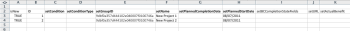

# 킥시작 템플릿을 사용하여 Adobe Workfront으로 데이터 가져오기

킥스타트는 Workfront에 가져오려는 데이터로 채울 수 있는 특별히 형식이 지정된 Excel 통합 문서입니다. Adobe Workfront에서는 의 설명에 따라 이 작업을 수행하는 데 사용할 수 있는 킥스타트 템플릿을 제공합니다 [데이터 가져오기 시작](../../../administration-and-setup/manage-workfront/using-kick-starts/kick-starts-data-importer.md).

이 프로세스는 다음 세 가지 주요 작업으로 분류됩니다.

* 먼저, 킥스타트 템플릿을 스프레드시트 파일로 내보냅니다
* 두 번째, 스프레드시트를 데이터로 채웁니다
* 마지막으로, 채워진 스프레드시트를 Workfront으로 가져옵니다

이러한 각 절차는 이 문서의 적절한 순서에 따라 요약되어 있습니다.

## 액세스 요구 사항

이 문서의 절차를 수행하려면 다음 액세스 권한이 있어야 합니다.

<table style="table-layout:auto"> 
 <col> 
 <col> 
 <tbody> 
  <tr> 
   <td role="rowheader">Adobe Workfront 플랜</td> 
   <td>모든</td> 
  </tr> 
  <tr> 
   <td role="rowheader">Adobe Workfront 라이선스</td> 
   <td>플랜</td> 
  </tr> 
  <tr> 
   <td role="rowheader">액세스 수준 구성</td> 
   <td> 
Workfront 관리자여야 합니다.
 
<b>참고</b>: 여전히 액세스 권한이 없는 경우 Workfront 관리자에게 액세스 수준에서 추가 제한 사항을 설정하는지 문의하십시오. Workfront 관리자가 액세스 수준을 수정하는 방법에 대한 자세한 내용은 <a href="../../../administration-and-setup/add-users/configure-and-grant-access/create-modify-access-levels.md" class="MCXref xref">사용자 정의 액세스 수준 만들기 또는 수정</a>.
 </td> 
  </tr> 
 </tbody> 
</table>

## 제한 사항

킥시작 템플릿을 사용하여 많은 수의 개체를 Workfront에 가져올 수 있습니다. 그러나 다음 제한 사항을 고려하십시오.

* 이러한 방식으로 데이터를 가져오면 Workfront에 이미 있는 레코드에 대한 정보가 업데이트되지 않습니다
* 새 레코드 및 해당 정보만 가져올 수 있습니다
* 한 번에 2,000개 이하의 레코드를 가져와서 가져오기가 시간 초과되지 않도록 합니다

## 킥시작 템플릿을 스프레드시트 파일로 내보내기

킥시작 템플릿을 내보내면 빈 Excel 스프레드시트 통합 문서가 표시됩니다. 이 문서의 후속 절차에서 통합 문서를 사용자의 정보로 채운 다음 다시 Workfront으로 가져옵니다.

킥시작 템플릿을 내보내려면 다음을 수행합니다.

1. 을(를) 클릭합니다. **기본 메뉴** 아이콘  Adobe Workfront의 오른쪽 위 모서리에서 을(를) 클릭하고 **설정** .

1. 클릭 **시스템** > **데이터 내보내기(시작)**.

1. 클릭 **추가 옵션**&#x200B;을 선택한 다음 포함할 정보 유형을 선택합니다.

   선택하는 각 옵션은 내보낸 스프레드시트에서 여러 탭 모음을 나타냅니다. 예를 들어, 보고서 옵션을 선택하면 보고서를 만드는 데 필요한 모든 개체가 스프레드시트(보기, 필터, 그룹화, 보고서)에 포함됩니다.

   아래 나열된 모든 개체 유형을 사용하여 데이터를 Workfront으로 가져올 수 있습니다. 단, 액세스 수준 옵션은 예외입니다. 내보내기의 액세스 레벨 데이터 시트는 참조 목적으로 제공되므로 ID별로 새 사용자 계정에 액세스 레벨을 지정할 수 있습니다.)

   각 객체 유형에 대한 템플릿은 다음 파일 형식으로 내보낼 수 있으며 다음 시트를 포함합니다.

   <table style="table-layout:auto"> 
    <col> 
    <col> 
    <col> 
    <thead> 
     <tr> 
      <th> 
<strong>오브젝트</strong> 
 </th> 
      <th> 
<strong>다음으로 내보내기</strong> 
 </th> 
      <th> 
<strong>내보낸 스프레드시트의 시트</strong> 
 </th> 
     </tr> 
    </thead> 
    <tbody> 
     <tr> 
      <td scope="col"> 
대시보드
 
시스템의 모든 대시보드를 내보낼 수 있습니다. 단일 내보내기에서 최대 100개의 특정 대시보드를 선택할 수 있습니다.
 </td> 
      <td scope="col">ZIP 파일로 내보내기</td> 
      <td scope="col"> 
매개변수
 
매개변수 옵션
 
매개변수 그룹
 
범주 매개변수
 
범주
 
보고서
 
포털 탭 섹션
 
대시보드
 
환경 설정
 </td> 
     </tr> 
     <tr> 
      <td scope="col"> 
보고서
 
시스템의 모든 보고서를 내보낼 수 있습니다. 단일 내보내기에서 최대 100개의 특정 보고서를 선택할 수 있습니다.
 </td> 
      <td scope="col">ZIP 파일로 내보내기 </td> 
      <td scope="col"> 
매개변수
 
매개변수 옵션
 
매개변수 그룹
 
범주 매개변수
 
범주
 
보고서
 
환경 설정
 </td> 
     </tr> 
     <tr> 
      <td scope="col"> 
승인
 </td> 
      <td scope="col"> 
Excel 파일로 내보내기
 </td> 
      <td scope="col"> 
단계 승인자
 
승인 단계
 
승인
 
승인 진행
 
환경 설정
 </td> 
     </tr> 
     <tr> 
      <td scope="col"> 
사용자 정의 데이터
 </td> 
      <td scope="col"> 
Excel 파일로 내보내기
 </td> 
      <td scope="col"> 
매개변수
 
매개변수 옵션
 
매개변수 그룹
 
범주 매개변수
 
범주
 
환경 설정
 </td> 
     </tr> 
     <tr> 
      <td scope="col"> 
경비 유형
 </td> 
      <td scope="col"> 
Excel 파일로 내보내기
 </td> 
      <td> 
경비 유형
 
환경 설정
 </td> 
     </tr> 
     <tr> 
      <td> 
시간 유형
 </td> 
      <td scope="col"> 
Excel 파일로 내보내기
 </td> 
      <td> 
시간 유형
 
환경 설정
 </td> 
     </tr> 
     <tr> 
      <td> 
팀
 </td> 
      <td scope="col"> 
Excel 파일로 내보내기
 </td> 
      <td> 
 팀원
 
팀
 
환경 설정 
 </td> 
     </tr> 
     <tr> 
      <td> 
사용자
 </td> 
      <td> 
Excel 파일로 내보냅니다. 전체 옵션 목록을 보려면 <strong>추가 옵션</strong>.
 </td> 
      <td> 
사용자
 
환경 설정
 </td> 
     </tr> 
     <tr> 
      <td>액세스 수준</td> 
      <td>Excel 파일로 내보내기</td> 
      <td> 
액세스 수준
 
환경 설정
 </td> 
     </tr> 
     <tr> 
      <td>할당</td> 
      <td>Excel 파일로 내보내기</td> 
      <td> 
할당
 
환경 설정
 </td> 
     </tr> 
     <tr> 
      <td>회사</td> 
      <td>Excel 파일로 내보내기</td> 
      <td> 
 회사
 
환경 설정 
 </td> 
     </tr> 
     <tr> 
      <td>이메일 템플릿</td> 
      <td>Excel 파일로 내보내기</td> 
      <td> 
이메일 템플릿
 
환경 설정 
 </td> 
     </tr> 
     <tr> 
      <td>경비</td> 
      <td>Excel 파일로 내보내기</td> 
      <td> 
 경비'
 
환경 설정 
 </td> 
     </tr> 
     <tr> 
      <td>외부 페이지</td> 
      <td>Excel 파일로 내보내기</td> 
      <td> 
 외부 페이지
 
환경 설정 
 </td> 
     </tr> 
     <tr> 
      <td>필터</td> 
      <td>ZIP 파일로 내보내기</td> 
      <td> 
 필터
 
환경 설정 
 </td> 
     </tr> 
     <tr> 
      <td>그룹</td> 
      <td>Excel 파일로 내보내기</td> 
      <td> 
 그룹
 
환경 설정 
 </td> 
     </tr> 
     <tr> 
      <td>그룹화</td> 
      <td>ZIP 파일로 내보내기</td> 
      <td> 
 그룹화
 
환경 설정 
 </td> 
     </tr> 
     <tr> 
      <td>시간</td> 
      <td>Excel 파일로 내보내기</td> 
      <td> 
 시간
 
환경 설정 
 </td> 
     </tr> 
     <tr> 
      <td>문제</td> 
      <td>Excel 파일로 내보내기</td> 
      <td> 
 문제
 
환경 설정 
 </td> 
     </tr> 
     <tr> 
      <td>작업 역할</td> 
      <td>Excel 파일로 내보내기</td> 
      <td> 
 작업 역할
 
환경 설정 
 </td> 
     </tr> 
     <tr> 
      <td>마일스톤 경로</td> 
      <td> Excel 파일로 내보내기</td> 
      <td> 
 마일스톤
 
마일스톤 경로
 
환경 설정 
 </td> 
     </tr> 
     <tr> 
      <td>참고</td> 
      <td>Excel 파일로 내보내기</td> 
      <td> 
 참고
 
환경 설정 
 </td> 
     </tr> 
     <tr> 
      <td>포트폴리오</td> 
      <td>Excel 파일로 내보내기</td> 
      <td> 
 포트폴리오
 
환경 설정 
 </td> 
     </tr> 
     <tr> 
      <td>프로젝트</td> 
      <td>Excel 파일로 내보내기</td> 
      <td> 
 대기열
 
프로젝트
 
라우팅 규칙
 
대기열 주제
 
환경 설정 
 </td> 
     </tr> 
     <tr> 
      <td>리소스 견적</td> 
      <td>Excel 파일로 내보내기</td> 
      <td> 
 리소스 견적
 
환경 설정 
 </td> 
     </tr> 
     <tr> 
      <td>리소스 풀</td> 
      <td>Excel 파일로 내보내기</td> 
      <td> 
 리소스 풀
 
환경 설정 
 </td> 
     </tr> 
     <tr> 
      <td>위험</td> 
      <td>Excel 파일로 내보내기</td> 
      <td> 
 위험
 
환경 설정 
 </td> 
     </tr> 
     <tr> 
      <td>위험 유형</td> 
      <td> Excel 파일로 내보내기</td> 
      <td> 
 위험 유형
 
환경 설정
 </td> 
     </tr> 
     <tr> 
      <td>스코어카드</td> 
      <td>Excel 파일로 내보내기</td> 
      <td> 
스코어카드 질문
 
스코어카드 옵션
 
스코어카드
 
환경 설정 
 </td> 
     </tr> 
     <tr> 
      <td>작업</td> 
      <td>Excel 파일로 내보내기</td> 
      <td> 
 작업
 
환경 설정 
 </td> 
     </tr> 
     <tr> 
      <td>템플릿</td> 
      <td> Excel 파일로 내보내기</td> 
      <td> 
 대기열
 
템플릿
 
라우팅 규칙
 
대기열 주제
 
환경 설정 
 </td> 
     </tr> 
     <tr> 
      <td>템플릿 할당</td> 
      <td>Excel 파일로 내보내기</td> 
      <td> 
 템플릿 할당
 
환경 설정 
 </td> 
     </tr> 
     <tr> 
      <td>템플릿 작업</td> 
      <td>Excel 파일로 내보내기</td> 
      <td> 
 템플릿 작업
 
환경 설정 
 </td> 
     </tr> 
     <tr> 
      <td>타임시트</td> 
      <td> Excel 파일로 내보내기</td> 
      <td> 
 타임시트 프로필
 
타임시트
 
환경 설정 
 </td> 
     </tr> 
     <tr> 
      <td>보기 </td> 
      <td> 
ZIP 파일로 내보내기
 </td> 
      <td> 
 보기
 
환경 설정 
 </td> 
     </tr> 
    </tbody> 
   </table>

1. 클릭 **다운로드**.
1. 계속 [스프레드시트를 데이터로 채웁니다](#populate-the-spreadsheet-template-with-your-data) 을 입력하여 정보로 템플릿을 채웁니다.

## 스프레드시트를 데이터로 채웁니다 {#populate-the-spreadsheet-template-with-your-data}

* [스프레드시트에 포함된 탭(데이터 시트) 정보](#about-the-tabs-data-sheets-included-in-the-spreadsheet)
* [레코드 가져오기](#import-a-record)
* [날짜 포함](#include-dates)
* [와일드카드 사용](#use-wildcards)
* [ID에 대한 속성 이름 대체](#attribute-name-substitution-for-ids)

### 스프레드시트에 포함된 탭(데이터 시트) 정보 {#about-the-tabs-data-sheets-included-in-the-spreadsheet}

>[!TIP]
>
>킥시작 템플릿을 채울 때 각 열의 정보 형식을 어떻게 지정해야 하는지 더 잘 이해하려면 가져오려는 객체의 기존 Workfront 데이터로 킥스타트를 내보내서 연습을 실행하는 것이 좋습니다. 자세한 내용은 [킥스타트를 통해 Adobe Workfront에서 데이터 내보내기](../../../administration-and-setup/manage-workfront/using-kick-starts/export-data-from-wf-via-kick-starts.md).

빈 킥시작 템플릿을 열면 다양한 탭(데이터 시트)을 사용할 수 있습니다. 이 개체는 다운로드용으로 선택한 개체에 따라 다릅니다. 각 객체는 프로젝트, 작업, 시간, 대시보드 및 사용자와 같은 애플리케이션의 객체를 나타냅니다.

이 탭 중 하나를 열면 2행에 임포트 중에 설정할 수 있는 각 객체의 필드가 표시됩니다. 열 헤더에서 &quot;set&quot;이라는 단어 뒤에 필드의 이름이 데이터베이스에 나타나는 대로 표시됩니다. 이러한 필드는 열 헤더로 작동합니다.

>[!IMPORTANT]
>
>오류를 방지하려면 다음을 확인하십시오.
>
>* 이러한 필드를 어떤 식으로든 삭제하거나 수정하지 마십시오. 예를 들어, 순서 또는 해당 이름을 변경하지 마십시오.
>* 굵은 글꼴로 표시된 열 헤더로 모든 필드를 채웁니다. 필수 필드를 나타냅니다.
>
>  그러나 필수 필드에 시스템 환경 설정에 설정된 기본값이 포함되어 있는 경우 필드를 채우지 않아도 됩니다.
>
>  예를 들어, **PROJ 프로젝트** 탭, **setCondition** 및 **setConditionType** 필드는 비워 둘 수 있지만, **setGroupID** 및 **setName** 열을 사용할 수 없습니다.

### 레코드 가져오기  {#import-a-record}

시트의 각 행은 고유한 객체에 해당합니다.

1. 에서 셀을 완료합니다 **isNew** 열:

   * 가져오는 객체가 새로운 경우 **TRUE** 행의 데이터를 가져오려면 다음을 수행하십시오.
   * 개체가 이미 Workfront에 있으면 을 입력합니다 **FALSE** 를 눌러 행을 무시합니다.

1. 에서 셀을 완료합니다 **ID** 열을 다음 방법 중 하나로 채우십시오.

   * 가져오는 객체가 새로운 경우(그리고 입력한 경우)**TRUE** 에서 **isNew** 열), ID에 사용할 숫자를 지정합니다. 이 숫자는 스프레드시트에서 고유해야 합니다.

   * 가져오는 개체가 Workfront 시스템에 이미 있으면(그리고 입력한 경우)**FALSE** 에서 **isNew** 열)이면 해당 개체의 Workfront에 있는 영숫자 GUID여야 합니다.

      **예:** 프로젝트의 경우 **setGroupID** 열은 다음 중 하나여야 합니다.

      * Workfront 인스턴스의 기존 그룹에 대한 GUID입니다
      * 의 ID 열에 있는 값(숫자) **그룹** 가져올 때 새 그룹을 생성하는 경우 시트

         

1. 가져오기 중에 채울 필수 필드 및 기타 필드에 대한 값을 입력합니다.
1. (선택 사항) 사용자 지정 데이터를 추가하려면:

   * 가져오기 프로세스에 포함할 각 사용자 지정 필드에 대해 새 열을 만듭니다.
   * 해당 사용자 지정 필드의 각 새 열 이름을 다음과 같이 지정합니다. **DE:[Workfront에 표시되는 사용자 지정 필드의 이름]**.
   * 열에서 **setCategoryID**&#x200B;를 입력하여 이 사용자 지정 필드가 있는 기존 사용자 지정 양식의 GUID를 입력합니다. 이 필드는 사용자 지정 데이터를 가져올 때 필요합니다.
   * 사용자 지정 필드(예: 라디오 단추, 확인란 또는 목록)에 여러 데이터 값을 추가해야 하는 경우 환경 설정 탭에 나열된 세로 막대 사용자 지정 데이터 구분 기호 &quot;|&quot;을 사용하여 값을 구분합니다.

      **예:** DE:Departments 열 아래에 A|D를 입력하여 사용자 지정 양식에 부서 A와 부서 D를 채웁니다.

### 날짜 포함  {#include-dates}

Workfront은 대부분의 날짜 형식을 처리할 수 있습니다. 그러나 스프레드시트의 날짜 열 형식이 날짜로 지정되었는지 확인해야 합니다. 열 형식이 일반, 숫자 또는 텍스트로 지정된 경우 가져오기가 실패합니다.

>[!TIP]
>
>대부분의 사용자는 YYYY/MM/DD 형식을 사용하는 것이 더 쉽다는 것을 알게 됩니다(예: 07/10/2022).

Workfront은 시간 값도 날짜의 일부로 허용합니다(예: 07/10/2022 01:30 또는 07/10/2022 1:00 PM).

날짜에서 시간을 생략하면 Workfront은 다음 중 하나를 수행합니다.

* 오전 12시로 가정합니다. 예상 날짜 결과를 확인하려면 시스템 시간대가 표준 시간대와 일치해야 합니다.
* 스케줄과 연관된 객체에 있는 경우 시간이 스케줄에서 허용하는 가장 이른 시간으로 정의됩니다.

>[!NOTE]
>
>UNIX 타임스탬프를 사용할 때는 값 끝에 3개의 0을 추가로 포함해야 합니다.
>
>예를 들어 타임스탬프가 7336899000이면 셀에 7336899000000을 입력합니다.

### 와일드카드 사용 {#use-wildcards}

Kick-Start 템플릿 스프레드시트를 채울 때 다음 와일드카드를 사용할 수 있습니다.

<table style="table-layout:auto"> 
 <col> 
 <col> 
 <thead> 
  <tr> 
   <th> 
<strong>와일드카드</strong> 
 </th> 
   <th> 
<strong>비헤이비어</strong> 
 </th> 
  </tr> 
 </thead> 
 <tbody> 
  <tr> 
   <td> 
$$오늘
 </td> 
   <td> 
에서 사용하는 경우 <strong>setDate</strong> 필드에서는 이 와일드카드가 킥스타트를 가져오는 날의 자정 날짜를 설정합니다.
 
필터에서 와일드카드에 허용된 표준 구문을 사용하여 와일드카드를 수정할 수 있습니다.
 
Example: </b>"><b>예: </b>실제로 가져오기를 수행하는 날짜와 상관없이 프로젝트를 가져오는 요일에 시작하려는 경우 를 사용할 수 있습니다 <strong>$$todayBW</strong>. 프로젝트의 계획 시작 날짜를 일요일 오전 12시로 설정합니다. 프로젝트 일정이 그 시간에 출근하지 못할 수도 있으므로 월요일 오전 9시에 시작됩니다.
 </td> 
  </tr> 
  <tr> 
   <td> 
$$NOW
 </td> 
   <td> 
에서 사용하는 경우 <strong>setDate</strong> 필드에서는 이 와일드카드가 킥스타트 가져오기 중에 레코드를 만드는 순간마다 날짜를 설정합니다.
 
필터에서 와일드카드에 허용된 표준 구문을 사용하여 와일드카드를 수정할 수 있습니다.
 
Example: </b>"><b>예: </b>프로젝트를 가져온 후 3시간 후에 시작하려면 다음을 사용할 수 있습니다 <strong>$$NOW+3h</strong>.
 </td> 
  </tr> 
  <tr> 
   <td> 
$$USER.ID
 </td> 
   <td> 
에서 사용하는 경우 <strong>setAssignedToID</strong> 또는 다른 userID 기반 필드인 경우 이 와일드카드는 작업을 할당하거나 가져오기를 수행하는 개별 레코드에 레코드를 연관시킵니다.
 </td> 
  </tr> 
  <tr> 
   <td> 
$$CUSTOMER
 </td> 
   <td> 
이 와일드카드는 킥시작 사용자 가져오기에 특별히 추가되었습니다. Workfront 계정이 만들어지면 시스템 관리자 액세스 수준을 가진 사용자가 만들어집니다. 기본 관리자에게 할당된 사용자 이름은 계정에서 다른 사용자를 만들 때 접두사로 사용할 수 있습니다.
 
사용자 이름은 모든 고객에서 고유해야 하므로 사용자 이름 "jsmith"가 있을 수 있는 John Smith와 같이 매우 일반적인 사용자 이름을 가진 개인이 여러 명 있을 때 유용합니다. 기본 관리자 사용자 이름을 사용하여 사용자 이름 지정을 사전 예약하면 각 사용자 이름이 고유한지 확인합니다(예: <strong>$$CUSTOMER.jsmith</strong>).
 
팁: 사용자 이름이 고유한 시스템 너비를 보장할 수 있는 보다 우아한 방법은 <strong>setUsername</strong> 필드.
 </td> 
  </tr> 
 </tbody> 
</table>

### ID에 대한 속성 이름 대체  {#attribute-name-substitution-for-ids}

가능하면 항상 ID를 사용하는 것이 좋지만, **setAttributeID** 값. 열 헤더를 변경하여 이름별로 값을 참조할 수 있습니다.

**예:**

* **(프로젝트 가져오기)**

   프로젝트를 가져올 때 **setGroupID** 프로젝트에 **그룹** 시트, 각 그룹 ID를 기록해 두고 올바른 셀(**setGroupID** 열)을 클릭하여 제품에서 사용할 수 있습니다 **PROJ 프로젝트** 시트.

   이는 몇 개의 그룹 및 프로젝트에서만 사용할 수 있지만, 각 그룹 중 몇 개를 사용하여 작업하는 경우에는 실용적이지 않습니다.

   위에서 설명한 예에 대해 속성 이름 대체를 수행하려면 **setGroupID** 열 머리글까지 **#setGroupID GROUP****name**. 그런 다음 각 프로젝트의 그룹을 이름별로 참조할 수 있습니다.

   >[!NOTE]
   >
   >속성 이름 대체를 사용하는 옵션은 기존 레코드에 대한 참조로만 제한됩니다. 같은 가져오기에서 생성 중인 객체에 이름 대체를 사용할 수 없습니다.

* **(사용자 가져오기)**

   사용자를 가져올 때 **setRoleID** 의 역할 목록에서 **역할 역할** 탭.

   일부 역할 ID는 계정에 이미 존재하는 레코드에 대한 것이고 다른 ID는 가져오기 중에 생성됩니다.

   기존 역할에 할당된 새 사용자 레코드의 경우 이름 대체를 사용할 수 있습니다. 새로 가져온 역할에 할당된 새 사용자 레코드의 경우 해당 역할을 수행할 수 없습니다.

   다음은 동일한 가져오기 파일에서 두 메서드를 모두 사용할 수 있는 방법입니다.

   * 스프레드시트의 왼쪽에 열을 추가합니다 **setRoleID** 열.
   * 새 열에 이름 지정 **#setRoleID 역할 이름**.
   * 기존 레코드에 할당된 롤의 경우 **#setRoleID 역할 이름** 열.

      새 역할 레코드에 할당된 역할에 대해 setRoleID의 역할 시트에 지정한 ID를 입력합니다.

      

## 스프레드시트 데이터를 Workfront에 가져옵니다

Excel 템플릿을 데이터로 채우면 Excel의 데이터를 Workfront에 업로드할 수 있습니다.

킥시작 가져오기는 다음 파일 유형을 지원합니다.

* XML 기반 Excel(&#42;.xlsx)
* 이전 Excel(&#42;.xls)
* 압축(&#42;ZIP) xlsx 또는 xls 파일

   >[!NOTE]
   >
   >문서, 아바타 등의 보고서를 참조하거나 속성 파일을 보거나 필터링하거나 그룹화하는 Excel 스프레드시트를 가져올 때 ZIP 파일을 사용해야 합니다. 압축된 가져오기 파일을 사용하는 경우 &#42;ZIP 파일의 이름은 다음과 같아야 합니다 &#42;.xlsx 또는 &#42;.xls 파일과 모든 컨텐츠는 동일한 파일 구조 수준(폴더 없음)이어야 합니다.

템플릿 스프레드시트 데이터를 Workfront에 가져오려면 다음을 수행하십시오.

1. 을(를) 클릭합니다. **기본 메뉴** 아이콘  Adobe Workfront의 오른쪽 위 모서리에서 을(를) 클릭하고 **설정** .

1. 클릭 **시스템** >**데이터 가져오기(시작)**.

1. 에서 **Kick-Start 스프레드시트를 사용하여 데이터 업로드** 섹션을 클릭합니다. **파일 선택**&#x200B;를 차례로 찾은 다음 채워진 스프레드시트로 이동하여 선택합니다.

1. 클릭 **업로드.**

   Excel 파일을 Workfront에 업로드하는 데 5분 이상 걸리는 경우 애플리케이션 시간이 초과되어 파일을 업로드할 수 없습니다.

   더 작은 개체 배치로 데이터를 가져오십시오.

1. (조건부) 이제 Workfront Fusion을 사용하는 경우 FLO 또는 시나리오를 설정할 수 있습니다.
