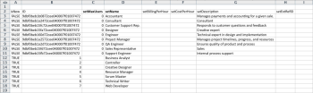

# 킥시작 시나리오: 회사, 그룹, 역할 및 사용자 킥스타트 준비

수동으로 데이터를 입력하지 않고 Adobe Workfront 구현을 시작하면 고객 목록, 내부 부서, 작업 역할 및 사용자 정보를 가져올 수 있습니다.

## 액세스 요구 사항

이 문서의 절차를 수행하려면 다음 액세스 권한이 있어야 합니다.

<table style="table-layout:auto"> 
 <col> 
 <col> 
 <tbody> 
  <tr> 
   <td role="rowheader">Adobe Workfront 플랜</td> 
   <td>모든</td> 
  </tr> 
  <tr> 
   <td role="rowheader">Adobe Workfront 라이선스</td> 
   <td>플랜</td> 
  </tr> 
  <tr> 
   <td role="rowheader">액세스 수준 구성</td> 
   <td> 
Workfront 관리자여야 합니다.
 
<b>참고</b>: 여전히 액세스 권한이 없는 경우 Workfront 관리자에게 액세스 수준에서 추가 제한 사항을 설정하는지 문의하십시오. Workfront 관리자가 액세스 수준을 수정하는 방법에 대한 자세한 내용은 <a href="../../../administration-and-setup/add-users/configure-and-grant-access/create-modify-access-levels.md" class="MCXref xref">사용자 정의 액세스 수준 만들기 또는 수정</a>.
 </td> 
  </tr> 
 </tbody> 
</table>

## 가져올 수 있는 항목

다음 표에는 가져올 회사, 그룹 및 역할이 표시됩니다.

<table style="table-layout:auto"> 
 <col> 
 <col> 
 <col> 
 <thead> 
  <tr> 
   <th><strong>회사</strong> </th> 
   <th><strong>그룹</strong> </th> 
   <th><strong>역할</strong> </th> 
  </tr> 
 </thead> 
 <tbody> 
  <tr> 
   <td valign="top"> 
Acme, Co
 
Workfront, Inc.
 
<em>사용자 회사</em> 
 
XYZ, Inc.
 </td> 
   <td valign="top"> 
재무
 
IT 
 
마케팅 
 
세일즈
 </td> 
   <td valign="top"> 
비즈니스 분석가
 
Controller Creative
 
디자이너
 
리소스 관리자
 
스크럼 기본
 
기술 작성기
 
웹 개발자
 </td> 
  </tr> 
 </tbody> 
</table>

역할 이름은 고유해야 하며 기존 작업 역할을 가져올 수 없습니다.

다음 표에는 가져올 사용자와 각 사용자 속성이 표시됩니다.

### 사용자 1

| **이름** | 크리스 |
|---|---|
| **성** | 매닝 |
| **사용자 이름/이메일** | mailto:cmanning@foo.com |
| **암호** | updateMe |
| **액세스** | 팀원 |
| **회사** | &lt;*회사>* |
| **홈 그룹** | 마케팅 |
| **작업 역할** | 비즈니스 분석가 |

{style=&quot;table-layout:auto&quot;}

### 사용자 2

| **이름** | 제니퍼 |
|---|---|
| **성** | 캠벨 |
| **사용자 이름/이메일** | jcampbell@foo.com |
| **암호** | updateMe |
| **액세스** | 프로젝트 관리자 |
| **회사** | &lt;*회사>* |
| **홈 그룹** | 마케팅 |
| **작업 역할** | 프로젝트 관리자 |

{style=&quot;table-layout:auto&quot;}

### 사용자 3

| **이름** | 질 |
|---|---|
| **성** | 설리번 |
| **사용자 이름/이메일** | jsullivan@foo.com |
| **암호** | updateMe |
| **액세스** | 헬프 데스크 |
| **회사** | &lt;*회사>* |
| **홈 그룹** | 세일즈 |
| **작업 역할** | 영업 담당자 |

{style=&quot;table-layout:auto&quot;}

### 사용자 4

| **이름** | 마르크 |
|---|---|
| **성** | 루이스 |
| **사용자 이름/이메일** | mlewis@foo.com |
| **암호** | updateMe |
| **액세스** | 포트폴리오 관리자 |
| **회사** | &lt;*회사>* |
| **홈 그룹** | 재무 |
| **작업 역할** | 컨트롤러 |

{style=&quot;table-layout:auto&quot;}

### 사용자 5

| **이름** | Pam |
|---|---|
| **성** | 레이놀즈 |
| **사용자 이름/이메일** | preynolds@foo.com |
| **암호** | updateMe |
| **액세스** | 프로젝트 관리자 |
| **회사** | *회사>* |
| **홈 그룹** | 마케팅 |
| **작업 역할** | IT |

{style=&quot;table-layout:auto&quot;}

### 사용자 6

| **이름** | 레이 |
|---|---|
| **성** | 앤드루스 |
| **사용자 이름/이메일** | randrews@foo.com |
| **암호** | updateMe |
| **액세스** | 관리자 |
| **회사** | *회사>* |
| **홈 그룹** | 리소스 관리자 |
| **작업 역할** | 없음 |

{style=&quot;table-layout:auto&quot;}

## 킥시작 템플릿 다운로드

1. 을(를) 클릭합니다. **기본 메뉴** 아이콘  Adobe Workfront의 오른쪽 위 모서리에서 을(를) 클릭하고 **설정** .

1. 클릭 **시스템** > **킥스타트** > **데이터를 가져옵니다.**

1. 클릭 **추가 옵션** 가져오기 옵션의 전체 목록을 확인합니다.
1. 가져올 액세스 레벨, 회사, 그룹, 작업 역할 및 사용자 객체를 선택합니다.

## 회사 정보 입력

1. 를 엽니다. **Workfront.xlsx** 방금 다운로드한 파일입니다.

   >[!TIP]
   >
   >매우 넓은 데이터 시트로 작업할 경우 스프레드시트 편집기의 고정 창(또는 그에 상응하는) 도구를 사용하여 스프레드시트를 보다 쉽게 작업할 수 있습니다.

1. CMPY 회사 시트로 이동합니다.

   이미 존재하는 기업이 아니면 공허해야 한다. 

   

1. 에 TRUE를 지정합니다. **isNew** 열.
1. 추가할 각 회사에 대해 이 작업을 반복합니다. (이 예에서는 네 개의 회사가 추가되고 있으므로 3-6행에 대해 이 작업을 완료하십시오.)

   

1. 고유 ID를 지정합니다.

   ID 열에 대해 각 행에 대해 수행해야 합니다. 1부터 시작하는 정수는 새 레코드를 만들 때 잘 작동합니다.

   

1. 이름을 설정합니다.

   에서 각 고객의 이름을 지정합니다. **setName** 열.

   

1. 그룹 시트로 이동합니다.

   Workfront에서 그룹을 이미 만들지 않은 경우, 이 시트는 Workfront의 모든 계정에 제공된 기본 그룹만 표시해야 합니다.

    

1. 설정 **isNew** column.시나리오에 따라 4개의 그룹을 가져오므로 &#39;isNew&#39; 열에 대해 4~7행에 TRUE를 지정합니다.
1. 고유 ID를 지정합니다.

   ID 열에 대해 각 행에 대해 수행해야 합니다. 1부터 시작하는 정수는 새 레코드를 만들 때 잘 작동합니다.

   

1. 이름을 설정합니다.

   각 부서의 이름을 **setName** 열.

   

   역할 정보를 지정합니다. [역할 역할] 시트로 이동합니다.

1. 계정에서 이미 역할을 만들거나 삭제하지 않은 경우 이 시트에는 Workfront의 모든 계정에 제공된 8개의 역할이 표시됩니다.

   

1. True 문을 설정합니다.

   7개의 작업 역할을 가져오는 중입니다. &#39;isNew&#39; 열에 대해 12~18행에 TRUE를 입력합니다.

   

1. 고유 ID를 지정합니다.

   ID 열에 대해 각 행에 대해 수행해야 합니다. 1부터 시작하는 정수는 새 레코드를 만들 때 잘 작동합니다.

   

   

1. setName 열에 각 역할의 이름을 입력하여 지정합니다.

   

1. 필요에 따라 추가 세부 정보를 제공합니다.

   필요에 따라 생성 중인 역할에 대한 청구 비율, 비용 비율 및 설명을 포함합니다.

1. 사용자 정보를 입력하려면 사용자 시트 로 이동합니다.

   계정에 이미 사용자를 만들지 않은 경우 이 시트에는 Workfront의 모든 계정에 제공된 관리 사용자만 표시됩니다.

    

1. 6명의 사용자를 가져오고 있으므로 TRUE를 &#39;isNew&#39; 열에 대해 4-9행에 지정하여 True 값을 설정합니다.

   

1. ID 열의 각 행에 고유 ID를 지정하여 고유 ID를 설정합니다. 일반적으로 1부터 시작하는 정수는 새 레코드에 대해 잘 작동합니다.

   

1. 각 사용자의 이름을 &#39;setFirstName&#39; 및 &#39;setLastName&#39; 열에 입력합니다.

   

1. &#39;setEmail&#39;, &#39;setPassword&#39; 및 &#39;setUsername&#39; 열에 값을 지정하여 세부 정보 값을 설정합니다.

   

1. 액세스 수준 값을 지정합니다.

   예를 들어 팀 멤버인 Chris Manning은 팀 구성원 액세스 수준의 ACSLVL 액세스 수준 시트에서 ID를 조회합니다. ID를 클립보드에 복사하고 USER User 시트에 **setAccessLevelID** Chris 행의 열.

   각 사용자 및 액세스 수준에 대해 이 단계를 반복합니다.

    

1. 홈 그룹 세부 정보를 지정합니다.

   시나리오에 따르면, 크리스 매닝은 마케팅 그룹에 속합니다. 그룹 그룹 시트에서 마케팅 그룹의 ID를 찾아 클립보드에 복사한 다음 사용자 시트에 붙여넣습니다 **setHomeGroupID** Chris 행의 열. &#x200B;각 사용자 및 그룹 지정에 대해 이 단계를 반복합니다.

    

1. 회사 세부 정보를 지정합니다.

   이 시나리오의 모든 사용자는 동일한 회사에 속합니다. CMPY 회사 시트에서 *귀사 *회사의 ID를 찾아 클립보드로 복사한 다음 사용자 탭에서 이 값을 &#39;setCompanyID&#39; 열의 각 행에 붙여 넣습니다&#x200B;.

   각 사용자 및 그룹 지정에 대해 이 단계를 반복합니다.

   

   

1. 작업 역할 세부 사항을 지정합니다.

   시나리오에 따르면, 크리스 매닝은 비즈니스 분석가 역할을 맡을 것이다. ROLE 역할 시트에서 Business Analyst 역할의 ID를 찾아 클립보드에 복사한 다음 USER User Sheet에서 Chris&#39; 행의 &#39;setRoleID&#39; 열에 붙여넣습니다. &#x200B;각 사용자 및 그룹 지정에 대해 이 단계를 반복합니다.

   

   

1. 필요에 따라 다른 사용자 세부 사항을 입력한 다음 파일을 저장합니다.
1. Excel 파일을 가져옵니다.

   에 제공된 지침을 따르십시오 **킥시작 파일 가져오기** 섹션 을 참조하십시오.
