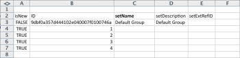
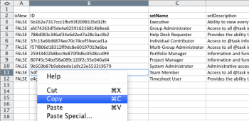
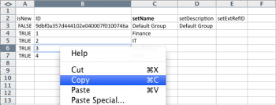

# 킥스타트 시나리오: 회사, 그룹, 역할 및 사용자 킥스타트 준비

Adobe Workfront 구현을 시작할 때 수동으로 데이터를 입력하지 않고 고객 목록, 내부 부서, 작업 역할 및 사용자 정보를 가져올 수 있습니다.

## 액세스 요구 사항

+++ 을 확장하여 이 문서의 기능에 대한 액세스 요구 사항을 봅니다.

이 문서의 단계를 수행하려면 다음 액세스 권한이 있어야 합니다.

<table style="table-layout:auto"> 
 <col> 
 <col> 
 <tbody> 
  <tr> 
   <td role="rowheader">Adobe Workfront 플랜</td> 
   <td>임의</td> 
  </tr> 
  <tr> 
   <td role="rowheader">Adobe Workfront 라이선스</td> 
   <td>
   
 새로운 기능: 표준

   또는
   
현재: 플랜
</td> 
  </tr> 
  <tr> 
   <td role="rowheader">액세스 수준 구성</td> 
   <td>[!UICONTROL 시스템 관리자]</td> 
  </tr> 
 </tbody> 
</table>

이 표의 정보에 대한 자세한 내용은 [Workfront 설명서의 액세스 요구 사항](/help/quicksilver/administration-and-setup/add-users/access-levels-and-object-permissions/access-level-requirements-in-documentation.md)을 참조하십시오.

+++

## 가져올 수 있는 항목

다음 표에는 가져올 회사, 그룹 및 역할이 표시됩니다.

| 회사 | 그룹 | 역할 |
|---|---|---|
| Acme, Co 
Workfront 
_회사_ 
XYZ, Inc. | 재무 
IT 
마케팅 
세일즈 | 비즈니스 분석가 
컨트롤러 Creative 
디자이너 
리소스 관리자 
스크럼 기본 
테크니컬 라이터 
웹 개발자 |

{style="table-layout:auto"}

역할 이름은 고유해야 합니다. 기존 작업 역할을 가져올 수 없습니다.

다음 표에는 가져올 사용자와 각 사용자의 몇 가지 사용자 속성이 표시됩니다.

### 사용자 1

| 속성 | 값 |
|---|---|
| **이름** | 크리스 |
| **성** | 매닝 |
| **사용자 이름/전자 메일** | mailto:cmanning@foo.com |
| **암호** | updateMe |
| **액세스** | 팀원 |
| **회사** | &lt;*회사>* |
| **홈 그룹** | 마케팅 |
| **작업 역할** | 비즈니스 분석가 |

{style="table-layout:auto"}

### 사용자 2

| 속성 | 값 |
|---|---|
| **이름** | 제니퍼 |
| **성** | 캠벨 |
| **사용자 이름/전자 메일** | jcampbell@foo.com |
| **암호** | updateMe |
| **액세스** | 프로젝트 관리자 |
| **회사** | &lt;*회사>* |
| **홈 그룹** | 마케팅 |
| **작업 역할** | 프로젝트 관리자 |

{style="table-layout:auto"}

### 사용자 3

| 속성 | 값 |
|---|---|
| **이름** | 질 |
| **성** | 설리번 |
| **사용자 이름/전자 메일** | jsullivan@foo.com |
| **암호** | updateMe |
| **액세스** | 헬프 데스크 |
| **회사** | &lt;*회사>* |
| **홈 그룹** | 세일즈 |
| **작업 역할** | 영업 담당자 |

{style="table-layout:auto"}

### 사용자 4

| 속성 | 값 |
|---|---|
| **이름** | 마크 |
| **성** | 루이스 |
| **사용자 이름/전자 메일** | mlewis@foo.com |
| **암호** | updateMe |
| **액세스** | 포트폴리오 관리자 |
| **회사** | &lt;*회사>* |
| **홈 그룹** | 재무 |
| **작업 역할** | 컨트롤러 |

{style="table-layout:auto"}

### 사용자 5

| 속성 | 값 |
|---|---|
| **이름** | 팸 |
| **성** | 레이놀즈 |
| **사용자 이름/전자 메일** | preynolds@foo.com |
| **암호** | updateMe |
| **액세스** | 프로젝트 관리자 |
| **회사** | *회사>* |
| **홈 그룹** | 마케팅 |
| **작업 역할** | IT |

{style="table-layout:auto"}

### 사용자 6

| 속성 | 값 |
|---|---|
| **이름** | 레이 |
| **성** | 앤드루스 |
| **사용자 이름/전자 메일** | randrews@foo.com |
| **암호** | updateMe |
| **액세스** | 관리자 |
| **회사** | *회사>* |
| **홈 그룹** | 리소스 관리자 |
| **작업 역할** | 없음 |

{style="table-layout:auto"}

## 킥스타트 템플릿 다운로드

{{step-1-to-setup}}

1. **시스템** > **킥스타트** > **데이터 가져오기**&#x200B;를 클릭합니다.

1. 가져오기 옵션의 전체 목록을 보려면 **추가 옵션**&#x200B;을 클릭하세요.
1. 가져오려는 액세스 수준, 회사, 그룹, 작업 역할 및 사용자 객체를 선택합니다.
1. **다운로드**&#x200B;를 클릭합니다.

## 회사 정보 입력

1. 다운로드한 **Workfront.xlsx** 파일을 엽니다.

   >[!TIP]
   >
   >매우 넓은 데이터 시트로 작업할 때 스프레드시트 편집기의 고정 창(또는 이와 동등한 도구)을 사용하여 스프레드시트를 더욱 쉽게 작업할 수 있습니다.

1. **CMPY 회사** 시트로 이동합니다.

   기업들이 이미 제도권에 들어가 있지 않는 한 공허해야 한다.

    

1. **isNew** 열에 **TRUE**&#x200B;을(를) 입력하십시오.

   추가되는 각 회사에 대해 이 작업을 반복합니다. (이 예에서는 4개의 회사가 추가되고 있으므로 행 3-6에 대해 이 작업을 완료합니다.)

   

1. 고유한 **ID**&#x200B;을(를) 입력하십시오.

   각 행의 ID를 입력해야 합니다. 1에서 시작하는 정수는 새 레코드를 만들 때 잘 작동합니다.

   

1. **setName** 열에 각 고객의 이름을 입력하십시오.

   

1. **그룹** 시트로 이동합니다.

   Workfront에서 그룹을 이미 만든 경우가 아니라면 이 시트에는 Workfront의 모든 계정으로 프로비저닝된 기본 그룹만 표시됩니다.

    

1. **isNew** 열에 **TRUE**&#x200B;을(를) 입력하십시오.

   시나리오에 따라 4개의 그룹을 가져오므로 4행부터 7행까지의 **isNew** 열에 **TRUE**&#x200B;을(를) 입력하십시오.

1. 고유한 **ID**&#x200B;을(를) 입력하십시오.

   각 행의 ID를 입력해야 합니다. 1에서 시작하는 정수는 새 레코드를 만들 때 잘 작동합니다.

   

1. **setName** 열에 각 부서의 이름을 입력하십시오.

   

1. **역할** 시트로 이동합니다.

   계정에서 역할을 이미 만들거나 삭제하지 않은 경우 이 시트에는 Workfront의 모든 계정에서 프로비저닝된 8개의 역할이 표시됩니다.

   

1. **isNew** 열에 **TRUE**&#x200B;을(를) 입력하십시오.

   시나리오에 따라 7개의 작업 역할을 가져오므로 12행부터 18행까지의 **isNew** 열에 **TRUE**&#x200B;을(를) 입력하십시오.

   

1. 고유한 **ID**&#x200B;을(를) 입력하십시오.

   각 행의 ID를 입력해야 합니다. 1에서 시작하는 정수는 새 레코드를 만들 때 잘 작동합니다.

   

1. **setName** 열에 각 역할의 이름을 입력하십시오.

   

1. 필요에 따라 추가 세부 정보를 제공합니다.

   필요에 따라 생성 중인 역할에 대한 청구 요금, 비용 요금 및 설명을 포함합니다.

1. **사용자** 시트로 이동합니다.

   계정에서 사용자를 이미 생성한 경우가 아니라면 이 시트에는 Workfront의 모든 계정으로 프로비저닝된 관리 사용자만 표시됩니다.

    

1. **isNew** 열에 **TRUE**&#x200B;을(를) 입력하십시오.

   시나리오에 따라 6명의 사용자를 가져오므로 4행부터 9행까지의 **isNew** 열에 **TRUE**&#x200B;을(를) 입력하십시오.

   

1. 고유한 **ID**&#x200B;을(를) 입력하십시오.

   각 행의 ID를 입력해야 합니다. 1에서 시작하는 정수는 새 레코드를 만들 때 잘 작동합니다.

   

1. **setFirstName** 및 **setLastName** 열에 각 사용자의 이름을 입력하십시오.

   

1. **setEmail**, **setPassword** 및 **setUsername** 열에 값을 입력하여 세부 값을 설정하십시오.

   

1. 액세스 수준 값을 지정합니다.

   예를 들어 Chris Manning은 팀원입니다. **ACSLVL 액세스 수준** 시트에서 팀원 액세스 수준에 대한 ID를 조회합니다. ID를 복사하고 **USER** 시트의 해당 사용자 행의 **setAccessLevelID** 열에 붙여 넣습니다.

   각 사용자 및 액세스 수준에 대해 이 단계를 반복합니다.

    

1. 사용자의 홈 그룹 세부 정보를 입력합니다.

   시나리오에 따르면 Chris Manning은 마케팅 그룹에 속합니다. **그룹** 시트에서 마케팅 그룹의 ID를 찾아 복사한 다음 **사용자** 시트에서 사용자 행의 **setHomeGroupID** 열에 붙여 넣습니다. &#x200B;각 사용자 및 그룹 할당에 대해 이 단계를 반복합니다.

    

1. 사용자의 회사 세부 정보를 입력합니다.

   이 시나리오의 모든 사용자는 동일한 회사에 속합니다. **CMPY 회사** 시트에서 **자신의 회사** 회사의 ID를 찾아 복사한 다음 **사용자 사용자** 탭에서 이 값을 **setCompanyID** 열의 각 행에 붙여 넣습니다&#x200B;.

   각 사용자 및 그룹 할당에 대해 이 단계를 반복합니다.

    

1. 사용자의 작업 역할 세부 정보를 입력합니다.

   시나리오에 따르면 Chris Manning이 비즈니스 분석가 역할을 맡게 됩니다. **역할 역할** 시트에서 비즈니스 분석가 역할의 ID를 찾아 복사한 다음 **사용자 사용자** 시트에서 사용자 행의 **setRoleID** 열에 붙여 넣습니다. &#x200B;각 사용자 및 그룹 할당에 대해 이 단계를 반복합니다.

    

1. 필요에 따라 다른 사용자 세부 정보를 입력한 다음 파일을 저장합니다.
1. Excel 파일을 가져옵니다.

   [킥스타트 템플릿을 사용하여 Adobe Workfront으로 데이터 가져오기](/help/quicksilver/administration-and-setup/manage-workfront/using-kick-starts/import-data-via-kickstarts.md)에 제공된 지침을 따르십시오.

>[!NOTE]
>
>Workfront으로 가져온 사용자는 비활성화됨 및 승인 보류 중 상태로 만들어집니다.
> 
>조직이 Adobe Admin Console으로 마이그레이션되고 사용자가 몇 분 내에 비활성화됨 및 승인 보류 중 상태에서 벗어나지 않는 경우 사용자 일괄 처리를 Adobe Admin Console에 바로 추가할 수 있습니다.
>
>지침은 [여러 사용자 관리를 참조하십시오. | Adobe 설명서의 일괄 CSV 업로드](https://helpx.adobe.com/kr/enterprise/using/bulk-upload-users.html).
