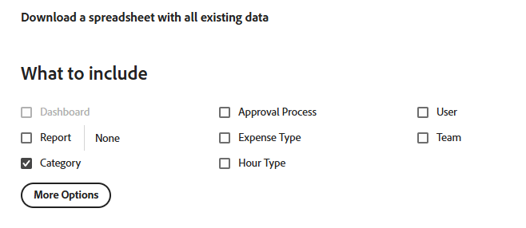

# 킥스타트 시나리오: 여러 옵션 사용자 정의 필드를 Workfront에 가져오기

킥스타트 기능을 사용하여 Adobe Workfront에서 여러 옵션이 있는 사용자 정의 필드를 가져올 수 있습니다.

여러 옵션이 있는 사용자 정의 필드의 예는 다음과 같습니다.

* 다중 선택 드롭다운
* 드롭다운
* 확인란
* 라디오 버튼

이러한 필드에는 때로 많은(경우에 따라 수백 개) 옵션이 있을 수 있습니다. 킥스타트 기능을 사용하여 이를 가져오면 Workfront 관리자로서 많은 시간을 절약할 수 있으며 오류가 발생하지 않도록 할 수 있습니다.

>[!IMPORTANT]
>
>킥스타트를 사용하여 여러 옵션이 있는 사용자 정의 필드를 가져오려면 아래 섹션에 설명된 단계를 순서대로 수행해야 합니다.
>
>1. Workfront에서 기존 사용자 지정 데이터 내보내기(선택적 단계)
>1. 사용자 정의 데이터에 대한 킥스타트 템플릿 내보내기
>1. Excel 킥스타트 스프레드시트 채우기
>1. Excel 스프레드시트를 Workfront에 업로드

## 액세스 요구 사항

+++ 을 확장하여 이 문서의 기능에 대한 액세스 요구 사항을 봅니다.

<table style="table-layout:auto"> 
 <col> 
 <col> 
 <tbody> 
  <tr> 
   <td>Adobe Workfront 패키지</td> 
   <td>
임의
</td> 
  </tr> 
  <tr> 
   <td>Adobe Workfront 라이선스</td> 
   <td>
표준

       
플랜
</td>
  </tr> 
  <tr> 
   <td>액세스 수준 구성</td> 
   <td>시스템 관리자</td> 
  </tr> 
 </tbody> 
</table>

자세한 내용은 [Workfront 설명서의 액세스 요구 사항](/help/quicksilver/administration-and-setup/add-users/access-levels-and-object-permissions/access-level-requirements-in-documentation.md)을 참조하십시오.

+++

## Workfront에서 기존 사용자 지정 데이터 내보내기(선택적 단계)

Workfront 데이터베이스 구조에 익숙하지 않거나 Workfront에서 정보를 가져오는 데 필요한 킥스타트 파일에 익숙하지 않은 경우, 먼저 가져오려는 필드의 정보와 유사한 기존 정보를 사용하여 Workfront에서 킥스타트 파일을 내보내는 것이 좋습니다.

예를 들어 사용자 정의 양식 또는 사용자 정의 필드를 가져오려면 먼저 기존 사용자 정의 데이터로 킥스타트 파일을 내보내야 합니다.

먼저 기존 데이터를 내보내면 데이터를 스캔하고 새 데이터의 형식을 지정하는 방법을 확인할 수 있습니다.

Workfront 데이터베이스 개체 및 구조를 잘 알고 있는 경우 아래 섹션을 계속할 수 있습니다.

Workfront에서 기존 데이터를 내보내려면:

{{step-1-to-setup}}

1. 왼쪽 메뉴에서 **시스템**&#x200B;을 확장한 다음 **데이터 내보내기(킥스타트)**&#x200B;를 클릭합니다.

1. **포함할 항목** 섹션에서 **사용자 지정 데이터**&#x200B;를 선택합니다.

   

1. **다운로드 형식** 섹션에서 **.xlsx 파일**&#x200B;을(를) 선택하십시오.

   >[!TIP]
   >
   >시스템에 있는 사용자 정의 데이터의 양에 따라 이 작업은 시간이 오래 걸릴 수 있습니다.

1. **다운로드**&#x200B;를 클릭합니다. .xlsx 파일을 컴퓨터로 다운로드합니다. 해당 페이지로 이동하여 엽니다.

   

1. 다운로드한 파일을 검사하고 다음 세부 사항을 기록해 둡니다.

   * 파일에는 여러 개의 시트가 포함되어 있습니다. 모든 시트의 정보를 알 필요는 없지만 일부 시트를 사용하여 정보를 가져옵니다. 잠시 시간을 내어 해당 콘텐츠, 특히 각 시트의 콘텐츠 형식을 숙지하십시오.
   * 열 이름과 각 열의 데이터가 표시되는 형식에 특별히 주의하십시오.
   * 시트의 열 이름이나 순서를 변경해서는 안 됩니다. 열 머리글은 각 행의 정보로 채워야 하는 필드를 나타냅니다. 열 머리글이 굵게 표시되는 경우 필수 필드이므로 해당 열에 정보가 있어야 합니다.

   >[!IMPORTANT]
   >
   >일부 열 헤더가 굵게 표시되지 않을 수 있지만 여전히 필요할 수 있습니다.

   * 다운로드한 파일은 나중에 참조할 수 있도록 보관하고 다음 섹션을 계속합니다.

## 사용자 정의 데이터에 대한 킥스타트 템플릿 내보내기

시스템의 기존 사용자 정의 필드에 대한 정보를 스캔한 후 가져올 새 킥스타트 템플릿을 다운로드할 수 있습니다.

{{step-1-to-setup}}

1. 왼쪽 메뉴에서 **시스템**&#x200B;을(를) 확장합니다.

1. **데이터 가져오기(킥스타트)**&#x200B;를 클릭합니다.

1. **빈 킥스타트 스프레드시트 다운로드** 영역에서 **사용자 지정 데이터** 확인란을 선택하고 **다운로드**&#x200B;를 클릭합니다.

   

   빈 킥스타트 파일이 컴퓨터로 다운로드됩니다.

   >[!NOTE]
   >
   >파일의 시트 수, 시트 이름, 각 시트의 열 수 및 이름은 기존 사용자 정의 데이터가 포함된 위 섹션에서 다운로드한 킥스타트의 시트 수와 동일해야 합니다.

## Excel 킥스타트 스프레드시트 채우기

Excel 스프레드시트를 채우기 전에 위의 섹션에 설명된 대로 킥스타트 템플릿을 다운로드합니다.

>[!IMPORTANT]
>
>임시 Excel 스프레드시트를 사용하여 정보를 가져오지 마십시오. 킥스타트 기능을 사용하여 정보를 Workfront으로 가져오기 위한 모든 스프레드시트는 Workfront에서 다운로드하고 이 문서에 설명된 파일의 내용과 일치해야 합니다.

Excel 스프레드시트를 새 사용자 정의 필드에 대한 정보로 채우려면 다음을 수행합니다.

1. 이전 섹션에서 다운로드한 Excel 스프레드시트를 열고 시트를 검토합니다. 각 시트는 애플리케이션의 객체를 나타냅니다.

   예를들어 **Parameter**(사용자 지정 필드 참조), **Parameter 옵션**(사용자 지정 필드 옵션 참조), **Category**(사용자 지정 양식 참조)입니다.

   Workfront 데이터베이스에서 지원하는 형식으로 개체 이름과 특성을 작성해야 합니다.

   이러한 개체의 의미에 대한 자세한 내용은 [용어집 [!DNL Adobe Workfront] 용어](../../../workfront-basics/navigate-workfront/workfront-navigation/workfront-terminology-glossary.md)를 참조하세요.

   Workfront 데이터베이스의 개체 이름에 대한 자세한 내용은 [API 탐색기](../../../wf-api/general/api-explorer.md)를 참조하십시오.

   

1. 다음 정보의 형식이 올바른지 확인합니다.

   * 모든 시트의 첫 번째 행은 비어 있어야 합니다. 그렇지 않으면 가져오기에서 오류가 발생합니다.
   * 각 시트의 열 머리글은 가져오는 동안 설정할 수 있는 객체의 속성을 나타냅니다. 모든 열 머리글은 시트를 내보낼 때 찾을 수 있는 순서로 유지되어야 하며 이름을 바꿀 수 없습니다.
   * 굵게 표시된 열 머리글은 필수 필드이며 값을 가져야 합니다.

     >[!TIP]
     >
     >굵게 표시되지 않은 일부 열이 필요합니다. 예를 들어 `isNew` 및 `ID` 열은 굵게 표시되지 않지만 필수 필드입니다.

1. `**PARAM Parameter`** 시트를 선택하고 다음 필수 열에 새 사용자 지정 필드에 대한 정보를 추가하십시오.

   * **`isNew`** = 새 사용자 지정 필드를 나타내는 모든 줄에 대해 이 열에 **`TRUE`**&#x200B;을(를) 입력합니다. 이는 필드가 새로운 것이며 Workfront에 존재하지 않음을 나타냅니다.

     >[!TIP]
     >
     >행이 Workfront에 이미 있는 기존 필드를 나타내는 경우 **`isNew`** = **`FALSE`**&#x200B;을(를) 입력합니다.

   * **`ID`** = 새 필드를 나타내는 각 줄의 고유 숫자여야 합니다. 각 새 필드에 고유한 숫자가 있는 한 1로 시작하는 숫자를 사용할 수 있습니다.
   * **`setDataType`** = 새 필드를 나타내는 각 줄에 대해 필드가 지원하는 데이터 형식을 입력합니다. 데이터 유형은 데이터베이스에 나타나는 대로 입력해야 합니다. 다음 데이터 유형 중에서 선택합니다.

      * **`NMBR`**(숫자)
      * 통화에 대한 **`CURC`**
      * 텍스트용 **`TEXT`**

   * `**setDisplaySize**`= 여러 옵션 사용자 지정 필드의 표시 크기(&#39;**setDisplaySize**&#39;)는 항상 0입니다.
   * **`setDisplayType`** = 새 필드를 나타내는 각 줄에 대해 필드의 표시 유형을 입력합니다. 표시 유형은 데이터베이스에 나타나는 대로 입력해야 합니다.

     다중 옵션 사용자 정의 필드의 경우 다음 옵션 중에서 선택합니다.

      * 다중 선택 드롭다운의 **`MULT`**
      * 드롭다운에 대한 **`SLCT`**
      * 라디오 단추의 **`RDIO`**
      * 확인란용 **`CHCK`**

     >[!TIP]
     >
     >데이터 형식 및 표시 형식 정보를 찾으려면 [API 탐색기](../../../wf-api/general/api-explorer.md)를 참조하고 **매개 변수** 개체를 확장한 다음 **필드** 탭에서 이러한 특성을 찾습니다.

   * **`setName`** = Workfront에 표시할 사용자 지정 필드의 이름을 입력합니다.

     >[!INFO]
     >
     >예를 들어 확인란 필드인 _Brand_&#x200B;과(와) 라디오 단추 필드인 _Media_&#x200B;이라는 두 개의 사용자 지정 필드를 가져올 수 있습니다.

   * **`setName`** 및 **`setValue`** 열에는 일반적으로 동일한 정보가 포함되어 있으며 새 필드의 Workfront 인터페이스에 원하는 이름을 반영해야 합니다.

   필드의 값은 보고서에 나타나는 이름이지만, 이름은 객체에 첨부된 사용자 정의 양식에 표시됩니다.

   자세한 내용은 [사용자 정의 양식 만들기](/help/quicksilver/administration-and-setup/customize-workfront/create-manage-custom-forms/form-designer/design-a-form/design-a-form.md)를 참조하십시오.

   

1. **`POPT Parameter Options`** 시트를 선택하고 다음의 필수 열에 각 사용자 지정 필드의 옵션에 대한 정보를 추가하십시오.

   * **`isNew`** = 새 필드 옵션을 나타내는 모든 줄에 대해 이 열에 **`TRUE`**&#x200B;을(를) 입력합니다.

     >[!TIP]
     >
     >    행이 기존 옵션을 나타내는 경우 **`isNew`** = **`FALSE`**&#x200B;을(를) 입력합니다.

   * **`ID`** = 새 옵션을 나타내는 각 줄의 고유 숫자여야 합니다. 각각의 새로운 옵션에 고유한 숫자가 있는 한 1로 시작하는 모든 숫자를 사용할 수 있습니다.
   * **`setIsDefault`** = 각 필드에 대해 기본적으로 표시할 옵션에는 `TRUE`을(를) 입력하고 다른 모든 옵션에는 `FALSE`을(를) 입력합니다.  예를 들어 _Nike_&#x200B;이(가) _Brand_&#x200B;에 대한 기본 옵션이 되고 _Print_&#x200B;이(가) _Media_&#x200B;에 대한 기본 옵션이 되기를 원합니다.

     >[!TIP]
     >
     >각 필드에 대해 하나의 기본 옵션만 가질 수 있습니다.

   * **`setParameterID`** = _Brand_ 사용자 지정 필드에 해당하는 옵션에는 **`setParameterID`**&#x200B;이(가) 1이고, _Media_&#x200B;에 해당하는 옵션에는 **`setParameterID`**&#x200B;이(가) 2입니다. `PARAM` 및 `POPT` 시트는 서로 상호 참조하여 사용자 지정 필드에 속하는 옵션을 나타냅니다.
   * **`setDisplayOrder`**= 표시 순서 열은 옵션이 사용자 지정 필드에 표시되는 순서를 나타냅니다. 1로 시작하여 해당 옵션이 속할 필드에 관계없이 모든 옵션에 대해 오름차순으로 계속할 수 있습니다. 여기서 중요한 것은 각 옵션에 대해 고유한 번호를 갖는 것입니다.
   * **`setLabel`** 및 `**setValue`** 열에는 일반적으로 동일한 정보가 포함되며 Workfront UI에서 원하는 이름을 반영해야 합니다. 옵션의 값은 보고서에 표시되는 이름인 반면 레이블은 오브젝트에 첨부할 때 사용자 정의 양식에 표시됩니다. 자세한 내용은 [사용자 정의 양식 만들기](/help/quicksilver/administration-and-setup/customize-workfront/create-manage-custom-forms/form-designer/design-a-form/design-a-form.md)를 참조하십시오.
   * **`setIsHidden`** = 옵션을 숨기려면 `TRUE`을(를) 입력합니다.

   

1. (선택 사항) 나중에 새 필드를 추가할 수 있는 사용자 정의 양식을 만들려면 **`CTGY Category`** 시트를 선택하고 사용자 정의 양식 정보에 필요한 다음 열을 업데이트하십시오.

   * **`isNew`** = 새 사용자 정의 양식을 나타내는 모든 줄에 대해 이 열에 **`TRUE`**&#x200B;을(를) 입력합니다.
   * **`ID`** = 새 양식을 나타내는 각 줄의 고유 번호를 입력합니다. 각 새 옵션 또는 줄에 고유한 숫자가 있는 한 1로 시작하는 숫자를 사용할 수 있습니다.
   * **`setGroupID`** = 홈 그룹 또는 이 양식에 액세스할 구성원이 있는 시스템의 다른 그룹에 대한 그룹 ID를 추가합니다. 필수 필드입니다.

   그룹의 `ID`을(를) 찾으려면 그룹 보고서를 작성하고 보기에 `ID` 필드를 추가하거나 그룹으로 이동하여 그룹의 URL을 찾을 수 있습니다. 그룹 ID는 그룹 페이지의 URL에 있습니다. 예를 들어 그룹의 URL이 `https://companyName.my.workfront.com/group/575b000800467a6f66e747932c807464/members`이면 그룹 ID는 `575b000800467a6f66e747932c807464`입니다.

   * **`setCatObjCode`**= 양식을 만들 개체 형식의 개체 코드입니다. 다음 옵션의 코드를 입력합니다.
      * 회사에 대한 **`CMPY`**
      * 작업용 **`TASK`**
      * 프로젝트용 **`PROJ`**
      * Portfolio용 **`PORT`**
      * 프로그램용 **`PRGM`**
      * 사용자용 **`USER`**
      * 문서에 대한 **`DOCU`**
      * 문제에 대한 **`OPTASK`**
      * 경비의 **`EXPNS`**
      * 반복에 대한 **`ITRN`**
      * 청구 기록에 대한 **`BILL`**
      * 그룹용 **`GROUP`**

     >[!NOTE]
     >
     >다중 객체 양식의 경우 UI에서 양식을 작성할 때 선택할 첫 번째 객체를 입력합니다. 예를 들어, Workfront 인터페이스에서 작업을 선택한 다음 문제, Portfolio 등을 선택하지만 프로젝트에서 양식을 사용할 수 없도록 하려면 `setCatObjCode`을(를) `TASK`(으)로 설정하십시오.

   * **`setName`** = Workfront 인터페이스에 표시하려는 사용자 정의 양식의 이름입니다.

     

1. 스프레드시트를 컴퓨터에 .xls 또는 .xlsx 파일로 저장합니다. Excel 스프레드시트가 작성되었으며 이제 Workfront으로 가져올 수 있습니다.

## Excel 스프레드시트를 Workfront에 업로드

이전 섹션에서 설명한 단계를 수행한 후 다음을 계속 진행하여 새 필드와 양식을 Workfront에 업로드합니다.

{{step-1-to-setup}}

1. **시스템 > 데이터 가져오기(킥스타트)**&#x200B;를 클릭합니다.

1. **킥스타트 스프레드시트로 데이터 업로드** 섹션에서 **파일 선택**&#x200B;을 클릭합니다.

1. 컴퓨터에서 준비한 Excel 스프레드시트를 검색하고 찾으면 선택합니다.

   파일이 자동으로 업로드되고 가져오기에 성공했다는 알림이 표시됩니다. 가져오는 정보의 양에 따라 이 단계는 몇 초에서 1분이 소요될 수 있습니다.

   새로운 사용자 정의 필드 및 양식은 이제 Workfront 시스템에 있습니다. 설정의 사용자 지정 Forms 영역에서 찾을 수 있습니다.

   >[!NOTE]
   >
   >가져온 새 양식과 필드가 아직 연결되지 않았습니다. 사용자 정의 필드 없이 양식을 가져옵니다. 필드를 새 사용자 정의 양식 또는 다른 기존 사용자 정의 양식에 수동으로 추가해야 합니다.

   사용자 정의 양식에 필드를 추가하는 방법에 대한 자세한 내용은 [사용자 정의 양식 만들기](/help/quicksilver/administration-and-setup/customize-workfront/create-manage-custom-forms/form-designer/design-a-form/design-a-form.md)를 참조하십시오.

1. (조건부) 가져오기에 성공하지 못하면 문제가 무엇인지 알려주는 오류 메시지가 표시됩니다. 문제가 발생한 필드, 시트 및 행 번호를 식별하고 Excel 파일의 정보를 수정하십시오. 그런 다음 파일을 한 번 더 가져오십시오.

1. (조건부) 오류 메시지에 설명된 대로 문제가 무엇인지에 따라 일부 정보를 이미 가져올 수 있습니다. 시트를 다시 가져오려면 먼저 다음 중 하나를 수행해야 합니다.

   * 사용자 지정 Forms 영역에서 Workfront에서 성공적으로 가져온 정보를 삭제한 다음 오류 메시지가 표시하는 대로 수정합니다.
   * 필드 또는 양식을 이미 가져온 해당 필드 또는 양식에 대해 시스템에 이미 있음을 표시한 다음 수정합니다.
필드나 사용자 정의 양식이 이미 Workfront에 있음을 나타내려면 킥스타트 가져오기 시트의 양식(`inNew`) 또는 필드(`FALSE`)에 대한 정보가 포함된 시트에서 `CTGY` 필드가 `PARAM`(으)로 표시되어야 합니다.
