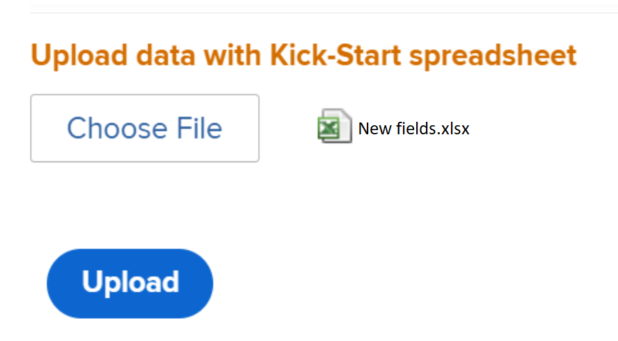

# 킥시작 시나리오: Workfront에 여러 옵션 사용자 지정 필드 가져오기

Adobe Workfront에서 킥시작 기능을 사용하여 여러 옵션이 있는 사용자 지정 필드를 가져올 수 있습니다.

여러 옵션이 있는 사용자 지정 필드의 예는 다음과 같습니다.

* 다중 선택 드롭다운
* 드롭다운
* 확인란
* 라디오 버튼

이러한 필드에는 때로 수백 개의 선택 사항이 있을 수 있습니다. 킥시작 기능을 사용하여 가져오면 Workfront 관리자로서 많은 시간을 절약할 수 있고 오류가 발생하지 않도록 할 수 있습니다.

>[!IMPORTANT]
>
>킥스타트를 사용하여 여러 선택 사항이 있는 사용자 지정 필드를 가져오려면 아래 섹션에 설명된 단계를 따라야 합니다.
>
>1. Workfront에서 기존 사용자 지정 데이터 내보내기(옵션 단계)
>1. 사용자 지정 데이터에 대해 킥시작 템플릿 내보내기
>1. Excel Kick-Starts 스프레드시트 채우기
>1. Excel 스프레드시트를 Workfront에 업로드

## Workfront에서 기존 사용자 지정 데이터 내보내기(옵션 단계)

Workfront 데이터베이스 구조에 익숙하지 않거나 Workfront에서 정보를 가져오는 데 필요한 킥시작 파일에 익숙하지 않은 경우, 가져오려는 필드와 유사한 기존 정보로 먼저 Workfront에서 킥시작 파일을 내보내는 것이 좋습니다.

예를 들어 사용자 지정 양식 또는 사용자 지정 필드를 가져오려면 먼저 기존 사용자 지정 데이터로 킥시작 파일을 내보내야 합니다.

기존 데이터를 내보내면 먼저 데이터를 스캔하고 새 데이터의 형식을 지정해야 하는 방법을 확인할 수 있습니다.

Workfront 데이터베이스 개체 및 구조를 잘 알고 있는 경우 아래 섹션을 계속 진행할 수 있습니다.

Workfront에서 기존 데이터를 내보내려면

1. 클릭 **기본 메뉴 > 설정** Workfront 인터페이스의 오른쪽 상단 모서리에서 을(를) 클릭합니다.
1. 를 확장합니다. **시스템** 메뉴를 왼쪽에 두고 **데이터 내보내기(시작)**.

   

1. 선택 **사용자 지정 데이터** 에서 **포함할 내용** 섹션을 참조하십시오.

   

1. 선택 **.xlsx 파일** 에서 **다운로드 형식** 섹션을 참조하십시오.

   >[!TIP]
   >
   >    시스템에 있는 사용자 지정 데이터의 양에 따라 시간이 오래 걸릴 수 있습니다.

   

1. 클릭 **다운로드**. .xlsx 파일이 컴퓨터에 다운로드됩니다. 로 이동하여 엽니다.

   

1. 다운로드한 파일을 살펴보고 다음 세부 사항을 기록합니다.

   * 이 파일에는 여러 개의 시트가 포함되어 있습니다. 모든 시트에 있는 정보를 알 필요는 없지만 일부 시트를 사용하여 정보를 가져옵니다. 시간을 내어 각 시트의 내용 및 특히 컨텐츠 형식에 대해 숙지하십시오.
   * 열 이름과 각 열의 데이터가 표시되는 형식에 특별히 주의하십시오.
   * 시트의 이름이나 열 순서를 변경할 수 없습니다. 열 헤더는 각 행에 정보를 입력해야 하는 필드를 나타냅니다. 열 머리글이 굵게 표시되는 경우 필수 필드이므로 해당 열에 정보가 있어야 합니다.
   >[!IMPORTANT]
   >
   >일부 열 헤더는 굵게 표시되지 않을 수 있지만 여전히 필요할 수 있습니다.

   * 나중에 참조할 수 있도록 다운로드한 파일을 보관하고 다음 섹션을 계속 진행합니다.

## 사용자 지정 데이터에 대해 킥시작 템플릿 내보내기

시스템의 기존 사용자 지정 필드에 대한 정보를 스캔한 후 가져오기에 사용할 새 킥시작 템플릿을 다운로드할 수 있습니다.

1. 클릭 **기본 메뉴 > 설정** Workfront 인터페이스의 오른쪽 상단 모서리에서 을(를) 클릭합니다.

1. 를 확장합니다. **시스템** 메뉴 왼쪽에 있습니다.

1. 클릭 **데이터 가져오기(시작)**.

   

1. 에서 **빈 킥스타트 스프레드시트 다운로드** 영역, 선택 **사용자 지정 데이터** 확인란을 선택하고 **다운로드**.

   

   빈 킥시작 파일이 컴퓨터에 다운로드됩니다.

   >[!NOTE]
   >
   >파일의 시트 수, 시트 이름, 각 시트의 열 수 및 이름은 기존 사용자 지정 데이터가 포함된 위의 섹션에서 다운로드한 킥스타트의 시트 수와 동일해야 합니다.

## Excel Kick-Starts 스프레드시트 채우기

Excel 스프레드시트를 채우려면 위의 섹션에 설명된 대로 킥시작 템플릿을 다운로드합니다.

>[!IMPORTANT]
>
>임시 Excel 스프레드시트를 사용하여 정보를 가져오려고 하지 마십시오. 킥시작 기능을 사용하여 Workfront으로 정보를 가져오는 모든 스프레드시트는 Workfront에서 다운로드하여 이 문서에 설명된 파일의 내용과 일치해야 합니다.

새 사용자 지정 필드에 대한 정보로 Excel 스프레드시트를 채우려면:

1. 이전 섹션에서 다운로드한 Excel 스프레드시트를 열고 많은 시트를 확인합니다. 각 시트는 응용 프로그램의 개체를 나타냅니다.

   >[!INFO]
   >
   >예, **매개 변수** (사용자 지정 필드를 참조하는), **매개 변수 옵션**(사용자 지정 필드 옵션을 참조함), **카테고리** (사용자 지정 양식을 나타냅니다.)
   >
   >개체 이름과 특성을 Workfront 데이터베이스에서 지원하는 형식으로 작성해야 합니다.
   >
   >이러한 객체의 의미에 대한 자세한 내용은 [Workfront 용어](../../../workfront-basics/navigate-workfront/workfront-navigation/workfront-terminology-glossary.md).
   >
   >Workfront 데이터베이스의 개체 이름에 대한 자세한 내용은 [API 탐색기](../../../wf-api/general/api-explorer.md).
   >
   >

1. 다음 정보의 형식이 올바르게 지정되었는지 확인합니다.

   * 모든 시트의 첫 번째 행은 비어 있어야 합니다. 그렇지 않으면 가져오기에 오류가 발생합니다.
   * 각 시트의 열 헤더는 가져오기 중에 설정할 수 있는 객체의 속성을 나타냅니다. 모든 열 헤더는 시트를 내보낼 때 찾을 수 있는 동일한 순서로 유지되어야 하며 이름을 변경할 수 없습니다.
   * 굵게 표시된 열 헤더는 필수 필드이며 값이 있어야 합니다.

      >[!TIP]
      >
      >일부 열은 굵게 표시되지 않지만 필수입니다. 예: `isNew` 및 `ID` 열은 굵게 표시되지 않지만 필수 필드입니다.

1. 을(를) 선택합니다 `**PARAM Parameter`** 시트 및 다음 필수 열에 새 사용자 정의 필드에 대한 정보를 추가합니다.

   * **`isNew`** = 입력 **`TRUE`** 새 사용자 지정 필드를 나타내는 모든 행에 대해 이 열에서 다음을 수행합니다. 이것은 필드가 Workfront에 존재하지 않고 새로운 것임을 나타냅니다.

      >[!TIP]
      >
      >    라인이 Workfront에 이미 있는 기존 필드를 나타내는 경우 **`isNew`** = **`FALSE`**.

   * **`ID`** = 새 필드를 나타내는 각 행에 대해 고유한 숫자여야 합니다. 각 새 필드에 고유한 숫자가 있는 한 1부터 시작하는 숫자를 사용할 수 있습니다.
   * **`setDataType`** = 새 필드를 나타내는 각 행에 대해 필드가 지원하는 데이터 유형을 입력합니다. 데이터 유형은 데이터베이스에 표시되는 대로 입력해야 합니다. 다음 데이터 유형 중에서 선택합니다.
      * **`NMBR`** 번호
      * **`CURC`** 통화
      * **`TEXT`** 텍스트
   * `**setDisplaySize**`= 표시 크기(&#39;**setDisplaySize**&#39;) 여러 옵션 사용자 지정 필드의 경우 항상 0입니다.
   * **`setDisplayType`** = 새 필드를 나타내는 각 행에 대해 필드의 표시 유형을 입력합니다. 데이터베이스에 표시되는 표시 유형을 입력해야 합니다.

      다중 옵션 사용자 지정 필드의 경우 다음 옵션 중에서 선택합니다.

      * **`MULT`** 다중 선택 드롭다운용
      * **`SLCT`** 드롭다운
      * **`RDIO`** 라디오 단추용
      * **`CHCK`** 확인란
      >[!TIP]
      >
      >데이터 유형 및 표시 유형 정보를 찾으려면 [API 탐색기](../../../wf-api/general/api-explorer.md)를 확장합니다. **매개 변수** 개체를 검색하고 **필드** 탭.

   * **`setName`** = Workfront에 표시할 사용자 지정 필드의 이름을 입력합니다.

      >[!INFO]
      >
      >예를 들어, _브랜드_, 확인란 필드 및 _미디어_: 라디오 단추 필드입니다.

   * 다음 **`setName`** 그리고 **`setValue`** 열에는 일반적으로 동일한 정보가 포함되며 새 필드의 Workfront 인터페이스에서 원하는 이름을 반영해야 합니다.
   필드의 값은 보고서에 표시되는 이름이고, 이 이름은 객체에 첨부된 사용자 지정 양식에 표시됩니다.

   자세한 내용은 [사용자 지정 양식에 사용자 지정 필드 추가](../../../administration-and-setup/customize-workfront/create-manage-custom-forms/add-a-custom-field-to-a-custom-form.md).

   

1. 을(를) 선택합니다 **`POPT Parameter Options`** 시트 및 다음 필수 열에 각 사용자 지정 필드의 옵션에 대한 정보를 추가합니다.

   * **`isNew`** = 입력 **`TRUE`** 새 필드 옵션을 나타내는 모든 행에 대해 이 열에서 다음을 수행합니다.

      >[!TIP]
      >
      >    라인이 기존 옵션을 나타내는 경우 **`isNew`** = **`FALSE`**.

   * **`ID`** = 새 옵션을 나타내는 각 행에 대해 고유한 숫자여야 합니다. 각 새 옵션에 고유한 숫자가 있는 한 1부터 시작하는 숫자를 사용할 수 있습니다.
   * **`setIsDefault`** = 입력 `TRUE` 기본적으로 표시할 옵션에 대해 및 `FALSE` 다른 모든 옵션에 대해 를 참조하십시오.  예를 들어 _나이키_ 에 대한 기본 옵션이 됩니다. _브랜드_ 및 _인쇄_ 에 대한 기본 옵션이 됩니다. _미디어_.

      >[!TIP]
      >
      >각 필드에 대해 하나의 기본 옵션만 사용할 수 있습니다.

   * **`setParameterID`** = _브랜드_ 사용자 지정 필드에 **`setParameterID`** 1의 옵션 및 _미디어_ **`setParameterID`**. 다음 `PARAM` 및 `POPT` 시트는 상호 참조(cross-reference)하여 사용자 정의 필드에 속하는 옵션을 나타냅니다.
   * **`setDisplayOrder`**= 표시 순서 열은 사용자 지정 필드에 옵션이 표시되는 순서를 나타냅니다. 1로 시작하고 해당 필드가 속한 필드에 관계없이 모든 옵션에 대해 오름차순으로 계속할 수 있습니다. 여기서 중요한 것은 각 선택 사항에 대해 고유한 숫자를 갖는 것입니다.
   * 다음 **`setLabel`** 그리고 `**setValue`** 열에는 일반적으로 동일한 정보가 포함되며 Workfront UI에서 원하는 이름을 반영해야 합니다. 옵션 값은 보고서에 표시되는 이름이며, 예를 들어 레이블이 객체에 첨부된 경우 사용자 지정 양식에 표시됩니다. 자세한 내용은 [사용자 지정 양식에 사용자 지정 필드 추가](../../../administration-and-setup/customize-workfront/create-manage-custom-forms/add-a-custom-field-to-a-custom-form.md).
   * **`setIsHidden`** = 입력 `TRUE` 옵션을 숨기려면
   

1. (선택 사항) 나중에 새 필드를 추가할 수 있는 사용자 지정 양식도 만들려면  **`CTGY Category`** 시트 및 사용자 지정 양식 정보에 대해 다음 필수 열을 업데이트합니다.

   * **`isNew`** = 입력 **`TRUE`** 새 사용자 지정 양식을 나타내는 모든 행에 대해 이 열에서 다음을 수행합니다.
   * **`ID`** = 새 양식을 나타내는 각 행에 대해 고유한 번호를 입력합니다. 각 새 옵션이나 줄에 고유한 숫자가 있는 한 1부터 시작하는 숫자를 사용할 수 있습니다.
   * **`setGroupID`** = 홈 그룹의 그룹 ID 또는 이 양식에 액세스할 구성원이 있는 시스템의 다른 그룹을 추가합니다. 필수 필드입니다.
   를 찾으려면 `ID` 그룹 중에서 그룹 보고서를 작성하고 `ID` 필드의 URL을 보거나 그룹으로 이동합니다. 그룹 ID는 그룹 페이지의 URL에 있습니다. 예를 들어 그룹의 URL이 `https://companyName.my.workfront.com/group/575b000800467a6f66e747932c807464/members`를 입력하면 그룹 ID는 `575b000800467a6f66e747932c807464`.

   * **`setCatObjCode` **= 양식을 만들 개체 유형의 개체 코드입니다. 다음 옵션에서 코드를 입력합니다.
      * **`CMPY`** 회사
      * **`TASK`** 작업
      * **`PROJ`** 프로젝트
      * **`PORT`** Portfolio
      * **`PRGM`** 프로그램
      * **`USER`** 사용자
      * **`DOCU`** 문서
      * **`OPTASK`** 문제
      * **`EXPNS`** 비용
      * **`ITRN`** 반복
      * **`BILL`** 청구 레코드
      * **`GROUP`** 그룹
      >[!NOTE]
      >
      >다중 개체 양식의 경우 UI에서 양식을 만들 때 선택할 첫 번째 개체를 입력합니다. 예를 들어 `setCatObjCode` to `TASK`, Workfront 인터페이스에서 작업 을 선택한 다음, 문제, Portfolio 등을 선택하지만 양식을 Projects에서 사용할 수 있도록 하지 않으려는 경우.

   * **`setName`** = Workfront 인터페이스에 표시할 사용자 지정 양식의 이름입니다.

      

1. 스프레드시트를 컴퓨터에 .xls 또는 .xlsx 파일로 저장합니다. Excel 스프레드시트가 가득 차서 이제 Workfront으로 가져올 준비가 되었습니다.

## Excel 스프레드시트를 Workfront에 업로드

이전 섹션에 설명된 단계를 수행한 후 다음을 계속 수행하여 새 필드와 양식을 Workfront에 업로드합니다.

1. 클릭 **데이터 가져오기** **(Kick-Starts) ** **기본 메뉴 > 설정 > 시스템** 메뉴 아래의 제품에서 사용할 수 있습니다.

1. 클릭 **파일 선택** 섹션 아래 **Kick-Start 스프레드시트를 사용하여 데이터 업로드**.

1. 컴퓨터에서 준비한 Excel 스프레드시트를 찾아 찾으면 선택합니다.  Workfront에서 파일을 인식하면 업로드 단추가 파란색으로 바뀝니다.
1. 클릭 **업로드.**

   

1. 가져오기에 성공했다는 알림이 표시됩니다. 가져오는 정보에 따라 이 단계는 몇 초~1분 정도 걸릴 수 있습니다.

   

   이제 새로운 사용자 지정 필드 및 양식이 Workfront 시스템에 있습니다. 설정의 사용자 지정 Forms 영역에서 찾을 수 있습니다.

   >[!NOTE]
   >
   >가져온 새 양식과 필드가 아직 연결되지 않았습니다. 사용자 지정 필드가 없는 양식을 가져옵니다. 필드를 새 사용자 지정 양식 또는 다른 기존 사용자 지정 양식에 수동으로 추가해야 합니다.

   사용자 지정 양식에 필드를 추가하는 방법에 대한 내용은 [사용자 지정 양식에 사용자 지정 필드 추가](../../../administration-and-setup/customize-workfront/create-manage-custom-forms/add-a-custom-field-to-a-custom-form.md).

1. (조건부) 가져오기가 실패하면 문제가 있는 오류 메시지가 표시됩니다. 문제가 발생한 필드, 시트 및 행 번호를 확인하고 Excel 파일의 정보를 수정한 다음 파일을 한 번 더 가져오십시오.

   

1. (조건부) 문제 내용에 따라 오류 메시지에 설명된 대로 일부 정보를 이미 가져올 수 있습니다. 시트를 다시 가져오려면 다음 중 하나를 수행해야 합니다.

   * 사용자 지정 Forms 영역에서 Workfront에서 성공적으로 가져온 정보를 삭제한 다음 오류 메시지에서 오류를 수정합니다.
   * 필드 또는 양식이 이미 가져온 필드 또는 양식에 대해 시스템에 이미 있음을 표시한 다음 수정합니다.
필드 또는 사용자 지정 양식이 이미 Workfront에 있음을 나타내려면 `inNew` 필드가 `FALSE` 양식에 대한 정보가 들어 있는 시트(`CTGY`) 또는 필드(`PARAM`)을 클릭하여 제품에서 사용할 수 있습니다.
