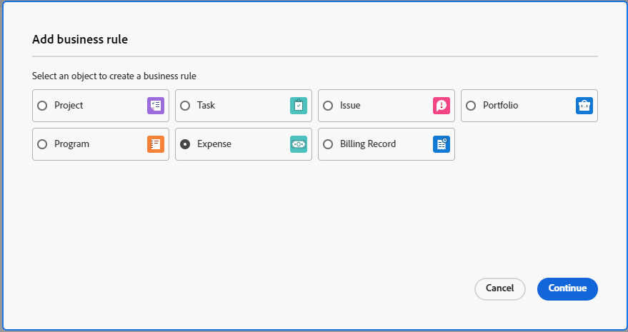

# 비즈니스 규칙 만들기 및 편집

{{preview-fast-release-general}}

비즈니스 규칙을 사용하면 Workfront 객체에 검증을 적용하고 특정 조건이 충족될 때 사용자가 객체를 생성, 편집 또는 삭제하지 못하도록 할 수 있습니다. 비즈니스 규칙을 사용하면 데이터 무결성을 손상시킬 수 있는 작업을 방지하여 데이터 품질과 운영 효율성을 향상시킬 수 있습니다.

단일 비즈니스 규칙은 하나의 객체에만 할당할 수 있습니다. 예를 들어 특정 조건에서 프로젝트를 편집하지 않는 비즈니스 규칙을 만드는 경우 동일한 규칙을 작업에 적용할 수 없습니다. 작업에 대해 동일한 조건으로 별도의 비즈니스 규칙을 만들어야 합니다.

사용자가 오브젝트와 상호 작용할 때 액세스 수준 및 오브젝트 공유는 비즈니스 규칙보다 우선 순위가 높습니다. 예를 들어, 사용자에게 프로젝트 편집을 허용하지 않는 액세스 수준 또는 권한이 있는 경우, 이러한 권한은 특정 조건에서 프로젝트 편집을 허용하는 비즈니스 규칙보다 우선합니다.

객체에 둘 이상의 비즈니스 규칙이 적용되면 모든 규칙이 준수되지만 특정 순서로 적용되지 않습니다. 예를 들어 두 가지 비즈니스 규칙이 있습니다. 하나는 2월의 경비 만들기를 제한합니다. 두 번째는 프로젝트 상태가 완료일 때 프로젝트를 편집할 수 없도록 합니다. 사용자가 6월에 완료된 프로젝트에 경비를 추가하려고 하면 두 번째 규칙을 트리거했기 때문에 경비를 추가할 수 없습니다.

비즈니스 규칙은 API와 Workfront 인터페이스를 통해 개체를 만들고, 편집하고, 삭제하는 데 적용됩니다.

>[!NOTE]
>
>비즈니스 규칙은 특정 작업을 차단하므로 항상 샌드박스 또는 미리보기 환경에서 비즈니스 규칙을 먼저 구성하고 철저하게 테스트한 후 프로덕션에서 활성화해야 합니다.

## 액세스 요구 사항

+++ 을 확장하여 이 문서의 기능에 대한 액세스 요구 사항을 봅니다.

이 문서의 단계를 수행하려면 다음이 있어야 합니다.

<table style="table-layout:auto"> 
 <col> 
 <col> 
 <tbody> 
  <tr> 
   <td>Adobe Workfront 플랜</td> 
   <td>Ultimate</td> 
  </tr> 
  <tr> 
   <td>Adobe Workfront 라이선스</td> 
   <td>표준</td> 
  </tr> 
  <tr> 
   <td>액세스 수준 구성</td> 
   <td>시스템 관리자</td> 
  </tr>  
 </tbody> 
</table>

이 표의 정보에 대한 자세한 내용은 [Workfront 설명서의 액세스 요구 사항](/help/quicksilver/administration-and-setup/add-users/access-levels-and-object-permissions/access-level-requirements-in-documentation.md)을 참조하십시오.

+++

## 비즈니스 규칙 시나리오

비즈니스 규칙의 형식은 &quot;정의된 조건이 충족되는 경우 사용자가 오브젝트에 대한 작업을 수행할 수 없게 되며 메시지가 표시됩니다.&quot;입니다.

비즈니스 규칙의 속성 및 기타 함수 구문은 사용자 정의 양식의 계산된 필드 구문과 동일합니다. 구문에 대한 자세한 내용은 [양식 디자이너를 사용하여 계산된 필드 추가](/help/quicksilver/administration-and-setup/customize-workfront/create-manage-custom-forms/form-designer/design-a-form/add-a-calculated-field.md)를 참조하십시오.

IF 문에 대한 자세한 내용은 계산된 사용자 지정 필드의 [&quot;IF&quot; 문 개요](/help/quicksilver/reports-and-dashboards/reports/calc-cstm-data-reports/if-statements-overview.md) 및 [조건 연산자](/help/quicksilver/reports-and-dashboards/reports/calc-cstm-data-reports/condition-operators-calculated-custom-expressions.md)를 참조하십시오.

사용자 기반 와일드카드에 대한 자세한 내용은 [사용자 기반 와일드카드를 사용하여 보고서 일반화](/help/quicksilver/reports-and-dashboards/reports/reporting-elements/use-user-based-wildcards-generalize-reports.md)를 참조하십시오.

날짜 기반 와일드카드에 대한 자세한 내용은 [날짜 기반 와일드카드를 사용하여 보고서 일반화](/help/quicksilver/reports-and-dashboards/reports/reporting-elements/use-date-based-wildcards-generalize-reports.md)를 참조하십시오.

API 와일드카드는 비즈니스 규칙에서도 사용할 수 있습니다. `$$ISAPI`을(를) 사용하여 UI에서만 또는 API에서만 규칙을 트리거할 수 있습니다.

`$$BEFORE_STATE` 및 `$$AFTER_STATE` 와일드카드는 편집 전후에 개체의 필드 값에 액세스하는 데 표현식에 사용됩니다.

* 이러한 와일드카드는 모두 편집 트리거에 사용할 수 있습니다. 편집 트리거의 기본 상태(식에 상태가 포함되지 않은 경우)는 `$$AFTER_STATE`입니다.
* before 상태가 존재하지 않으므로 개체 만들기 트리거에서 `$$AFTER_STATE`만 허용합니다.
* after 상태가 존재하지 않으므로 개체 삭제 트리거에서는 `$$BEFORE_STATE`만 허용합니다.

몇 가지 간단한 비즈니스 규칙 시나리오는 다음과 같습니다.

* 2월 마지막 주 중에는 새 경비를 추가할 수 없습니다. 이 수식은 다음과 같이 지정할 수 있습니다. `IF(MONTH($$TODAY) = 2 && DAYOFMONTH($$TODAY) >= 22, "You cannot add new expenses during the last week of February.")`
* 완료 상태인 프로젝트의 프로젝트 이름은 편집할 수 없습니다. 이 수식은 다음과 같이 지정할 수 있습니다. `IF({status} = "CPL" && {name} != $$BEFORE_STATE.{name}, "You cannot edit the project name.")`

중첩된 IF 문이 있는 시나리오는 다음과 같습니다.

사용자는 완료된 프로젝트를 편집할 수 없으며 3월에 계획된 완료 일자가 있는 프로젝트를 편집할 수 없습니다. 이 공식은 다음과 같이 명시될 수 있습니다.

```
IF(
    $$AFTER_STATE.{status}="CPL",
    "You cannot edit a completed project",
    IF(
        MONTH({plannedCompletionDate})=3,
        "You cannot edit a project with a planned completion date in March")
)
```

## 새 비즈니스 규칙 추가

{{step-1-to-setup}}

1. 왼쪽 패널에서 **비즈니스 규칙**&#x200B;을 클릭합니다.
1. **새 비즈니스 규칙**&#x200B;을 클릭합니다.
1. 비즈니스 규칙을 할당할 개체 유형을 선택한 다음 **계속**&#x200B;을 클릭합니다.

   

1. 비즈니스 규칙의 **이름**&#x200B;을(를) 입력하십시오.
1. **활성 상태임** 필드에서 규칙을 저장할 때 규칙을 활성화해야 하는지 여부를 선택합니다.

   **아니요**&#x200B;를 선택하면 규칙이 비활성 상태로 저장되며 나중에 활성화할 수 있습니다.

1. 비즈니스 규칙에 대한 **트리거**&#x200B;를 선택하십시오. 옵션은 다음과 같습니다.

   * **개체를 만들 때:** 사용자가 개체를 만들려고 할 때 규칙이 적용됩니다.
   * **개체 편집 시:** 사용자가 개체를 편집하려고 하면 규칙이 적용됩니다.
   * **개체 삭제 시:** 사용자가 개체를 삭제하려고 할 때 규칙이 적용됩니다.

1. (선택 사항) 비즈니스 규칙의 **설명**&#x200B;과(와) 비즈니스 규칙을 적용할 때 수행할 작업을 입력합니다.
1. 비즈니스 규칙 대화 상자의 중앙에 있는 공식 편집기에서 공식을 작성합니다.

   비즈니스 규칙의 형식은 &quot;정의된 조건이 충족되는 경우 사용자가 오브젝트에 대한 작업을 수행할 수 없게 되며 메시지가 표시됩니다.&quot;입니다.

   공식 영역에서 작성하는 비즈니스 규칙의 일부는 조건이며, 조건이 충족될 때 Workfront에 표시되는 메시지입니다.

   * &quot;객체&quot;는 비즈니스 규칙을 생성할 때 선택한 객체 유형입니다. 대화 상자의 머리글에 표시됩니다.
   * &quot;작업&quot;은 규칙에 대해 선택한 트리거입니다(객체 만들기, 편집 또는 삭제).
   * 개체와 작업이 이미 정의되어 있으므로 수식에 포함하지 않습니다.
   * 사용자 지정 오류 메시지는 비즈니스 규칙을 트리거할 때 사용자에게 표시됩니다. 무엇이 잘못되었는지, 어떻게 문제를 수정해야 하는지에 대한 명확한 지침을 제공해야 한다.

     <span class="preview">오류 메시지에 정적 URL을 포함하여 문서 또는 기타 유용한 페이지에 연결하여 규칙 제한 내에서 사용자가 작업을 수정하는 방법을 안내할 수 있습니다.</span>

     <span class="preview">이 예제에서는 &quot;자세히 알아보기&quot;가 URL에 연결됩니다. `"You are not allowed to add a new project in November.[Learn more](http://url)"` URL은 괄호로 묶어야 하지만 대괄호로 묶인 링크 텍스트는 필요하지 않습니다. 전체 URL을 표시할 수 있으며 클릭할 수 있는 링크가 됩니다.</span>

   

   이 예제는 프로젝트에 대한 비즈니스 규칙입니다. 현재 월이 11월인 경우 사용자는 새 프로젝트를 만들 수 없으며 이 메시지가 표시됩니다.

   비즈니스 규칙의 자세한 예는 이 문서에서 [비즈니스 규칙에 대한 시나리오](#scenarios-for-business-rules)를 참조하십시오.

1. (선택 사항) 규칙 작성을 지원하려면 오른쪽 패널의 **식** 및 **필드** 수식을 사용합니다.

   사용 가능한 항목 목록의 범위를 좁히려면 표현식 또는 필드를 검색합니다.

   사용 가능한 필드 목록은 비즈니스 규칙의 개체 유형과 관련된 필드로 제한됩니다.

1. 비즈니스 규칙 작성을 마치면 **저장**&#x200B;을 클릭합니다.

>[!NOTE]
>
>비즈니스 규칙을 추가한 후에는 연결된 개체를 추가, 편집 또는 삭제하여 비즈니스 규칙을 테스트하여 규칙이 제대로 적용되었는지 확인해야 합니다.

## 비즈니스 규칙 활성화

비즈니스 규칙이 비활성 상태이면 비즈니스 규칙 목록의 활성 상태 필드에 False가 표시됩니다. 목록 보기에서 규칙의 상태를 업데이트할 수 없습니다.

비즈니스 규칙을 활성화하려면 다음을 수행합니다.

1. 규칙 목록에서 비즈니스 규칙을 선택하고 편집 아이콘을 클릭합니다.
1. 비즈니스 규칙 대화 상자에서 **활성 상태임**&#x200B;에 대해 **예**&#x200B;를 선택합니다.
1. **저장**&#x200B;을 클릭합니다.
