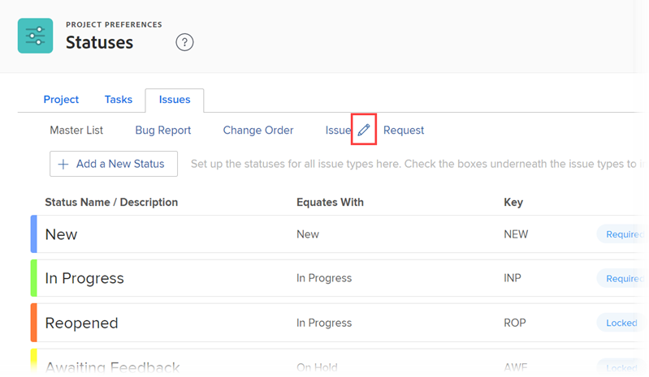

# 요청 유형 구성

프로젝트를 작업하는 동안 예기치 않은 이벤트가 발생할 수 있습니다. 이러한 예기치 않은 이벤트를 특정 프로젝트 또는 작업에 대한 문제로 기록할 수 있습니다. 요청 대기열로 지정된 프로젝트의 문제로 기록되는 요청을 제출할 수도 있습니다. 문제 및 요청은 Adobe Workfront에서 상호 교환 가능한 것으로 간주됩니다.

[!DNL Workfront]에서 문제를 만드는 방법에 대한 자세한 내용은 [문제 만들기](../../../manage-work/issues/manage-issues/create-issues.md)를 참조하십시오. [!DNL Workfront]에서 요청을 만드는 방법에 대한 자세한 내용은 [만들기 및 제출 [!DNL Adobe Workfront] 요청](../../../manage-work/requests/create-requests/create-submit-requests.md)을 참조하세요. 요청 유형을 프로젝트와 연결하는 방법에 대한 자세한 내용은 [프로젝트에 대한 요청 유형 정의](../../../manage-work/requests/create-and-manage-request-queues/define-request-types-for-project.md)를 참조하십시오.

## 액세스 요구 사항

+++ 을 확장하여 이 문서의 기능에 대한 액세스 요구 사항을 봅니다.

이 문서의 단계를 수행하려면 다음 액세스 권한이 있어야 합니다.

<table style="table-layout:auto"> 
 <col> 
 <col> 
 <tbody> 
  <tr> 
   <td role="rowheader">[!DNL Adobe Workfront] 플랜</td> 
   <td>임의</td> 
  </tr> 
  <tr> 
   <td role="rowheader">[!DNL Adobe Workfront] 라이센스</td> 
   <td>
새로운 기능: [!UICONTROL Standard]

   또는
   
현재: [!UICONTROL Plan]

   </td> 
  </tr>
  <tr> 
   <td role="rowheader">액세스 수준 구성</td> 
   <td>[!UICONTROL 시스템 관리자]</td>
  </tr> 
 </tbody> 
</table>

이 표의 정보에 대한 자세한 내용은 [Workfront 설명서의 액세스 요구 사항](/help/quicksilver/administration-and-setup/add-users/access-levels-and-object-permissions/access-level-requirements-in-documentation.md)을 참조하십시오.

+++

<!--
THIS IS DRAFTED IN FLARE
<h2>Set what issue or request types are allowed for a project</h2>

You can organize the kind of issues or requests that are logged in Workfront by Request Types. This organization is useful for reporting reasons and for helping users understand what kind of unexpected work might occur during the lifetime of a project.

You can specify the type of requests that can be logged on a project when you configure the <strong>Queue Details</strong> area for the project. 

<ol>
<li value="1"> 
 Click <strong>Projects</strong> in the Main Menu.  
 </li>
<li value="2">Click the name of the project to open it.</li>
<li value="3"> In the left panel, click <strong>Queue Details</strong>. </li>
<li value="4"> 
In the <strong>Queue Properties</strong> section, select the <strong>Request Types</strong> you want for the project.
 <note type="note">
You must have at least one request type selected. You can select multiple request types.
</note> </li>
<li value="5"> 
Click <strong>Save</strong>.
 
The request types you specified will be available to select when you enter a new issue on a task or a project, or when you submit a new request to the project.
 </li>
</ol>

-->

## 요청 유형 이름 사용자 지정

[!DNL Workfront] 관리자는 시스템에서 요청 유형의 이름을 구성할 수 있습니다. **[!UICONTROL 문제 유형]** 또는 **[!UICONTROL 요청 유형]** 필드가 표시되는 [!DNL Workfront] 영역에 새 이름이 표시됩니다.

* 문제 또는 요청을 수신할 프로젝트의 **[!UICONTROL 큐 세부 정보]** 영역에 있습니다.
* 새 문제를 만들거나 새 요청을 제출할 때 **[!UICONTROL 문제 유형]** 필드의 **[!UICONTROL 새 문제] 양식**&#x200B;에서 요청 큐에 대해 요청 유형을 두 개 이상 선택합니다.

  [!DNL Workfront]에서 문제를 만드는 방법에 대한 자세한 내용은 [문제 만들기](../../../manage-work/issues/manage-issues/create-issues.md)를 참조하십시오.

  [!DNL Workfront]에서 요청을 만드는 방법에 대한 자세한 내용은 [만들기 및 제출 [!DNL Adobe Workfront] 요청](../../../manage-work/requests/create-requests/create-submit-requests.md)을 참조하세요.

* **[!UICONTROL 대기열 주제 세부 정보]** 양식에서 대기열 주제를 구성할 때.\
   대기열 주제 만들기에 대한 자세한 내용은 [대기열 주제 만들기](../../../manage-work/requests/create-and-manage-request-queues/create-queue-topics.md)를 참조하십시오.

요청 유형의 이름을 사용자 정의하려면 다음을 수행합니다.

{{step-1-to-setup}}

1. **[!UICONTROL 프로젝트 환경 설정]** > **[!UICONTROL 상태]**&#x200B;를 클릭합니다.

1. **[!UICONTROL 문제]** 탭을 클릭합니다.
1. **[!UICONTROL 문제]** 탭의 맨 위에서 요청 유형의 이름을 마우스로 가리킨 다음 표시되는 **[!UICONTROL 편집]** 아이콘을 클릭합니다.

   

1. 표시되는 상자에 새 이름을 입력한 다음 **[!UICONTROL Enter]**&#x200B;를 누릅니다.

## 다양한 요청 유형 내에서 문제 상태 구성

각 요청 유형을 다양한 문제 상태와 연결할 수 있습니다. 문제의 유형에 따라 문제에 대한 상태 표시 순서를 변경할 수도 있습니다.

문제 상태의 기본 순서 변경 및 문제 상태 구성에 대한 자세한 내용은 [상태 만들기 또는 편집](../../../administration-and-setup/customize-workfront/creating-custom-status-and-priority-labels/create-or-edit-a-status.md)의 [상태 만들기 또는 편집](../../../administration-and-setup/customize-workfront/creating-custom-status-and-priority-labels/create-or-edit-a-status.md) 섹션을 참조하십시오.
