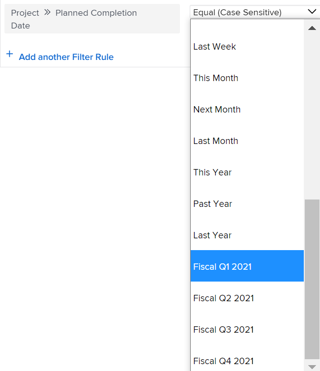

# 프로젝트에 대한 사용자 지정 분기 활성화

보고를 위해, 조직의 분기가 달력 날짜(예: 비즈니스 일 또는 쇼핑 일)가 아닌 특정 기준을 기반으로 하는 경우 사용자 지정 분기를 만들 수 있습니다.

에 대해 최대 8개의 사용자 지정 분기를 구성할 수 있습니다 [!DNL Adobe Workfront] 시스템.

## 액세스 요구 사항

이 문서의 절차를 수행하려면 다음 액세스 권한이 있어야 합니다.

<table style="table-layout:auto"> 
 <col> 
 <col> 
 <tbody> 
  <tr> 
   <td role="rowheader">[!DNL Adobe Workfront] 플랜</td> 
   <td>모든</td> 
  </tr> 
  <tr> 
   <td role="rowheader">[!DNL Adobe Workfront] 라이선스</td> 
   <td>[!UICONTROL 계획]</td> 
  </tr> 
  <tr> 
   <td role="rowheader">액세스 수준 구성</td> 
   <td> 
넌 [!DNL Workfront] 관리자
 
<b>참고</b>: 여전히 액세스할 수 없는 경우 [!DNL Workfront] 관리자가 액세스 수준에서 추가 제한을 설정한 경우 자세한 내용은 [!DNL Workfront] 관리자는 액세스 수준을 수정할 수 있습니다. <a href="../../../administration-and-setup/add-users/configure-and-grant-access/create-modify-access-levels.md" class="MCXref xref">사용자 정의 액세스 수준 만들기 또는 수정</a>.
 </td> 
  </tr> 
 </tbody> 
</table>

## 에 대한 사용자 지정 분기 설정 [!DNL Workfront] 시스템

1. 을(를) 클릭합니다. **[!UICONTROL 기본 메뉴]** 아이콘  의 오른쪽 위 모서리에서 [!DNL Adobe Workfront]를 클릭한 다음 **[!UICONTROL 설정]** .

1. 클릭 **[!UICONTROL 프로젝트 환경 설정]** > **[!UICONTROL 프로젝트].**

1. 에서 **[!UICONTROL 타임라인]** 섹션, **[!UICONTROL 사용자 지정 분기 활성화]**.

1. 사용자 지정 분기(예: &quot;2021년 회계 분기&quot;)의 이름을 입력합니다.
1. 사용자 지정 분기에 대한 시작 및 종료 날짜를 선택합니다.

   

1. (선택 사항) **[!UICONTROL 사용자 지정 분기 추가]** 를 추가하여 시스템에 사용자 지정 분기를 추가합니다.
1. (선택 사항) 회계 분기를 참조하는 보고 요소를 만듭니다.

   **예:** 필터 만들기 [!UICONTROL 프로젝트] 목록 및 사용자 지정 분기를 참조하는 프로젝트의 계획 완료 일자를 포함합니다.

   

   &quot;이 분기&quot;, &quot;다음 분기&quot; 및 &quot;마지막 분기&quot;에 대한 참조가 사용자 지정 분기에 대한 새 참조로 대체됩니다.

   보고 요소에 대한 자세한 내용은 [보고 요소: 필터, 보기 및 그룹화](../../../reports-and-dashboards/reports/reporting-elements/reporting-elements-filters-views-groupings.md).

   필터 만들기에 대한 내용은 [에서 필터 만들기 또는 편집 [!DNL Adobe Workfront]](../../../reports-and-dashboards/reports/reporting-elements/create-filters.md).
