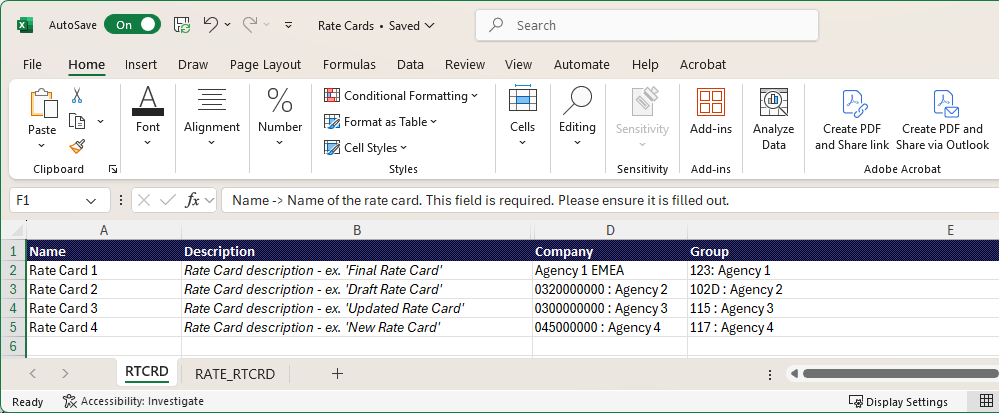

# 템플릿에서 비율 카드 가져오기

모든 작업 역할과 비율을 수동으로 추가하는 대신 템플릿 파일을 사용하여 비율 카드를 Excel에서 작성하고 Adobe Workfront으로 가져올 수 있습니다.

이 문서에 설명된 예제 속도 카드를 보려면 [샘플 파일](assets/rate-cards-sample.zip)을 다운로드하십시오.

## 템플릿 파일 작업에 대한 중요한 규칙

* Job 역할이나 비인적 자원 범주 중 하나만 입력합니다.
* RATE_RTCRD 탭의 비율 카드 시퀀스는 RTCRD 탭의 카드 순서와 일치해야 합니다(첫 번째는 1, 두 번째는 2 등).
* 시작 날짜 및 종료 날짜는 허용된 형식을 따라야 합니다.
* 등급 카드를 비율 없이 가져오고 나중에 업데이트할 수 있습니다.
* 사용자 지정 속성(에이전시, 비용 센터 등)은 다를 수 있습니다. 정확한 요구 사항은 시스템 관리자에게 문의하십시오.
* 템플릿에서 삭제된 행은 시스템의 기존 레코드를 삭제하지 않습니다.

## 액세스 요구 사항

+++ 을 확장하여 이 문서의 기능에 대한 액세스 요구 사항을 봅니다.

<table style="table-layout:auto"> 
 <col> 
 <col> 
 <tbody> 
  <tr> 
   <td>[!DNL Adobe Workfront] 패키지</td> 
   <td>임의</td> 
  </tr> 
  <tr> 
   <td>[!DNL Adobe Workfront] 라이센스</td> 
   <td>
[!UICONTROL Standard]

   
[!UICONTROL 계획]

   </td> 
  </tr> 
  <tr> 
   <td>액세스 수준 구성</td> 
   <td>[!UICONTROL 등급 카드]에 대한 액세스 편집</td> 
  </tr> 
 </tbody> 
</table>

자세한 내용은 [Workfront 설명서의 액세스 요구 사항](/help/quicksilver/administration-and-setup/add-users/access-levels-and-object-permissions/access-level-requirements-in-documentation.md)을 참조하십시오.

+++

## 템플릿 파일 작성

{{step-1-to-setup}}

1. 왼쪽 패널에서 [!UICONTROL **카드 평가**]&#x200B;를 클릭합니다.
1. **새 요금 카드**&#x200B;를 클릭한 다음 **Excel 템플릿 다운로드**&#x200B;를 클릭합니다.
1. 브라우저 프롬프트에 따라 템플릿 파일을 컴퓨터에 저장합니다.
1. Excel에서 템플릿 파일을 엽니다.

   >[!TIP]
   >
   > 빈 템플릿 파일을 유지하고 나중에 다시 사용하려면 파일을 새 이름으로 저장합니다.

   템플릿에는 두 개의 탭이 있습니다. 요금 카드를 성공적으로 가져오려면 두 탭에 올바른 정보가 있어야 합니다.

   * RTCRD: 비율 카드 정의(기본 정보)
   * RATE_RTCRD: 각 비율 카드와 연관된 상세 비율을 정의합니다.

### RTCRD(Rate Card Setup) 탭을 채웁니다.

이 탭에서 모든 등급 카드를 만들고 나열합니다. 각 행은 하나의 등급 카드를 나타냅니다.

속도 카드 가져오기 템플릿 파일의 

1. 각 행에서 비율 카드에 대한 정보를 입력합니다.

   * **이름**(필수): &quot;Global Billing 2025&quot;와 같은 요금 카드의 이름입니다.

     이 이름은 요금 카드의 기본 식별자입니다. 각 요금 카드의 이름은 고유해야 합니다.

   * **설명**(선택 사항): 요금 카드에 대한 자유 형식의 텍스트 설명입니다. 예를 들어 &quot;북미 프로젝트에 적용&quot;과 같이 목적, 범위 또는 유효성을 설명하는 데 사용합니다.
   * **회사**(선택 사항): 회사 이름 또는 회사 ID일 수 있습니다. 가져오기를 통해 둘 다 인식됩니다.

     예: Coffesta 또는 _68c0234e00000541dd8c0757723daa68_

   * **그룹**(선택 사항): 그룹 이름 또는 그룹 ID일 수 있습니다. 가져오기를 통해 둘 다 인식됩니다.

     예: Marketing 또는 _68c0234e00000541dd8c0757723daa68_

   * **사용자 지정 필드**(선택 사항): 환경에 특정 요구 사항이 있는 경우 사용자 지정 필드 이름으로 열을 추가할 수 있습니다.

   >[!NOTE]
   >
   >* 최소한 각 요금 카드의 이름을 입력해야 합니다.
   >* 각 비율 카드에는 행 위치에 따라 시퀀스 번호가 자동으로 부여됩니다. 예를 들어 정의하는 첫 번째 비율 카드(2행)는 시퀀스 1이고, 그 다음은 2입니다. 이러한 순번은 RATE_RTCRD 탭에서 비율을 첨부하는 데 사용됩니다.

### RATE_RTCRD(Rates Setup) 탭을 입력합니다.

이 탭에서 요금 카드에 속하는 모든 요금을 정의합니다.

탭의 모든 행은 하나의 특정 비율을 정의합니다. 비율 카드 시퀀스를 반복하여 동일한 비율 카드에 여러 비율을 생성할 수 있습니다.

의도하지 않은 경우 날짜가 겹치지 않도록 하십시오.

속도 카드 가져오기 템플릿 파일의 

1. 각 행의 비율에 대한 정보를 입력합니다.

   * **Name**(필수): 환율 행의 레이블입니다.

     가장 좋은 방법은 &quot;Global Billing 2025 - 개발자 요금&quot;과 같이 요금 카드 이름을 명확하게 하기 위해 재사용하는 것입니다.

   * **속도 카드 참조**(필수): 이 속도가 속한 속도 카드의 시퀀스 번호입니다.

     요금 카드가 RTCRD 탭(2행)에 처음 나열한 카드인 경우 1을 입력합니다. 두 번째 문자인 경우 2를 입력합니다.

   * **작업 역할**(비인적 리소스 범주가 사용되지 않는 경우 필수): 비율이 적용되는 작업 역할입니다. 작업 역할 이름 또는 작업 역할 ID일 수 있습니다. 가져오기를 통해 둘 다 인식됩니다.

     예: Designer 또는 _68c0234e00000541dd8c0757723daa68_

   * **비인적 자원 범주**(작업 역할이 사용되지 않는 경우 필수): 비율이 적용되는 비인적 자원 범주. 카테고리 이름 또는 카테고리 ID일 수 있습니다. 가져오기를 통해 둘 다 인식됩니다.

     예: 카메라 또는 _68c0234e00000541dd8c0757723daa68_

     >[!IMPORTANT]
     >
     >**작업 역할** 열과 **비인적 리소스 범주** 열 모두에 데이터를 입력할 수 없습니다. 하나는 필수입니다.

   * **시작 날짜**(선택 사항): 요금이 적용되는 날짜입니다.

     날짜는 위치에 따라 지원되는 형식(MM/dd/yyyy, dd/MM/yyyy, MM/DD/YY, DD/MM/YY, M/d/yy, d/M/yy, yyyy/MM/dd, yyyy/dd/MM, yyyy-MM-dd, yyyy-dd-MM) 중 하나를 따라야 합니다

     예: 2025/01/01

     자세한 내용은 아래의 [날짜 서식 요구 사항](#date-formatting-requirements)을 참조하십시오.

   * **종료 날짜**(선택 사항): 요금이 적용되지 않는 날짜입니다.

     이 날짜는 시작 날짜와 동일한 지원 형식을 따라야 합니다.

     자세한 내용은 아래의 [날짜 서식 요구 사항](#date-formatting-requirements)을 참조하십시오.

   * **값**(선택 사항): 숫자 속도 값(예: 150)입니다. 기본값은 0입니다.
   * **통화**(선택 사항): 환율의 통화(예: USD, EUR, GBP). 기본값은 시스템 통화입니다.
   * **잠김**(선택 사항): 요금이 잠겼는지 여부를 나타냅니다. 유효한 값은 참 또는 거짓입니다.
   * **특성**(선택 사항/사용자 지정): 마지막 열(에이전시, 위치, 비용 센터 등)은 고객 구성에 따라 다른 비율 특성입니다. 사용자 정의 가능한 필드이며 고객 환경에 따라 다를 수 있습니다.

     예: Agency = &quot;1: Agency,&quot; Location = &quot;Chicago,&quot; Cost Center = &quot;22: Cost Center&quot;

### 날짜 형식 요구 사항

가져오기를 위해 요금 카드 데이터를 준비할 때는 날짜 열의 형식이 **날짜**&#x200B;이 아닌 **일반** 형식인지 확인해야 합니다.

열이 날짜 형식으로 설정되어 있으면 가져오기 프로세스 중에 값이 잘못 해석되어 오류가 발생하거나 업로드가 실패할 수 있습니다. 일반 형식을 사용하면 날짜의 원시 숫자 또는 텍스트 표현이 유지되므로 시스템에서 값을 올바르게 확인하고 적용할 수 있습니다.

이러한 단계를 수행하면 불필요한 문제가 방지되고 환율 데이터를 원활하고 정확하게 가져올 수 있습니다.

1. 파일을 저장하거나 업로드하기 전에 스프레드시트에서 날짜 열을 선택합니다.
1. 열 형식을 **일반**(으)로 변경하십시오.
1. 값이 여전히 올바르게 표시되는지 확인합니다(예: 01/01/2025 또는 2025-01-01).

## 템플릿 파일 가져오기

{{step-1-to-setup}}

1. 왼쪽 패널에서 [!UICONTROL **카드 평가**]&#x200B;를 클릭합니다.
1. **새 요금 카드**&#x200B;를 클릭한 다음 **새 요금 카드 가져오기**&#x200B;를 클릭합니다.
1. 파일을 대화 상자로 끌어서 놓거나 Excel 파일 선택 을 클릭하여 컴퓨터의 파일을 찾습니다.
1. **가져오기 시작**&#x200B;을 클릭합니다.

   파일에 문제가 없으면 확인 메시지가 나타나고 새 요금 카드가 목록에 나타납니다.

1. 파일에 문제가 있는 경우 오류 메시지가 나타납니다. **문제 보기**&#x200B;를 클릭하여 별도의 화면에서 문제를 봅니다.

   Workfront에 요금 카드가 존재하기 전에 Excel 파일의 문제를 수정하고 다시 가져와야 합니다.
