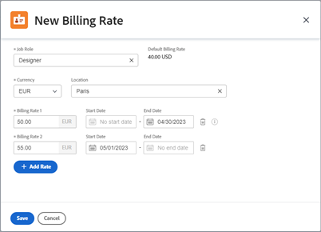

# 등급 카드 관리

{{highlighted-preview-article-level}}

요금 카드를 사용하면 위치에 따라 역할당 여러 청구 요금을 정의할 수 있습니다. 각각 청구 요금이 다른 파리에 기반을 둔 Designer과 뉴욕에 기반을 둔 두 번째 Designer의 작업 역할이 있을 수 있습니다. 하지만 요금 카드의 작업 역할에는 위치가 필요하지 않습니다. 요금 카드의 작업 역할(및 가능한 위치)에 대한 청구 요금에는 유효 날짜도 포함될 수 있습니다.

## 액세스 요구 사항

+++ 을 확장하여 이 문서의 기능에 대한 액세스 요구 사항을 봅니다.

이 문서의 단계를 수행하려면 다음 액세스 권한이 있어야 합니다.

<table style="table-layout:auto"> 
 <col> 
 <col> 
 <tbody> 
  <tr> 
   <td role="rowheader">[!DNL Adobe Workfront] 플랜</td> 
   <td>임의</td> 
  </tr> 
  <tr> 
   <td role="rowheader">[!DNL Adobe Workfront] 라이센스</td> 
   <td>
새 플랜: [!UICONTROL Standard] 

       
또는
 
       
현재 계획: [!UICONTROL 계획] 

   </td>    
  </tr> 
  <tr> 
   <td role="rowheader">액세스 수준 구성</td> 
   <td> 
[!UICONTROL 재무 데이터]에 대한 액세스 편집
 
<b>참고</b>: 아직 액세스 권한이 없는 경우 [!DNL Workfront] 관리자에게 액세스 수준에 추가 제한을 설정했는지 문의하세요. [!DNL Workfront] 관리자가 액세스 수준을 수정하는 방법에 대한 자세한 내용은 <a href="../../../administration-and-setup/add-users/configure-and-grant-access/create-modify-access-levels.md" class="MCXref xref">사용자 지정 액세스 수준 만들기 또는 수정</a>을 참조하십시오.
 </td> 
  </tr> 
  <tr> 
   <td role="rowheader">개체 권한</td> 
   <td>공유된 요금 카드를 편집하려면 요금 카드에 대한 관리 권한이 있어야 합니다.</td> 
  </tr> 
 </tbody> 
</table>

+++

## 요금 카드 추가

{{step-1-to-setup}}

1. 왼쪽 패널에서 [!UICONTROL **카드 평가**]&#x200B;를 클릭합니다.
1. [!UICONTROL **새 요금 카드**]&#x200B;를 클릭한 다음 [!UICONTROL 새 요금 카드] 상자에 요금 카드 이름을 입력하여 &quot;제목 없는 요금 카드&quot;를 바꿉니다.
1. (선택 사항) 요금 카드 세부 정보 화면에서 [!UICONTROL **설명**]&#x200B;을(를) 추가합니다.
1. (선택 사항) 사용자 정의 양식을 요율 카드에 첨부하려면 오른쪽 상단의 [!UICONTROL **사용자 정의 양식 추가**] 필드를 클릭하고 표시되는 목록에서 사용자 정의 양식을 선택합니다.

   사용자 정의 양식을 첨부하는 방법에 대한 자세한 내용은 [개체에 사용자 정의 양식 추가](/help/quicksilver/workfront-basics/work-with-custom-forms/add-a-custom-form-to-an-object.md)를 참조하십시오.

1. 왼쪽 탐색 패널에서 [!UICONTROL **작업 역할 및 속도**]&#x200B;를 클릭합니다.
1. 비율 카드 작업 역할 및 비율 화면에서 [!UICONTROL **작업 역할 추가**]&#x200B;를 클릭합니다.
1. 대화 상자에서 [!UICONTROL **작업 역할**]&#x200B;을(를) 선택하여 청구 요금을 정의합니다.

   기본 청구 요금이 정의된 경우 이 작업 역할에 대한 시스템 레벨 요금을 표시합니다.

   

1. 작업 역할에 대해 [!UICONTROL **통화**]&#x200B;를 선택하십시오.
1. (선택 사항) 작업 역할의 [!UICONTROL **위치**]&#x200B;를 선택합니다.
1. [!UICONTROL **청구 요금 1**] 필드에 이 위치에 대한 청구 요금을 입력합니다. 그런 다음 [!UICONTROL **저장**]&#x200B;을 클릭하여 청구 요금을 한 번 재정의합니다.

   또는

   유효 날짜가 포함된 위치별 청구 요금을 추가하려면 [!UICONTROL **요금 추가**]&#x200B;를 클릭하세요.

1. (조건부) 이 위치에 대해 두 개 이상의 청구 요율을 추가하는 경우 다음 정보를 입력합니다.

   * **[!UICONTROL 청구 요금 1], 2 등:** 해당 기간의 청구 요금 값입니다.
   * **[!UICONTROL 시작 날짜]:** 속도 재정의가 시작되는 날짜입니다.
   * **[!UICONTROL 종료 날짜]:** 속도 재정의가 끝나는 날짜입니다.

     청구 요금 1에는 시작 일자가 없으며 마지막 청구 요금에 종료 일자가 없습니다. 일부 날짜는 자동으로 추가됩니다. 예를 들어, 청구 요금 1에 종료 일자가 없고 시작 일자가 2023년 5월 1일인 청구 요금 2를 추가하는 경우, 2023년 4월 30일인 종료 일자가 청구 요금 1에 추가되므로 간격이 없습니다.

1. [!UICONTROL **저장**]&#x200B;을 클릭합니다.
1. (선택 사항) 다른 위치의 동일한 작업 역할이나 별도의 작업 역할에 대해 다른 청구 요금을 추가하려면 [!UICONTROL **작업 역할 추가**]&#x200B;를 클릭합니다.
1. (선택 사항) 비율 카드를 편집하려면 설정의 비율 카드 목록에서 비율 카드 이름을 클릭합니다. 청구 요금을 편집하려면 요금 카드의 왼쪽 탐색 패널에서 [!UICONTROL **작업 역할 및 요금**]&#x200B;을 클릭하세요. 그런 다음 비율을 선택하고 **편집** 아이콘 을 클릭합니다.

## 요금 카드 복사

{{step-1-to-setup}}

1. 왼쪽 패널에서 [!UICONTROL **카드 평가**]&#x200B;를 클릭합니다.
1. 목록의 요금 카드 옆에 있는 확인란을 선택하고 **복사** 아이콘 을 클릭합니다.
1. [!UICONTROL 요금 카드 복사] 상자에 요금 카드의 이름을 입력하여 &quot;제목 없는 요금 카드&quot;를 바꿉니다. 그런 다음 **저장**&#x200B;을 클릭합니다.

   새 요금 카드가 저장되었습니다. 필요에 따라 비율 카드 세부 정보, 작업 역할 및 비율을 편집합니다.

## 전체 요금 카드 삭제

{{step-1-to-setup}}

1. 왼쪽 패널에서 [!UICONTROL **카드 평가**]&#x200B;를 클릭합니다.
1. 목록의 요금 카드 옆에 있는 확인란을 선택하고 **삭제** 아이콘 을 클릭합니다.

   >[!NOTE]
   >
   >프로젝트에 첨부된 요금 카드가 프로젝트에서 삭제됩니다.
