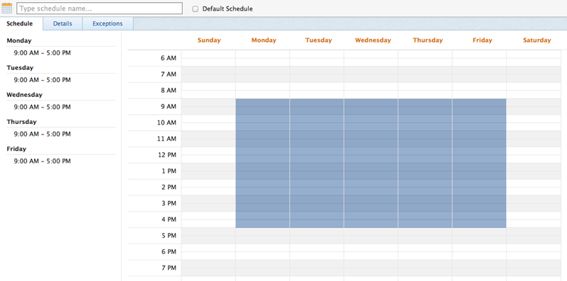
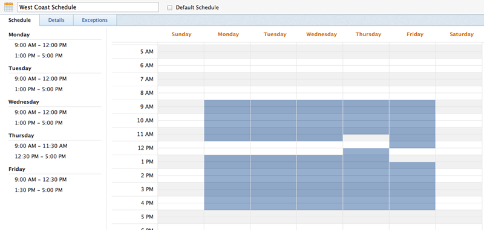

# 일정 만들기

<!--DON'T DELETE, DRAFT OR HIDE THIS ARTICLE. IT IS LINKED TO THE PRODUCT, THROUGH THE CONTEXT SENSITIVE HELP LINKS. 
Linked to Editing Users, Editing Projects, Creating and managing groups
-->

(으)로 [!DNL Adobe Workfront] 관리자는 스케줄을 사용하여 작업 주를 정의할 수 있습니다. 사용자 또는 프로젝트와 일정을 연결할 수 있습니다. 이렇게 하면 [!DNL Workfront] 을 클릭하여 타임라인 및 사용자 가용성을 계산합니다.

서로 다른 시간대에서 근무하는 사용자가 있는 경우, 각 시간대에서 일정을 만들어 해당 사용자와 연결하면 작업이 기록되도록 할 수 있습니다 [!DNL Workfront] 실시간 및 가용성은 언제 작동하는지에 따라 항상 정확합니다.

일정을 사용자 및 프로젝트와 연관시키는 방법에 대한 자세한 내용은 다음 문서를 참조하십시오.

* [사용자 프로필 편집](../../../administration-and-setup/add-users/create-and-manage-users/edit-a-users-profile.md)
* [프로젝트 편집](../../../manage-work/projects/manage-projects/edit-projects.md)

그룹 관리자는 자신이 관리하는 그룹과 관련된 일정을 만들 수도 있습니다. 자세한 내용은 [그룹의 일정 만들기 및 수정](../../../administration-and-setup/manage-groups/work-with-group-objects/create-and-modify-a-groups-schedules.md).

사용자가에서 공동 작업을 지원하는 데 일정을 사용하는 방법에 대한 자세한 정보 [!DNL Workfront] 시간대에서 다음을 참조하십시오. [시간대 간 작업](../../../workfront-basics/tips-tricks-and-troubleshooting/working-across-timezones.md).

## 액세스 요구 사항

이 문서의 단계를 수행하려면 다음 액세스 권한이 있어야 합니다.

<table style="table-layout:auto"> 
 <col> 
 <col> 
 <tbody> 
  <tr> 
   <td role="rowheader">[!UICONTROL Adobe Workfront] 플랜</td> 
   <td>모든</td> 
  </tr> 
  <tr> 
   <td role="rowheader">[!DNL Adobe Workfront] 라이센스</td> 
   <td>[!UICONTROL 계획]</td> 
  </tr> 
  <tr> 
   <td role="rowheader">액세스 수준 구성</td> 
   <td> 
다음이어야 합니다: [!DNL Workfront] 관리자.
 
<b>참고</b>: 아직 액세스 권한이 없는 경우 [!DNL Workfront] 관리자가 액세스 수준에 추가 제한을 설정하는 경우. 자세한 내용: [!DNL Workfront] 관리자가 액세스 수준을 수정할 수 있습니다. 다음을 참조하십시오. <a href="../../../administration-and-setup/add-users/configure-and-grant-access/create-modify-access-levels.md" class="MCXref xref">사용자 정의 액세스 수준 만들기 또는 수정</a>.
 </td> 
  </tr> 
 </tbody> 
</table>

## 일정 만들기

1. 다음을 클릭합니다. **[!UICONTROL 메인 메뉴]** 아이콘  의 오른쪽 위 모서리 [!DNL Adobe] Workfront을 클릭한 다음 **[!UICONTROL 설정]** .
1. 클릭 **[!UICONTROL 일정]**.
1. 클릭 **[!UICONTROL 새 일정]**.
1. 예약의 이름을 지정합니다.
1. (선택 사항) 선택 **[!UICONTROL 기본 일정]** 이 일정을 기본값으로 식별합니다.

   다음에서 두 개 이상의 일정을 가질 수 있습니다. [!DNL Workfront], 그러나 기본 일정은 하나만 있을 수 있습니다.

   에 하나 이상의 일정이 있어야 합니다. [!DNL Workfront]. 하나만 있는 경우 기본 일정으로 지정됩니다.

   >[!NOTE]
   >
   >그룹 관리자인 경우 스케줄을 기본 스케줄로 지정할 수 없습니다. 만 [!DNL Workfront] 관리자는 일정을 시스템의 기본값으로 지정할 수 있습니다.

   

1. 다음에서 **[!UICONTROL 예약]** 탭에서 시간 블록에 걸쳐 파란색 윤곽선을 드래그하여 일별 일정을 선택하여 강조 표시합니다.

   9시간 동안 1시간 블록 8개를 선택하는 것이 좋습니다. 이것은 점심이나 다른 휴식에 사용할 수 있다.

   

1. 다음에서 **[!UICONTROL 세부 사항]** 탭에서 다음 정보를 지정합니다.

   <table style="table-layout:auto">
    <tr>
     <td>관리 액세스 권한이 있는 [!UICONTROL 그룹]</td>
     <td>
관리자가 이 일정을 편집할 수 있는 권한을 가진 그룹을 지정합니다.

     
<b>중요 사항</b>:

      <ul>
       <li>
       
일정을 작성하는 그룹 관리자의 경우 이 필드는 필수입니다.

       
그룹 관리자는 자신이 관리자로 지정된 그룹 또는 하위 그룹에 대해 지정된 경우에만 스케줄을 생성할 수 있습니다.

       
한 그룹만 관리하는 경우 기본적으로 해당 그룹이 이 필드에서 선택됩니다.

       
여러 그룹을 관리하는 경우 이 필드에서 그룹을 선택해야 일정을 저장할 수 있습니다.
</li>
       <li>다음과 같은 경우 [!DNL Workfront] 관리자 일정을 생성하는 경우 이 필드는 선택 사항입니다. 그룹과 연관시키지 않고 스케줄을 생성하면 시스템 레벨 스케줄로 저장되며 그룹의 그룹 관리자가 관리할 수 없습니다.
       
계정 또는 프로젝트에 할당된 일정은 이러한 오브젝트를 편집할 수 있는 모든 사용자가 볼 수 있습니다. 시스템 수준 및 그룹 수준 일정 모두에 해당됩니다.

       </li>
       
일정에 대한 관리 액세스 권한이 있는 그룹을 지정하면 그룹의 사용자에게 일정이 할당되지 않고 그룹의 그룹 관리자만 일정을 편집, 삭제 및 복사할 수 있습니다.

       
그룹 관리자는 시스템 수준 일정을 편집, 삭제 또는 복사할 수 없습니다. 자세한 내용은 <a href="../../../administration-and-setup/manage-groups/group-roles/group-administrators.md" class="MCXref xref">그룹 관리자</a>.
     </td>
    </tr>
    <tr>
     <td>보기 액세스 권한이 있는 [!UICONTROL 그룹]</td>
     <td>
이 일정을 볼 수 있는 [!UICONTROL 보기] 액세스 권한이 있는 그룹을 선택합니다.

     
여기에서 지정된 그룹의 사용자만 사용자 또는 프로젝트에 일정을 할당할 때 드롭다운 메뉴에서 일정을 찾을 수 있습니다.
</tr>
    <tr>
     <td>[!UICONTROL 시간대]</td>
     <td>
일정에 대한 시간대를 선택합니다.

     
일정을 사용자와 연결하는 경우 일정의 시간대가 사용자의 시간대와 일치하는 것이 좋습니다.사용자의 시간대에 대한 자세한 내용은 다음을 참조하십시오. <a href="../../../administration-and-setup/add-users/create-and-manage-users/edit-a-users-profile.md" class="MCXref xref">사용자 프로필을 편집합니다.
     </td>
    </tr>
   </table>

1. 다음에서 **[!UICONTROL 예외]** 탭에서 예약에 대한 예외를 지정합니다.

   예외는 휴일 또는 회사 행사 등 일정에서 제외해야 하는 전체 또는 반일입니다.

   >[!NOTE]
   >
   >반복 스케줄 예외가 무엇인지 이미 알고 있는 경우 미래의 여러 해에 대해 스케줄 예외를 정의할 수 있습니다.

   전체 또는 일부 일수는 작업 일정에서 제외할 수 있습니다. 날짜를 클릭하여 예외로 선택한 다음 **[!UICONTROL 하루 종일]** 예외의 하루 전체 여부를 나타내는 필드입니다.

   

1. 부분 일 예외에 대한 시작 및 종료 시간을 지정합니다.

   

1. 클릭 **[!UICONTROL 저장]**&#x200B;을 클릭한 다음 을 클릭합니다 **[!UICONTROL 저장] 변경 사항**.

1. (선택 사항) 일정을 사용자와 연결합니다.

   자세한 내용은 [사용자 프로필 편집](../../../administration-and-setup/add-users/create-and-manage-users/edit-a-users-profile.md).

1. (선택 사항) 일정을 프로젝트와 연결합니다.

   자세한 내용은 [프로젝트 편집](../../../manage-work/projects/manage-projects/edit-projects.md).
