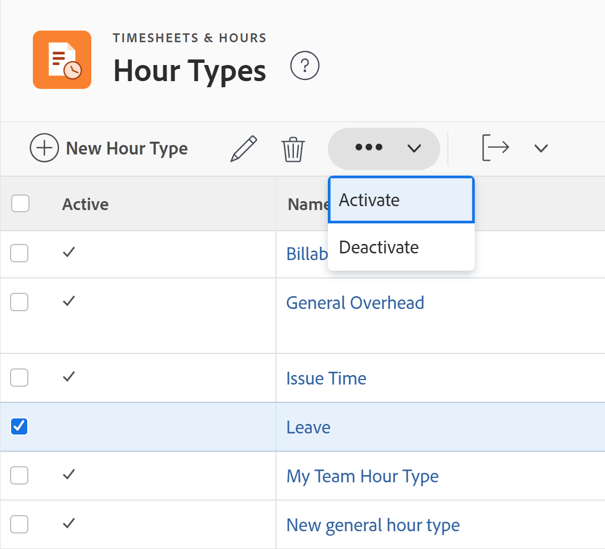

# 시간 유형 관리

<!--Audited: 05/2025-->

<!--DON'T DELETE, DRAFT OR HIDE THIS ARTICLE. IT IS LINKED TO THE PRODUCT, THROUGH THE CONTEXT SENSITIVE HELP LINKS. 
**Linked to Creating Billing Record-->

<!--

The highlighted information on this page refers to functionality not yet generally available. It is available only in the Preview environment for all customers. The same features will also be available in the Production environment for all customers after a week from the Preview release.     

For more information, see [Interface modernization](/help/quicksilver/product-announcements/product-releases/interface-modernization/interface-modernization.md). 

-->

시간 유형은 시간 항목을 정의하는 데 사용하는 레이블입니다. 시간 유형과 시간 항목을 연결할 수 있습니다.

시간 유형에는 두 가지 범주가 있습니다.

* **프로젝트별 시간 유형**: 프로젝트, 작업 및 문제에 로그온한 시간입니다. 프로젝트 특정 시간 유형은 프로젝트, 작업 및 문제에 시간을 기록할 수 있는 [!DNL Adobe Workfront]의 어디에서나 시간 항목과 연결할 수 있습니다.

  [!DNL Workfront]에서 시간을 기록할 때 사용할 수 있는 프로젝트별 시간 유형은 시스템, 프로젝트 및 사용자 수준에서 설정된 구성 옵션에 따라 다릅니다.

  다음 기본 프로젝트별 시간 유형은 항상 사용할 수 있습니다.

   * 프로젝트 시간
   * 작업 시간
   * 문제 시간

  [!DNL Workfront] 관리자는 [시간 형식 및 가용성 정의](../../../timesheets/create-and-manage-timesheets/define-hour-types-and-availability.md)에 설명된 대로 사용할 수 있는 프로젝트별 시간 형식을 결정합니다.

  >[!NOTE]
  >
  >[!DNL Workfront] 시스템에서 프로젝트별 시간 유형을 사용하는 경우 시스템의 각 프로젝트에서 프로젝트별 시간 유형을 하나 이상 사용해야 합니다. 시스템 수준에서 프로젝트별 시간 유형을 활성화할 수 없으며 프로젝트 수준에서 사용할 수 있는 프로젝트별 시간 유형이 없습니다.

* **일반 시간 유형**: 일반 시간은 프로젝트, 작업 또는 문제와 연결할 수 없으며 타임시트에 직접 로그인됩니다.

시간을 기록하고 시간 유형과 연결하는 방법에 대한 자세한 내용은 [시간 기록](/help/quicksilver/timesheets/create-and-manage-timesheets/log-time.md)을 참조하세요.

## 액세스 요구 사항

+++ 을 확장하여 이 문서의 기능에 대한 액세스 요구 사항을 봅니다.

<table style="table-layout:auto"> 
 <col> 
 <col> 
 <tbody> 
  <tr> 
   <td>[!DNL Adobe Workfront] 패키지</td> 
   <td>
임의
</td> 
  </tr> 
  <tr> 
   <td>[!DNL Adobe Workfront] 라이센스</td> 
   <td>
[!UICONTROL Standard]

       
[!UICONTROL 계획]
</td>
  </tr> 
  <tr> 
   <td>액세스 수준 구성</td> 
   <td>[!UICONTROL 시스템 관리자]</td> 
  </tr> 
 </tbody> 
</table>

자세한 내용은 [Workfront 설명서의 액세스 요구 사항](/help/quicksilver/administration-and-setup/add-users/access-levels-and-object-permissions/access-level-requirements-in-documentation.md)을 참조하십시오.

+++

## 기본 시간 유형

Workfront에는 기본 제공 시간 유형이 포함되어 있습니다. 이러한 시간 유형은 편집하거나 숨길 수 없습니다.

[!DNL Workfront]과(와) 함께 제공되는 시간 유형은 다음과 같습니다.

* **[!UICONTROL 병가 시간]**: 프로젝트, 작업 또는 문제의 시간 항목과 연결할 수 없는 일반적인 시간 형식입니다. 병가 시간은 수익으로 계산할 수 없습니다.
* **[!UICONTROL 휴가 시간]**: 프로젝트, 작업 또는 문제의 시간 항목과 연결할 수 없는 일반적인 시간 형식입니다. 휴가 시간은 매출로 계산할 수 없습니다.
* **[!UICONTROL 일반 오버헤드]**: 프로젝트, 작업 또는 문제의 시간 항목과 연결할 수 없는 일반 시간 형식입니다. 프로젝트 계획 프로세스에서 수익으로 카운트될 수 있습니다.
* **[!UICONTROL 프로젝트 시간]**: 프로젝트의 시간 항목에만 연결할 수 있는 일반적인 시간 형식입니다.
* **[!UICONTROL 작업 시간]**: 작업의 시간 항목에만 연결할 수 있는 일반적인 시간 형식입니다.
* **[!UICONTROL 문제 시간]**: 문제에 대한 시간 항목에만 연결할 수 있는 일반적인 시간 형식입니다.

## 시간 유형 만들기

[!DNL Workfront] 관리자는 시스템 및 프로젝트 수준에서 조직에 대한 시간 유형을 만들 수 있습니다.

시스템 수준에서 시간 유형을 정의한 후 사용자는 특정 프로젝트 또는 특정 사용자에 사용할 수 있는 시간 유형을 정의할 수 있습니다.

자세한 내용은 [시간 유형 및 가용성 정의](../../../timesheets/create-and-manage-timesheets/define-hour-types-and-availability.md)를 참조하십시오.

시간 유형을 생성하려면

{{step-1-to-setup}}

1. 왼쪽 패널에서 **타임시트 및 시간**&#x200B;을 클릭한 다음 **시간 유형**&#x200B;을 클릭합니다.

1. **시간 유형** 섹션에서 **새 시간 유형**&#x200B;을 클릭합니다.
1. **새 시간 유형** 대화 상자에서 다음 정보를 지정합니다.

   <table style="table-layout:auto"> 
    <col> 
    <col> 
    <tbody> 
     <tr> 
      <td role="rowheader">[!UICONTROL 이름]</td> 
      <td>시스템에서 쉽게 인식할 수 있는 시간 유형 이름을 입력합니다.</td> 
     </tr> 
     <tr> 
      <td role="rowheader">[!UICONTROL 설명]</td> 
      <td>시간 유형에 대한 설명을 추가합니다.</td> 
     </tr> 
     <tr> 
      <td role="rowheader">[!UICONTROL 범위]</td> 
      <td> 
<strong>범위</strong> 드롭다운 메뉴에서 시간 유형이 일반 또는 프로젝트별 시간 유형인지 선택합니다.
 
일반 시간 유형은 타임시트에서만 볼 수 있으며 프로젝트, 작업 또는 문제와 연결할 수 없습니다.
 
<b>중요 사항</b>

 사용자 정의 시간 유형이 [!UICONTROL 프로젝트 특정]이고 [!UICONTROL 일반]으로 변경한 경우 기존의 모든 작업, 문제 및 프로젝트 시간이 해당 시스템 기본 유형으로 설정됩니다.
 </td> 
     </tr> 
     <tr> 
      <td role="rowheader">[!UICONTROL Count as Revenue]</td> 
      <td>
이 시간 유형과 연관된 시간 항목이 수익 계산에 영향을 미치도록 하려면 이 옵션을 선택합니다.

      
병가 시간과 휴가 시간은 수익으로 계산할 수 없습니다.

      
<b>메모</b>

      
일반 시간 유형이 매출로 계산되는 경우 시간을 기록하는 사용자의 프로필과 연결된 비용률은 시간 비용과 연결됩니다.  
      </td> 
     </tr> 
    </tbody> 
   </table>

1. **저장**&#x200B;을 클릭합니다.

   시간 유형이 Workfront 시스템에 추가되고 기본적으로 활성화됩니다.

## 시간 유형 편집

[!DNL Workfront] 관리자는 시스템 및 프로젝트 수준에서 조직의 시간 유형을 편집할 수 있습니다.

>[!NOTE]
>
>* 기본 제공 시간 유형은 편집할 수 없습니다.
>* 시간 유형은 일괄적으로 편집할 수 없습니다.

{{step-1-to-setup}}

1. 왼쪽 패널에서 **타임시트 및 시간**&#x200B;을 클릭한 다음 **시간 유형**&#x200B;을 클릭합니다.

1. 시간 유형 이름을 클릭하거나 시간 유형을 선택한 다음 목록 맨 위에 있는 **편집** 아이콘 을 클릭합니다.
1. **시간 유형 편집** 대화 상자에서 다음 정보를 지정하십시오.

   <table style="table-layout:auto"> 
    <col> 
    <col> 
    <tbody> 
     <tr> 
      <td role="rowheader">[!UICONTROL 이름]</td> 
      <td>시스템에서 쉽게 인식할 수 있는 시간 유형 이름을 입력합니다.</td> 
     </tr> 
     <tr> 
      <td role="rowheader">[!UICONTROL 설명]</td> 
      <td>시간 유형에 대한 설명을 추가합니다.</td> 
     </tr> 
     <tr> 
      <td role="rowheader">[!UICONTROL 범위]</td> 
      <td> 
<strong>범위</strong> 드롭다운 메뉴에서 시간 유형이 일반 또는 프로젝트별 시간 유형인지 선택합니다.
 
일반 시간 유형은 타임시트에서만 볼 수 있으며 프로젝트, 작업 또는 문제와 연결할 수 없습니다.
 
<b>중요 사항</b>
 
사용자 정의 시간 유형이 [!UICONTROL 프로젝트 특정]이고 [!UICONTROL 일반]으로 변경한 경우 기존의 모든 작업, 문제 및 프로젝트 시간이 해당 시스템 기본 유형으로 설정됩니다.
 </td> 
     </tr> 
     <tr> 
      <td role="rowheader">[!UICONTROL Count as Revenue]</td> 
      <td>
이 시간 유형과 연관된 시간 항목이 수익 계산에 영향을 미치도록 하려면 이 옵션을 선택합니다.

      
병가 시간과 휴가 시간은 수익으로 계산할 수 없습니다.

      
<b>메모</b>

      
일반 시간 유형이 매출로 계산되는 경우 시간을 기록하는 사용자의 프로필과 연결된 비용률은 시간 비용과 연결됩니다.  
      </td> 
     </tr> 
    </tbody> 
   </table>

1. **저장**&#x200B;을 클릭합니다.

   변경 사항이 저장되고 시간 유형이 편집됩니다.

## 시간 유형 비활성화

사용자가 자신의 시간을 근로자와 연결하지 않도록 하려면 시간 유형을 비활성화하면 됩니다. 시간 유형을 비활성화하면 시간 유형이 표시되는 [!DNL Workfront]의 어디에서든 시간 유형이 숨겨집니다.

>[!NOTE]
>
>* 기본 제공 시간 유형은 비활성화할 수 없습니다.
>* 시간 유형을 일괄적으로 비활성화할 수 있습니다.
>* 프로젝트별 시간 유형을 비활성화하면 해당 유형에 대해 기록된 모든 시간이 자동으로 기본 제공 프로젝트별 시간 유형으로 설정됩니다. 예를 들어 프로젝트에 대해 기록된 시간은 기본적으로 프로젝트 시간 유형으로 설정되며 작업에 대해 기록된 시간은 기본적으로 작업 시간 유형으로 설정됩니다.
>* 일반 시간 유형을 비활성화하면 기록된 시간이 타임시트에 남아 있지만 앞으로 해당 시간 유형에 대한 시간을 더 이상 기록할 수 없습니다.

시간 유형을 비활성화하려면

{{step-1-to-setup}}

1. 왼쪽 패널에서 **[!UICONTROL 타임시트 및 시간]**&#x200B;을 클릭한 다음 **[!UICONTROL 시간 유형]**&#x200B;을 클릭합니다.

1. 비활성화할 시간 유형을 선택합니다. 여러 시간 유형을 선택할 수 있습니다.

1. **자세히**&#x200B;를 클릭한 다음 **비활성화**&#x200B;를 클릭합니다.

   

   시간 유형이 비활성화되어 사용자가 시간을 기록할 때 더 이상 시간 유형을 찾을 수 없습니다.

1. (선택 사항) 시간 유형을 다시 활성화하려면 **시간 유형** 목록에서 선택한 다음 **자세히** > **활성화**&#x200B;를 클릭합니다.

