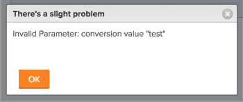

# 오류 메시지: 잘못된 매개변수: 전환 값

## 문제

기존 사용자 정의 양식에서 사용자 정의 필드의 형식을 변경하려고 할 때 다음과 같은 오류 메시지가 표시됩니다. &quot;잘못된 매개변수: 전환 값 &quot;&lt;...>&quot;\

## 원인

이 메시지는 다음 시나리오에서 발생합니다.

예를 들어 텍스트 형식의 사용자 지정 필드가 있습니다.  이제 사용자 정의 필드의 형식을 통화로 변경합니다. Adobe Workfront 인스턴스 어딘가에 이 필드가 개체에 이미 첨부되어 있고 개체에 이미 지정된 정보가 있습니다. 하나 이상의 해당 필드에 있는 기존 정보의 형식이 이미 텍스트로 지정되어 있습니다. 따라서 필드의 형식은 통화로 변경할 수 없습니다.

<table style="table-layout:auto"> 
 <col> 
 <col> 
 <tbody> 
  <tr> 
   <td role="rowheader"> 
<a href="https://www.workfront.com/plans" target="_blank">Workfront 플랜</a>*
 </td> 
   <td>임의</td> 
  </tr> 
  <tr> 
   <td role="rowheader"> 
<a href="../../administration-and-setup/add-users/access-levels-and-object-permissions/wf-licenses.md" class="MCXref xref">라이선스 개요</a>*
 </td> 
   <td>플랜</td> 
  </tr> 
  <tr data-mc-conditions=""> 
   <td role="rowheader"><strong>액세스 수준*</strong> </td> 
   <td> 
액세스 권한 편집 대상:
 
    <ul> 
     <li> 
보고서, 대시보드 및 캘린더 만들기
 </li> 
     <li> 
필터, 보기 및 그룹화 만들기
 </li> 
    </ul> 
<b>참고</b>: 아직 액세스 권한이 없는 경우 Workfront 관리자에게 액세스 수준에 추가 제한을 설정했는지 문의하세요. Workfront 관리자가 액세스 수준을 변경하는 방법에 대한 자세한 내용은 <a href="../../administration-and-setup/add-users/configure-and-grant-access/create-modify-access-levels.md" class="MCXref xref">사용자 지정 액세스 수준 만들기 또는 수정</a>을 참조하십시오.
 </td> 
  </tr> 
 </tbody> 
</table>

## 솔루션

다음을 수행합니다.

1. 이 필드가 사용자 지정 Forms과 연결되어 있을 수 있는 모든 개체에 대한 보고서를 작성합니다.\
   보고서 작성에 대한 자세한 내용은 [사용자 지정 보고서 만들기](../../reports-and-dashboards/reports/creating-and-managing-reports/create-custom-report.md)를 참조하십시오.

1. 편집하려는 사용자 정의 필드를 보고서 보기에 포함하면 이 필드가 텍스트 값으로 채워진 오브젝트를 확인할 수 있습니다.
1. 텍스트 형식으로 표시되는 오브젝트의 사용자 정의 필드 값을 수정하고 [통화] 형식의 값을 지정한 다음 사용자 정의 양식의 형식 필드를 다시 변경해 보십시오.\
   또는\
   이미 텍스트 형식의 정보로 채워진 필드 값이 너무 많은 경우 사용자 정의 양식에 새 사용자 정의 필드를 추가하고 통화로 형식을 지정하는 것이 좋습니다.
