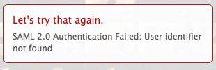

# 오류 메시지: SAML 2.0 오류: 사용자 식별자를 찾을 수 없음

## 문제

ADFS에 성공적으로 연결할 수 없습니다.

>[!NOTE]
>
>성공적인 테스트 연결을 설정했지만 여전히 문제가 발생하는 경우 잘못된 속성 매핑이나 페더레이션 ID에 문제가 발생할 수 있습니다. 문의 사항은 고객 지원 센터에 문의하십시오.

## 원인:

ADFS 서버에 대한 클레임이 잘못되었습니다.

## 액세스 요구 사항

이 문서의 단계를 수행하려면 다음 액세스 권한이 있어야 합니다.

+++ 을 확장하여 이 문서의 기능에 대한 액세스 요구 사항을 봅니다.

이 문서의 단계를 수행하려면 다음 액세스 권한이 있어야 합니다.

<table style="table-layout:auto"> 
 <col> 
 <col> 
 <tbody> 
  <tr> 
   <td role="rowheader">[!DNL Adobe Workfront] 플랜</td> 
   <td>임의</td> 
  </tr> 
  <tr> 
   <td role="rowheader">[!DNL Adobe Workfront] 라이센스</td> 
   <td>
   
새로운 기능: 표준

   
또는

   
현재: 플랜
</td> 
  </tr> 
  <tr> 
   <td role="rowheader">액세스 수준 구성</td> 
   <td>[!DNL Workfront] 관리자여야 합니다. </td> 
  </tr> 
 </tbody> 
</table>

이 표의 정보에 대한 자세한 내용은 [Workfront 설명서의 액세스 요구 사항](/help/quicksilver/administration-and-setup/add-users/access-levels-and-object-permissions/access-level-requirements-in-documentation.md)을 참조하십시오.

+++

## 솔루션

ADFS 서버에서 이름 ID에 대한 클레임이 있는지 확인합니다.

1. Windows에서는 **[!UICONTROL 시작]** > **[!UICONTROL 관리]** > **[!UICONTROL ADFS 2.0 관리]**&#x200B;를 클릭합니다.\
   [ADFS 2.0 관리] 대화 상자가 표시됩니다.

1. 왼쪽 창에서 **[!UICONTROL 트러스트 관계]** > **[!UICONTROL 신뢰 당사자 트러스트]**&#x200B;를 선택합니다.

1. Adobe Workfront 관련 신뢰 당사자 트러스트를 마우스 오른쪽 단추로 클릭하고 **[!UICONTROL 클레임 규칙 편집]**&#x200B;을 선택합니다.
1. 클레임에 **[!UICONTROL 이름 ID]**&#x200B;의 **[!UICONTROL 나가는 클레임 유형]**&#x200B;이 있는지 확인하십시오.

