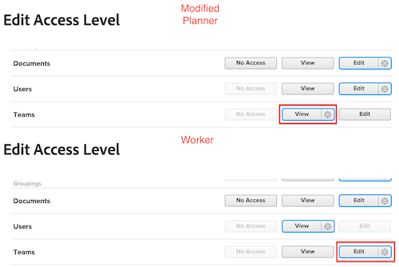

# 그룹 관리자는 자신이 관리하는 사용자보다 높은 액세스 권한을 가져야 합니다.

그룹 관리자의 액세스 권한이 관리하는 액세스 수준보다 낮은 경우 낮은 액세스 수준을 보거나 수정하거나 할당할 수 없습니다.

## 문제

그룹 관리자에게 팀에 대한 보기 권한이 있는 수정된 계획자 액세스 수준이 할당되지만 특정 사용자에게 팀에 대한 편집 권한이 있는 작업자 액세스 수준이 할당되면 그룹 관리자는 수정된 작업자 액세스 수준과 상호 작용할 수 없습니다.

>[!NOTE]
>
>이 논리는 설정 세부 조정 드롭다운 메뉴에도 적용됩니다. 두 액세스 수준 모두 편집 액세스 권한을 가질 수 있지만 그룹 관리자의 경우 설정 세부 조정 드롭다운 메뉴의 설정이 더 높아야 합니다.
> 

## 솔루션

그룹 관리자는 액세스 수준의 모든 영역에서 자신이 관리하는 영역보다 더 높은 권한을 가져야 합니다.
