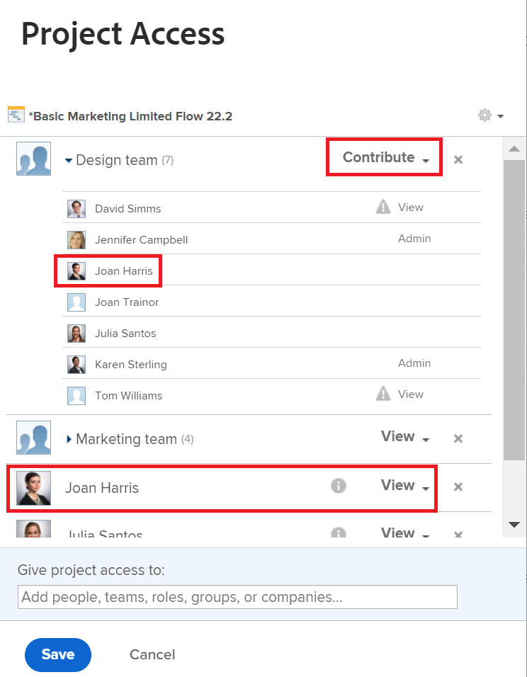

# 공유에는 두 개 이상의 권한이 표시됩니다

## 질문

공유 창에는 한 사용자에 대한 두 가지 다른 권한이 표시됩니다. 어느 것이 사용되고 있습니까?

## 답변

사용자에게 공유 화면에 표시되는 가장 높은 권한이 있습니다. 권한에 대한 자세한 내용은 문서를 참조하십시오 [개체에 대한 권한 공유 개요](../../workfront-basics/grant-and-request-access-to-objects/sharing-permissions-on-objects-overview.md).

