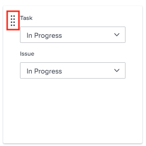

# 구성 [!UICONTROL 칸반]

<!--Audited: 12/2023-->

에서 애자일 팀을 만들 수 있습니다. [!DNL Adobe Workfront] 에 설명된대로 [애자일 팀 만들기](../../agile/get-started-with-agile-in-workfront/create-an-agile-team.md). 애자일 팀을 만드는 동안 팀이 작업을 완료하는 데 사용하는 방법론을 선택할 수 있습니다. 다음 옵션 중에서 선택할 수 있습니다.

* 스크럼
* 칸반

이 문서에서는 Kanban 팀에 대한 설정을 구성하는 방법에 대해 설명합니다. 애자일 팀을 만들고 Kanban 방법을 선택한 후 이 문서를 참조하여 다음 설정을 업데이트할 수 있습니다.

* 스토리를 포인트 또는 시간 단위로 추정하는지 여부
* 애자일 스토리 보드의 상태 열
* 애자일 스토리 보드의 스토리 카드에 표시할 추가 필드
* WIP(Work In Progress) 한도
* 백로그에서 스토리를 자동으로 추가하는 방법
* 카드가 칸반 보드에 남아 있는 기간

스크럼 팀 구성에 대한 자세한 내용은 [스크럼 구성](../get-started-with-agile-in-workfront/configure-scrum.md).

## 액세스 요구 사항

+++ 을 확장하여 이 문서의 기능에 대한 액세스 요구 사항을 봅니다.

이 문서의 단계를 수행하려면 다음 액세스 권한이 있어야 합니다.

<table style="table-layout:auto"> 
 <col> 
 </col> 
 <col> 
 </col> 
 <tbody> 
  <tr> 
   <td role="rowheader">[!DNL Adobe Workfront] 플랜*</td> 
   <td> 
임의
 </td> 
  </tr>

<tr> 
   <td role="rowheader">[!DNL Adobe Workfront] 라이센스*</td> 
   <td> 
새로운 기능: [!UICONTROL Standard]
 
   또는
   
현재: [!UICONTROL Work] 이상
 </td> 
  </tr>

<tr> 
   <td role="rowheader">액세스 수준</td> 
   <td> 
팀에 대한 액세스 편집
  </td> 
  </tr>

</tbody> 
</table>

*보유 중인 플랜 또는 라이선스 유형을 확인하려면 다음 연락처로 문의하십시오. [!DNL Workfront] 관리자.

+++

## 스토리를 포인트 또는 시간 단위로 예상할지 구성

점 또는 시간을 사용하여 예상할 스토리를 구성할 수 있습니다.

애자일 팀에 대한 스토리를 추정하는 방법을 구성하려면 다음을 수행하십시오.

{{step1-to-team}}

1. 다음을 클릭합니다. **[!UICONTROL 팀 전환]** 아이콘 을 클릭한 후 드롭다운 메뉴에서 새 팀을 선택하거나 검색 상자에서 팀을 검색합니다.
1. 관리할 애자일 팀을 선택합니다.
1. 다음을 클릭합니다. **[!UICONTROL 자세히]** 메뉴  을 선택한 다음 을 선택합니다. **[!UICONTROL 편집]**.

   

1. 다음에서 **[!UICONTROL 애자일]** 섹션, **[!UICONTROL 다음에서 스토리 예상:]** 영역에서 스토리의 크기(작업 로드)를 예상하는 데 포인트를 사용할지 또는 시간을 사용할지 선택합니다. 점(Points)을 선택하는 경우 1점과 동일한 시간을 지정합니다. (기본값은 1포인트 = 8시간입니다.) 스토리에 추가된 계획된 시간 수입니다.

   **예:** 스토리를 포인트 단위로 추정하도록 선택했는데 1포인트가 8시간과 같고 스토리가 3포인트로 추정되는 경우 24개의 계획된 시간이 스토리에 추가됩니다.

1. **[!UICONTROL 변경 내용 저장]**&#x200B;을 클릭합니다.

## 애자일 스토리 보드에서 상태 열 구성

애자일 팀의 스토리 보드에 있는 상태를 정의할 수 있습니다. 스토리 보드에 표시되는 상태는 이것뿐입니다.

애자일 팀과 연관된 스토리 보드에 사용할 수 있는 상태를 정의하려면 다음을 수행합니다.

{{step1-to-team}}

1. 다음을 클릭합니다. **[!UICONTROL 팀 전환]** 아이콘 을 클릭한 후 드롭다운 메뉴에서 새 팀을 선택하거나 검색 창에서 팀을 검색합니다.

1. 관리할 애자일 팀을 선택합니다.
1. 다음을 클릭합니다. **[!UICONTROL 자세히]** 메뉴, 선택 **[!UICONTROL 편집]**.

   

1. 다음에서 **[!UICONTROL 애자일]** 섹션에서 다음을 찾습니다. **[!UICONTROL 스토리보드]** 영역입니다.

1. (선택 사항) **[!UICONTROL 열 추가]** 스토리 보드에 상태 열을 더 추가합니다.
1. (선택 사항) 드래그 앤 드롭 표시기를 사용하여 상태 열을 드래그하여 스토리 보드의 상태 열을 재정렬합니다. 첫 번째 열은 이동할 수 없으며 첫 번째 열 앞에 다른 열을 드래그할 수 없습니다.

   

1. 작업 상태를 선택합니다.

   >[!IMPORTANT]
   >
   >잠긴 시스템 전체 상태만 선택할 수 있습니다. 그룹별 상태는 선택할 수 없습니다. 첫 번째 열의 상태는 항상 **[!UICONTROL 신규]**.

   다음과 같은 경우 사용자 정의 상태를 추가할 수 있습니다. [!DNL Workfront] 관리자가 구성했습니다. 자세한 내용은 [상태 만들기 또는 편집](../../administration-and-setup/customize-workfront/creating-custom-status-and-priority-labels/create-or-edit-a-status.md).

1. **[!UICONTROL 변경 내용 저장]**&#x200B;을 클릭합니다.

## 애자일 스토리 보드에서 스토리 카드에 표시할 추가 필드를 구성합니다.

스토리 카드에 필드를 추가할 때 필드는 보기 전용이며 필드가 채워질 때만 표시됩니다.

기본적으로 작업 및 문제에 대한 스토리 카드에 다음 유형의 데이터가 표시됩니다.

* 작업 또는 문제에 직접 연결된 링크가 있는 스토리 이름
* 프로젝트에 직접 연결되는 링크가 있는 프로젝트 이름
* 이 링크는 스토리에 대해서만 표시되고 하위 작업에 대해서는 표시되지 않습니다
* 작업 또는 문제 설명
* 현재 약정
* 완료율 자체를 조정하거나 완료된 점수 또는 시간을 조정하여 완료율을 조회 및 편집합니다.
* 할당된 사용자

스토리 카드에 추가 데이터(사용자 정의 데이터 포함)를 표시할 수 있습니다. 여러 가지 이유로 스토리 카드에 추가 필드를 표시할 수 있습니다. 예를 들어, 반복 내에서 여러 고객에 대한 스토리를 작업하는 경우 고객 ID를 표시하거나 프로젝트 시작 일자 또는 프로젝트 완료 일자를 표시할 수 있습니다.

>[!NOTE]
>
>스토리 카드에서 사용자 지정 필드를 사용하는 경우 이름에 마침표(또는 점)를 포함할 수 없습니다.

애자일 팀에 할당된 스토리 카드를 구성하여 추가 필드를 표시하려면 다음을 수행하십시오.

{{step1-to-team}}

1. 다음을 클릭합니다. **[!UICONTROL 팀 전환]** 아이콘 을 클릭한 후 드롭다운 메뉴에서 새 팀을 선택하거나 검색 창에서 팀을 검색합니다.

1. 관리할 애자일 팀을 선택합니다.
1. 다음을 클릭합니다. **[!UICONTROL 자세히]** 메뉴, 선택 **[!UICONTROL 편집]**.\

   

1. 다음에서 **[!UICONTROL 애자일]** 섹션에서 필드 이름을 입력하여 찾습니다.

   

1. 추가할 필드의 이름을 선택합니다.
1. 을(를) 입력합니다 **[!UICONTROL 표시 이름]** 스토리나 발급 카드에 표시할 필드용입니다.
1. **[!UICONTROL 변경 내용 저장]**&#x200B;을 클릭합니다.

## WIP(Work In Progress) 한도 구성

Kanban 팀의 WIP 제한을 정의할 때, 다음에 나타날 수 있는 태스크 수를 제한하여 팀이 현재 작업 중인 품목 수를 제어할 수 있습니다. [!UICONTROL 신규] 또는 [!UICONTROL 진행 중] 의 열 [!UICONTROL 칸반] 게시판.

Kanban 팀에 대한 WIP 한도를 구성한 후 WIP 한도를 조회하고 다음 창에서 갱신할 수 있습니다. [!UICONTROL 칸반] 에 설명된 대로 애자일 스토리 보드 [에 대한 WIP(Work In Progress) 한도 관리 [!UICONTROL 칸반] 보드](../../agile/use-kanban-in-an-agile-team/work-in-progress-limit-on-the-kanban-board.md).

Kanban 팀의 WIP를 제한하려면

{{step1-to-team}}

1. 다음을 클릭합니다. **[!UICONTROL 팀 전환]** 아이콘 을 클릭한 후 드롭다운 메뉴에서 새 팀을 선택하거나 검색 창에서 팀을 검색합니다.

1. 관리할 Kanban 팀을 선택합니다.
1. 다음을 클릭합니다. **[!UICONTROL 자세히]** 메뉴 을 선택한 다음 을 선택합니다. **[!UICONTROL 편집]**.

   

1. 다음에서 **[!UICONTROL 애자일]** 섹션, **[!UICONTROL 방법론]** 섹션, Kanban이 선택되어 있는지 확인합니다.

1. 다음에서 **[!UICONTROL 스토리보드]** 섹션, **[!UICONTROL WIP 제한]** 필드, 각 열의 허용 가능한 최대 항목 수 지정 [!UICONTROL 칸반] 애자일 스토리 보드. 각 열에 대해 다른 제한을 설정할 수 있습니다. 각 열에 대해 설정할 수 있는 최대 한도는 100입니다.\
   설정하면 WIP 한도에 다음과 같은 경고 메시지가 표시됩니다. [!UICONTROL 칸반] 애자일 스토리 보드 는 스토리 보드의 열에 대한 제한을 언제든지 초과했습니다. 이 경고 메시지는 WIP 제한이 처음 초과된 경우에만 표시됩니다. 이 경고 메시지는 다음과 같은 상태의 열에는 표시되지 않습니다. [!UICONTROL 완료].\
   WIP 제한은 단순히 시각적 경고일 뿐 팀이 단일 열에 설정한 제한보다 더 많은 항목을 보유하는 것을 제한하지 않습니다.

   

1. **변경 내용 저장**&#x200B;을 클릭합니다.

## 백로그에서 스토리를 자동으로 추가하도록 구성

<!-- this functionality needs to be verified-->

백로그에서 스토리가 의 첫 번째 열에 자동으로 추가되도록 구성할 수 있습니다. [!UICONTROL 칸반] 항목이 해당 열에서 이동된 후 바로 게시됩니다.

{{step1-to-team}}

1. 다음을 클릭합니다. **[!UICONTROL 팀 전환]** 아이콘 을 클릭한 후 드롭다운 메뉴에서 새 팀을 선택하거나 검색 창에서 팀을 검색합니다.

1. 관리할 Kanban 팀을 선택합니다.
1. 다음을 클릭합니다. **[!UICONTROL 자세히]** 메뉴 을 선택한 다음 을 선택합니다. **[!UICONTROL 편집]**.

   

1. 선택 **[!UICONTROL 백로그에서 다음 스토리를 자동으로 추가]** 백로그의 다음 항목을 **[!UICONTROL 신규]** 열: 항목을 **[!UICONTROL 진행 중]** 열.

   사용자는 다음을 활성화해야 합니다. **백로그 표시** 에 설정 [!UICONTROL 칸반] 게시판 : 이 기능을 적용하려면 사용자가 다음을 활성화할 때 [!UICONTROL 백로그 표시] 에 설정 [!UICONTROL 칸반 보드], 다음 기능이 수행됩니다.

   스토리가에 있는 [!UICONTROL 진행 중] 열을 스토리 보드에서 다음을 나타내는 열로 바꿉니다. [!UICONTROL 완료] 상태(또는 와 동일한 상태) [!UICONTROL 완료]) 백로그 열의 스토리가 자동으로 다음으로 이동합니다. [!UICONTROL 신규] 열 [!UICONTROL 칸반 보드].
백로그에서 추가되면 우선 순위가 가장 높은 스토리가 스토리 보드에 추가됩니다.

1. **[!UICONTROL 변경 내용 저장]**&#x200B;을 클릭합니다.

## 카드에 남아 있는 기간을 구성합니다. [!UICONTROL 칸반] 보드

완료된 카드가 다음에서 유지되는 기간을 선택할 수 있습니다. [!UICONTROL 칸반] 게시판. 다음에서 제외되는 작업 [!UICONTROL 칸반] 보드는 원래 프로젝트에서 계속 액세스할 수 있습니다.

{{step1-to-team}}

1. (선택 사항) **[!UICONTROL 팀 전환]** 아이콘 을 클릭한 다음 드롭다운 메뉴에서 새 Kanban 팀을 선택하거나 검색 막대에서 팀을 검색합니다.
1. 칸반 팀을 선택합니다.
1. 다음을 클릭합니다. **[!UICONTROL 자세히]** 메뉴  을 선택한 다음 을 선택합니다. **[!UICONTROL 편집]**.

   

1. 다음에서 **[!UICONTROL 완료된 카드가 칸반 보드에 남아 있는 일 수]** 드롭다운 메뉴에서 값을 선택합니다.

   1일에서 30일 사이의 숫자를 선택할 수 있습니다.
1. **[!UICONTROL 변경 내용 저장]**&#x200B;을 클릭합니다.
