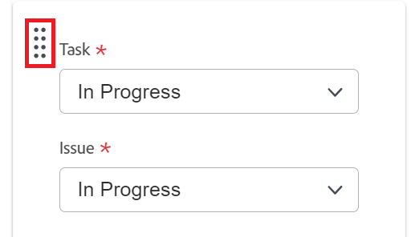

# [!UICONTROL Kanban] 구성

<!--Audited: 12/2023-->

[!DNL Adobe Workfront]애자일 팀 만들기[에 설명된 대로 &#x200B;](../../agile/get-started-with-agile-in-workfront/create-an-agile-team.md)에서 애자일 팀을 만들 수 있습니다. 애자일 팀을 만드는 동안 팀이 작업을 완료하는 데 사용하는 방법론을 선택할 수 있습니다. 다음 옵션 중에서 선택할 수 있습니다.

* 스크럼
* 칸반

이 문서에서는 Kanban 팀에 대한 설정을 구성하는 방법에 대해 설명합니다. After you create an Agile team and choose the Kanban methodology, you can refer to this article to update the following settings:

* Whether stories are estimated in points or hours
* The status columns on the Agile story board
* Additional fields to display on story cards on the Agile story board
* The work in progress (WIP) limit
* How to automatically add stories from the backlog
* 카드가 칸반 보드에 남아 있는 기간

스크럼 팀 구성에 대한 자세한 내용은 [스크럼 구성](../get-started-with-agile-in-workfront/configure-scrum.md)을 참조하십시오.

## 액세스 요구 사항

+++ 이 문서의 기능에 대한 액세스 요구 사항을 보려면 확장하십시오.

<table style="table-layout:auto"> 
 <col> 
 </col> 
 <col> 
 </col> 
 <tbody> 
  <tr> 
   <td role="rowheader">Adobe Workfront 패키지</td> 
   <td> 
Any
 </td> 
  </tr>

<tr> 
   <td role="rowheader">Adobe Workfront license</td> 
   <td> 
표준
 
   
작업 이상
 </td> 
  </tr>

<tr> 
   <td role="rowheader">액세스 수준 구성</td> 
   <td> 
팀에 대한 액세스 편집
  </td> 
  </tr>

</tbody> 
</table>

이 표의 정보에 대한 자세한 내용은 [Workfront 설명서의 액세스 요구 사항](/help/quicksilver/administration-and-setup/add-users/access-levels-and-object-permissions/access-level-requirements-in-documentation.md)을 참조하십시오.

+++

## 스토리를 포인트 또는 시간 단위로 예상할지 구성

점 또는 시간을 사용하여 예상할 스토리를 구성할 수 있습니다.

애자일 팀에 대한 스토리를 예측하는 방법을 구성하려면:

{{step1-to-team}}

1. **[!UICONTROL 팀 전환]** 아이콘 을 클릭한 다음 드롭다운 메뉴에서 새 팀을 선택하거나 검색 상자에서 팀을 검색합니다.
1. 관리할 애자일 팀을 선택합니다.
1. **[!UICONTROL 자세히]** 메뉴 을(를) 클릭한 다음 **[!UICONTROL 편집]**&#x200B;을(를) 선택합니다.

   

1. **[!UICONTROL 애자일]** 섹션의 **[!UICONTROL 다음에서 스토리 예상]** 영역에서 스토리의 크기(작업 부하)를 예상하는 데 포인트를 사용할지 또는 시간을 사용할지 여부를 선택합니다. 점(Points)을 선택하는 경우 1점과 동일한 시간을 지정합니다. (기본값은 1포인트 = 8시간입니다.) 스토리에 추가된 계획된 시간 수입니다.

   **예:** 스토리를 포인트 단위로 추정하도록 선택했는데 1포인트가 8시간이고 스토리가 3포인트로 추정되는 경우 24개의 계획된 시간이 스토리에 추가됩니다.

1. **[!UICONTROL 변경 내용 저장]**&#x200B;을 클릭합니다.

## 애자일 스토리 보드에서 상태 열 구성

애자일 팀의 스토리 보드에 있는 상태를 정의할 수 있습니다. 스토리 보드에 표시되는 상태는 이것뿐입니다.

애자일 팀과 연관된 스토리 보드에 사용할 수 있는 상태를 정의하려면 다음을 수행합니다.

{{step1-to-team}}

1. **[!UICONTROL 팀 전환]** 아이콘 을 클릭한 다음 드롭다운 메뉴에서 새 팀을 선택하거나 검색 막대에서 팀을 검색합니다.

1. 관리할 애자일 팀을 선택합니다.
1. **[!UICONTROL 자세히]** 메뉴를 클릭한 다음 **[!UICONTROL 편집]**&#x200B;을 선택합니다.

   

1. **[!UICONTROL 애자일]** 섹션에서 **[!UICONTROL 스토리 게시판]** 영역을 찾습니다.

1. (선택 사항) 스토리 보드에 상태 열을 추가하려면 **[!UICONTROL 열 추가]**&#x200B;를 클릭합니다.
1. (선택 사항) 드래그 앤 드롭 표시기를 사용하여 상태 열을 드래그하여 스토리 보드의 상태 열을 재정렬합니다. 첫 번째 열은 이동할 수 없으며 첫 번째 열 앞에 다른 열을 드래그할 수 없습니다.

   

1. 작업 상태를 선택합니다.

   >[!IMPORTANT]
   >
   >잠긴 시스템 전체 상태만 선택할 수 있습니다. 그룹별 상태는 선택할 수 없습니다. 첫 번째 열의 상태는 항상 **[!UICONTROL New]**&#x200B;에 해당합니다.

   [!DNL Workfront] 관리자가 구성한 경우 사용자 지정 상태를 추가할 수 있습니다. 자세한 내용은 [상태 만들기 또는 편집](../../administration-and-setup/customize-workfront/creating-custom-status-and-priority-labels/create-or-edit-a-status.md)을 참조하세요.

1. **[!UICONTROL 변경 내용 저장]**&#x200B;을 클릭합니다.

## 애자일 스토리 보드에서 스토리 카드에 표시할 추가 필드를 구성합니다.

스토리 카드에 필드를 추가할 때 필드는 보기 전용이며 필드가 채워질 때만 표시됩니다.

기본적으로 작업 및 문제에 대한 스토리 카드에 다음 유형의 데이터가 표시됩니다.

* 작업 또는 문제에 직접 연결된 링크가 있는 스토리 이름
* 프로젝트에 직접 연결되는 링크가 있는 프로젝트 이름
* 이 링크는 스토리에 대해서만 표시되고 하위 작업에 대해서는 표시되지 않습니다
* The task or issue description
* Current commitment
* View and edit the percent complete either by adjusting the percent complete itself or by adjusting the number of points or hours that are completed
* 할당된 사용자

스토리 카드에 추가 데이터(사용자 정의 데이터 포함)를 표시할 수 있습니다. 여러 가지 이유로 스토리 카드에 추가 필드를 표시할 수 있습니다. 예를 들어, 반복 내에서 여러 고객에 대한 스토리를 작업하는 경우 고객 ID를 표시하거나 프로젝트 시작 일자 또는 프로젝트 완료 일자를 표시할 수 있습니다.

>[!NOTE]
>
>스토리 카드에서 사용자 지정 필드를 사용하는 경우 이름에 마침표(또는 점)를 포함할 수 없습니다.

To configure story cards that are assigned to the Agile team to display additional fields:

{{step1-to-team}}

1. **[!UICONTROL 팀 전환]** 아이콘 을 클릭한 다음 드롭다운 메뉴에서 새 팀을 선택하거나 검색 막대에서 팀을 검색합니다.

1. 관리할 애자일 팀을 선택합니다.
1. **[!UICONTROL 자세히]** 메뉴를 클릭한 다음 **[!UICONTROL 편집]**&#x200B;을 선택합니다.

   

1. In the **[!UICONTROL Agile]** section, type a field name to locate it.

   

1. 추가할 필드의 이름을 선택합니다.
1. 스토리 또는 문제 카드에 표시할 필드에 **[!UICONTROL 표시 이름]**&#x200B;을(를) 입력하십시오.
1. **[!UICONTROL 변경 내용 저장]**&#x200B;을 클릭합니다.

## Configure the work in progress (WIP) limit

When you define the WIP limit of a Kanban team, you can control the number of items the team is currently working on by limiting the number of tasks that can appear in the [!UICONTROL New] or the [!UICONTROL In Progress] column on the [!UICONTROL Kanban] board.

After you configure the WIP limit for a Kanban team, you can view the WIP limit and update it from the [!UICONTROL Kanban] Agile story board, as described in [Manage the work in progress (WIP) limit on the [!UICONTROL Kanban] board](../../agile/use-kanban-in-an-agile-team/work-in-progress-limit-on-the-kanban-board.md).

To limit WIP for your Kanban team:

{{step1-to-team}}

1. **[!UICONTROL 팀 전환]** 아이콘 을 클릭한 다음 드롭다운 메뉴에서 새 팀을 선택하거나 검색 막대에서 팀을 검색합니다.

1. 관리할 Kanban 팀을 선택합니다.
1. **[!UICONTROL 자세히]** 메뉴 을(를) 클릭한 다음 **[!UICONTROL 편집]**&#x200B;을(를) 선택합니다.

   

1. **[!UICONTROL 애자일]** 섹션의 **[!UICONTROL 방법론]** 섹션에서 Kanban이 선택되었는지 확인하십시오.

1. **[!UICONTROL 스토리 보드]** 섹션의 **[!UICONTROL WIP 제한]** 필드에서 [!UICONTROL Kanban] 애자일 스토리 보드의 각 열에 허용되는 최대 항목 수를 지정합니다. 각 열에 대해 다른 제한을 설정할 수 있습니다. 각 열에 대해 설정할 수 있는 최대 한도는 100입니다.
설정하면 WIP 제한이 [!UICONTROL Kanban] 애자일 스토리 보드의 열에 대한 제한을 초과할 때마다 경고 메시지를 표시합니다. 이 경고 메시지는 WIP 제한이 처음 초과된 경우에만 표시됩니다. 이 경고 메시지는 [!UICONTROL 완료]와(과) 같은 상태의 열에는 표시되지 않습니다.
WIP 제한은 단순히 시각적 경고일 뿐 팀이 단일 열에 설정한 제한보다 더 많은 항목을 보유하는 것을 제한하지 않습니다.

   

1. **변경 내용 저장**&#x200B;을 클릭합니다.

## 백로그에서 스토리를 자동으로 추가하도록 구성

<!-- this functionality needs to be verified-->

백로그에서 스토리가 [!UICONTROL Kanban] 보드의 첫 번째 열에 자동으로 추가되도록 구성할 수 있습니다.

이 기능을 사용하려면 **Kanban** 보드에서 [!UICONTROL 백로그 표시] 설정을 사용하도록 설정해야 합니다.

스토리가 [!UICONTROL 진행 중] 열에서 [!UICONTROL 완료] 상태(또는 [!UICONTROL 완료]와 같은 상태)를 나타내는 스토리 보드의 열로 이동될 때마다 백로그 열의 다음 스토리가 [!UICONTROL Kanban 보드]의 [!UICONTROL 새로 만들기] 열로 자동 이동합니다.

다음 스토리는 다음 기준을 모두 충족하는 가장 낮은 백로그 주문 번호의 불완전한 스토리입니다.

* 팀에 할당됩니다.
* 실제 완료 일자가 없습니다(즉, 아직 완료되지 않음).
* 아직 칸반 보드에 있지 않습니다.
* 현재 상태의 프로젝트에 속합니다.

백로그 순서가 우선 순위와 동일하지 않습니다. 백로그 열에서 스토리를 끌어다 놓아 백로그 순서를 정렬할 수 있습니다. 백로그 맨 위에 있는 이야기는 다음에 보드에 끌어당겨진 것입니다.

백로그에서 [!UICONTROL Kanban] 보드에 스토리를 자동으로 추가하려면:

{{step1-to-team}}

1. **[!UICONTROL 팀 전환]** 아이콘 을 클릭한 다음 드롭다운 메뉴에서 새 팀을 선택하거나 검색 막대에서 팀을 검색합니다.

1. 관리할 Kanban 팀을 선택합니다.
1. **[!UICONTROL 자세히]** 메뉴 을(를) 클릭한 다음 **[!UICONTROL 편집]**&#x200B;을(를) 선택합니다.

   

1. **[!UICONTROL 백로그에서 다음 스토리를 자동으로 추가]**&#x200B;를 선택하여 **[!UICONTROL 진행 중]** 열에서 항목을 이동할 때 백로그에서 다음 항목이 **[!UICONTROL 새로 만들기]** 열에 자동으로 추가되도록 구성하십시오.

1. **[!UICONTROL 변경 내용 저장]**&#x200B;을 클릭합니다.

## [!UICONTROL Kanban] 보드에서 카드가 유지되는 기간을 구성합니다.

완료된 카드가 [!UICONTROL Kanban] 보드에 남아 있는 기간을 선택할 수 있습니다. [!UICONTROL Kanban] 보드에서 떨어진 작업은 원래 프로젝트에서 계속 액세스할 수 있습니다.

{{step1-to-team}}

1. (선택 사항) **[!UICONTROL 팀 전환]** 아이콘 을 클릭한 다음 드롭다운 메뉴에서 새 Kanban 팀을 선택하거나 검색 창에서 팀을 검색합니다.
1. 칸반 팀을 선택합니다.
1. **[!UICONTROL 자세히]** 메뉴 을(를) 클릭한 다음 **[!UICONTROL 편집]**&#x200B;을(를) 선택합니다.

   

1. **[!UICONTROL 완료된 카드가 칸반 보드에 남아 있는 일 수]** 드롭다운 메뉴에서 값을 선택합니다.

   1일에서 30일 사이의 숫자를 선택할 수 있습니다.
1. **[!UICONTROL 변경 내용 저장]**&#x200B;을 클릭합니다.
