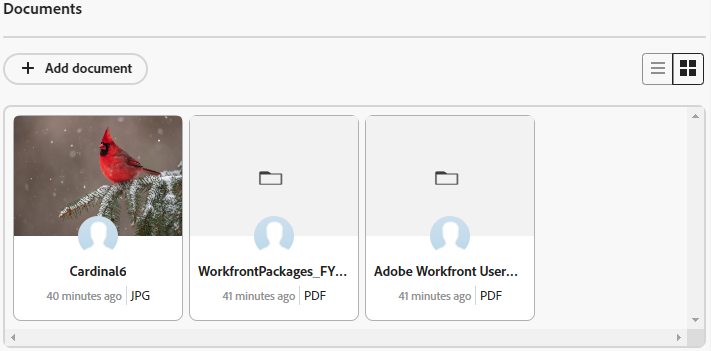

# 카드에 문서 추가

{{article-preview-and-fast-release}}

Adobe Workfront 보드에서 연결된 카드에 문서를 추가할 수 있습니다. 카드에 추가한 모든 문서는 연결된 작업 또는 문제의 문서 탭에서 사용할 수 있으며 작업 또는 문제에 추가된 문서는 카드에 표시됩니다. 두 영역에서 동일한 파일 유형이 지원됩니다. Workfront의 문서에 대한 자세한 내용은 [파일 시스템에서 Adobe Workfront에 문서 추가](/help/quicksilver/documents/adding-documents-to-workfront/add-documents-from-file-system.md).

>[!NOTE]
>
>문서는 연결된 카드에서만 사용할 수 있습니다. 자세한 내용은 [보드에서 연결된 카드 사용](/help/quicksilver/agile/get-started-with-boards/connected-cards.md).

## 액세스 요구 사항

이 문서의 단계를 수행하려면 다음 액세스 권한이 있어야 합니다.

<table style="table-layout:auto"> 
 <tbody> 
  <tr> 
   <td role="rowheader"><strong>[!DNL Adobe Workfront] 플랜*</strong></td> 
   <td> 
모든
 </td> 
  </tr> 
  <tr> 
   <td role="rowheader"><strong>[!DNL Adobe Workfront] 라이센스*</strong></td> 
   <td> 
[!UICONTROL Request] 이상
 </td> 
  </tr> 
  <tr>
   <td role="rowheader"><strong>액세스 수준 구성*</strong></td>
   <td>
문서에 대한 [!UICONTROL 편집] 액세스 권한

참고: 여전히 액세스 권한이 없는 경우 Workfront 관리자에게 액세스 수준에서 추가 제한을 설정하는지 문의하십시오. Workfront 관리자가 액세스 수준을 수정하는 방법에 대한 자세한 내용은 <a href="/help/quicksilver/administration-and-setup/add-users/configure-and-grant-access/create-modify-access-levels.md" class="MCXref xref">사용자 정의 액세스 수준 만들기 또는 수정</a>.
</td>
  </tr>
 </tbody> 
</table>

&#42;보유 중인 플랜, 라이선스 유형 또는 액세스 권한을 알아보려면 [!DNL Workfront] 관리자.

## 카드에 문서 추가

{{step1-to-boards}}

1. 문서를 추가할 연결된 카드를 엽니다.
1. 파일을 드래그하여 [!UICONTROL 문서] 영역 또는 클릭 [!UICONTROL **문서 추가**] 을 클릭하여 파일을 선택합니다.

   파일이 [!UICONTROL 문서] 영역입니다.

   

## 카드에서 기존 문서 보기

1. 카드에서 [!UICONTROL 문서] 영역입니다. 클릭  목록에 있는 모든 문서를 보려면  갤러리에서 문서를 봅니다.
1. 문서 축소판 위로 마우스를 가져간 다음 [!UICONTROL **미리 보기**] 브라우저에서 파일을 보려면 [!UICONTROL **다운로드**] 를 클릭하여 파일을 컴퓨터에 다운로드합니다.
