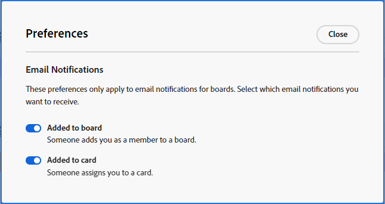

# 게시판 이메일 알림 및 환경 설정

[!DNL Adobe Workfront] [!UICONTROL 게시판]에서 사용자가 게시판에 추가되고 사용자에게 카드가 할당되면 전자 메일을 보냅니다. 알림은 기본적으로 켜져 있으며 보드 환경 설정에서 수신할 이메일을 선택할 수 있습니다.

또한 이메일 알림 설정에 따라 연결된 카드에 댓글을 달면 이메일을 받게 됩니다. 자세한 내용은 [전자 메일 알림 수정](/help/quicksilver/workfront-basics/using-notifications/activate-or-deactivate-your-own-event-notifications.md)을 참조하세요. 현재 Ad Hoc 카드에 댓글을 태그 지정한 사용자는 이메일 알림을 받지 못합니다.

## 액세스 요구 사항

+++ 을 확장하여 이 문서의 기능에 대한 액세스 요구 사항을 봅니다.

<table style="table-layout:auto"> 
 <col> 
 <col> 
 <tbody> 
  <tr> 
   <td role="rowheader">Adobe Workfront 패키지</td> 
   <td> 
임의
 </td> 
  </tr> 
  <tr> 
   <td role="rowheader">Adobe Workfront 라이선스</td> 
   <td> 
   
기여자 이상
 
   
요청 이상

   </td> 
  </tr> 
 </tbody> 
</table>

이 표의 정보에 대한 자세한 내용은 [Workfront 설명서의 액세스 요구 사항](/help/quicksilver/administration-and-setup/add-users/access-levels-and-object-permissions/access-level-requirements-in-documentation.md)을 참조하십시오.

+++

## 게시판 이메일에 대한 환경 설정 지정

{{step1-to-boards}}

1. 게시판 대시보드에서 [!UICONTROL **환경 설정**]&#x200B;을 클릭합니다.
1. 보드에 추가되고 카드에 할당된 이메일에 대한 수신 여부를 선택합니다.

   

   이메일에 대해 설정한 환경 설정은 모든 보드에 적용됩니다.

<!--

## Set the dark mode preference

>[!NOTE]
>
>If your organization's instance of Workfront has been onboarded to the Adobe Unified Experience, you can enable dark theme formatting for all of Adobe Experience Cloud through your preferences menu (your profile picture), and you will not see a separate dark mode option for Workfront Boards. For more information, see [Adobe Unified Experience for Workfront](/help/quicksilver/workfront-basics/navigate-workfront/workfront-navigation/adobe-unified-experience.md).

{{step1-to-boards}}

1. Click [!UICONTROL **Preferences**] on the boards dashboard.
1. In the Themes area, enable or disable Dark mode.

   The preference you set for dark mode applies to all of your boards and workstreams, and the dashboard.

-->
