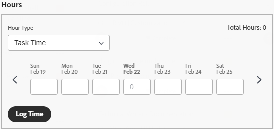

# 보드에서 연결된 카드 사용

{{highlighted-preview}}

보드에 기존 작업 및 문제에 연결된 카드를 추가할 수 있습니다 [!DNL Workfront].

한 위치에서 카드에 대해 다음 세부 정보 중 하나가 업데이트되면 다른 위치에서 자동으로 업데이트됩니다.

* [!UICONTROL 이름]
* [!UICONTROL 설명]
* [!UICONTROL 할당자]
* [!UICONTROL 상태]
* [!UICONTROL 계획된 완료 일자]
* [!UICONTROL 예측] / [!UICONTROL 스토리 포인트]

>[!NOTE]
>하나의 연결된 작업이나 문제를 보드당 한 번만 추가할 수 있습니다. 동일한 작업이나 문제를 여러 보드에 연결할 수 있습니다.

## 액세스 요구 사항

이 문서의 절차를 수행하려면 다음 액세스 권한이 있어야 합니다.

<table style="table-layout:auto"> 
 <tbody> 
  <tr> 
   <td role="rowheader"><strong>[!DNL Adobe Workfront] 플랜*</strong></td> 
   <td> 
모든
 </td> 
  </tr> 
  <tr> 
   <td role="rowheader"><strong>[!DNL Adobe Workfront] 라이센스*</strong></td> 
   <td> 
[!UICONTROL Request] 이상
 </td> 
  </tr> 
  <tr>
   <td role="rowheader"><strong>액세스 수준 구성*</strong></td>
   <td>
작업 및 문제에 대한 [!UICONTROL 보기] 이상 액세스
</td>
  </tr>
  <tr>
   <td role="rowheader"><strong>개체 권한</strong></td>
   <td>
Workfront 작업 또는 문제에 대한 [!UICONTROL 보기] 이상 권한
</td>
  </tr>
 </tbody> 
</table>

&#42;어떤 계획, 라이센스 유형 또는 액세스 권한을 보유하고 있는지 확인하려면 [!DNL Workfront] 관리자

## 연결된 카드 추가

1. 을(를) 클릭합니다. **[!UICONTROL 기본 메뉴]** 아이콘  Adobe Workfront의 오른쪽 위 모서리에서 을(를) 클릭하고 **[!UICONTROL 보드]**.
1. 보드 액세스. 자세한 내용은 [보드 만들기 또는 편집](../../agile/get-started-with-boards/create-edit-board.md).
1. 클릭 **[!UICONTROL 카드 추가] > [!UICONTROL 연결된 카드]**.
1. 프로젝트를 선택한 다음 보드에 카드로 추가할 작업 또는 문제를 선택합니다.

   여러 개체를 선택할 수 있으며 모든 개체가 별도의 카드로 추가됩니다.

   >[!NOTE]
   >
   >* 사용 권한이 있는 객체만 검색 결과에서 사용할 수 있습니다. 항목이 흐리게 표시되어 있으면 이미 보드에 추가되었습니다.
   >* 다음을 기준으로 필터링할 때 **[!UICONTROL 프로젝트 소유]** 또는 **[!UICONTROL 프로젝트 설정]**, 완료, 데드 또는 거부됨 상태와 동일한 프로젝트는 포함되지 않습니다. 을 사용하여 해당 프로젝트를 계속 검색할 수 있습니다. **[!UICONTROL 모두]** 필터.

1. 클릭 **[!UICONTROL 추가]**.

   

   카드가 가장 왼쪽 열 하단에 추가됩니다. 연결된 [!DNL Workfront] 개체 및 해당 자산이 카드에 표시됩니다.

   >[!NOTE]
   >
   >할당자가 [!DNL Workfront] 작업 또는 문제가 보드에 있는 구성원이 아니므로 카드에 할당되지 않습니다.

   

1. 클릭  열다 [!DNL Workfront] 새 브라우저 탭의 작업 또는 문제
1. 카드 세부 사항을 편집하려면 카드 이름이 아닌 카드를 클릭합니다.

   또는

   을(를) 클릭합니다. **[!UICONTROL 자세히]** 메뉴  카드에서 을 선택하고 을 선택합니다. **[!UICONTROL 편집]**.

1. 에서 **[!UICONTROL 카드 세부 사항]** 상자에서 다음 정보를 추가하거나 업데이트합니다.

   <table style="table-layout:auto"> 
    <tbody> 
     <tr> 
      <td role="rowheader"><strong>[!UICONTROL Name]</strong></td> 
      <td> 
이름을 변경하면 연결된 파일에서도 이름이 변경됩니다 [!DNL Workfront] 개체.
 </td> 
     </tr> 
     <tr> 
      <td role="rowheader"><strong>[!UICONTROL Description]</strong></td> 
      <td> 
설명을 변경하면 연결된 설명도 변경됩니다 [!DNL Workfront] 개체.
 </td> 
     </tr> 
     <tr>
      <td role="rowheader"><strong>[!UICONTROL Assignees]</strong></td>
      <td>
카드에 사용자나 팀을 더 할당하려면 검색 필드에 이름을 입력한 다음 목록에 표시될 때 선택합니다. 개인 사용자와 팀을 모두 추가할 수 있습니다. 연결된 카드에는 한 팀 할당만 허용됩니다.

      
할당자는 보드의 구성원이어야 합니다. 그렇지 않으면 선택 목록에 표시되지 않습니다. 한 팀이 보드의 멤버일 경우 개별 팀 구성원을 카드에 할당할 수 있습니다.

      
선택한 모든 지정자도 의 작업이나 문제에 할당됩니다 [!DNL Workfront].
</td>
     </tr>
     <tr>
      <td role="rowheader"><strong>[!UICONTROL 열]</strong></td>
      <td>
카드의 열을 선택합니다.
</td>
     </tr>
     <tr>
      <td role="rowheader"><strong>[!UICONTROL 상태]</strong></td>
      <td>
카드의 상태를 선택합니다. 기본값은 [!UICONTROL New], [!UICONTROL In Progress] 및 [!UICONTROL Complete]이지만, 의 항목에 대해 정의된 모든 사용자 지정 상태입니다 [!DNL Workfront] 사용 가능합니다.

      
필드 값을 업데이트할 수 있도록 열 정책이 활성화된 경우 카드의 상태를 변경하면 카드가 해당 열로 자동 이동합니다. 자세한 내용은 문서에서 "열 설정 및 정책 정의"를 참조하십시오 <a href="/help/quicksilver/agile/get-started-with-boards/manage-board-columns.md" class="MCXref xref">보드 열 관리</a>.

      
를 클릭하면 <strong>[!UICONTROL Mark Complete]</strong> 카드 상단에서 상태가 자동으로 완료로 변경됩니다.
</td>
     </tr>
     <tr>
      <td role="rowheader"><strong>[!UICONTROL 계획된 완료]</strong></td>
      <td>
이 일자를 변경하면 연결된 경우 계획 완료 일자도 변경됩니다 [!DNL Workfront] 개체.
</td>
     </tr>
      <tr>
      <td role="rowheader"><strong>[!UICONTROL Estimation]</strong></td>
      <td>
카드를 완료하는 데 필요한 시간 수입니다.

에 대한 초기 기능 옵트인을 사용하는 경우 [!DNL Workfront] [!UICONTROL Boards], 예측을 변경하면 연결된 페이지의 스토리 포인트 값도 변경됩니다 [!DNL Workfront] 개체.

초기 기능을 선택하지 않는 경우, 이 필드는 수동 입력만 표시되며 값은 99를 초과할 수 없습니다.
</td>
     </tr>
     <tr>
      <td role="rowheader"><strong>[!UICONTROL Tags]</strong></td>
      <td>
카드의 태그를 검색하고 선택합니다.

      
새 태그 만들기에 대한 내용은 <a href="../../agile/get-started-with-boards/add-tags.md" class="MCXref xref">태그 추가</a>.
</td>
     </tr>
     <tr> 
      <td role="rowheader"><strong>[!UICONTROL 검사 목록 항목]</strong> </td> 
      <td> 
클릭 <strong>[!UICONTROL 검사 목록 항목 추가]</strong>. 그런 다음 항목의 제목을 입력하고 Enter 키를 누릅니다. 다른 항목이 자동으로 추가됩니다. 항목을 더 추가하려면 제목을 계속 입력합니다.
 
검사 목록 맨 위의 카운터는 완료된 항목의 수와 총 항목 수를 표시합니다.
 
검사 목록 항목에 대한 자세한 내용은 <a href="/help/quicksilver/agile/get-started-with-boards/manage-checklist-items.md">카드의 검사 목록 항목 관리</a>.
</td>
     </tr>
    </tbody> 
   </table>

1. 클릭 **[!UICONTROL 닫기]** 이사회로 돌아가려고
연결된 객체, 담당자, 태그, 기한, 체크리스트 카운터, 예상 시간 및 상태가 카드에 표시됩니다.

   

## 연결된 카드 연결 끊기

Workfront 개체에서 연결된 카드의 연결을 끊을 수 있으며, 이 카드는 편집할 수 있는 임시 카드로 보드에 남아 있습니다.

보드 수준에서 연결을 끊으려면

1. 보드에 액세스합니다.
1. 을(를) 클릭합니다. **[!UICONTROL 자세히]** 메뉴  연결된 카드에서 을 선택하고 **[!UICONTROL 연결 끊기]**.
1. 클릭 **[!UICONTROL 연결 끊기]** 확인 메시지에 저장됩니다.

카드 수준에서 연결을 끊으려면

1. 보드에 액세스하여 연결된 카드를 엽니다.
1. 을(를) 클릭합니다. **[!UICONTROL 자세히]** 메뉴  카드 세부 사항의 연결 영역에서 다음을 선택합니다. **[!UICONTROL 연결 끊기]**.
1. 클릭 **[!UICONTROL 연결 끊기]** 확인 메시지에 저장됩니다.

## Ad Hoc 카드를 연결된 카드로 변환

임시 카드를 만든 후 연결된 카드로 변환할 수 있습니다. 애드혹 카드에 대한 자세한 내용은 [보드에 임시 카드 추가](/help/quicksilver/agile/get-started-with-boards/add-card-to-board.md).

1. 보드에 액세스하여 임시 카드를 엽니다.
1. 카드에서 이름과 설명을 확인합니다. 그러면 사용자가 만든 작업 또는 문제에 추가됩니다. [!DNL Workfront].
1. 에서 [!UICONTROL 연결] 카드 세부 정보 영역에서 **[!UICONTROL Workfront과 연결]**.
1. 설정 [!UICONTROL 카드 연결] 창에서 작업을 만드는지 아니면 문제를 만드는지 선택합니다.
1. 프로젝트나 문제를 추가할 프로젝트를 검색하고 선택합니다.

   >[!NOTE]
   >
   >* 사용 권한이 있는 객체만 검색 결과에서 사용할 수 있습니다.
   >* 다음을 기준으로 필터링할 때 **[!UICONTROL 프로젝트 소유]** 또는 **[!UICONTROL 프로젝트 설정]**, 와 동일한 프로젝트 [!UICONTROL 완료], [!UICONTROL 데드], 또는 [!UICONTROL 거부됨] 상태는 포함되지 않습니다. 을 사용하여 해당 프로젝트를 계속 검색할 수 있습니다. **[!UICONTROL 모두]** 필터.

1. 클릭 **[!UICONTROL Connect]**.

   

   프로젝트 이름은 카드 세부 사항의 연결 영역에 표시됩니다.

1. 클릭 **[!UICONTROL 닫기]** 이사회로 돌아가려고

## 연결된 카드의 로그 시간

>[!NOTE]
>
>이 기능은 Workfront 보드의 초기 기능 옵트인을 통해서만 사용할 수 있습니다.

연결된 작업 또는 문제에 대한 시간을 기록하려면 올바른 권한이 있어야 합니다.

기본적으로 연결된 카드에 시간 로깅 필드가 표시되지 않습니다. 활성화 [!UICONTROL **시간**] 에서 [!UICONTROL 구성] 지역 [!UICONTROL 카드]. 자세한 내용은 [카드에 표시되는 필드를 사용자 정의합니다](/help/quicksilver/agile/get-started-with-boards/customize-fields-on-card.md).

1. 작업 또는 문제에 대한 시간(시)을 입력합니다.
1. 선택 [!UICONTROL 시간 유형] 기본값과 다른 경우 드롭다운 메뉴에서
1. 클릭 [!UICONTROL **로그 시간**].

   

   카드에 기록된 시간도 연결된 작업 또는 문제에 저장됩니다.

카드의 로깅 시간은 작업 또는 문제에 대한 로깅 시간과 같습니다. 자세한 내용은 문서의 &quot;프로젝트, 작업 또는 문제에 대한 로그 시간&quot;을 참조하십시오 [로그 시간](/help/quicksilver/timesheets/create-and-manage-timesheets/log-time.md).

