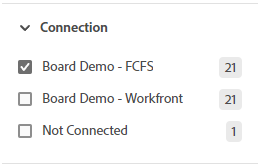

# 보드에서 필터링 및 검색

표시할 보드를 필터링할 수 있습니다.

* 특정 사용자에게 할당된 카드
* 특정 태그가 있는 카드
* 특정 상태의 카드
* 특정 기간에 만기가 되는 카드
* 보관된 카드
* 특정 프로젝트에 연결된 카드

보드를 정렬하면 열에 있는 모든 카드가 정렬됩니다. 단일 열을 정렬할 수 없으며 백로그 또는 접수 열이 정렬되지 않았습니다.

검색은 보드에서 특정 카드를 찾는 데에도 도움이 됩니다.

필터를 적용하면 표시기가 에 표시됩니다. **[!UICONTROL 모두 지우기]**&#x200B;를 클릭하여 보드에서 모든 필터를 제거하고 축소 아이콘을 클릭하여 필터 패널을 닫습니다.

## 액세스 요구 사항

이 문서의 단계를 수행하려면 다음 액세스 권한이 있어야 합니다.

<table style="table-layout:auto"> 
 <col> 
 <col> 
 <tbody> 
  <tr> 
   <td role="rowheader"><strong>[!DNL Adobe Workfront] 플랜*</strong></td> 
   <td> 
임의
 </td> 
  </tr> 
  <tr> 
   <td role="rowheader"><strong>[!DNL Adobe Workfront] 라이센스*</strong></td> 
   <td> 
[!UICONTROL Request] 이상
 </td> 
  </tr> 
 </tbody> 
</table>

&#42;플랜, 라이선스 유형 또는 액세스 권한을 확인하려면 [!DNL Workfront] 관리자에게 문의하세요.

## 피할당자별로 보드 필터링

1. [!DNL Adobe Workfront]의 오른쪽 위 모서리에 있는 **[!UICONTROL 기본 메뉴]** 아이콘 을 클릭한 다음 **[!UICONTROL 게시판]**&#x200B;을 클릭합니다.
1. 보드에 액세스합니다. 자세한 내용은 [게시판 만들기 또는 편집](../../agile/get-started-with-boards/create-edit-board.md)을 참조하세요.
1. [!UICONTROL **필터**]&#x200B;를 클릭하고 [!UICONTROL 구성원] 섹션을 확장한 다음 표시할 카드를 가진 사람을 선택합니다. 할당 해제된 카드를 표시할 수도 있습니다.

   

## 태그로 보드 필터링

1. 보드에 액세스합니다.
1. [!UICONTROL **필터**]&#x200B;를 클릭하고 [!UICONTROL 태그] 섹션을 확장한 다음 표시할 태그를 선택하십시오.

   

## 상태별로 보드 필터링

1. 보드에 액세스합니다.
1. [!UICONTROL **필터**]&#x200B;를 클릭하고 [!UICONTROL 상태] 섹션을 확장한 다음 보려는 상태 형식을 선택합니다.

   완료된 카드를 숨길 수도 있습니다.

   

## 기한을 기준으로 보드 필터링

1. 보드에 액세스합니다.
1. [!UICONTROL **필터**]&#x200B;를 클릭하고 [!UICONTROL 기한] 섹션을 확장한 다음 표시할 날짜 옵션을 선택하십시오.

   선택한 날짜 범위의 카드만 표시됩니다.

   

## 보드를 필터링하여 보관된 카드 표시

기본적으로 활성 카드만 보드에 표시됩니다. 보드를 필터링하여 보관된 카드도 표시할 수 있습니다.

1. 보드에 액세스합니다.
1. 보드 오른쪽의 [!UICONTROL **구성**]&#x200B;을 클릭하여 구성 패널을 엽니다.
1. [!UICONTROL **카드**]&#x200B;를 확장합니다.
1. [!UICONTROL **보드에 보관된 카드 표시**]&#x200B;를 켭니다.
1. [!UICONTROL **필터**]&#x200B;를 클릭하고 [!UICONTROL 보관된 카드] 섹션을 확장한 다음 **[!UICONTROL 보관된 카드]**&#x200B;를 선택하여 보관된 카드를 표시합니다.

   필터에는 보관된 카드 수가 표시됩니다.

   

   >[!NOTE]
   >
   >보관된 카드를 표시하도록 구성 설정을 켜지 않은 경우 [!UICONTROL 보관된 카드] 섹션을 필터에서 사용할 수 없습니다. 자세한 내용은 [카드에 표시할 필드 사용자 지정](/help/quicksilver/agile/get-started-with-boards/customize-fields-on-card.md)을 참조하십시오.

1. **[!UICONTROL 보관된 카드]**&#x200B;를 다시 선택하여 옵션을 지우고 활성 카드만 표시합니다.

## 연결로 보드 필터링

1. 보드에 액세스합니다.
1. [!UICONTROL **필터**]&#x200B;를 클릭하고 [!UICONTROL 연결] 섹션을 확장한 다음 보려는 연결된 카드에 대한 [!DNL Workfront] 프로젝트를 선택하십시오.

   프로젝트에 연결되지 않은 카드를 표시할 수도 있습니다.

   

## 게시판에서 정렬

정렬 기준 옵션을 선택하면 모든 열이 정렬됩니다. 단일 열을 정렬할 수 없으며 백로그 또는 접수 열이 정렬되지 않았습니다.

1. 보드에 액세스합니다.
1. [!UICONTROL **정렬 기준**]&#x200B;을 클릭하고 [!UICONTROL **이름**], [!UICONTROL **기한**], [!UICONTROL **예상**], [!UICONTROL **상태**] 또는 [!UICONTROL **연결**]&#x200B;을 선택합니다.

   연결(프로젝트 이름)은 연결된 카드에만 적용되고, 다른 옵션은 열에서 연결된 카드와 Ad Hoc 카드를 모두 정렬합니다.

   &quot;사용자 순서&quot; 옵션은 다른 정렬 옵션이 적용되기 전에 카드를 수동으로 설정했던 순서로 반환합니다. 열의 기본 정렬입니다.

1. 정렬 옵션의 역순으로 열을 정렬하려면 [!UICONTROL **역순**]&#x200B;을(를) 선택하십시오.

   정렬 아이콘의 화살표는 열이 오름차순으로 정렬되는지 또는 내림차순으로 정렬되는지를 나타냅니다.

   기본값이 아닌 정렬을 적용하면 정렬 아이콘 에 표시기가 표시됩니다.

   

## 보드에서 검색

1. 보드에 액세스합니다.
1. [!UICONTROL **검색**]&#x200B;을 클릭하고 검색어를 입력하세요. 그런 다음 Enter 키를 누릅니다.

   검색어가 포함된 모든 카드가 표시됩니다.

   X를 클릭하여 검색을 지웁니다.

   
