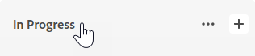
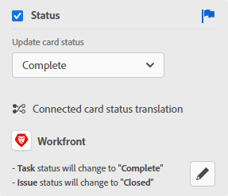

# 보드 열 관리

<!-- Audited: 05/2024 -->

새 보드에는 기본적으로 3개의 열이 있습니다. 열을 더 추가하고, 열의 순서를 변경하고, 열의 이름을 바꾸고, 필요하지 않은 열을 삭제할 수 있습니다.

열 설정에는 정책이 포함되어 있으며, 정책을 사용하면 카드가 해당 열로 이동할 때 발생하는 상황에 대한 옵션을 정의할 수 있습니다.

열에서 카드를 정렬하는 방법에 대한 자세한 내용은 [보드에서 필터링 및 검색](/help/quicksilver/agile/get-started-with-boards/filter-search-in-board.md).

## 액세스 요구 사항

이 문서의 단계를 수행하려면 다음 액세스 권한이 있어야 합니다.

<table style="table-layout:auto"> 
 <col> 
 </col> 
 <col> 
 </col> 
 <tbody> 
  <tr> 
   <td role="rowheader">[!DNL Adobe Workfront] 플랜</td> 
   <td> 
임의
 </td> 
  </tr> 
  <tr> 
   <td role="rowheader">[!DNL Adobe Workfront] 라이센스</td> 
   <td> 
새로운 기능: 기여자 이상 

        
또는
 
        
현재: [!UICONTROL Request] 이상 
</td> 
  </tr> 
 </tbody> 
</table>

이 표의 정보에 대한 자세한 내용은 [Workfront 설명서의 액세스 요구 사항](/help/quicksilver/administration-and-setup/add-users/access-levels-and-object-permissions/access-level-requirements-in-documentation.md).

## 보드에 열 추가

{{step1-to-boards}}

1. 보드에 액세스합니다. 자세한 내용은 [보드 만들기 또는 편집](../../agile/get-started-with-boards/create-edit-board.md).
1. 클릭 **[!UICONTROL 열 추가]** 기존 열의 오른쪽에
1. 새 열에서 이름을 입력하고 **[!UICONTROL 열 추가]**.

   

>[!TIP]
>
>접수 열을 추가하려면 다음을 참조하십시오. [보드에 접수 열 추가](/help/quicksilver/agile/use-boards-agile-planning-tools/add-intake-column-to-board.md).

## 보드에서 열 순서 바꾸기

1. 보드에 액세스합니다.
1. 열을 올바른 순서로 끌어서 놓습니다. 열을 다른 위치로 드래그하기 전에 열의 위쪽을 선택해야 합니다.

   

## 보드 열 이름 바꾸기

1. 보드에 액세스합니다.
1. 열 이름을 클릭하고 새 이름을 입력한 다음 Enter 키를 누릅니다.

   또는

   다음을 클릭합니다. **[!UICONTROL 자세히]** 메뉴  열에서 다음을 선택합니다. **[!UICONTROL 편집]**. 설정 영역에서 새 이름을 입력합니다 **[!UICONTROL 열 이름]** 필드 및 클릭 **[!UICONTROL 닫기]**.

## 보드 열 삭제

보드에서 열을 삭제하면 복구할 수 없습니다.

1. 보드에 액세스합니다.
1. 다음을 클릭합니다. **[!UICONTROL 자세히]** 메뉴  열에서 **[!UICONTROL 삭제]**.

   >[!NOTE]
   >
   >보관된 카드를 포함하여 카드가 포함된 열은 삭제할 수 없습니다. 카드가 들어 있는 열을 삭제하려는 경우 해당 카드에 대해 다른 열을 선택해야 합니다.

## 카드 수 표시

구성 설정을 사용하여 각 열의 카드 수를 표시할 수 있습니다.

열에 대해 WIP 제한을 사용하는 경우 별도의 카드 카운터가 추가되지 않습니다. WIP 한도에 대한 자세한 내용은 [관리 [!UICONTROL 진행 중인 작업] 보드에 대한 (WIP) 제한](/help/quicksilver/agile/use-boards-agile-planning-tools/manage-wip-limit-on-board.md).

1. 보드에 액세스합니다.
1. 클릭 **[!UICONTROL 구성]** 보드 오른쪽에서 Configure 패널을 엽니다.
1. 확장 **[!UICONTROL 열]**.
1. 켜기 **[!UICONTROL 열 카드 수 표시]**.

   

   카드 카운터는 각 열의 맨 위에 나타납니다.

1. 클릭 **[!UICONTROL 구성 숨기기]** 닫으려면 다음을 수행하십시오. [!UICONTROL 구성] 패널.

## 열 설정 및 정책 정의

열 정책에는 필드 값을 자동으로 업데이트하는 것과 진행 중인 작업 제한 설정이 포함됩니다.

상태 업데이트 정책은 카드와 열 모두에 대해 자동으로 작동합니다.

* 카드가 정책이 있는 열로 이동되면 카드 상태가 정책에 정의된 상태로 업데이트됩니다. 이 방법은 Ad Hoc과 연결된 카드 모두에 적용됩니다.
* 카드의 Ad Hoc 또는 연결된 카드 상태가 정책의 열 상태와 일치하도록 업데이트되거나 연결된 카드 상태가 Workfront의 다른 곳에서 업데이트되면 카드가 자동으로 해당 열로 이동합니다. 또한 카드의 사용자 지정 상태가 열에 할당된 시스템 상태와 일치하는 경우 카드가 해당 열로 이동됩니다.

카드 상태가 기존 열 정책에 설정된 상태와 일치하지 않으면 카드가 배치된 열에 남아 있습니다.

>[!NOTE]
>
>동적 보드는 열 정책의 활성화 여부에 관계없이 항상 해당 상태와 일치하는 열에 카드를 배치합니다. 카드를 새로 고치면 할당된 열로 돌아갑니다.
> 
>또한 모든 보드 유형의 경우 한 열에서 동일한 상태의 다른 열로 카드를 이동하면 보드를 새로 고칠 때 카드가 원래 열로 돌아갑니다.

1. 보드에 액세스합니다.
1. 다음을 클릭합니다. **[!UICONTROL 자세히]** 메뉴  열에서 **[!UICONTROL 편집]**.

   다음 [!UICONTROL 설정] 영역이 나타납니다. 다음 **[!UICONTROL 열 이름]** 설정을 정의하는 열을 알 수 있습니다.

1. 활성화 **[!UICONTROL 자동으로 필드 값 업데이트]** 카드가 이 열로 이동될 때 특정 필드 값을 자동으로 변경하는 정책.

   

1. (선택 사항) 카드 상태에 대한 값을 설정합니다.

   1. 다음 항목 선택 **[!UICONTROL 상태]** 확인란.

   1. 이 열로 이동할 때 카드에 적용할 상태를 선택합니다.

      

      연결된 카드의 상태 변환 옵션도 표시됩니다. (상태 변환은 임시 카드에 적용되지 않습니다.) 이 옵션들은 의 작업 또는 문제에 적용되는 사용자 지정 상태를 결정합니다. [!DNL Workfront] 연결된 카드가 이 열로 이동될 때.

   1. 선택 [!UICONTROL **사용자 정의**] 작업 및 문제에 대해 카드에 적용할 상태.

      카드가 이 열로 이동되면 [!DNL Workfront] 먼저 사용자 지정 상태(예: 해결됨)를 적용하려고 합니다. 해당 카드에 대해 선택한 사용자 지정 상태를 사용할 수 없는 경우 시스템 상태에 해당하는 다른 상태를 선택하라는 메시지가 표시됩니다(위의 b단계에서). 상태에 대한 자세한 내용은 [상태 개요](/help/quicksilver/administration-and-setup/customize-workfront/creating-custom-status-and-priority-labels/statuses-overview.md).

      또한 연결된 작업 또는 문제의 상태가 열 정책에 설정된 사용자 지정 또는 시스템 상태로 변경되면 카드가 자동으로 열로 이동됩니다.

1. (선택 사항) 카드 피할당자에 대한 값을 설정합니다.

   1. 다음 항목 선택 **[!UICONTROL 할당자]** 확인란.
   1. 작업을 선택합니다.

      * **[!UICONTROL 피할당자에 추가]:** 선택한 피할당자는 이 열로 이동할 때 카드의 기존 피할당자 목록에 추가됩니다.
      * **[!UICONTROL 피할당자 무시]:** 선택한 피할당자는 다른 모든 피할당자를 재정의하고 이 열로 이동할 때 카드의 유일한 피할당자가 됩니다.

   1. 클릭 [!UICONTROL **할당 추가**] 사용자를 검색합니다. 검색 결과에서 피할당자를 선택합니다. 모든 Workfront 사용자 및 팀을 선택할 수 있습니다.

      

1. (선택 사항) 카드 태그의 값을 설정합니다.

   1. 다음 항목 선택 **[!UICONTROL 카드]** 확인란.
   1. 작업을 선택합니다.

      * **[!UICONTROL 태그에 추가]:** 선택한 태그는 이 열로 이동할 때 카드의 기존 태그 목록에 추가됩니다.
      * **[!UICONTROL 태그 재정의]:** 선택하는 태그는 다른 모든 태그를 재정의하며, 이 열로 이동할 때 카드에서 유일한 태그가 됩니다.

   1. 드롭다운 목록에서 태그를 선택합니다. 에 이미 만들어진 태그만 [!UICONTROL 태그 관리자] 선택할 수 있습니다. 새 태그 추가에 대한 자세한 내용은 [태그 추가](/help/quicksilver/agile/get-started-with-boards/add-tags.md).

      

1. 활성화 **[!UICONTROL 진행 중인 작업 제한]** 열에 추가할 수 있는 카드 수를 제한하는 정책. 그런 다음, **[!UICONTROL 제한 설정]** 필드.

   

   자세한 내용은 [보드에서 WIP(Work In Progress) 한도 관리](/help/quicksilver/agile/use-boards-agile-planning-tools/manage-wip-limit-on-board.md).

1. 클릭 **[!UICONTROL 닫기]** 를 클릭하여 설정 영역을 종료하고 열과 해당 카드를 확인합니다.
