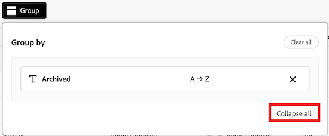

# 보드 관리 보기 관리

보드 관리 보기에는 시스템 관리자가 마지막으로 업데이트된 시간, 각 보드에 있는 카드 수 등을 포함하여 전체 보드 세부 사항에 대한 빠른 스냅샷을 얻는 데 사용할 수 있는 계정의 모든 보드 목록이 포함되어 있습니다.

이 영역에서 다음 작업을 수행할 수 있습니다.

* 보드 목록 필터링
* 보드 목록 열 구성
* 보드 목록 그룹화

## 액세스 요구 사항

+++ 를 확장하여 액세스 요구 사항을 확인합니다.

<table style="table-layout:auto"> 
 <col> 
 </col> 
 <col> 
 </col> 
 <tbody> 
  <tr> 
   <td role="rowheader">Adobe Workfront 플랜</td> 
   <td> 
임의
 </td> 
  </tr> 
  <tr> 
   <td role="rowheader">Adobe Workfront 라이선스</td> 
   <td> 
표준

        
 플랜 
</td> 
  </tr> 
    <tr> 
   <td role="rowheader">액세스 수준 구성</td> 
   <td> 
시스템 관리자 

        </td> 
  </tr> 
 </tbody> 
</table>

이 표의 정보에 대한 자세한 내용은 [Workfront 설명서의 액세스 요구 사항](/help/quicksilver/administration-and-setup/add-users/access-levels-and-object-permissions/access-level-requirements-in-documentation.md)을 참조하십시오.

+++

## 전제 조건

관리 보기에서 게시판을 보려면 먼저 게시판을 만들어야 합니다.

자세한 내용은 [보드 만들기 또는 편집](/help/quicksilver/agile/get-started-with-boards/create-edit-board.md)을 참조하세요.

## 보드 목록 필터링

{{step1-to-boards}}

1. **게시판** 페이지에서 **관리자 보기** 탭을 선택합니다.

1. **필터**&#x200B;를 선택하십시오. **필터** 패널이 열립니다.

1. 아래 단계에 따라 필터를 구성합니다.

   1. (선택 사항) **달력** 아이콘 을 클릭한 다음 날짜 범위를 선택하여 해당 기간 내에 마지막으로 수정된 게시판별로 필터링합니다.

   1. (선택 사항) **템플릿** 섹션에서 목록에서 필터링할 보드 템플릿 유형을 선택합니다. 템플릿 유형을 두 개 이상 선택할 수 있습니다.
게시판 템플릿 유형에 대한 자세한 내용은 [게시판 만들기 또는 편집](/help/quicksilver/agile/get-started-with-boards/create-edit-board.md)을 참조하십시오.

   1. (선택 사항) **보관됨** 섹션에서 보관되거나 보관되지 않은 게시판이 표시되는지 여부를 선택합니다. 두 개 이상의 옵션을 선택할 수 있습니다.

      

1. 닫으려면 **필터** 패널 바깥쪽을 클릭하십시오. 필터 선택은 기본 보기로 다시 변경될 때까지 보드 목록에 적용된 상태로 유지됩니다.

   >[!NOTE]
   >
   >필터를 제거하려면 **필터** 패널을 열고 오른쪽 상단에서 **기본값으로 돌아가기**&#x200B;를 클릭합니다.

## 보드 목록 열 구성

{{step1-to-boards}}

1. **게시판** 페이지에서 **관리자 보기** 탭을 선택합니다.

1. **열**&#x200B;을(를) 선택하십시오. **필드 표시 및 순서** 패널이 열립니다.

1. 각 열과 함께 인라인으로 토글을 선택하거나 선택 취소하여 보드 목록에 표시할 열을 구성합니다.

   * **소유자**
   * **마지막으로 업데이트됨**
   * **구성원**
   * **보관됨**
   * **템플릿**
   * **카드 개수**

1. (선택 사항) 필드가 표시되는 순서를 조정하려면 필드 왼쪽에 있는 **드래그** 아이콘을 클릭한 채 새 위치로 드래그합니다.

   

1. 닫으려면 **필드 표시 및 순서** 패널 바깥쪽을 클릭하십시오. 열 구성은 수정될 때까지 보드 목록에 적용된 상태로 유지됩니다.

   >[!NOTE]
   >
   > 게시판 목록 열이 수정되면 **열** 아이콘 위에 파란색 점이 표시되어 현재 보기가 기본값에서 수정되었음을 나타냅니다.

## 특정 필드를 기준으로 게시판 목록 그룹화

{{step1-to-boards}}

1. **게시판** 페이지에서 **관리자 보기** 탭을 선택합니다.

1. **그룹**&#x200B;을(를) 선택하십시오. **그룹화 기준** 패널이 열립니다.

1. 보드 목록을 그룹화할 필드를 선택합니다.

   * **보관됨**
   * **소유자**
   * **템플릿**

1. (선택 사항) **그룹화 기준** 패널에서 그룹화를 확장하거나 축소하려면 **모두 축소** 또는 **모두 확장**&#x200B;을 클릭합니다.

   

1. (선택 사항) 그룹화의 표시 순서를 A-Z에서 Z-A로 변경하려면 목록이 현재 그룹화된 필드를 선택한 다음 드롭다운에서 **Z-A**&#x200B;을(를) 선택합니다.

   

1. **그룹화 기준** 패널 바깥쪽을 클릭하여 닫습니다. 여기에서 그룹화 제목 옆에 있는 화살표를 선택하여 목록에서 적용된 그룹화를 축소하거나 확장할 수 있습니다.

   

   >[!NOTE]
   >   
   >게시판 목록 그룹화 표시를 수정하면 **그룹** 아이콘 위에 파란색 점이 표시되어 현재 보기가 기본값과 다르다는 것을 나타냅니다.  
   >그룹화를 제거하려면 **그룹화 기준** 패널을 열고 오른쪽 상단에서 **모두 지우기**&#x200B;를 선택하십시오.
